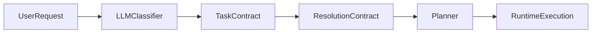

# Contract-First Routing Cleanup

## Цель

Убрать из production routing все промежуточные слои, которые повторно читают пользовательский ввод и угадывают intent/tools/profile после LLM-классификации.

Итоговый контур должен быть таким:

## Source Of Truth

Оставить единственным источником смысла:

- `TaskContract.primaryOutcome`
- `TaskContract.requiredCapabilities`
- `TaskContract.interactionMode`

Дальше только детерминированный bridge:

- [C:/Users/Tanya/source/repos/god-mode-core/src/platform/decision/task-classifier.ts](C:/Users/Tanya/source/repos/god-mode-core/src/platform/decision/task-classifier.ts)
- [C:/Users/Tanya/source/repos/god-mode-core/src/platform/decision/resolution-contract.ts](C:/Users/Tanya/source/repos/god-mode-core/src/platform/decision/resolution-contract.ts)
- [C:/Users/Tanya/source/repos/god-mode-core/src/platform/recipe/planner.ts](C:/Users/Tanya/source/repos/god-mode-core/src/platform/recipe/planner.ts)

## Что удалить из execution path

### Этап 1. Убрать prompt-based post-processing после LLM

Файл:

- [C:/Users/Tanya/source/repos/god-mode-core/src/platform/decision/task-classifier.ts](C:/Users/Tanya/source/repos/god-mode-core/src/platform/decision/task-classifier.ts)

Нужно:

- свести `normalizeTaskContract(...)` к безопасной канонизации, без переугадывания по `prompt`
- оставить только:
  - schema/JSON repair
  - dedupe
  - confidence clamp
  - сортировку/нормализацию массивов
- удалить prompt-based ветки вроде:
  - `promptSuggestsProductionDelivery()`
  - `promptSuggestsRepoValidation()`
  - `promptSuggestsLocalRuntime()`
  - `promptSuggestsVisualArtifact()`
  - `promptSuggestsDocumentAuthoring()`
  - `promptSuggestsExplicitDelivery()`
  - `promptSuggestsExtractionTask()`
  - `promptSuggestsVisualAssetGeneration()`
  - `promptSuggestsBrowserObservation()`

Цель этапа:

- код больше не меняет `primaryOutcome` и `requiredCapabilities` по regex после LLM.

### Этап 2. Убрать heuristic intent/tool/artifact guessing

Файл:

- [C:/Users/Tanya/source/repos/god-mode-core/src/platform/decision/input.ts](C:/Users/Tanya/source/repos/god-mode-core/src/platform/decision/input.ts)
- [C:/Users/Tanya/source/repos/god-mode-core/src/platform/decision/intent-signals.ts](C:/Users/Tanya/source/repos/god-mode-core/src/platform/decision/intent-signals.ts)
- [C:/Users/Tanya/source/repos/god-mode-core/src/platform/decision/turn-normalizer.ts](C:/Users/Tanya/source/repos/god-mode-core/src/platform/decision/turn-normalizer.ts)

Нужно:

- вывести `buildExecutionDecisionInput(...)` из роли production router
- убрать из execution path:
  - `inferPromptIntent()`
  - `promptNeedsBrowserTool()`
  - `promptNeedsWebSearchTool()`
  - `promptNeedsImageGenerationTool()`
  - `promptNeedsPdfTool()`
  - `inferArtifactKinds()`
  - `inferArtifactDrivenTools()`
  - `promptSuggestsCompareIntent()`
  - `promptSuggestsCalculationIntent()`
  - `promptSuggestsWebsiteFrontendWork()`
- оставить `turn-normalizer` только для очистки transport/inbound metadata, но не для semantic routing

Цель этапа:

- текст пользователя не должен напрямую превращаться в `intent`, `artifactKinds`, `requestedTools`, `publishTargets`.

### Этап 3. Перевести fallback в fail-closed

Файлы:

- [C:/Users/Tanya/source/repos/god-mode-core/src/platform/decision/task-classifier.ts](C:/Users/Tanya/source/repos/god-mode-core/src/platform/decision/task-classifier.ts)
- [C:/Users/Tanya/source/repos/god-mode-core/scripts/dev/task-classifier-live-smoke.ts](C:/Users/Tanya/source/repos/god-mode-core/scripts/dev/task-classifier-live-smoke.ts)
- [C:/Users/Tanya/source/repos/god-mode-core/src/platform/decision/task-classifier.test.ts](C:/Users/Tanya/source/repos/god-mode-core/src/platform/decision/task-classifier.test.ts)

Нужно:

- отказаться от полноценного heuristic router как fallback
- заменить fallback на один из безопасных вариантов:
  - `clarification_needed`
  - controlled retry
  - явный classifier failure path
- live smoke должен отдельно фиксировать classifier availability и classifier quality

Цель этапа:

- не держать второй классификатор на regex рядом с LLM classifier.

### Этап 4. Убрать legacy prompt scoring из planner

Файл:

- [C:/Users/Tanya/source/repos/god-mode-core/src/platform/recipe/planner.ts](C:/Users/Tanya/source/repos/god-mode-core/src/platform/recipe/planner.ts)

Нужно:

- удалить или окончательно изолировать legacy сигналы:
  - `hasOcrSignal()`
  - `hasIntegrationSignal()`
  - `hasOpsSignal()`
  - `hasMediaSignal()`
  - `hasTableSignal()`
  - `hasCompareSignal()`
  - `hasCalculationSignal()`
- `buildRecipeScore(...)` должен зависеть только от contract-derived fields и profile config
- `toolBundles + executionContract + profile defaults` должны остаться единственным planner input

Цель этапа:

- planner больше не читает prompt как semantic source.

### Этап 5. Убрать keyword-based profile routing

Файл:

- [C:/Users/Tanya/source/repos/god-mode-core/src/platform/profile/signals.ts](C:/Users/Tanya/source/repos/god-mode-core/src/platform/profile/signals.ts)

Нужно:

- вывести keyword-scoring из execution routing
- профиль выбирать из:
  - явного выбора пользователя
  - session/profile memory
  - classifier-driven overlay/contract bridge
- keyword profile signals оставить только как optional diagnostics, если вообще нужны

Цель этапа:

- profile selection не должен плясать от слов `pdf`, `deploy`, `image`, `code`.

## Что оставить

Оставить как допустимый детерминированный слой:

- schema validation
- enum normalization
- dedupe/ordering
- bridge `TaskContract -> ResolutionContract`
- planner selection из `toolBundles`, `executionContract`, `profile defaults`
- profile-driven model defaults в:
  - [C:/Users/Tanya/source/repos/god-mode-core/src/platform/profile/defaults.ts](C:/Users/Tanya/source/repos/god-mode-core/src/platform/profile/defaults.ts)
  - [C:/Users/Tanya/source/repos/god-mode-core/src/platform/recipe/planner.ts](C:/Users/Tanya/source/repos/god-mode-core/src/platform/recipe/planner.ts)
  - [C:/Users/Tanya/source/repos/god-mode-core/src/agents/openclaw-tools.ts](C:/Users/Tanya/source/repos/god-mode-core/src/agents/openclaw-tools.ts)

## Критерий завершения

Считать cleanup завершённым, когда:

- ни `task-classifier`, ни `input`, ни `planner`, ни `profile/signals` не меняют routing по пользовательскому prompt через regex/keyword heuristics
- смысл задачи определяется только LLM classifier
- downstream code работает только от contract fields
- live smoke остаётся зелёным после удаления prompt-based посредников

## Как дробить на отдельные промты

После принятия генерального плана каждый этап делать отдельным коротким промтом:

1. Удалить prompt-based post-processing из `task-classifier.ts`
2. Вырезать prompt-to-intent/tool/artifact guessing из `input.ts`
3. Перевести fallback в fail-closed classifier path
4. Очистить `planner.ts` от prompt scoring
5. Убрать keyword profile routing из `profile/signals.ts`
6. Обновить тесты и smoke harness под новый чистый contract-first контур
