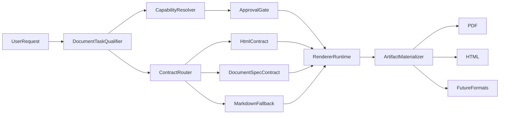

# Document Pipeline Plan

## Goal

Уйти от PDF-спецлогики и самописного расширения markdown-парсера к общему документному pipeline, где система:

- квалифицирует запрос на тип документа и нужный renderer;
- выбирает доступный capability/installer;
- при необходимости инициирует bootstrap/install approval;
- передает в renderer уже подходящий контракт (`html`, `document spec`, `markdown` fallback);
- получает готовый артефакт (`pdf`, `html`, `docx` в будущем) без document-specific логики в оркестраторе.

## Current Bottlenecks

- Prompt-only rich PDF сейчас завязан на [src/agents/tools/pdf-tool.ts](src/agents/tools/pdf-tool.ts): здесь одновременно и drafting, и layout heuristics, и renderer gating.
- Общий materialization layer уже существует, но PDF ветка зашита напрямую в [src/platform/materialization/render.ts](src/platform/materialization/render.ts) и [src/platform/materialization/pdf-materializer.ts](src/platform/materialization/pdf-materializer.ts).
- `markdown` остаётся в критическом пути rich docs через [src/platform/materialization/markdown-report-materializer.ts](src/platform/materialization/markdown-report-materializer.ts), из-за чего приходится латать поддержку отдельных markdown-конструкций.
- Bootstrap/install flow уже есть и выглядит как правильная база для абстракции capability-driven renderer install: [src/platform/bootstrap/service.ts](src/platform/bootstrap/service.ts), [src/platform/materialization/render.ts](src/platform/materialization/render.ts), [src/platform/bootstrap/defaults.ts](src/platform/bootstrap/defaults.ts).

## Target Architecture

## Proposed Direction

- Сделать `HTML-first` для rich documents/PDF: если модель или tool уже могут выдать хороший HTML/CSS, pipeline не должен тащить это через markdown renderer.
- Добавить `DocumentSpec` fallback-контракт для случаев, где лучше просить структурированный layout/spec, а не raw HTML.
- Оставить `markdown` только как low-fidelity fallback и совместимость, а не как основу rich rendering.
- Вынести capability/bootstrap привязку из PDF-ветки в общий renderer registry: renderer знает, какой capability ему нужен и как деградировать.
- Сохранить поведение “спросить, устанавливать или нет” через существующий approval/bootstrap контур вместо ad hoc install logic в отдельных tools.

## Key Changes

- В [src/platform/materialization/contracts.ts](src/platform/materialization/contracts.ts) расширить materialization contract так, чтобы он явно описывал входной document contract (`html`, `spec`, `markdown`, `text`) и renderer target.
- В [src/platform/materialization/render.ts](src/platform/materialization/render.ts) заменить жесткую PDF-ветку на renderer registry / dispatcher по capability-driven renderer definition.
- В [src/agents/tools/pdf-tool.ts](src/agents/tools/pdf-tool.ts) убрать смешение drafting/layout/render bootstrap и превратить tool в orchestration layer над document pipeline.
- Вынести HTML wrapping / print CSS / asset embedding в отдельный renderer layer вместо inline layout heuristics внутри `pdf-tool`.
- Пересмотреть [src/platform/bootstrap/defaults.ts](src/platform/bootstrap/defaults.ts) и связанные bootstrap services так, чтобы renderers описывались как installable capabilities, а не special-case `pdf-renderer`.
- Добавить документный qualifier/router, который решает: rich HTML path, spec path, markdown fallback, native provider path.

## Surface Map

- [src/agents/tools/pdf-tool.ts](src/agents/tools/pdf-tool.ts) сейчас содержит сразу несколько responsibilities: prompt qualification (`promptOnlyPdfNeedsManagedRenderer`, `promptOnlyPdfWantsRichDraft`), draft generation, image asset loading, renderer availability check и final materialization.
- [src/platform/materialization/contracts.ts](src/platform/materialization/contracts.ts) пока знает только `renderKind/outputTarget/payload`, но не различает отдельно document input contract и renderer contract, из-за чего оркестратор вынужден угадывать intent по `renderKind`.
- [src/platform/materialization/render.ts](src/platform/materialization/render.ts) жёстко special-cases `renderKind === "pdf"` и напрямую резолвит `pdf-renderer`, а значит registry пока не является настоящим dispatch boundary.
- [src/platform/document/materialize.ts](src/platform/document/materialize.ts) и [src/platform/developer/materialize.ts](src/platform/developer/materialize.ts) массово прокидывают `markdown` как универсальный промежуточный формат, даже когда пользовательский intent ближе к `html`/`spec`.
- [src/platform/bootstrap/defaults.ts](src/platform/bootstrap/defaults.ts) и [src/platform/bootstrap/service.ts](src/platform/bootstrap/service.ts) уже дают хороший capability/install/resume каркас, но документный pipeline пока использует его только через PDF-specific integration.
- Текущая тестовая база уже покрывает degraded PDF materialization и bootstrap orchestration в [src/platform/materialization/render.test.ts](src/platform/materialization/render.test.ts), но почти не фиксирует contract routing и migration compatibility.

## Implementation Phases

### Phase 0. Freeze Contracts And Invariants

- Зафиксировать текущие инварианты поведения до рефакторинга: degraded HTML fallback, bootstrap request creation, resume after approval, supporting PDF output для html/markdown flows.
- Выписать все существующие call sites `materializeArtifact()` и классифицировать их по intent: `final pdf`, `html preview`, `report export`, `binary metadata`, `fallback rich doc`.
- Сформулировать обратную совместимость: старые callers с `renderKind/html|markdown|pdf` не должны ломаться в первой миграционной фазе.

### Phase 1. Introduce Document Contract Layer

- Добавить новый уровень данных в `materialization/contracts`: `documentInputKind` (`html`, `spec`, `markdown`, `text`) и `rendererTarget` (`pdf`, `html`, `preview`, future `docx`).
- Оставить текущий `renderKind` как compatibility field на переходный период, но сделать его derivable из новых полей.
- Явно определить, где допустима авто-конверсия: `markdown -> html`, `text -> html`, `spec -> html`, но не наоборот без отдельного reason.
- Ввести helper/normalizer, который строит canonical document request до входа в renderer dispatcher.

### Phase 2. Extract Renderer Registry And Dispatcher

- Выделить renderer definition registry: renderer id, supported input kinds, target format, required capability, bootstrap policy, degradation strategy.
- Перенести выбор `pdf-renderer` из `render.ts` в registry-backed dispatcher.
- Описать хотя бы три renderer profile: `html-file`, `html-preview`, `pdf-from-html`; `markdown` должен стать input contract, а не renderer.
- Централизовать degradation policy: если renderer unavailable, вернуть fallback + bootstrapRequest + warning через единый путь, а не через условие только для PDF.

### Phase 3. Reduce `pdf-tool` To Orchestration

- Вынести из `pdf-tool` document qualification в отдельный qualifier/router, чтобы tool перестал сам решать low-level renderer specifics.
- Вынести rich draft preparation в самостоятельный drafting layer: либо raw HTML, либо `DocumentSpec`, либо plain markdown fallback.
- Вынести renderer readiness check в общий capability resolver вместо прямого `isPdfRendererAvailable()` вызова внутри tool.
- После этого `pdf-tool` должен заниматься только: собрать входы, выбрать desired target, вызвать pipeline, отдать артефакт/деградацию/approval result.

### Phase 4. Attach Bootstrap As Generic Renderer Capability Flow

- Обобщить catalog semantics: `pdf-renderer` остаётся конкретным capability, но pipeline больше не знает о нём напрямую, только о `requiredCapabilityId` renderer-а.
- Проверить, что bootstrap request dedupe и blocked-run resume из `bootstrap/service.ts` не завязаны логически на wording про PDF.
- Сделать resume prompt/guidance renderer-agnostic, оставив PDF-specific copy только как optional presentation layer при необходимости.
- Подготовить точку для future renderers (`docx`, richer html packaging, image bundle print renderer) без новой special-case логики.

### Phase 5. Migrate Existing Producers

- Перевести [src/platform/document/materialize.ts](src/platform/document/materialize.ts) на явный выбор `documentInputKind`, чтобы `report/export/extraction` не прокидывали markdown по умолчанию там, где есть структурированный контент.
- Перевести [src/platform/developer/materialize.ts](src/platform/developer/materialize.ts) на новый canonical request builder, сохранив `site_preview` и metadata-only paths.
- Добавить adaptor layer для старых вызовов `materializeArtifact()` и постепенно убрать legacy shape из внутренних вызовов.

### Phase 6. Tighten Validation And Remove Legacy Branches

- После миграции callers убрать PDF-specific branch из `render.ts`, который смотрит только на `request.renderKind === "pdf"`.
- Удалить или сузить legacy heuristics в `pdf-tool`, которые выбирают rich path по regex-подсказкам, если их уже покрывает qualifier.
- Закрыть переходный compatibility code только когда все production call sites и тесты используют canonical document contract.

## Migration Strategy

- Идти additive-first: сначала новые поля и dispatcher, потом перевод callers, и только потом удаление legacy `renderKind` assumptions.
- Не менять одновременно contract shape и bootstrap semantics без промежуточного compatibility adapter: иначе будет трудно отделить contract regressions от install-flow regressions.
- На каждом шаге держать одну точку truth для degradation outcome: `primary/supporting/bootstrapRequest/degraded/warnings`.
- Сначала мигрировать write-path, потом tightening read/assert paths в тестах и consumers.

## Open Questions

- Нужен ли `DocumentSpec` как полноценный persisted contract в `contracts.ts`, или сначала достаточно internal typed shape без внешнего API exposure?
- Где должен жить qualifier: рядом с `pdf-tool`, в `platform/document`, или в новом `platform/materialization/document-pipeline` модуле?
- Должен ли `includePdf` остаться как отдельный флаг, или его лучше заменить на список desired outputs / supporting outputs?
- Нужно ли сразу закладывать multi-artifact jobs (`html + pdf + assets manifest`), или это отложить до стабилизации single-target pipeline?
- Хотим ли мы сохранять markdown как user-visible primary artifact для report-like flows, если rich renderer тоже доступен?

## Risks

- Самый высокий риск — незаметно сломать existing `html`/`markdown` materialization, пока рефакторинг сфокусирован на PDF.
- Второй риск — сделать новый registry, но оставить selection logic размазанным между `pdf-tool`, `render.ts` и callers, получив ещё один слой indirection без реального упрощения.
- Третий риск — случайно ухудшить bootstrap resume UX: система установит capability, но continuation path потеряет исходный intent документа.
- Четвёртый риск — слишком рано удалить regex qualification из `pdf-tool`, не подготовив typed qualifier с эквивалентным coverage.

## Exit Milestones

- M1: canonical document contract добавлен, legacy callers продолжают работать через adapter.
- M2: renderer registry dispatches `html-preview`, `html-file`, `pdf-from-html` без hardcoded PDF branch.
- M3: `pdf-tool` больше не содержит bootstrap/render-specific branching кроме orchestration surface.
- M4: document/developer producers migrated на новый request builder.
- M5: live human-like сценарии проходят без markdown-specific hotfixes в rich path.

## Validation

- Unit tests на contract routing: `html` идёт напрямую в renderer, `markdown` не попадает в rich path без необходимости.
- Integration tests на bootstrap/install approvals: отсутствие renderer capability приводит к approval request и корректному resume.
- Golden-style tests на prompt-only rich documents: один и тот же input стабильно materializes в PDF без ручного patching markdown features.
- Live scenarios на несколько классов документов: infographic PDF, formal report, attachment-to-report, simple save-to-file.

## Execution Notes

- Работать короткими итерациями, а не большим рефакторингом вслепую: после каждого слоя (`contract`, `renderer registry`, `bootstrap flow`, `tool orchestration`) делать локальную валидацию и только потом идти дальше.
- Не пытаться “дочинить PDF” частными условиями в одном месте. Любой найденный дефект сначала классифицировать: это проблема `contract`, `renderer`, `bootstrap/install`, `delivery`, `tool orchestration` или `model drafting`.
- Если проблема относится к преобразованию документа, сначала проверять, был ли вход уже хорошим (`html/spec`) и не сломали ли его мы сами в materialization path.
- Если проблема относится к зависимости или внешнему рендереру, сначала проверять capability/bootstrap path, а не добавлять fallback в бизнес-логику документа.
- Пока задача не закрыта, цикл должен быть таким: реализовали слой -> прогнали targeted tests -> прогнали integration/live сценарии -> проверили как человек -> только потом следующая итерация.

## Subagent Usage

- Использовать explore-subagent в начале каждой крупной итерации для картирования затронутых файлов и поиска скрытых связей в `materialization`, `bootstrap`, `reply delivery`, `tool orchestration`.
- Использовать отдельный explore-subagent перед финализацией каждого крупного куска для review-мысленного режима: что осталось hardcoded, где всё ещё PDF-specific logic, что может деградировать в других document flows.
- Если реализация затрагивает и orchestration, и renderer boundary, запускать минимум два параллельных сабагента: один по architecture/data flow, второй по tests/live validation gaps.
- Не делегировать сабагентам весь task целиком. Они должны возвращать короткие выводы по конкретным вопросам: “где hardcoded pdf-renderer”, “где markdown остаётся в rich path”, “какие live сценарии ещё не покрыты”.

## Human Verification Loop

- После каждой значимой итерации проверять не только unit/integration tests, но и реальные “человеческие” сценарии через live path.
- Проверять артефакт глазами как пользователь, а не только по JSON/status: читаемость, структура, не развалился ли layout, корректно ли приложен файл, есть ли debug/meta где ожидается.
- Проверять негативные сценарии: нет renderer capability, install approval denied, install approval accepted, renderer degraded, html contract absent, markdown fallback activated.
- Проверять, что бот не “врёт” о результате: если PDF/HTML реально не создан, он должен сообщать про bootstrap/degraded path, а не писать будто документ готов.
- Проверять resume path после install approval: пользователь не должен заново полностью пересобирать запрос, если система уже знает, какой renderer/capability был нужен.

## Human-Like Test Cases

- “Сделай PDF-инфографику на 3 страницы о жизни банана, с графиками и парой картинок, оформи как презентацию.”
- “Вот markdown-отчёт, просто нормально упакуй его в PDF, ничего не переписывай по смыслу.”
- “Вот готовый HTML, сохрани как PDF без переделки структуры.”
- “Сделай короткий служебный отчёт в PDF по вложенному CSV: summary, таблица, вывод.”
- “Собери визуальный one-pager PDF для инвестора по этим данным, если нужен renderer — спроси, устанавливать ли.”
- “Не устанавливай ничего нового. Если без зависимости нельзя, просто скажи, что именно нужно.”
- “Можно поставить нужный renderer, продолжай после установки сам.”
- “Сделай HTML-версию документа вместо PDF.”
- “Сделай простой текстовый документ без красивостей, главное быстро.”
- “Вот две картинки и текст, оформи это в аккуратный PDF-файл.”

## Done Criteria

- Rich document path больше не зависит от самописного markdown parsing как от основного способа рендера.
- У renderer/capability install есть общий orchestration path без PDF-specific special cases в бизнес-логике.
- Бот умеет внятно различать: `готовый html`, `spec`, `markdown fallback`, `text fallback`.
- Install approval path воспроизводим и понятен пользователю: спросить -> установить -> продолжить -> доставить артефакт.
- Есть набор live human-like сценариев, после которых можно сказать, что pipeline действительно общий, а не очередной набор точечных затычек.

## Non-Goals

- Не проектировать отдельную логику под каждый тип документа вручную.
- Не делать PDF единственным центральным форматом.
- Не полагаться на свободный natural-language “догадочный” install без approval boundary.
