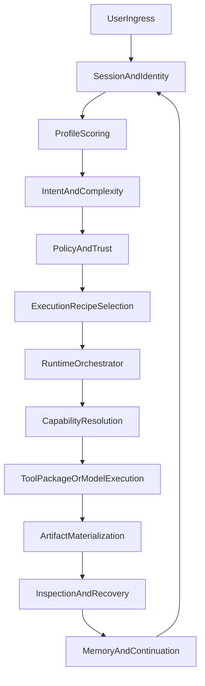

# Master Orchestrator Context

## Purpose

Этот документ отвечает на вопрос: `что именно мы строим как продукт и как должен работать оркестратор`.

Он нужен как главный длинный контекст для новых чатов и для любых больших архитектурных обсуждений. Его задача не заменить операционный backlog, а дать одну устойчивую карту, от которой потом рождаются stage-планы, validation gates и конкретные slices.

## Document Boundaries

Этот файл:

- фиксирует продуктовую бизнес-логику оркестратора;
- фиксирует домены, seams и truth-инварианты;
- связывает ожидания пользователя с реальными зонами кода;
- объясняет, как декомпозировать работу дальше.

Этот файл не делает:

- не хранит live backlog и `what next right now`;
- не хранит per-slice evidence, даты, transient blockers и chat history;
- не заменяет активный `stage_XX_*.plan.md`;
- не подменяет manual acceptance checklist.

## Canonical Document Stack

| Layer | Role | Source |
| ---- | ---- | ---- |
| Long-form orchestrator context | Что строим и как это должно работать | `[.cursor/plans/master_orchestrator_context.md](.cursor/plans/master_orchestrator_context.md)` |
| Short handoff and release boundary | Короткий контекст для новых чатов и релизной границы | `[.cursor/plans/master_v1_roadmap.md](.cursor/plans/master_v1_roadmap.md)` |
| Product boundary | Что входит в Horizon 1 и investor-facing v1 | `[.cursor/plans/autonomous_v1_roadmap_cb6fe0e6.plan.md](.cursor/plans/autonomous_v1_roadmap_cb6fe0e6.plan.md)` |
| Active backlog | Что делать следующим прямо сейчас | `[.cursor/plans/autonomous_v1_active_backlog.md](.cursor/plans/autonomous_v1_active_backlog.md)` |
| Active stage execution | Правила текущего stage и его validation ladder | `stage_XX_*.plan.md` under `[.cursor/plans/](.cursor/plans/)` |
| Execution contract | Operational vocabulary and stop rules | `[.cursor/plans/v1_execution_checklist.md](.cursor/plans/v1_execution_checklist.md)` |
| Live acceptance | Что должно реально пройти у пользователя | `[.cursor/v1_user_acceptance_cases.md](.cursor/v1_user_acceptance_cases.md)`, `[.cursor/stage86_test_cases.md](.cursor/stage86_test_cases.md)` |

## Glossary Of V1 Layers

| Term | Meaning |
| ---- | ------- |
| `Stable V1` | Инженерная граница: routing, runtime truth, recovery, artifacts и execution surfaces честны и достаточно стабильны для пользовательского теста |
| `Horizon 1` | Первая реально полезная пользовательская версия: smart routing, install-resume, file/report flows, developer and domain-aware behavior |
| `Investor cut` | Узкий демо-срез Horizon 1, который можно показать быстро без обещаний про всю будущую платформу |
| `Architecture V1/V2/V3` | Более длинные фазы развития платформы из общей карты, а не недельный delivery commitment |
| `Recipe` | Типизированный execution path, а не просто одна выбранная модель |
| `Capability` | Конкретная возможность runtime или installable package/tool, которую recipe может потребовать |
| `Artifact` | Materialized output: файл, PDF, image, report, code result, release artifact, receipt |

## Product Promise

God Mode Core должен ощущаться как умный оркестратор, а не как чат с одной LLM.

Пользователь должен чувствовать следующее:

- система выбирает execution path под задачу, а не навязывает одну модель;
- простые задачи идут быстрым и дешёвым путём без долгого ожидания;
- сложные задачи могут поднять более сильный runtime или потребовать capability;
- встроенные tools, bootstrap/install, generated scripts и package integration работают как единая среда;
- профиль пользователя помогает, но не запирает в жёсткие границы;
- система умеет не только отвечать, но и материализовать результат;
- если чего-то не хватает, система умеет доустановить, подключить и продолжить;
- runtime честно показывает, что получилось, что не получилось и что нужно сделать дальше.

## Core Orchestrator Principles

### 1. Route by task, not by model worship

Цель оркестратора не в том, чтобы удержать конкретную модель любой ценой. Цель в том, чтобы выбрать лучший execution path по задаче, latency budget, tool requirements, risk level и ожидаемому типу результата.

### 2. Prefer the fastest sufficient path

Система должна по умолчанию предпочитать самый дешёвый и быстрый путь, который даёт правдивый результат:

- deterministic transform лучше, чем дорогой reasoning;
- local model лучше, чем remote heavy model, если задача это позволяет;
- existing tool лучше, чем install;
- installable package лучше, чем генерация нового шва с нуля;
- generated seam допустим, когда reuse и install уже исчерпаны.

### 3. Materialized output beats clever prose

Для многих пользовательских сценариев текст не является достаточным результатом. Канонический успех определяется materialized outcome:

- код или patch;
- PDF/report;
- image asset;
- table/spreadsheet summary;
- generated file;
- runtime receipt with inspectable status.

### 4. Profile is a soft steering layer

У пользователя может быть base profile вроде `developer`, `builder`, `operator`, `general`, но это не жёсткая persona.

Профиль:

- повышает приоритет подходящих recipes, tools и vocabulary;
- помогает на первом старте подобрать sane defaults;
- не даёт скрытых полномочий;
- не запрещает пользователю временно уйти в другой task overlay.

### 5. Memory is layered, not monolithic

Память состоит из нескольких слоёв:

- session context;
- recent working context;
- durable memory and integrations;
- profile signals;
- artifact and project state.

Ни один отдельный слой не должен становиться скрытым монолитом.

### 6. Recovery must be truthful

Система не должна врать про результат:

- несуществующий файл не считается success;
- queued install не считается completed resume;
- degraded path должен быть явно видим;
- follow-up и main run должны жить на одном truth contract.

### 7. UI guards are compatibility shields, not root-cause fixes

Клиентские защитные слои допустимы только как `defense-in-depth` для отображения и совместимости между runtime-версиями.

Это означает:

- backend/gateway остаётся единственным источником истины для delivery, finalization и recovery;
- UI может отфильтровать `NO_REPLY` и подряд идущие идентичные assistant payloads, если это защищает пользователя от event-race или reload дублей;
- такой guard никогда не считается основным исправлением продуктового бага;
- если duplicate delivery исправлен в runtime, клиентский shield остаётся только как узкий anti-regression слой и должен быть явно задокументирован.

## End-To-End Orchestration Flow

### User-facing business logic

1. Пользователь приносит сообщение, файлы, историю и контекст канала.
2. Система определяет identity, session и baseline working state.
3. Мягко оценивает базовый профиль и текущий task overlay.
4. Классифицирует intent, complexity, expected artifact и latency budget.
5. Проверяет policy, trust и approval requirements.
6. Выбирает recipe, а не только модель.
7. Поднимает нужный runtime path: local, remote, tool-driven, bootstrap, artifact, developer lane.
8. Если capability не хватает, решает: reuse, install, generate narrow seam или честный отказ.
9. Выполняет задачу через tools, models, packages, scripts и integrations.
10. Материализует результат в first-class artifact или честное diagnostic outcome.
11. Публикует inspectable truth в runtime and session surfaces.
12. Сохраняет continuation signals и memory так, чтобы следующий шаг не начинался с нуля.

## Domain Architecture

## A. Ingress And Channel Routing

Primary surfaces:

- `[src/routing/resolve-route.ts](src/routing/resolve-route.ts)`
- `[src/routing/bindings.ts](src/routing/bindings.ts)`
- `[src/routing/session-key.ts](src/routing/session-key.ts)`
- `[src/auto-reply/reply/get-reply.ts](src/auto-reply/reply/get-reply.ts)`
- `[src/gateway/server-methods/agent.ts](src/gateway/server-methods/agent.ts)`

Responsibilities:

- принять входящий запрос из канала или gateway;
- привязать запрос к `agentId`, `sessionKey`, `sessionId` и маршруту доставки;
- отделить транспортный routing от orchestration routing;
- гарантировать, что дальше в pipeline идёт одна каноническая точка входа.

Design rule:

- channel routing отвечает на вопрос `куда попадает запрос`;
- orchestration routing отвечает на вопрос `как именно его исполнять`.

## B. Identity, Session, And Profile Signals

Primary surfaces:

- `[src/config/sessions.js](src/config/sessions.js)`
- `[src/agents/command/session.ts](src/agents/command/session.ts)`
- `[src/platform/profile/resolver.ts](src/platform/profile/resolver.ts)`
- `[src/platform/profile/defaults.ts](src/platform/profile/defaults.ts)`
- `[src/platform/schemas/profile.ts](src/platform/schemas/profile.ts)`

Responsibilities:

- вести identity и continuity пользователя;
- извлекать сигналы первого запуска и текущей рабочей сессии;
- мягко определять `base profile`, `session profile`, `task overlay`;
- переиспользовать накопленные сигналы без жёсткой блокировки на одном профиле.

Desired first-run behavior:

- бот на первом старте пытается понять, кто перед ним: developer, builder, operator, general user;
- формирует разумное предположение по профилю;
- объясняет, что это не канон, а soft steering;
- может скорректировать поведение по новым сигналам без ручной перенастройки.

## C. Intent, Policy, And Planning

Primary surfaces:

- `[src/platform/decision/input.ts](src/platform/decision/input.ts)`
- `[src/platform/recipe/planner.ts](src/platform/recipe/planner.ts)`
- `[src/platform/recipe/runtime-adapter.ts](src/platform/recipe/runtime-adapter.ts)`
- `[src/platform/policy/engine.ts](src/platform/policy/engine.ts)`

Responsibilities:

- собрать structured input для planning;
- определить тип задачи и ожидаемый artifact;
- решить, нужен ли tool path, bootstrap path, local reasoning, remote reasoning, developer lane или mixed path;
- отделить policy decisions от prompt improvisation.

Planning output should answer:

- какой recipe выбран;
- какой runtime class нужен;
- какой artifact ожидается;
- есть ли capability gap;
- нужен ли approval;
- допускается ли внешний provider;
- какой fallback truth допустим.

## D. Execution Recipe Registry

Recipe является основной единицей orchestration.

Каждый recipe должен иметь минимум:

- `id`
- `purpose`
- `acceptedInputs`
- `expectedArtifacts`
- `requiredCapabilities`
- `allowedProfiles`
- `riskLevel`
- `preferredRuntimes`
- `validationSuite`
- `recoverySemantics`

### Required recipe families for the first useful version

| Recipe | Purpose | Typical outcome |
| ---- | ---- | ---- |
| `general_reasoning` | Быстрые и общие reasoning turns | Text answer or simple tool result |
| `developer_workflow` | Исследование, код, тест, patch, release-oriented steps | Code diff, test result, artifact or deploy candidate |
| `document_ingest` | PDF, docs, text extraction, structure | Structured document data |
| `table_compare` | CSV/Excel compare and normalize | Ranked table, summary, recommendation |
| `report_generate` | Markdown, PDF, polished report output | Materialized report |
| `image_generate` | Generate or transform visual artifacts | Image asset |
| `capability_bootstrap` | Install or connect a missing capability | Installed capability plus resumed run |
| `artifact_update` | Continue work on an existing artifact | Updated file or versioned artifact |

Design rule:

- orchestration core не должен знать бизнес-логику каждого recipe;
- core должен знать общий контракт recipe execution;
- новые recipes должны добавляться через registry and seams, а не через бесконечный hardcoded `if/else`.

## E. Runtime Orchestrator

Primary surfaces:

- `[src/agents/agent-command.ts](src/agents/agent-command.ts)`
- `[src/agents/model-fallback.ts](src/agents/model-fallback.ts)`
- `[src/auto-reply/reply/get-reply-run.ts](src/auto-reply/reply/get-reply-run.ts)`
- `[src/auto-reply/reply/agent-runner-execution.ts](src/auto-reply/reply/agent-runner-execution.ts)`
- `[src/auto-reply/reply/followup-runner.ts](src/auto-reply/reply/followup-runner.ts)`
- `[src/agents/pi-embedded-runner/run/attempt.ts](src/agents/pi-embedded-runner/run/attempt.ts)`

Responsibilities:

- привести recipe, profile, policy и runtime choice к одному execution path;
- согласовать main run и follow-up run;
- поддерживать fast-path для простых задач;
- поднимать stronger path только когда он действительно нужен;
- держать honest fallback semantics.

Design rule:

- explicit user intent не должен silently ломаться reorder или fallback логикой;
- fallback может менять путь только честно и inspectably;
- tooling и packages являются частью runtime orchestration, а не внешним костылём.

## F. Tools, Capabilities, And Package Strategy

Primary surfaces:

- `[src/agents/tool-catalog.ts](src/agents/tool-catalog.ts)`
- `[src/gateway/tools-invoke-http.ts](src/gateway/tools-invoke-http.ts)`
- `[src/platform/bootstrap/orchestrator.ts](src/platform/bootstrap/orchestrator.ts)`
- `[src/platform/bootstrap/service.ts](src/platform/bootstrap/service.ts)`
- `[src/platform/bootstrap/resolver.ts](src/platform/bootstrap/resolver.ts)`

Система должна различать три пути:

1. `Existing tool`
   Использовать уже доступную возможность.
2. `Installable capability`
   Доустановить пакет, runtime bridge или integration seam и продолжить задачу.
3. `Narrow generated seam`
   Сгенерировать узкий адаптер или script, когда reuse и install уже не подходят.

### Capability resolution ladder

1. Reuse current tool or runtime.
2. Reuse existing package or integration from repo or supported package source.
3. Install approved or explainable external package.
4. Generate a narrow adapter if prior layers are insufficient.
5. Return truthful refusal only when all sane paths are exhausted or blocked by policy.

### Package and integration rule

Система не должна жить только логикой `из хаба` или `заранее руками поставлено`.

Если пользователь говорит что-то вроде `установи MemPalace`, каноническое поведение такое:

1. Понять, это уже существующий tool, package, MCP integration или внешний dependency path.
2. Объяснить, что именно будет установлено и как это встраивается.
3. Выполнить install or connection through the safest available path.
4. Проверить health and availability.
5. Подключить capability в recipe execution.
6. Объяснить пользователю, как новая возможность теперь будет использоваться.

## G. Artifact Runtime

Primary surfaces:

- `[src/platform/materialization/render.ts](src/platform/materialization/render.ts)`
- `[src/platform/materialization/contracts.ts](src/platform/materialization/contracts.ts)`
- `[src/platform/document/](src/platform/document/)`
- `[src/platform/artifacts/](src/platform/artifacts/)`

Artifacts are first-class outcomes.

### First useful artifact families

- code result or project patch;
- PDF or markdown report;
- spreadsheet or comparison table;
- image asset;
- generated downloadable file;
- runtime receipt and visible execution status.

Design rule:

- задача не считается закрытой только потому, что модель красиво объяснила решение;
- если пользователь ожидает файл, отчёт, картинку или сравнение прайсов, успехом считается materialized artifact or a truthful blocked state.

## H. Memory, Context, And Continuity

Primary surfaces:

- `[src/auto-reply/reply/agent-runner-memory.ts](src/auto-reply/reply/agent-runner-memory.ts)`
- `[src/plugin-sdk/memory-core.ts](src/plugin-sdk/memory-core.ts)`
- `[src/auto-reply/reply/agent-runner.ts](src/auto-reply/reply/agent-runner.ts)`
- `[src/auto-reply/reply/agent-runner-utils.ts](src/auto-reply/reply/agent-runner-utils.ts)`

### Memory layers

| Layer | Purpose |
| ---- | ------- |
| Session context | Текущий рабочий диалог и свежие действия |
| Recent working context | Что было сделано в последних шагах и что ещё не потеряло актуальность |
| Durable memory | Долгоживущие факты, user preferences, linked integrations |
| Profile signals | Повторяющиеся паттерны и предпочтения выполнения |
| Artifact and project state | Что уже создано, установлено, проверено, опубликовано |

Design rule:

- память должна помогать оркестратору продолжать работу;
- память не должна становиться непрозрачным чёрным ящиком;
- если система сама выбирает стратегию записи памяти, она обязана выбрать объяснимый режим и уметь его озвучить пользователю.

## I. Inspection, Truth, And Recovery

Primary surfaces:

- `[src/platform/runtime/service.ts](src/platform/runtime/service.ts)`
- `[src/platform/runtime/contracts.ts](src/platform/runtime/contracts.ts)`
- `[src/infra/agent-events.ts](src/infra/agent-events.ts)`
- `[src/auto-reply/reply/closure-outcome-dispatcher.ts](src/auto-reply/reply/closure-outcome-dispatcher.ts)`

### Runtime truth rules

- file success требует реального файла;
- install-resume success требует реального resumed outcome, а не просто enqueue;
- main and follow-up share one truth model;
- denied and degraded states are first-class outcomes;
- operator and user surfaces must show what happened and what is next.

### Recovery rule

Recovery не является вторичной внутренней механикой. Это часть продуктового обещания.

Пользователь должен видеть:

- что задача заблокировалась;
- чего не хватает;
- что было установлено или разрешено;
- продолжилась ли задача после этого;
- получился ли итоговый artifact.

## J. Developer Work Cells

Для developer-oriented flows система должна уметь работать не как один непрерывный чат, а как координируемая среда разработки с общим контекстом.

Желаемая логика:

- `discover` — понять кодовую базу, ограничения и existing seams;
- `plan` — выбрать путь реализации;
- `implement` — внести изменения;
- `validate` — прогнать нужные тесты и build gates;
- `package_or_release` — подготовить materialized outcome;
- `handoff` — зафиксировать что сделано и что дальше.

Это не означает обязательный multi-agent на каждый запрос. Это означает, что developer workflow является отдельным recipe family с повторяемыми этапами и общим контекстом.

## Reference Scenarios

## Scenario 1: Install memory capability on demand

User request:

`Установи MemPalace и подключи память так, как считаешь лучшим.`

Expected orchestration:

1. Определить, что нужен capability/package path.
2. Проверить existing integration seam.
3. Если нужен install, сформулировать install contract.
4. Установить и проверить capability.
5. Подключить в execution surface.
6. Объяснить, как будет происходить запись, поиск и дальнейшее использование памяти.

## Scenario 2: Compare supplier tables and generate report

User request:

`Сравни эти два прайса и скажи, у кого лучше покупать.`

Expected orchestration:

1. Выбрать `table_compare` recipe.
2. Простое чтение и нормализацию выполнить дешёвым путём.
3. Для форматирования recommendation table поднять более подходящий path only if needed.
4. Материализовать summary table and recommendation.
5. При запросе report materialize PDF or markdown.

## Scenario 3: Developer asks for a stable coding environment

User request:

`Сделай умную среду для разработки, которая держит контекст и помогает вести задачу до результата.`

Expected orchestration:

1. Выбрать `developer_workflow` recipe family.
2. Сформировать work cells: discover, plan, implement, validate, handoff.
3. Переиспользовать memory, package install, scripts and tools as one environment.
4. Материализовать outcome как diff, validated result, artifact or release candidate.

## Validation And Acceptance Model

Master-документ задаёт только каноническую логику, а не живой статус.

Validation layers остаются такими:

- `T1` focused tests for touched modules;
- `T2` `pnpm check` and `pnpm build` where required;
- `T3` `pnpm test:e2e:smoke` for gateway/chat/runtime boot paths;
- `T4` `pnpm test:v1-gate` before release-boundary claims;
- `T5` live user acceptance from `[.cursor/v1_user_acceptance_cases.md](.cursor/v1_user_acceptance_cases.md)` and stage checklists.

Product rule:

- `v1 ready` определяется не только зелёным automated ladder, а прохождением полного live acceptance.

## How Tactical Plans Derive From This Document

### Permanent domains

Этот документ задаёт постоянные домены:

- ingress and routing;
- sessions and profiles;
- policy and planning;
- recipe registry;
- runtime orchestration;
- tools and capability bootstrap;
- artifact runtime;
- memory and continuity;
- inspection and recovery;
- developer work cells.

### Derivation rule

Каждый tactical stage-план должен:

- ссылаться на один или несколько доменов из этого документа;
- явно формулировать user value, который он закрывает;
- перечислять touched files and validation tiers;
- соблюдать runtime truth rules из этого документа;
- не создавать локальную продуктовую философию, которая противоречит master context.

### Operational rule

Только `[.cursor/plans/autonomous_v1_active_backlog.md](.cursor/plans/autonomous_v1_active_backlog.md)` отвечает на вопрос `что делать следующим прямо сейчас`.

Master context отвечает на вопрос `зачем существует этот slice и где его место в общей архитектуре`.

## Canonical References Index

- `[.cursor/plans/master_v1_roadmap.md](.cursor/plans/master_v1_roadmap.md)`
- `[.cursor/plans/autonomous_v1_roadmap_cb6fe0e6.plan.md](.cursor/plans/autonomous_v1_roadmap_cb6fe0e6.plan.md)`
- `[.cursor/plans/autonomous_v1_active_backlog.md](.cursor/plans/autonomous_v1_active_backlog.md)`
- `[.cursor/plans/v1_execution_checklist.md](.cursor/plans/v1_execution_checklist.md)`
- `[.cursor/plans/autonomous_v1_loop_a69b9e98.plan.md](.cursor/plans/autonomous_v1_loop_a69b9e98.plan.md)`
- `[.cursor/plans/multi_agent_execution_protocol.md](.cursor/plans/multi_agent_execution_protocol.md)`
- `[.cursor/plans/sovereign_ai_map_8e04210e.plan.md](.cursor/plans/sovereign_ai_map_8e04210e.plan.md)`
- `[.cursor/v1_user_acceptance_cases.md](.cursor/v1_user_acceptance_cases.md)`
- `[.cursor/stage86_test_cases.md](.cursor/stage86_test_cases.md)`

## What Must Stay Out Of This File

- живые blocker entries;
- per-slice validation logs;
- одноразовые tactical решения;
- временные stage-specific обещания;
- подробная история чатов.

## Expected Result

Если этот документ поддерживается в актуальном состоянии, у проекта появляется один устойчивый архитектурно-продуктовый контекст, который:

- объясняет, какой оркестратор строится;
- не даёт снова скатиться в спор нескольких `.md`, каждый из которых претендует на истину;
- помогает новым чатам быстро восстановить правильную картину;
- позволяет строить детальные stage-планы без потери общей бизнес-логики.
