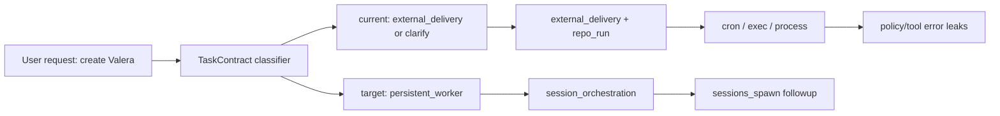

# Orchestrator Decision Audit

## Предварительный диагноз

- В [src/platform/decision/task-classifier.ts](src/platform/decision/task-classifier.ts) схема `TaskContract` не имеет исхода для “создай постоянного агента / фоновую сессию”. Сейчас модель вынуждена выбирать между `clarification_needed`, `external_delivery`, `document_package` и т.п.
- В [src/platform/decision/tool-registry.ts](src/platform/decision/tool-registry.ts) нет `sessions_spawn`, хотя сам tool есть в [src/agents/tools/sessions-spawn-tool.ts](src/agents/tools/sessions-spawn-tool.ts) и поддерживает `continuation="followup"`.
- В [src/platform/decision/resolution-contract.ts](src/platform/decision/resolution-contract.ts) нет `toolBundle` для session/subagent orchestration. Поэтому `external_delivery` превращается в `external_delivery` bundle, а не в spawn-сценарий.
- В [src/platform/recipe/planner.ts](src/platform/recipe/planner.ts) `external_delivery` допускает `code_build_publish`, `integration_delivery`, `ops_orchestration`; это объясняет, почему “Валера” уехал в ops/publish/cron.
- В [src/agents/pi-tool-definition-adapter.ts](src/agents/pi-tool-definition-adapter.ts) и [src/platform/runtime/execution-intent-from-plan.ts](src/platform/runtime/execution-intent-from-plan.ts) есть поверхности, где raw tool/policy errors или `contract_unsatisfiable` могут дойти дальше как обычный результат, если не поставить единый hard gate.

## Audit And Fix Plan

1. Add an explicit “persistent worker / session orchestration” contract path.
  - Extend the classifier vocabulary in [src/platform/decision/task-classifier.ts](src/platform/decision/task-classifier.ts) with a distinct outcome or deliverable kind for “spawn persistent worker”.
  - Add examples for Russian and English: “создай сабагента Валера”, “постоянная сессия”, “каждый день слать отчёт”, “background worker”, “persistent subagent”.
  - Map this path to `sessions_spawn` with `continuation="followup"` and never to `external_delivery` unless the user asks to publish to an outside provider directly.
2. Add first-class routing/bundles for orchestration instead of overloading publish.
  - Extend [src/platform/decision/tool-registry.ts](src/platform/decision/tool-registry.ts) to derive `sessions_spawn` from a new abstract capability such as `needs_session_orchestration` or `needs_persistent_worker`.
  - Extend [src/platform/decision/resolution-contract.ts](src/platform/decision/resolution-contract.ts) with a `session_orchestration` tool bundle.
  - Update [src/platform/recipe/planner.ts](src/platform/recipe/planner.ts) so this bundle selects a safe orchestration recipe, not `code_build_publish` or generic external delivery.
3. Make clarification behavior less brittle, not just “raise threshold”.
  - Keep P0.2 protection for irreversible workspace mutations, but make “spawn named agent / persistent session” non-mutating and actionable when the requested role/schedule/deliverable is clear enough.
  - Harden clarify budget in [src/platform/decision/input.ts](src/platform/decision/input.ts): repeated same-topic clarifications should force an assumption/default, and topic keys should survive turns where the model words the ambiguity slightly differently.
  - Add tests for the exact three-turn “Валера” sequence from the prior chat.
4. Sanitize all policy/tool denial paths consistently.
  - Add a shared sanitizer for tool-result error reasons used by [src/agents/pi-embedded-subscribe.tools.ts](src/agents/pi-embedded-subscribe.tools.ts), [src/agents/pi-tool-definition-adapter.ts](src/agents/pi-tool-definition-adapter.ts), and gateway invocation surfaces.
  - Replace raw strings like `Only reminder scheduling is allowed from this chat.` with user-safe explanations, while preserving raw detail only in logs/debug metadata.
  - Ensure receipts say “this action is not allowed from this chat/tool context” rather than leaking internal policy wording.
5. Add contract hard-stops and regression coverage.
  - Audit consumers of `routingOutcome` so `contract_unsatisfiable` cannot be treated as successful execution.
  - Add focused unit tests in [src/platform/decision/task-classifier.test.ts](src/platform/decision/task-classifier.test.ts), planner tests in [src/platform/recipe/planner.test.ts](src/platform/recipe/planner.test.ts), and tool sanitization tests in [src/agents/pi-embedded-subscribe.tools.test.ts](src/agents/pi-embedded-subscribe.tools.test.ts).
  - Extend [scripts/live-routing-smoke.mjs](scripts/live-routing-smoke.mjs) or equivalent smoke coverage with Telegram-style “create Valera daily report” cases.

## Success Criteria

- “Создай сабагента Валера / постоянную сессию / ежедневно слать отчёт” classifies to the new orchestration contract, not `clarification_needed` or `external_delivery`.
- Planner emits a route whose requested tools include `sessions_spawn` and whose bundle is orchestration-specific.
- LLM receives `sessions_spawn` guidance and can create a follow-up/persistent session when policy allows it.
- Cron is used only for reminder/schedule semantics where the current chat policy allows it, not as a fallback for missing spawn routing.
- Tool/policy failures never expose raw internal denial text in user-facing receipts.
- Regression tests cover the prior broken Telegram transcript.
