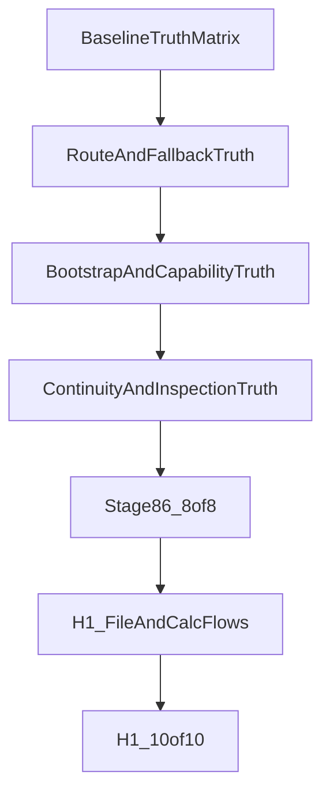

# Runtime Stabilization Recovery

## Goal

Этот файл не заменяет `[.cursor/plans/master_orchestrator_context.md](.cursor/plans/master_orchestrator_context.md)` и не дублирует `[.cursor/plans/autonomous_v1_active_backlog.md](.cursor/plans/autonomous_v1_active_backlog.md)`.

Его роль: быть первым жёстким tactical execution-plan для runtime/orchestrator слоя, который переводит общую архитектурную карту в конкретный порядок работы по живым проблемам Stage 86 и следующим Horizon 1 slices.

Итоговая цель:

- привести core orchestration к каноническому контракту из `master_orchestrator_context`;
- убрать ложные успехи в routing, bootstrap, artifacts, continuity и recovery;
- честно закрыть Stage 86 foundation `**8/8**`;
- затем провести Horizon 1 до общего live gate `**10/10**`.

## Role In The Document Stack

Этот tactical plan живёт в следующей иерархии:

- `[.cursor/plans/master_orchestrator_context.md](.cursor/plans/master_orchestrator_context.md)` — длинный продуктовый и архитектурный смысл;
- `[.cursor/plans/master_v1_roadmap.md](.cursor/plans/master_v1_roadmap.md)` — короткий handoff и release boundary;
- `[.cursor/plans/autonomous_v1_active_backlog.md](.cursor/plans/autonomous_v1_active_backlog.md)` — единственный живой backlog со статусами и `resumeFrom`;
- `[.cursor/plans/stage_86_smart_routing_bootstrap.plan.md](.cursor/plans/stage_86_smart_routing_bootstrap.plan.md)` — stage-level execution rules для Stage 86;
- этот файл — tactical recovery-plan по orchestration core, который объясняет, как именно закрывать runtime seams, на которых держатся S86-01…S86-06 и post-Stage-86 H1 slices.

## Out Of Scope

- Полный multi-runtime platform rewrite beyond current Horizon 1.
- Полноценный marketplace capabilities и arbitrary install from the internet.
- Большой UI/UX redesign вне runtime truth и inspection surfaces.
- Новая продуктовая философия, противоречащая `master_orchestrator_context`.
- Подмена active backlog этим файлом.

## Current Truth Sources

- `[.cursor/plans/master_orchestrator_context.md](.cursor/plans/master_orchestrator_context.md)`
- `[.cursor/plans/master_v1_roadmap.md](.cursor/plans/master_v1_roadmap.md)`
- `[.cursor/plans/stage_86_smart_routing_bootstrap.plan.md](.cursor/plans/stage_86_smart_routing_bootstrap.plan.md)`
- `[.cursor/plans/autonomous_v1_active_backlog.md](.cursor/plans/autonomous_v1_active_backlog.md)`
- `[.cursor/plans/v1_execution_checklist.md](.cursor/plans/v1_execution_checklist.md)`
- `[.cursor/stage86_test_cases.md](.cursor/stage86_test_cases.md)`
- `[.cursor/v1_user_acceptance_cases.md](.cursor/v1_user_acceptance_cases.md)`

## Tactical Recovery Model

## Ordered Tactical Workstreams

### Workstream 0 — Baseline Truth Matrix

Сначала не лечить всё сразу, а привязать активные live-failures и backlog slices к конкретным seams оркестратора из `master_orchestrator_context`.

Опорные домены:

- `ingress and routing`
- `policy and planning`
- `runtime orchestration`
- `tools and capability bootstrap`
- `artifact runtime`
- `inspection and recovery`

Основные файлы:

- `[src/platform/decision/route-preflight.ts](src/platform/decision/route-preflight.ts)`
- `[src/platform/decision/input.ts](src/platform/decision/input.ts)`
- `[src/platform/recipe/planner.ts](src/platform/recipe/planner.ts)`
- `[src/platform/recipe/runtime-adapter.ts](src/platform/recipe/runtime-adapter.ts)`
- `[src/agents/model-fallback.ts](src/agents/model-fallback.ts)`
- `[src/auto-reply/reply/agent-runner-execution.ts](src/auto-reply/reply/agent-runner-execution.ts)`
- `[src/auto-reply/reply/followup-runner.ts](src/auto-reply/reply/followup-runner.ts)`
- `[src/platform/bootstrap/](src/platform/bootstrap/)`
- `[src/platform/runtime/](src/platform/runtime/)`

Результат:

- каждый active slice в backlog сопоставлен с доменом master context и code-owner surfaces;
- понятно, какие баги относятся к runtime truth, какие к внешнему live gate, а какие к channel transport;
- обновление backlog идёт только через `lastValidation`, `resumeFrom`, `evidence`.

Gate перехода:

- нет больше неразмеченных `это как-то сломано`, для каждого сбоя есть техническая поверхность и validation seam.

### Workstream 1 — Orchestrator Routing Truth

Этот слой закрывает прежде всего `S86-01`, а также готовит почву для `H1-01` и `H1-02`.

Цель:

- стабилизировать route-preflight, fallback и explicit user intent как единый orchestration path;
- убрать framing `single-model pin`;
- сделать правильным не `держать одну модель`, а `честно выбирать лучший execution path`.

Основные файлы:

- `[src/platform/decision/route-preflight.ts](src/platform/decision/route-preflight.ts)`
- `[src/platform/decision/input.ts](src/platform/decision/input.ts)`
- `[src/platform/recipe/planner.ts](src/platform/recipe/planner.ts)`
- `[src/platform/recipe/runtime-adapter.ts](src/platform/recipe/runtime-adapter.ts)`
- `[src/agents/model-fallback.ts](src/agents/model-fallback.ts)`
- `[src/agents/agent-command.ts](src/agents/agent-command.ts)`
- `[src/auto-reply/reply/get-reply-run.ts](src/auto-reply/reply/get-reply-run.ts)`

Primary validations:

- `[src/platform/decision/route-preflight.test.ts](src/platform/decision/route-preflight.test.ts)`
- `[src/platform/decision/input.test.ts](src/platform/decision/input.test.ts)`
- `[src/platform/recipe/runtime-adapter.test.ts](src/platform/recipe/runtime-adapter.test.ts)`
- `[src/platform/runtime/execution-intent-from-plan.test.ts](src/platform/runtime/execution-intent-from-plan.test.ts)`
- `[src/agents/model-fallback.test.ts](src/agents/model-fallback.test.ts)`
- `[src/agents/model-fallback.probe.test.ts](src/agents/model-fallback.probe.test.ts)`

Done when:

- user intent, preflight mode and fallback chain дают inspectable and truthful route selection;
- simple turns честно идут быстрым путём, heavy turns поднимают stronger path only when needed;
- Stage 86 кейсы 1, 2, 3 и 8 либо реально проходят, либо остаются `blocked_external` с честной причиной.

### Workstream 2 — Prompt, Bootstrap, And Capability Truth

Этот слой закрывает `S86-02` и `S86-03`, а также часть `H1-01`.

Цель:

- не смешивать prompt-visibility, capability detection, install flow и resume semantics;
- развести built-in capabilities, installable packages и narrow generated seams;
- сделать approve -> install -> resume продуктовой, а не внутренней механикой.

Основные файлы:

- `[src/context-engine/prompt-optimize.ts](src/context-engine/prompt-optimize.ts)`
- `[src/agents/pi-embedded-runner/run/attempt.ts](src/agents/pi-embedded-runner/run/attempt.ts)`
- `[src/platform/bootstrap/service.ts](src/platform/bootstrap/service.ts)`
- `[src/platform/bootstrap/orchestrator.ts](src/platform/bootstrap/orchestrator.ts)`
- `[src/platform/bootstrap/resolver.ts](src/platform/bootstrap/resolver.ts)`
- `[src/platform/bootstrap/audit.ts](src/platform/bootstrap/audit.ts)`
- `[src/platform/recipe/runtime-adapter.ts](src/platform/recipe/runtime-adapter.ts)`
- `[src/agents/tools/pdf-tool.ts](src/agents/tools/pdf-tool.ts)`

Primary validations:

- `[src/context-engine/prompt-optimize.test.ts](src/context-engine/prompt-optimize.test.ts)`
- `[src/platform/bootstrap/service.test.ts](src/platform/bootstrap/service.test.ts)`
- `[src/platform/bootstrap/orchestrator.test.ts](src/platform/bootstrap/orchestrator.test.ts)`
- `[src/agents/tools/pdf-tool.test.ts](src/agents/tools/pdf-tool.test.ts)`

Done when:

- prompt optimization visibility не расходится с живым runtime log;
- capability gap честно определяется как `existing tool`, `installable capability` или `generated seam`;
- Stage 86 кейс 4 проходит как `approve -> install -> resume`;
- PDF/report path не врёт про already-available vs bootstrap-needed capability.

### Workstream 3 — Artifact, Continuity, And Inspection Truth

Этот слой закрывает `S86-04`, `S86-05` и часть `H1-01`.

Цель:

- согласовать main run, follow-up, session continuity, artifact materialization и runtime inspection surfaces;
- не считать текстовый ответ успешным там, где ожидался materialized artifact;
- сделать runtime/user/operator truth одной цепочкой.

Основные файлы:

- `[src/auto-reply/reply/agent-runner-execution.ts](src/auto-reply/reply/agent-runner-execution.ts)`
- `[src/auto-reply/reply/agent-runner-execution.runtime.ts](src/auto-reply/reply/agent-runner-execution.runtime.ts)`
- `[src/auto-reply/reply/followup-runner.ts](src/auto-reply/reply/followup-runner.ts)`
- `[src/auto-reply/reply/agent-runner-utils.ts](src/auto-reply/reply/agent-runner-utils.ts)`
- `[src/platform/materialization/](src/platform/materialization/)`
- `[src/platform/artifacts/](src/platform/artifacts/)`
- `[src/platform/runtime/service.ts](src/platform/runtime/service.ts)`
- `[src/platform/runtime/contracts.ts](src/platform/runtime/contracts.ts)`
- `[src/infra/agent-events.ts](src/infra/agent-events.ts)`
- `ui/src/ui/views/sessions.ts`
- `ui/src/ui/controllers/runtime-inspector.ts`
- `ui/src/ui/views/usage.ts`

Primary validations:

- `[src/auto-reply/reply/followup-runner.test.ts](src/auto-reply/reply/followup-runner.test.ts)`
- `[src/auto-reply/reply/agent-runner.runreplyagent.e2e.test.ts](src/auto-reply/reply/agent-runner.runreplyagent.e2e.test.ts)`
- `[src/platform/materialization/render.test.ts](src/platform/materialization/render.test.ts)`
- `[src/platform/materialization/contracts.test.ts](src/platform/materialization/contracts.test.ts)`
- `[src/platform/artifacts/gateway.test.ts](src/platform/artifacts/gateway.test.ts)`
- `[src/platform/artifacts/service.test.ts](src/platform/artifacts/service.test.ts)`
- `ui/src/ui/views/sessions.test.ts`

Done when:

- file/path success требует реального artifact on disk or in artifact service;
- main run и follow-up разделяют один continuity contract;
- Stage 86 кейсы 6 и 7 реально видны в Sessions/Usage surfaces;
- H1-01 получает честный artifact/report substrate для table and report flows.

### Workstream 4 — Stage 86 Foundation Proof

После закрытия deterministic seams выше этот workstream превращает Stage 86 из набора partial fixes в честное foundation proof.

Связанные backlog slices:

- `S86-01`
- `S86-02`
- `S86-03`
- `S86-04`
- `S86-05`
- `S86-06`

Execution rule:

- deterministic части каждого slice должны быть зелёными до полного живого прогона;
- Telegram нельзя использовать как оправдание незакрытых core-runtime дефектов;
- channel proof начинается только после закрытия routing/bootstrap/inspection truth.

Основные файлы:

- `[extensions/telegram/src/probe.ts](extensions/telegram/src/probe.ts)`
- `[extensions/telegram/src/probe.test.ts](extensions/telegram/src/probe.test.ts)`
- channel/gateway wiring only if diagnostics point there

Gate завершения:

- Stage 86 считается закрытым только при честном проходе `**8/8**` из `[.cursor/stage86_test_cases.md](.cursor/stage86_test_cases.md)`;
- если внешний Hydra, сеть, ключ или Telegram мешают — это оформляется как `blocked_external`, а не замазывается частичным success.

### Workstream 5 — Horizon 1 Flow Proof

После Stage 86 тот же tactical plan продолжает вести runtime/orchestrator слой через `H1-01`, `H1-02`, `H1-03`.

Связанные backlog slices:

- `H1-01` universal file/table/report flow
- `H1-02` structured calculation flow + builder context preset
- `H1-03` final investor proof and handoff

Цель:

- использовать уже стабилизированный orchestration core для document/table/report/calculation scenarios;
- не плодить новый локальный план, который снова спорит с master context;
- довести общий live regression до `10/10`.

Основные зоны:

- `[src/platform/recipe/](src/platform/recipe/)`
- `[src/platform/document/](src/platform/document/)`
- `[src/platform/materialization/](src/platform/materialization/)`
- `[src/platform/profile/](src/platform/profile/)`
- `[src/platform/decision/](src/platform/decision/)`
- `[src/agents/system-prompt.ts](src/agents/system-prompt.ts)`
- `[src/agents/pi-embedded-runner/](src/agents/pi-embedded-runner/)`

Gate завершения:

- case 9 и case 10 из `[.cursor/v1_user_acceptance_cases.md](.cursor/v1_user_acceptance_cases.md)` проходят живьём;
- затем общий live gate становится честным `**10/10**`;
- готов короткий user-testable handoff без устных оговорок про скрытые runtime gaps.

## Validation Ladder

Опираемся на:

- `[.cursor/plans/master_v1_roadmap.md](.cursor/plans/master_v1_roadmap.md)`
- `[.cursor/plans/stage_86_smart_routing_bootstrap.plan.md](.cursor/plans/stage_86_smart_routing_bootstrap.plan.md)`
- `[.cursor/plans/v1_execution_checklist.md](.cursor/plans/v1_execution_checklist.md)`
- `[docs/help/testing.md](docs/help/testing.md)`

| Tier | Command / evidence                                                     | When required                                                              |
| ---- | ---------------------------------------------------------------------- | -------------------------------------------------------------------------- |
| T1   | `pnpm test -- <relevant-paths>`                                        | Всегда для touched modules                                                 |
| T2   | `pnpm check`; `pnpm build` where required                              | Typing, build, broad wiring, UI bundle, lazy boundaries                    |
| T3   | `pnpm test:e2e:smoke`                                                  | Gateway/chat/runtime boot paths                                            |
| T4   | `pnpm test:v1-gate`                                                    | Recovery/session-event/release boundary surfaces и всегда перед `v1 ready` |
| T5   | `.cursor/stage86_test_cases.md`, `.cursor/v1_user_acceptance_cases.md` | Product proof                                                              |

### E2E и «как пользователь»

Автоматические e2e и ручной прогон не конкурируют, а дополняют друг друга.

- **Автоматический e2e (CI/deterministic):**
  - базовый барьер для затронутых boot/chat/runtime путей: `pnpm test:e2e:smoke` (это **T3** в таблице выше);
  - если затронута широкая интеграция и это оправдано touched area, дополнительно: broader `pnpm test:e2e` — см. `[.cursor/plans/master_v1_roadmap.md](.cursor/plans/master_v1_roadmap.md)` (Release Ladder) и `[docs/help/testing.md](docs/help/testing.md)`.
- **Ручной прогон как пользователь (обязателен для продуктового gate, не заменяется T1–T4):**
  - отправить реальное сообщение в выбранный канал (например Telegram), дождаться ответа;
  - сверить ожидания сценария с фактом (текст, артефакты, bootstrap/resume);
  - по шаблону из чеклистов снять **gateway log** и при необходимости **control UI** (Sessions, bootstrap-панель, usage);
  - зафиксировать evidence в `[.cursor/plans/autonomous_v1_active_backlog.md](.cursor/plans/autonomous_v1_active_backlog.md)` (`lastValidation`, `evidence`).

**Stage 86 foundation** по продукту = полный проход `**8/8`** кейсов из `[.cursor/stage86_test_cases.md](.cursor/stage86_test_cases.md)` (T5 для трека Stage 86).

**Точная проверка Horizon 1 / заявление готовности к пользовательскому тесту** = полный проход `**10/10`** сценариев из `[.cursor/v1_user_acceptance_cases.md](.cursor/v1_user_acceptance_cases.md)` — это отдельный и более широкий live gate, чем Stage 86; без него нельзя считать трек «точно проверенным по продукту», даже если автоматические tier’ы зелёные.

Rules:

- scoped tests никогда не заменяют live gate;
- на позднем этапе всплыл баг из раннего слоя — вернуться к более раннему workstream и заново закрыть его truth;
- Stage 86 foundation = `**8/8**`, а не старый мягкий порог `6+/8`;
- для **точной** продуктовой проверки по всему Horizon 1 обязателен полный `**10/10`** по `[.cursor/v1_user_acceptance_cases.md](.cursor/v1_user_acceptance_cases.md)` в дополнение к Stage 86, если цель — не только foundation Stage 86.

## Continue Conditions

Продолжать без нового пинга пользователя, если одновременно:

- следующий slice уже определён в active backlog;
- touched scope укладывается в текущий tactical track;
- deterministic validation можно прогнать сразу;
- нет hard stop;
- live/manual шаг ещё не требует внешнего действия оператора.

## Hard Stop Conditions

Остановиться и явно эскалировать только если:

- для продолжения нужен внешний ключ, сеть, Telegram/Hydra/Ollama access или действие оператора;
- обязательный tier нельзя сделать зелёным без расширения scope за пределы текущего runtime/orchestrator track;
- найдено противоречие между `master_orchestrator_context`, active backlog и live acceptance;
- следующий шаг является только manual/live gate.

## First Slice To Execute

Работать в следующем порядке:

1. `Workstream 0 — Baseline Truth Matrix`
2. `Workstream 1 — Orchestrator Routing Truth`
3. `Workstream 2 — Prompt, Bootstrap, And Capability Truth`
4. `Workstream 3 — Artifact, Continuity, And Inspection Truth`
5. `Workstream 4 — Stage 86 Foundation Proof`
6. `Workstream 5 — Horizon 1 Flow Proof`

Нельзя:

- прыгать сразу к Telegram;
- объявлять Stage 86 закрытым без `8/8`;
- объявлять Horizon 1 готовым без `10/10`;
- маскировать external blockers под runtime fixed.

## Expected Outcome

После прохождения этого плана у проекта должен появиться не очередной локальный recovery-документ, а реальный tactical execution order для runtime/orchestrator слоя:

- master context задаёт общую философию;
- active backlog задаёт `what next right now`;
- этот файл задаёт жёсткий порядок исправления core-runtime seams;
- Stage 86 закрывается честно;
- Horizon 1 доводится до `10/10` на уже стабилизированном orchestration core.
