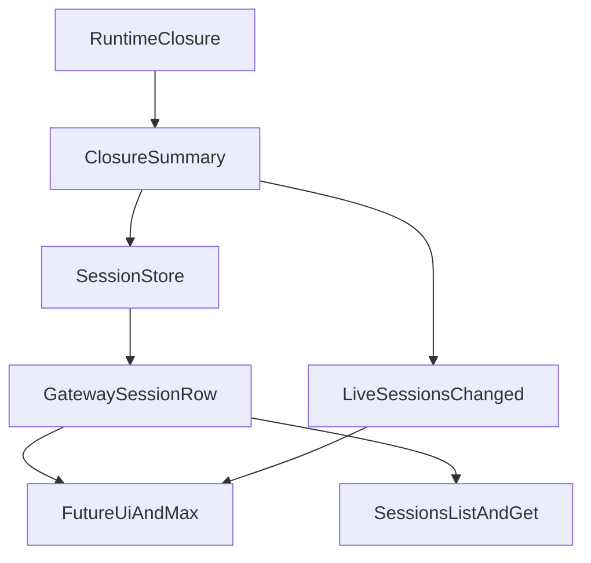

# Stage 18: Durable Session Closure Parity

## Goal

Сделать следующий шаг после [src/infra/agent-events.ts](src/infra/agent-events.ts) и [src/gateway/session-lifecycle-state.ts](src/gateway/session-lifecycle-state.ts): довести `runClosureSummary` до durable session truth, чтобы live WS snapshots, session list/get APIs и reconnect/reload flows видели один и тот же structured closure outcome, а не только coarse `status`.

Итог этапа:

- compact closure summary перестаёт жить только в live `sessions.changed`
- session rows после reload/restart сохраняют declared intent/recipe, final action и reason code
- gateway list/get surfaces получают API parity с live session snapshots
- будущие UI/MAX surfaces могут опираться на один reload-stable contract

## Why This Is The Strongest Next Step

`Stage 17` уже сделал важный переход: `recordRunClosure()` эмитит `runtime/closure` event, а [src/gateway/server-chat.ts](src/gateway/server-chat.ts) умеет включать `runClosureSummary` в live session snapshots. Но сейчас этот truth ещё не полностью durable:

- [src/gateway/session-lifecycle-state.ts](src/gateway/session-lifecycle-state.ts) на runtime closure event сохраняет только `updatedAt` и coarse `status`, но не сам `runClosureSummary`
- [src/config/sessions/types.ts](src/config/sessions/types.ts) не хранит closure summary на session entry
- [src/gateway/session-utils.ts](src/gateway/session-utils.ts) собирает `GatewaySessionRow` из `SessionEntry`, но не гидрирует туда `runClosureSummary`
- [src/gateway/ws-log.ts](src/gateway/ws-log.ts) пока не даёт first-class runtime closure summary для operator-facing diagnostics

Перед UI/MAX это самый сильный следующий шаг: сначала делаем session/API truth reload-stable, и только потом строим richer views и controls поверх уже устойчивого summary contract.

## Current Anchors

- Runtime closure emission: [src/platform/runtime/service.ts](src/platform/runtime/service.ts), [src/infra/agent-events.ts](src/infra/agent-events.ts)
- Session lifecycle projection: [src/gateway/session-lifecycle-state.ts](src/gateway/session-lifecycle-state.ts)
- Session persistence model: [src/config/sessions/types.ts](src/config/sessions/types.ts)
- Gateway session hydration: [src/gateway/session-utils.ts](src/gateway/session-utils.ts), [src/gateway/session-utils.types.ts](src/gateway/session-utils.types.ts)
- Live session snapshot consumer: [src/gateway/server-chat.ts](src/gateway/server-chat.ts)
- Operator logging surface: [src/gateway/ws-log.ts](src/gateway/ws-log.ts)

## Architecture Sketch

## Workstreams

### 1. Persist Closure Summary On Session Entries

Сделать `runClosureSummary` first-class persisted field на session entry, а не transient live patch.

Основные файлы:

- [src/config/sessions/types.ts](src/config/sessions/types.ts)
- [src/gateway/session-lifecycle-state.ts](src/gateway/session-lifecycle-state.ts)

Ключевой результат:

- runtime closure event сохраняет compact summary вместе с terminal session state
- restart/reconnect больше не теряют final action/reason/declared intent truth

### 2. Hydrate Gateway Session Rows

Протянуть persisted summary в `GatewaySessionRow` и во все session list/get surfaces.

Основные файлы:

- [src/gateway/session-utils.ts](src/gateway/session-utils.ts)
- [src/gateway/session-utils.types.ts](src/gateway/session-utils.types.ts)
- при необходимости [src/gateway/protocol](src/gateway/protocol)

Ключевой результат:

- `sessions.list` и `loadGatewaySessionRow()` показывают тот же closure summary, что и live snapshots
- operator/UI consumers получают parity между live и reload flows

### 3. Closure Precedence Discipline

Зафиксировать, как closure-derived truth соотносится с legacy lifecycle `status`, `endedAt`, `runtimeMs`, чтобы не появилось двух конфликтующих финальных картин.

Основные файлы:

- [src/gateway/session-lifecycle-state.ts](src/gateway/session-lifecycle-state.ts)
- [src/gateway/server-chat.ts](src/gateway/server-chat.ts)
- [src/gateway/session-utils.ts](src/gateway/session-utils.ts)

Ключевой результат:

- documented precedence для `status`/`runClosureSummary`
- нет расхождения между live patch и persisted row hydration

### 4. Operator Logging And Inspection Readiness

Сделать runtime closure events читаемыми в ws/operator diagnostics, чтобы structured summary было удобно инспектировать не только через session payloads.

Основные файлы:

- [src/gateway/ws-log.ts](src/gateway/ws-log.ts)
- при необходимости [src/infra/agent-events.ts](src/infra/agent-events.ts)

Ключевой результат:

- runtime closure events логируются так же осмысленно, как assistant/tool/lifecycle streams
- operator debugging не опирается на generic event dumps

### 5. Deterministic Session-Parity Scenarios

Закрепить parity между live and reload session surfaces короткими deterministic tests.

Основные файлы:

- [src/gateway/session-lifecycle-state.test.ts](src/gateway/session-lifecycle-state.test.ts)
- [src/gateway/server-chat.agent-events.test.ts](src/gateway/server-chat.agent-events.test.ts)
- [src/gateway/session-utils.test.ts](src/gateway/session-utils.test.ts)
- при необходимости [src/gateway/openresponses-http.test.ts](src/gateway/openresponses-http.test.ts)

Ключевой результат:

- минимум один scenario доказывает, что `sessions.changed` и persisted session row несут одинаковый closure summary
- минимум один scenario доказывает reload/reconnect parity после записи closure summary в session store
- минимум один scenario доказывает корректную precedence между closure-derived status и legacy lifecycle fields

## Sequencing

1. Сначала добавить persisted `runClosureSummary` в session model.
2. Затем сохранить его в session lifecycle persistence path.
3. После этого гидрировать summary в gateway session rows и list/get APIs.
4. Потом выровнять logging и precedence discipline.
5. В конце закрепить live-vs-reload parity tests.

## Guardrails

- Не дублировать полный `PlatformRuntimeRunClosure` в session store; хранить только compact summary.
- Не вводить конфликтующие источники финального `status` между lifecycle и closure summary.
- Не ломать текущие live `sessions.changed` semantics ради reload path.
- Не раздувать session rows полями, которые уже доступны через `platform.runtime.closures.get`.
- Не ухудшать hot path list/get лишними expensive lookups.

## Validation Target

- `pnpm tsgo`
- `pnpm build`
- `pnpm check`
- targeted gateway/session tests
- по возможности комбинированный gateway batch для проверки inter-file isolation на новом session-closure path
