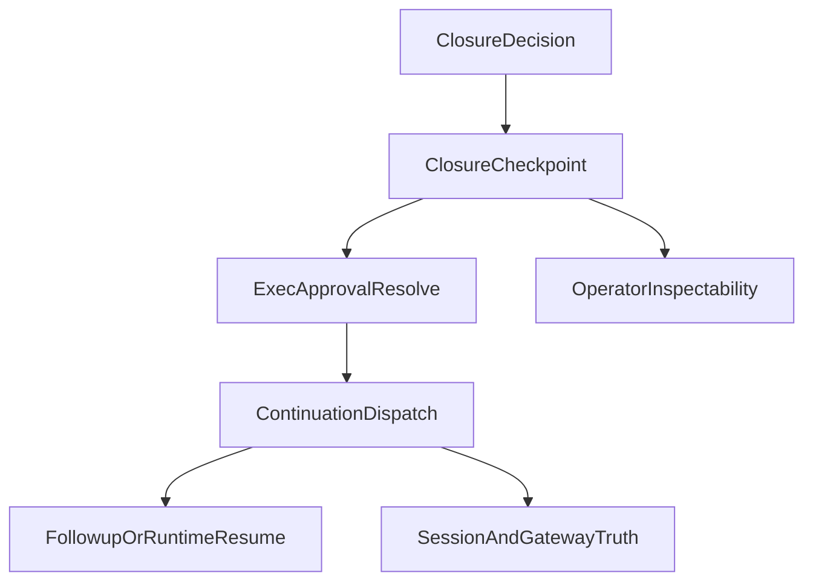

# Stage 21: Closure Continuation and Resolution Loop

## Goal

Сделать следующий шаг после [src/auto-reply/reply/closure-outcome-dispatcher.ts](src/auto-reply/reply/closure-outcome-dispatcher.ts), [src/gateway/server-methods/exec-approval.ts](src/gateway/server-methods/exec-approval.ts) и [src/platform/runtime/service.ts](src/platform/runtime/service.ts): довести `closure`-созданные approval/bootstrap outcomes от состояния `actionable object created` до реального `continuation truth`, чтобы операторское решение не заканчивалось на `approved`, а переводило run в понятный `resumed -> continued` loop.

Итог этапа:

- `closure.recovery` получает такой же законченный continuation story, как уже есть у `bootstrap_run`
- `exec.approval.resolve` для closure-bound approvals не просто обновляет checkpoint, а запускает разрешённое продолжение
- session/gateway truth перестаёт зависать в неясном `approved means still blocked` состоянии
- followup/runtime/operator surfaces читают одну и ту же reload-stable историю восстановления

## Why This Is The Strongest Next Step

После Stage 20 система уже умеет создавать:

- closure-driven human approvals в [src/auto-reply/reply/closure-outcome-dispatcher.ts](src/auto-reply/reply/closure-outcome-dispatcher.ts)
- runtime checkpoints и operator next actions в [src/platform/runtime/service.ts](src/platform/runtime/service.ts)
- bootstrap continuation через `dispatchContinuation` в [src/platform/bootstrap/service.ts](src/platform/bootstrap/service.ts)

Но сейчас есть ключевой product gap:

- closure approval path в [src/gateway/server-methods/exec-approval.ts](src/gateway/server-methods/exec-approval.ts) обновляет checkpoint до `approved`, но не запускает continuation
- `PlatformRuntimeContinuationKind` в [src/platform/runtime/contracts.ts](src/platform/runtime/contracts.ts) пока знает только `bootstrap_run` и `artifact_transition`
- session lifecycle в [src/gateway/session-lifecycle-state.ts](src/gateway/session-lifecycle-state.ts) трактует `approved` как `blocked`, поэтому UX recovery loop остаётся незавершённым

Это сильнее, чем ещё один presentation/API этап, потому что закрывает главный runtime gap: control plane уже создан, но для closure approvals он ещё не становится поведением.

## Current Anchors

- Closure action dispatcher: [src/auto-reply/reply/closure-outcome-dispatcher.ts](src/auto-reply/reply/closure-outcome-dispatcher.ts)
- Approval resolve flow: [src/gateway/server-methods/exec-approval.ts](src/gateway/server-methods/exec-approval.ts)
- Reference resumed semantics: [src/gateway/node-invoke-system-run-approval.ts](src/gateway/node-invoke-system-run-approval.ts)
- Runtime continuation machinery: [src/platform/runtime/contracts.ts](src/platform/runtime/contracts.ts), [src/platform/runtime/service.ts](src/platform/runtime/service.ts)
- Followup queue and runners: [src/auto-reply/reply/queue/enqueue.ts](src/auto-reply/reply/queue/enqueue.ts), [src/auto-reply/reply/queue/drain.ts](src/auto-reply/reply/queue/drain.ts), [src/auto-reply/reply/followup-runner.ts](src/auto-reply/reply/followup-runner.ts)
- Session lifecycle projection: [src/gateway/session-lifecycle-state.ts](src/gateway/session-lifecycle-state.ts)

Ключевой текущий seam:

```ts
const checkpoint = runtimeCheckpointService.createCheckpoint({
  id: approvalId,
  boundary: "exec_approval",
  nextActions: [
    { method: "exec.approval.resolve", phase: "approve" },
    { method: "exec.approval.waitDecision", phase: "inspect" },
  ],
  target: { approvalId, operation: "closure.recovery" },
});
```

И текущий dead-end после resolve:

```ts
const checkpoint = runtimeCheckpointService.updateCheckpoint(id, {
  status: decision === "deny" ? "denied" : "approved",
});
registerAgentRunContext(runtimeRunId, {
  runtimeState: decision === "deny" ? "failed" : "approved",
});
```

## Architecture Sketch



## Workstreams

## 1. Add a Closure Continuation Contract

Расширить runtime continuation model так, чтобы closure recovery жил не как special-case в gateway, а как официальный continuation path.

Основные файлы:

- [src/platform/runtime/contracts.ts](src/platform/runtime/contracts.ts)
- [src/platform/runtime/service.ts](src/platform/runtime/service.ts)
- [src/auto-reply/reply/closure-outcome-dispatcher.ts](src/auto-reply/reply/closure-outcome-dispatcher.ts)

Ключевой результат:

- появляется `closure_recovery` continuation kind или эквивалентный typed continuation seam
- closure-created checkpoints получают `continuation`, а не только `nextActions`
- dispatcher перестаёт заканчиваться на `approvalId/bootstrapRequestIds` и начинает описывать, что именно будет продолжено после resolve

## 2. Wire Approval Resolve Into Resume/Dispatch Path

Подключить `exec.approval.resolve` к фактическому continuation dispatch для closure-bound approvals, не ломая существующий `system.run` behavior.

Основные файлы:

- [src/gateway/server-methods/exec-approval.ts](src/gateway/server-methods/exec-approval.ts)
- [src/gateway/node-invoke-system-run-approval.ts](src/gateway/node-invoke-system-run-approval.ts)
- [src/auto-reply/reply/closure-outcome-dispatcher.ts](src/auto-reply/reply/closure-outcome-dispatcher.ts)
- [src/auto-reply/reply/followup-runner.ts](src/auto-reply/reply/followup-runner.ts)

Ключевой результат:

- allow-decision по `closure.recovery` переводит checkpoint в `resumed/dispatching`, а не оставляет только `approved`
- system-run approvals и closure approvals остаются раздельно типизированными по `target.operation` и continuation kind
- разрешённый closure path может безопасно enqueue-ить followup или runtime resume, используя уже существующий queue/runtime seam

## 3. Align Session Truth and Operator Surfaces

Сделать так, чтобы session rows, runtime checkpoints и operator inspection одинаково отражали состояние recovery loop.

Основные файлы:

- [src/gateway/session-lifecycle-state.ts](src/gateway/session-lifecycle-state.ts)
- [src/gateway/session-utils.ts](src/gateway/session-utils.ts)
- [src/platform/runtime/gateway.ts](src/platform/runtime/gateway.ts)

Ключевой результат:

- `approved` больше не выглядит как тупиковый `blocked`, если continuation уже разрешён к запуску
- session/API surfaces могут отличить `blocked awaiting approval` от `resumed continuing recovery`
- operator inspection сохраняет привязку между session/run/checkpoint/approval без ручного чтения нескольких источников истины

## 4. Lock the Resolution Loop With Tests

Закрепить, что новый continuation loop не ломает existing closure truth, semantic retry и operator flows.

Основные файлы:

- [src/auto-reply/reply/agent-runner-helpers.test.ts](src/auto-reply/reply/agent-runner-helpers.test.ts)
- [src/gateway/server-methods/exec-approval.ts](src/gateway/server-methods/exec-approval.ts)
- [src/platform/runtime/service.test.ts](src/platform/runtime/service.test.ts)
- [src/gateway/session-lifecycle-state.test.ts](src/gateway/session-lifecycle-state.test.ts)
- [src/platform/bootstrap/service.test.ts](src/platform/bootstrap/service.test.ts)

Ключевой результат:

- минимум один test доказывает, что closure approval resolution вызывает continuation/followup dispatch
- минимум один test доказывает parity между `blocked -> approved/resumed -> continued` в lifecycle/session projection
- минимум один test доказывает, что bootstrap и semantic retry paths не регрессируют после введения нового continuation kind

## Sequencing

1. Сначала расширить continuation contract и typed runtime seam.
2. Затем добавить closure continuation metadata в dispatcher/checkpoint creation.
3. После этого подключить `exec.approval.resolve` к resumed/dispatch path.
4. Затем выровнять session/operator projection для новых промежуточных состояний.
5. В конце закрепить parity targeted tests на closure recovery loop.

## Guardrails

- Не создавать новый источник истины рядом с `PlatformRuntimeRunClosure`, `PlatformRuntimeCheckpoint` и followup queue.
- Не смешивать `system.run` approval resume semantics с closure recovery без явного `target.operation`/continuation discrimination.
- Не встраивать channel-specific behavior в continuation layer.
- Не ломать текущий semantic retry path и существующий `bootstrap_run` continuation contract.
- Не делать resolve-handler хрупким к повторным approve/duplicate dispatch; continuation должен быть idempotent или безопасно guarded.

## Validation Target

- `pnpm tsgo`
- `pnpm build`
- targeted closure/approval/runtime tests
- targeted session lifecycle parity tests
- по возможности combined batch на closure recovery + bootstrap continuation paths
