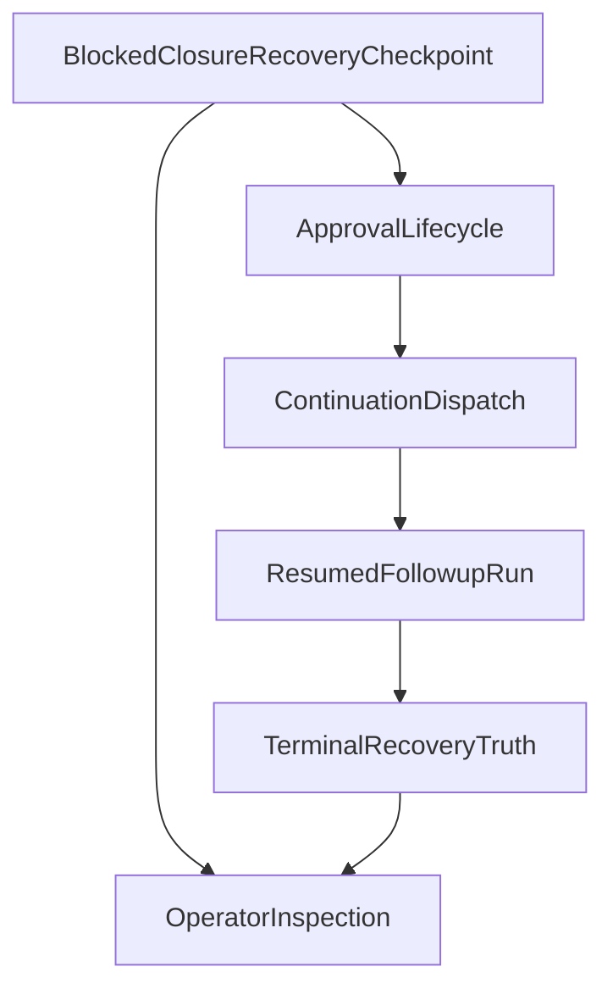

# Stage 22: Recovery Pipeline Truth and Operator Visibility

## Goal

Сделать следующий шаг после [src/auto-reply/reply/closure-outcome-dispatcher.ts](src/auto-reply/reply/closure-outcome-dispatcher.ts), [src/gateway/server-methods/exec-approval.ts](src/gateway/server-methods/exec-approval.ts) и [src/platform/runtime/service.ts](src/platform/runtime/service.ts): довести `closure_recovery` от просто работающего continuation до durable и inspectable recovery pipeline, чтобы restart, operator inspection и фактический исход resumed run читали одну и ту же правду.

Итог этапа:

- persisted `closure_recovery` checkpoints не зависают после рестарта в состоянии `blocked, but no resolvable approval`
- checkpoint completion больше не означает только `enqueue succeeded`, а отражает реальный terminal outcome recovery loop
- session/runtime/operator surfaces могут увидеть не только `runClosureSummary`, но и промежуточный recovery progress без ручной корреляции нескольких сто́ров
- recovery path становится reload-stable и дебажится как продуктовая capability, а не как набор внутренних швов

## Why This Is The Strongest Next Step

После Stage 21 система уже умеет:

- создавать `closure_recovery` continuation payload в [src/auto-reply/reply/closure-outcome-dispatcher.ts](src/auto-reply/reply/closure-outcome-dispatcher.ts)
- переводить allow-approval в `resumed -> dispatchContinuation` через [src/gateway/server-methods/exec-approval.ts](src/gateway/server-methods/exec-approval.ts)
- rehydrate-ить checkpoints и persisted followup queues через [src/platform/plugin.ts](src/platform/plugin.ts) и [src/gateway/server.impl.ts](src/gateway/server.impl.ts)

Но остаются два product-critical gaps:

- `ExecApprovalManager` в [src/gateway/exec-approval-manager.ts](src/gateway/exec-approval-manager.ts) всё ещё in-memory, поэтому restart может оставить durable blocked checkpoint без живого approval lifecycle
- `dispatchClosureRecoveryContinuation` в [src/auto-reply/reply/closure-outcome-dispatcher.ts](src/auto-reply/reply/closure-outcome-dispatcher.ts) помечает checkpoint как `completed` сразу после enqueue/schedule, то есть checkpoint truth может расходиться с фактическим результатом resumed run

Это сильнее, чем сразу идти в UI/MAX или новую automation ветку, потому что закрывает именно reliability/truth слой: продукт уже умеет восстанавливаться, но пока ещё не всегда умеет честно показать, что именно происходит и пережить restart без тупикового состояния.

## Current Anchors

- Recovery continuation creation: [src/auto-reply/reply/closure-outcome-dispatcher.ts](src/auto-reply/reply/closure-outcome-dispatcher.ts)
- Approval resolution and dispatch: [src/gateway/server-methods/exec-approval.ts](src/gateway/server-methods/exec-approval.ts)
- In-memory approval lifecycle: [src/gateway/exec-approval-manager.ts](src/gateway/exec-approval-manager.ts)
- Runtime checkpoint persistence and continuation dispatch: [src/platform/runtime/service.ts](src/platform/runtime/service.ts)
- Persisted followup queues: [src/auto-reply/reply/queue/state.ts](src/auto-reply/reply/queue/state.ts)
- Gateway restart hook: [src/gateway/server.impl.ts](src/gateway/server.impl.ts)
- Runtime inspection APIs: [src/platform/runtime/gateway.ts](src/platform/runtime/gateway.ts)
- Session projection: [src/gateway/session-lifecycle-state.ts](src/gateway/session-lifecycle-state.ts), [src/gateway/session-utils.ts](src/gateway/session-utils.ts)

Ключевой текущий seam:

```ts
scheduleFollowupDrain(payload.queueKey, runFollowup);
getPlatformRuntimeCheckpointService().updateCheckpoint(checkpointId, {
  status: "completed",
  completedAtMs: Date.now(),
});
```

И restart-sensitive seam:

```ts
const resumedFollowupDrains = resumePersistedFollowupDrains();
runtimeCheckpointService.rehydrate();
```

При этом pending exec approvals живут только в памяти через [src/gateway/exec-approval-manager.ts](src/gateway/exec-approval-manager.ts).

## Architecture Sketch



## Workstreams

## 1. Reconcile Recovery State After Restart

Сделать restart-safe reconciliation между persisted recovery checkpoints и approval lifecycle, чтобы operator не упирался в stale blocked record после рестарта.

Основные файлы:

- [src/gateway/exec-approval-manager.ts](src/gateway/exec-approval-manager.ts)
- [src/gateway/server.impl.ts](src/gateway/server.impl.ts)
- [src/gateway/server-methods/exec-approval.ts](src/gateway/server-methods/exec-approval.ts)
- [src/platform/runtime/service.ts](src/platform/runtime/service.ts)

Ключевой результат:

- startup либо re-materialize-ит resolvable closure recovery approvals, либо переводит stale checkpoints в явное inspectable состояние с безопасным next action
- больше нет durable checkpoint, который выглядит pending, но уже не может быть разрешён через gateway
- reconcile path остаётся idempotent и не ломает обычный `system.run` approval lifecycle

## 2. Align Checkpoint Completion With Real Recovery Outcome

Перестать считать recovery завершённым в момент enqueue; completion должен отражать реальный terminal result resumed run или явную terminal failure/cancel branch.

Основные файлы:

- [src/auto-reply/reply/closure-outcome-dispatcher.ts](src/auto-reply/reply/closure-outcome-dispatcher.ts)
- [src/auto-reply/reply/followup-runner.ts](src/auto-reply/reply/followup-runner.ts)
- [src/platform/runtime/service.ts](src/platform/runtime/service.ts)
- [src/infra/agent-events.ts](src/infra/agent-events.ts)

Ключевой результат:

- `closure_recovery` checkpoint проходит через честные `resumed -> running/idle -> completed/failed` semantics
- enqueue success больше не маскирует downstream failure или partial outcome
- terminal recovery truth может быть выведен из checkpoint/run closure без догадок

## 3. Surface Recovery State In Gateway And Session Inspection

Поднять recovery progress в inspection surfaces так, чтобы оператор видел состояние loop без ручного сопоставления `runClosureSummary`, checkpoint и followup queue.

Основные файлы:

- [src/platform/runtime/gateway.ts](src/platform/runtime/gateway.ts)
- [src/gateway/session-lifecycle-state.ts](src/gateway/session-lifecycle-state.ts)
- [src/gateway/session-utils.types.ts](src/gateway/session-utils.types.ts)
- [src/gateway/session-utils.ts](src/gateway/session-utils.ts)

Ключевой результат:

- runtime/session list/get surfaces могут отличить `awaiting approval`, `resumed`, `continuing`, `recovered`, `stale`
- operator read path не требует чтения сырых внутренних payload’ов, но показывает достаточно recovery metadata для диагностики
- не появляется второй источник истины рядом с `runClosureSummary` и `PlatformRuntimeCheckpoint`

## 4. Lock The Recovery Truth With Tests

Закрепить restart, rehydrate и completion semantics targeted тестами, чтобы future refactors не вернули dead-end или optimistic completion.

Основные файлы:

- [src/gateway/server-methods/server-methods.test.ts](src/gateway/server-methods/server-methods.test.ts)
- [src/platform/runtime/service.test.ts](src/platform/runtime/service.test.ts)
- [src/auto-reply/reply/agent-runner-helpers.test.ts](src/auto-reply/reply/agent-runner-helpers.test.ts)
- [src/auto-reply/reply/followup-runner.test.ts](src/auto-reply/reply/followup-runner.test.ts)
- [src/gateway/session-lifecycle-state.test.ts](src/gateway/session-lifecycle-state.test.ts)

Ключевой результат:

- минимум один test доказывает, что restart не оставляет unresolved closure recovery dead-end
- минимум один test доказывает, что checkpoint completion привязан к реальному resumed outcome, а не только к enqueue
- минимум один test доказывает parity между runtime inspection и session truth на промежуточных recovery состояниях

## Sequencing

1. Сначала определить restart reconciliation contract для persisted closure recovery checkpoints.
2. Затем выровнять completion semantics между continuation dispatch и фактическим resumed outcome.
3. После этого поднять recovery progress в gateway/session inspection surfaces.
4. В конце закрепить restart + truth parity targeted тестами.

## Guardrails

- Не создавать новый отдельный recovery store, если текущие runtime checkpoint и followup persistence можно согласовать.
- Не ломать `system.run` approvals и existing `bootstrap_run` continuation semantics.
- Не считать enqueue/schedule эквивалентом успешного recovery completion.
- Не вытаскивать сырые continuation payload’ы в operator surface целиком; наружу должна идти безопасная summary truth.
- Не плодить channel-specific recovery logic в core runtime/gateway слоях.

## Validation Target

- `pnpm tsgo`
- `pnpm build`
- targeted runtime/approval/followup restart tests
- targeted session/operator inspection parity tests
- по возможности combined batch на closure recovery + bootstrap continuation durability
