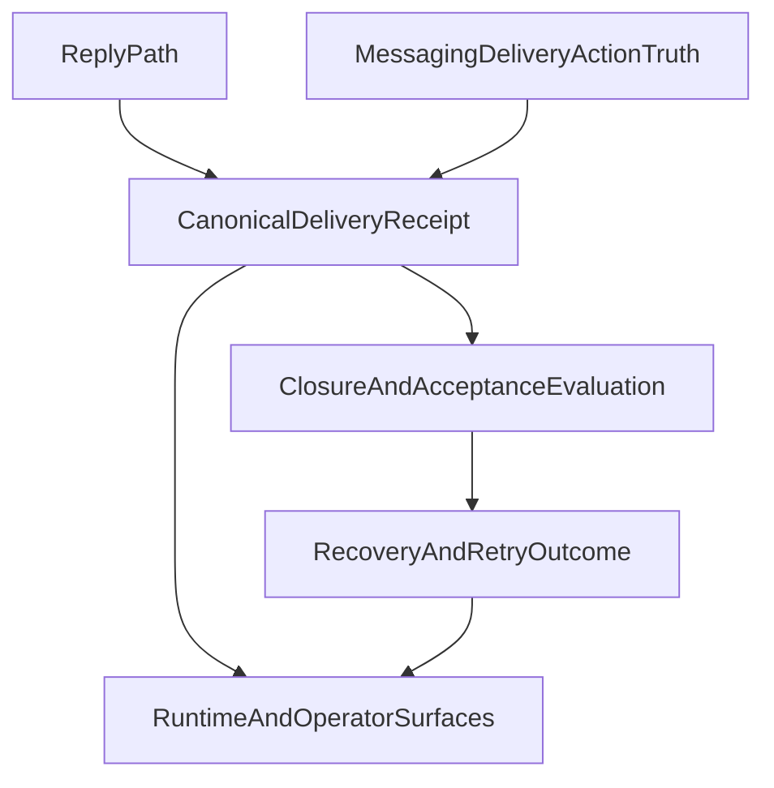

# Stage 24: Delivery Evidence and Closure Parity

## Goal

Сделать следующий шаг после Stage 23: свести `messaging_delivery`, `finalizeMessagingDeliveryClosure`, followup-send path и outbound queue/runtime actions к одной truth-модели, чтобы `delivered`, `partial`, `failed`, `retryable`, `recovered` и `closed` означали одно и то же во всех messaging/recovery путях.

Итог этапа:

- closure/recovery decisions строятся из одного canonical delivery receipt, а не из нескольких похожих, но расходящихся источников
- inbound, followup и channel-specific reply paths перестают по-разному финализировать delivery closure truth
- operator/runtime surfaces могут доверять, что `messaging_delivery` action truth и `runClosureSummary` не расходятся по staged/attempted/confirmed/failed semantics
- после этапа появляется реальная основа для локального end-to-end recovery smoke и ограниченного внутреннего deploy

## Why This Is The Strongest Next Step

После Stage 23 recovery уже durable, inspectable и telemetry-aware, но остаётся последний большой backend gap:

- `deliverOutboundPayloads` в [src/infra/outbound/deliver.ts](src/infra/outbound/deliver.ts) ведёт собственную action/queue truth про `messaging_delivery`
- `finalizeMessagingDeliveryClosure` и `reevaluateMessagingDecision` в [src/auto-reply/reply/agent-runner-helpers.ts](src/auto-reply/reply/agent-runner-helpers.ts) строят closure truth из delivery receipt, который сейчас не везде собирается одинаково
- `dispatchInboundMessage` в [src/auto-reply/dispatch.ts](src/auto-reply/dispatch.ts) умеет сливать `routedDeliveryReceipt` и `dispatcher.getDeliveryStats()`, но не все reply paths обязаны пройти тот же closure-finalization choke point
- `followup-runner` в [src/auto-reply/reply/followup-runner.ts](src/auto-reply/reply/followup-runner.ts) делает pre-send reevaluation и post-send finalization разными слоями evidence, что может давать UI/closure parity gap

Это сильнее, чем сразу идти в local smoke как отдельный stage, потому that smoke сейчас проверит уже существующее расхождение, а не устранит его. Сначала нужен единый delivery truth contract, потом smoke и limited deploy будут действительно показательными.

## Current Anchors

- Outbound send + queue + runtime actions: [src/infra/outbound/deliver.ts](src/infra/outbound/deliver.ts)
- Inbound closure finalization choke point: [src/auto-reply/dispatch.ts](src/auto-reply/dispatch.ts)
- Routed delivery receipt assembly: [src/auto-reply/reply/dispatch-from-config.ts](src/auto-reply/reply/dispatch-from-config.ts)
- Acceptance / closure reevaluation: [src/auto-reply/reply/agent-runner-helpers.ts](src/auto-reply/reply/agent-runner-helpers.ts)
- Followup reply path: [src/auto-reply/reply/followup-runner.ts](src/auto-reply/reply/followup-runner.ts)
- Reply routing into outbound delivery: [src/auto-reply/reply/route-reply.ts](src/auto-reply/reply/route-reply.ts)
- Runtime action / acceptance policy: [src/platform/runtime/service.ts](src/platform/runtime/service.ts)
- One known direct extension path to verify parity against: [extensions/matrix/src/matrix/monitor/handler.ts](extensions/matrix/src/matrix/monitor/handler.ts)

Ключевой текущий seam:

```ts
const deliveryReceipt = buildMessagingDeliveryReceipt({
  replyPayloads,
  routedDeliveryReceipt,
  deliveryStats,
});

return reevaluateMessagingDecision({
  completionOutcome,
  deliveryReceipt,
  // ...
});
```

Но рядом существует отдельная durable send truth:

```ts
runtimeCheckpointService.stageAction({
  kind: "messaging_delivery",
  // ...
});
// ... send / ack / fail / markActionConfirmed
```

## Architecture Sketch



## Workstreams

## 1. Define a Canonical Delivery Receipt Contract

Сделать единый safe contract для staged/attempted/confirmed/failed/partial delivery evidence, из которого потом живут и closure decisions, и runtime action truth.

Основные файлы:

- [src/auto-reply/reply/agent-runner-helpers.ts](src/auto-reply/reply/agent-runner-helpers.ts)
- [src/auto-reply/reply/dispatch-from-config.ts](src/auto-reply/reply/dispatch-from-config.ts)
- [src/platform/runtime/service.ts](src/platform/runtime/service.ts)
- [src/infra/outbound/deliver.ts](src/infra/outbound/deliver.ts)

Ключевой результат:

- появляется одно canonical место для сборки delivery evidence
- `stagedReplyCount`, `attemptedDeliveryCount`, `confirmedDeliveryCount`, `failedDeliveryCount`, `partialDelivery` считаются по одинаковым правилам
- action/queue truth и closure truth перестают быть двумя похожими, но потенциально расходящимися рассказами

## 2. Route All Messaging Closure Finalization Through One Truth Path

Убедиться, что inbound, followup и extension-driven reply paths одинаково проходят через delivery-aware closure finalization, а не обходят её частично.

Основные файлы:

- [src/auto-reply/dispatch.ts](src/auto-reply/dispatch.ts)
- [src/auto-reply/reply/followup-runner.ts](src/auto-reply/reply/followup-runner.ts)
- [src/auto-reply/reply/route-reply.ts](src/auto-reply/reply/route-reply.ts)
- [extensions/matrix/src/matrix/monitor/handler.ts](extensions/matrix/src/matrix/monitor/handler.ts)
- аналогичные extension paths, если найдутся direct `dispatchReplyFromConfig` usages

Ключевой результат:

- post-send closure reevaluation использует тот же evidence path независимо от того, это inbound reply или resumed followup
- direct channel paths больше не обходят delivery-aware finalization semantics
- recovery decisions и semantic retries привязаны к финальному send outcome, а не к промежуточному pre-send предположению

## 3. Correlate Outbound Actions With Run Closure Truth

Поднять явную связь между `messaging_delivery` runtime actions, receipt evidence и финальным `runClosureSummary`, чтобы operator/debug path не требовал ручной корреляции по косвенным признакам.

Основные файлы:

- [src/infra/outbound/deliver.ts](src/infra/outbound/deliver.ts)
- [src/platform/runtime/service.ts](src/platform/runtime/service.ts)
- [src/auto-reply/reply/agent-runner-helpers.ts](src/auto-reply/reply/agent-runner-helpers.ts)
- [src/platform/runtime/gateway.ts](src/platform/runtime/gateway.ts)

Ключевой результат:

- можно безопасно вывести, какой runtime action подтверждает messaging delivery для конкретного closure decision
- `partial` и `failed` delivery semantics не теряются между action store и closure store
- runtime/operator surfaces получают честный join между send truth и run truth

## 4. Lock Delivery Parity With Tests

Закрепить, что unified receipt contract и post-send closure parity больше не расползаются между inbound/followup/channel paths.

Основные файлы:

- [src/infra/outbound/deliver.test.ts](src/infra/outbound/deliver.test.ts)
- [src/infra/outbound/deliver.lifecycle.test.ts](src/infra/outbound/deliver.lifecycle.test.ts)
- [src/auto-reply/dispatch.delivery-closure.test.ts](src/auto-reply/dispatch.delivery-closure.test.ts)
- [src/auto-reply/reply/followup-runner.test.ts](src/auto-reply/reply/followup-runner.test.ts)
- [src/auto-reply/reply/agent-runner-helpers.test.ts](src/auto-reply/reply/agent-runner-helpers.test.ts)
- при необходимости targeted extension tests around direct `dispatchReplyFromConfig` consumers

Ключевой результат:

- минимум один test доказывает parity между durable `messaging_delivery` action truth и closure acceptance evidence
- минимум один test доказывает, что followup/recovery path финализируется по post-send receipt, а не по pre-send guess
- минимум один test доказывает, что direct channel reply path не обходит unified closure finalization

## Sequencing

1. Сначала определить canonical delivery receipt contract и выровнять счётчики.
2. Затем встроить этот contract в `dispatch-from-config`, inbound dispatch и followup finalization.
3. После этого связать runtime action truth с closure evidence и inspection surfaces.
4. В конце закрепить parity targeted tests и подготовить почву для local smoke stage.

## Guardrails

- Не создавать третий параллельный delivery store рядом с outbound queue, runtime actions и closure store.
- Не ломать `bestEffort`, `skipQueue` и crash-recovery semantics в [src/infra/outbound/deliver.ts](src/infra/outbound/deliver.ts).
- Не смешивать `staged` и `confirmed` delivery в acceptance/closure policy.
- Не ломать channel-specific routing/threading semantics в [src/auto-reply/reply/route-reply.ts](src/auto-reply/reply/route-reply.ts) и followup path.
- Не превращать extension parity в repo-wide churn: сначала закрывать общую delivery-aware finalization seam, затем точечно подтягивать обходящие её integrations.

## Validation Target

- `pnpm tsgo`
- `pnpm build`
- targeted outbound delivery tests
- targeted dispatch/followup closure parity tests
- по возможности focused channel-parity batch для direct `dispatchReplyFromConfig` consumers

## Expected Timeline

- Реализация Stage 24: примерно 2-3 рабочих дня
- После него локальный end-to-end smoke stage: ещё 1-2 дня
- После этого первый ограниченный внутренний deploy / ручной прогон: реалистично в пределах 1 рабочей недели, если не всплывут новые cross-channel gaps
