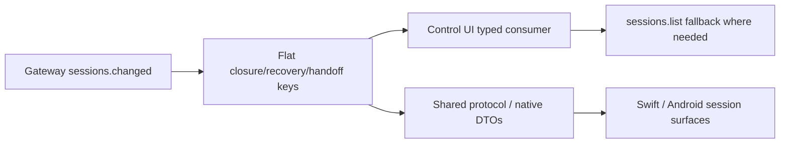

# Stage 29: Session Consumer Contract Adoption

## Why This Next

Stage 28 выровнял **producer side**: gateway теперь умеет отдавать closure/recovery/handoff в плоском `sessions.changed` payload. Следующий логичный шаг — довести **consumer side** до этого контракта, иначе часть клиентов продолжает либо игнорировать payload, либо зависеть от legacy-формы события.

Два ключевых сигнала из репозитория:

- [docs/cli/gateway.md](docs/cli/gateway.md) уже фиксирует плоские top-level поля как **stable contract** для UI/WS consumers.
- [ui/src/ui/app-gateway.ts](ui/src/ui/app-gateway.ts) на `sessions.changed` сейчас просто делает `loadSessions(...)`, не используя новый payload напрямую.
- [apps/shared/OpenClawKit/Sources/OpenClawChatUI/ChatSessions.swift](apps/shared/OpenClawKit/Sources/OpenClawChatUI/ChatSessions.swift) и shared protocol модели пока не показывают handoff/recovery/closure поля как first-class consumer surface.

## Goal

Сделать так, чтобы web/shared/native consumers могли безопасно читать один и тот же session contract:

- плоские поля `runClosureSummary`, recovery и `handoff`\* считаются canonical;
- отсутствие поля в JSON при значении `undefined` трактуется как `nil` / `undefined`, а не как нарушение контракта;
- вложенный `session` остаётся только как transitional compatibility layer, а не как источник истины.

## Current Gap

```377:379:ui/src/ui/app-gateway.ts
if (evt.event === "sessions.changed") {
  void loadSessions(host as unknown as OpenClawApp);
  return;
}
```

```68:68:docs/cli/gateway.md
The gateway also pushes events (for example `sessions.changed`). For session rows, the **flat** fields on those events match the same closure, recovery, and handoff surface as `sessions.list` / session row RPCs ... prefer treating the flat keys as the stable contract for UI consumers.
```

## Scope

1. Define the consumer contract explicitly.
   Проверить и зафиксировать, какие поля consumer обязан читать из top-level `sessions.changed`, какие остаются optional, и как трактуется отсутствие ключа после JSON serialization (`undefined` не едет по wire и потому должен декодироваться как optional omission).
2. Introduce typed event/session projections for consumers.
   Добавить или расширить consumer-facing types/DTO для session snapshots в:

- [ui/src/ui/types.ts](ui/src/ui/types.ts)
- [apps/shared/OpenClawKit/Sources/OpenClawProtocol/GatewayModels.swift](apps/shared/OpenClawKit/Sources/OpenClawProtocol/GatewayModels.swift)
- при необходимости Android chat/session models рядом с текущими history/session DTO
  Цель: top-level `runClosureSummary`, recovery и `handoff*` должны быть декодируемыми first-class полями, а не «невидимым» JSON хвостом.

3. Migrate the web control UI off reload-only semantics where it materially helps.
   В [ui/src/ui/app-gateway.ts](ui/src/ui/app-gateway.ts) и [ui/src/ui/controllers/sessions.ts](ui/src/ui/controllers/sessions.ts):

- решить, где достаточно оставить full reload,
- а где выгодно применить тонкий local patch для уже открытого списка сессий по `sessions.changed` payload,
- особенно для статуса, closure/recovery/handoff badges и counters.
  Не обязательно полностью отказаться от `sessions.list` fallback в этом этапе; достаточно сделать payload usable и предсказуемым.

4. Harden backward compatibility.
   Проверить все пути, где consumer всё ещё может ожидать `payload.session`. Там, где это важно, либо оставить fallback, либо явно перевести код на flat поля. Особое внимание:

- [src/gateway/server.impl.ts](src/gateway/server.impl.ts)
- [src/gateway/server-chat.ts](src/gateway/server-chat.ts)
- consumer tests, где событие мокается со старой формой.

5. Add contract tests for omission semantics.
   Добавить тесты, которые фиксируют не только наличие новых полей, но и важный wire-level инвариант: если значение было `undefined`, ключ может отсутствовать в JSON payload, и consumer обязан корректно воспринимать это как optional-none, без ложной ошибки или рассинхронизации.
6. Update developer guidance.
   Дополнить:

- [docs/cli/gateway.md](docs/cli/gateway.md)
- [docs/help/testing.md](docs/help/testing.md)
  Коротко зафиксировать:
- flat top-level keys — canonical consumer API;
- nested `session` — compatibility only;
- omitted `undefined` keys in WebSocket JSON — expected behavior.

## Likely Files

- [ui/src/ui/app-gateway.ts](ui/src/ui/app-gateway.ts)
- [ui/src/ui/controllers/sessions.ts](ui/src/ui/controllers/sessions.ts)
- [ui/src/ui/app-gateway.sessions.node.test.ts](ui/src/ui/app-gateway.sessions.node.test.ts)
- [ui/src/ui/types.ts](ui/src/ui/types.ts)
- [apps/shared/OpenClawKit/Sources/OpenClawProtocol/GatewayModels.swift](apps/shared/OpenClawKit/Sources/OpenClawProtocol/GatewayModels.swift)
- [apps/shared/OpenClawKit/Sources/OpenClawChatUI/ChatSessions.swift](apps/shared/OpenClawKit/Sources/OpenClawChatUI/ChatSessions.swift)
- [apps/shared/OpenClawKit/Tests/OpenClawKitTests/ChatViewModelTests.swift](apps/shared/OpenClawKit/Tests/OpenClawKitTests/ChatViewModelTests.swift)
- [docs/cli/gateway.md](docs/cli/gateway.md)
- [docs/help/testing.md](docs/help/testing.md)

## Execution Outline



## Validation

- Web UI tests around `sessions.changed` prove that typed payload parsing works and no longer relies on nested `session`.
- Shared/native decoding tests prove optional omission behavior for absent `handoff*` / recovery keys.
- Targeted gateway/UI/shared tests pass.
- `pnpm build` passes for touched TypeScript surfaces.
- Native/shared tests pass for touched app models if those files are included in scope.

## Exit Criteria

- At least one real consumer path uses the Stage 28 flat contract directly.
- Consumer models can decode closure/recovery/handoff fields without bespoke JSON digging.
- Omitted `undefined` keys are documented and covered by tests.
- Nested `session` is no longer treated as the primary API surface for new consumer code.
