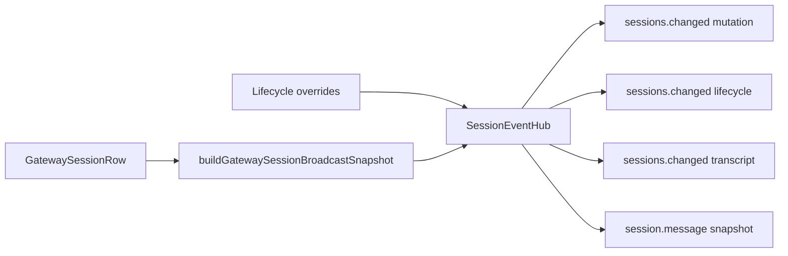

# Stage 30: Session Event Hub Consolidation

## Why This Next

После Stage 28 и Stage 29 у нас уже есть сильный session contract, но producer-side остаётся размазанным по нескольким gateway путям. Это тормозит путь к `v1`: каждое новое session/runtime поле требует помнить о нескольких местах эмита и о legacy-совместимости.

Сейчас логика spread-конструкции и policy совместимости размазана между:

- [src/gateway/server-methods/sessions.ts](src/gateway/server-methods/sessions.ts)
- [src/gateway/server-methods/agent.ts](src/gateway/server-methods/agent.ts)
- [src/gateway/server.impl.ts](src/gateway/server.impl.ts)
- [src/gateway/server-chat.ts](src/gateway/server-chat.ts)
- [src/gateway/session-broadcast-snapshot.ts](src/gateway/session-broadcast-snapshot.ts)

Это уже работает, но как база для `v1` и шаблонного расширения выглядит хрупко: `includeFullSession` и event-shape rules живут в разных местах.

## Goal

Сделать один **session event hub** для gateway-путей, который:

- владеет canonical policy для `sessions.changed` и связанных session snapshots;
- централизует решение, когда нужен nested `session`, а когда нет;
- позволяет добавлять новые session/runtime поля через одну точку правды;
- остаётся совместимым с текущими thin consumers и Stage 29 flat-contract consumers.

## Architectural Principle

Использовать ООП/фасад **только там, где он реально снижает сложность**:

- не превращать pure snapshot builders в лишние классы;
- выделить один небольшой orchestration layer / service module, потому что он инкапсулирует **policy**, **варианты событий** и **совместимость**, а не просто набор утилит.

## Scope

### 1. Introduce a canonical session event facade

Ввести один небольшой модуль, например:

- [src/gateway/session-event-hub.ts](src/gateway/session-event-hub.ts) или
- [src/gateway/session-broadcast.ts](src/gateway/session-broadcast.ts)

Ответственность модуля:

- собрать payload для `sessions.changed` mutation/lifecycle/message paths;
- применить lifecycle overrides к session row до broadcast;
- централизовать флаг compatibility (`includeFullSession`) и правила его использования;
- скрыть от callers ручной spread полей.

### 2. Separate event variants explicitly

Вместо «каждый caller собирает свой объект» ввести явные builder entrypoints:

- `buildSessionsChangedMutationEvent(...)`
- `buildSessionsChangedLifecycleEvent(...)`
- `buildSessionsChangedTranscriptEvent(...)`
- при необходимости `buildSessionMessageSnapshot(...)`

Важно: различия между variant-ами должны быть **осознанными и типизированными**, а не случайным результатом копипасты.

### 3. Move compatibility policy into one place

Сейчас nested `session` иногда включается, иногда нет. На этом этапе нужно зафиксировать единое правило:

- где nested `session` ещё обязателен для compatibility;
- где его уже не нужно отправлять;
- где плоский snapshot должен считаться единственной truth surface.

Это правило должно жить в одном модуле, а не в callers.

### 4. Replace scattered producer logic

Перевести на hub следующие пути:

- [src/gateway/server-methods/sessions.ts](src/gateway/server-methods/sessions.ts)
- [src/gateway/server-methods/agent.ts](src/gateway/server-methods/agent.ts)
- [src/gateway/server.impl.ts](src/gateway/server.impl.ts)
- [src/gateway/server-chat.ts](src/gateway/server-chat.ts)

`buildGatewaySessionBroadcastSnapshot()` в [src/gateway/session-broadcast-snapshot.ts](src/gateway/session-broadcast-snapshot.ts) оставить как lower-level snapshot builder, а новый hub сделать orchestration/facade поверх него.

### 5. Lock in a regression matrix

Добавить regression matrix по producer-side формам событий:

- mutation path
- lifecycle path
- transcript/message path
- row absent vs row present
- closure/recovery/handoff present vs omitted
- compatibility path with nested `session`

Опорные тесты:

- [src/gateway/server.sessions.gateway-server-sessions-a.test.ts](src/gateway/server.sessions.gateway-server-sessions-a.test.ts)
- [src/gateway/session-message-events.test.ts](src/gateway/session-message-events.test.ts)
- [src/gateway/server-chat.agent-events.test.ts](src/gateway/server-chat.agent-events.test.ts)
- [src/gateway/session-broadcast-snapshot.test.ts](src/gateway/session-broadcast-snapshot.test.ts)

### 6. Document extension rules

Коротко дописать в gateway docs/rules:

- как добавлять новое поле в session row;
- где оно автоматически попадёт в event surfaces;
- когда можно/нельзя менять nested `session` compatibility behavior.

## Likely Files

- [src/gateway/session-broadcast-snapshot.ts](src/gateway/session-broadcast-snapshot.ts)
- [src/gateway/session-lifecycle-state.ts](src/gateway/session-lifecycle-state.ts)
- [src/gateway/server-methods/sessions.ts](src/gateway/server-methods/sessions.ts)
- [src/gateway/server-methods/agent.ts](src/gateway/server-methods/agent.ts)
- [src/gateway/server.impl.ts](src/gateway/server.impl.ts)
- [src/gateway/server-chat.ts](src/gateway/server-chat.ts)
- [src/gateway/server.sessions.gateway-server-sessions-a.test.ts](src/gateway/server.sessions.gateway-server-sessions-a.test.ts)
- [src/gateway/session-message-events.test.ts](src/gateway/session-message-events.test.ts)
- [src/gateway/server-chat.agent-events.test.ts](src/gateway/server-chat.agent-events.test.ts)
- [docs/cli/gateway.md](docs/cli/gateway.md)
- [docs/help/testing.md](docs/help/testing.md)

## Execution Outline

## Validation

- Targeted gateway tests prove all major producer paths now go through the same hub.
- `pnpm build` passes.
- `pnpm test -- <touched gateway tests>` passes.
- If shared producer behavior widens more than expected, run full `pnpm test`.

## Exit Criteria

- Все основные producer paths session events завязаны на один orchestration hub.
- `buildGatewaySessionBroadcastSnapshot()` остаётся единственным lower-level snapshot builder, без новых ручных field lists.
- Правила nested `session` compatibility формализованы и больше не разбросаны по callers.
- Добавление нового session/runtime поля в будущем требует одной осознанной правки producer-surface, а не grep по нескольким broadcast paths.

## Non-Goals

- Не расширять сейчас `ConnectParams` / node handshake contract.
- Не рефакторить весь `GatewayRequestContext`.
- Не делать новый consumer stage вместо уже закрытого Stage 29.
