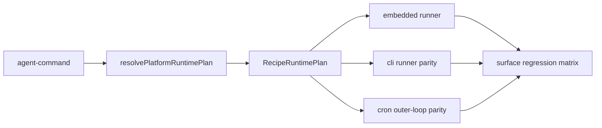

# Stage 32: Execution Surface Parity

## Why This Next

После `Stage 31` основной `embedded` path уже реально использует `platformRuntimePlan`, recipe lifecycle hooks и structured runtime context. Но execution foundation ещё не закрыта полностью: вторичные поверхности запуска всё ещё расходятся с canonical path.

Главный практический разрыв сейчас такой:

- `agent-command` считает `platformRuntimePlan`, но ветка CLI provider уходит в `[src/agents/cli-runner.ts](C:\Users\Tanya\source\repos\god-mode-core\src\agents\cli-runner.ts)` без явного `platformExecutionContext`.
- `cron` уже считает runtime plan в `[src/cron/isolated-agent/run.ts](C:\Users\Tanya\source\repos\god-mode-core\src\cron\isolated-agent\run.ts)`, но outer-loop policy для timeout/fallback всё ещё живёт отдельно от main `agent` path.
- В результате canonical planner -> recipe -> runtime chain уже есть, но пока не одинаково надёжен на всех рабочих surfaces.

Для движения к рабочему `v1` это логичнее следующего большого vertical stage: сначала добить единый execution contract, потом наращивать specialist runtimes и продуктовые фичи поверх устойчивой базы.

## Goal

Сделать так, чтобы `embedded`, CLI-backed runs и `cron` использовали максимально один и тот же canonical execution contract:

- planner/recipe selection остаётся одной точкой правды;
- runtime policy (`timeout`, fallback intent, prompt/runtime hints) не расползается по вторичным путям;
- gateway/CLI/cron ведут себя как разные входы в одну execution system, а не как три частично независимых route;
- новые recipes дальше можно расширять шаблонно без дублирования policy.

## Scope

### 1. Audit secondary execution surfaces

Явно зафиксировать, какие части already-canonical path работают только на embedded route, а какие нужно подтянуть для parity.

Основные файлы:

- `[src/agents/agent-command.ts](C:\Users\Tanya\source\repos\god-mode-core\src\agents\agent-command.ts)`
- `[src/agents/cli-runner.ts](C:\Users\Tanya\source\repos\god-mode-core\src\agents\cli-runner.ts)`
- `[src/cron/isolated-agent/run.ts](C:\Users\Tanya\source\repos\god-mode-core\src\cron\isolated-agent\run.ts)`
- `[src/platform/recipe/runtime-adapter.ts](C:\Users\Tanya\source\repos\god-mode-core\src\platform\recipe\runtime-adapter.ts)`

Ключевая цель аудита: не изобретать новый orchestration слой, а подтянуть secondary surfaces к уже существующему path из `Stage 31`.

### 2. Bring CLI provider path closer to canonical runtime

Сейчас ветка `isCliProvider(...)` в `agent-command` уходит в отдельный runner с собственным prompt/bootstrap flow. На этом этапе нужно довести parity настолько, насколько это возможно без тотального переписывания CLI backend.

Минимум для `v1`:

- runtime-selected context не должен теряться на CLI route;
- recipe/runtime hints должны влиять на CLI path осознанно, а не только на embedded;
- policy не должна дублироваться в двух местах без причины.

Опорный участок:

```12:18:C:/Users/Tanya/source/repos/god-mode-core/src/agents/agent-command.ts
export function resolveAgentCommandFallbackOverride(params: {
  platformRuntimePlan: ResolvedPlatformRuntimePlan;
  configuredFallbacks?: string[];
}): string[] | undefined {
  return params.platformRuntimePlan.runtime.fallbackModels ?? params.configuredFallbacks;
}
```

Эта логика уже canonical для main path; следующий шаг — не потерять подобные runtime decisions на CLI route.

### 3. Align cron outer-loop runtime policy

`cron` уже считает `platformExecutionContext`, но timeout/fallback orchestration пока не до конца следует тому же policy path, что `agent-command`.

Нужно выровнять:

- recipe-aware timeout policy;
- fallback override policy;
- shared runtime context propagation в тот же canonical execution surface.

Опорный участок:

```442:448:C:/Users/Tanya/source/repos/god-mode-core/src/cron/isolated-agent/run.ts
const platformExecutionContext = resolveExecutionRuntimePlan({
  prompt: commandBody,
  sessionEntry: cronSession.sessionEntry,
  channelHints: {
    messageChannel,
  },
}).runtime;
```

То есть база уже есть; задача этапа — дотянуть outer-loop parity, а не строить всё заново.

### 4. Lock parity regressions

Добавить focused regression matrix именно по живым execution surfaces:

- main `agent` path keeps recipe/runtime policy;
- CLI-backed route не теряет critical runtime intent;
- cron route использует совместимую timeout/fallback policy;
- gateway ingress остаётся согласован с тем же `agent-command` path.

Основные тестовые зоны:

- `[src/agents/agent-command.stage2.test.ts](C:\Users\Tanya\source\repos\god-mode-core\src\agents\agent-command.stage2.test.ts)`
- `[src/gateway/server-methods/agent.test.ts](C:\Users\Tanya\source\repos\god-mode-core\src\gateway\server-methods\agent.test.ts)`
- `[src/cron/isolated-agent/run.owner-auth.test.ts](C:\Users\Tanya\source\repos\god-mode-core\src\cron\isolated-agent\run.owner-auth.test.ts)`
- existing `pi-embedded-runner` parity/runtime tests рядом с `[src/agents/pi-embedded-runner/](C:\Users\Tanya\source\repos\god-mode-core\src\agents\pi-embedded-runner\)`

### 5. Document canonical extension rules

Коротко зафиксировать:

- какие execution surfaces считаются canonical;
- где должен использоваться уже-resolved runtime plan;
- что нельзя делать: не размазывать timeout/fallback/recipe policy по CLI/cron вручную, если её уже знает `platformRuntimePlan`.

Основные doc зоны:

- `[src/platform/SEAMS.md](C:\Users\Tanya\source\repos\god-mode-core\src\platform\SEAMS.md)`
- `[docs/help/testing.md](C:\Users\Tanya\source\repos\god-mode-core\docs\help\testing.md)`

## Likely Files

- `[src/agents/agent-command.ts](C:\Users\Tanya\source\repos\god-mode-core\src\agents\agent-command.ts)`
- `[src/agents/cli-runner.ts](C:\Users\Tanya\source\repos\god-mode-core\src\agents\cli-runner.ts)`
- `[src/cron/isolated-agent/run.ts](C:\Users\Tanya\source\repos\god-mode-core\src\cron\isolated-agent\run.ts)`
- `[src/platform/recipe/runtime-adapter.ts](C:\Users\Tanya\source\repos\god-mode-core\src\platform\recipe\runtime-adapter.ts)`
- `[src/platform/SEAMS.md](C:\Users\Tanya\source\repos\god-mode-core\src\platform\SEAMS.md)`
- `[docs/help/testing.md](C:\Users\Tanya\source\repos\god-mode-core\docs\help\testing.md)`

## Execution Outline



## Validation

- Targeted tests prove recipe/runtime policy stays consistent across embedded, CLI, and cron surfaces.
- Gateway ingress remains aligned with the same `agent-command` path.
- Existing embedded runner regressions remain green.
- `pnpm build` passes.
- Focused runtime/gateway/cron tests pass.

## Exit Criteria

- `platformRuntimePlan` becomes the practical source of truth not only for embedded runs but also for the main secondary execution surfaces used in `v1`.
- CLI and cron no longer drift on the most important runtime policy knobs (`timeout`, fallback intent, runtime context propagation).
- Future recipe activation can extend one canonical execution contract instead of patching each surface independently.

## Non-Goals

- Не делать сейчас тотальный рефакторинг CLI backend architecture.
- Не переводить в этом этапе весь ACP path на embedded lifecycle parity.
- Не уходить сейчас в большой specialist/product UI stage до закрытия execution surface consistency.
