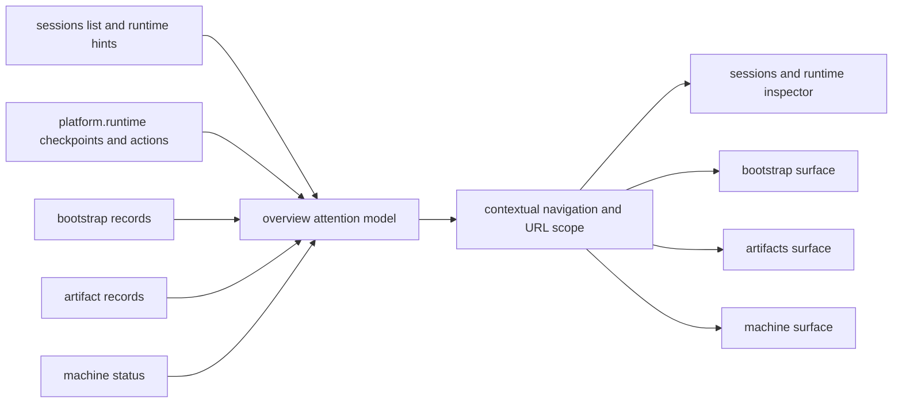

# Stage 36: Operator Correlation Surfaces

## Why This Next

После `Stage 35` оператор уже может не только читать runtime ledger, но и запускать минимальные recovery actions. Следующая практическая дыра для `v1` теперь не в отсутствии методов, а в разрыве между поверхностями: нужные данные уже есть в `sessions`, `runtime`, `bootstrap`, `artifacts`, `machine`, но оператор всё ещё часто должен вручную понять, **что требует внимания**, а потом руками искать нужную запись в другой вкладке.

Сильный фундамент уже существует:

- [C:\Users\Tanya\source\repos\god-mode-core\ui\src\ui\app-settings.ts](C:\Users\Tanya\source\repos\god-mode-core\ui\src\ui\app-settings.ts) уже собирает overview attention через `buildAttentionItems(...)`, но почти не использует runtime recovery как first-class signal.
- [C:\Users\Tanya\source\repos\god-mode-core\ui\src\ui\controllers\runtime-inspector.ts](C:\Users\Tanya\source\repos\god-mode-core\ui\src\ui\controllers\runtime-inspector.ts) уже умеет грузить canonical runtime ledger и вызывать recovery actions.
- [C:\Users\Tanya\source\repos\god-mode-core\ui\src\ui\views\sessions.ts](C:\Users\Tanya\source\repos\god-mode-core\ui\src\ui\views\sessions.ts) уже показывает checkpoint detail и action controls, но это знание почти не проецируется в `overview`/`specialist` attention и переходы.
- [C:\Users\Tanya\source\repos\god-mode-core\ui\src\ui\views\bootstrap.ts](C:\Users\Tanya\source\repos\god-mode-core\ui\src\ui\views\artifacts.ts) и `machine` surface уже имеют собственные operator views, но навигация между ними и runtime context остаётся слабо связанной.

Итог: backend и UI surface уже достаточно зрелые для `v1`, но operator flow всё ещё не собран в одну explainable цепочку.

## Goal

Сделать следующий operator-facing слой для `v1`, где:

- overview и attention явно подсказывают, какие runtime/bootstrap/artifact/machine проблемы требуют действия прямо сейчас;
- переход из сигнала внимания открывает правильную вкладку и правильную запись, а не заставляет искать id вручную;
- active session / runtime scope перестаёт расходиться между `overview`, `specialist` и `sessions`;
- платформа остаётся composed из существующих surfaces, без нового большого incident dashboard.

## Scope

### 1. Audit the operator correlation gap

Явно зафиксировать, где surfaces уже используют один и тот же canonical state, но ещё не собраны в единый operator workflow.

Основные файлы:

- [C:\Users\Tanya\source\repos\god-mode-core\ui\src\ui\app-settings.ts](C:\Users\Tanya\source\repos\god-mode-core\ui\src\ui\app-settings.ts)
- [C:\Users\Tanya\source\repos\god-mode-core\ui\src\ui\views\overview-attention.ts](C:\Users\Tanya\source\repos\god-mode-core\ui\src\ui\views\overview-attention.ts)
- [C:\Users\Tanya\source\repos\god-mode-core\ui\src\ui\views\sessions.ts](C:\Users\Tanya\source\repos\god-mode-core\ui\src\ui\views\sessions.ts)
- [C:\Users\Tanya\source\repos\god-mode-core\ui\src\ui\views\bootstrap.ts](C:\Users\Tanya\source\repos\god-mode-core\ui\src\ui\views\bootstrap.ts)
- [C:\Users\Tanya\source\repos\god-mode-core\ui\src\ui\views\artifacts.ts](C:\Users\Tanya\source\repos\god-mode-core\ui\src\ui\views\artifacts.ts)
- [C:\Users\Tanya\source\repos\god-mode-core\ui\src\ui\controllers\runtime-inspector.ts](C:\Users\Tanya\source\repos\god-mode-core\ui\src\ui\controllers\runtime-inspector.ts)

Ключевая цель аудита: не строить новый orchestration/backend слой, а собрать уже существующие operator signals в одну usable navigation model.

### 2. Add attention signals from existing operator state

Расширить overview/attention так, чтобы он поднимал уже имеющиеся сигналы из текущих источников правды:

- session rows с `recoveryStatus` / `recoveryOperatorHint`;
- runtime checkpoints, которые требуют operator action;
- bootstrap/artifact/machine состояния, которые уже загружаются в UI;
- приоритетные сигналы должны оставаться explainable и ссылаться на canonical record, а не на client-only эвристику.

Опорные зоны:

- [C:\Users\Tanya\source\repos\god-mode-core\ui\src\ui\app-settings.ts](C:\Users\Tanya\source\repos\god-mode-core\ui\src\ui\app-settings.ts)
- [C:\Users\Tanya\source\repos\god-mode-core\ui\src\ui\types.ts](C:\Users\Tanya\source\repos\god-mode-core\ui\src\ui\types.ts)
- [C:\Users\Tanya\source\repos\god-mode-core\ui\src\ui\views\overview-attention.ts](C:\Users\Tanya\source\repos\god-mode-core\ui\src\ui\views\overview-attention.ts)

### 3. Wire contextual navigation and stable scope

Не делать новую консоль; минимально добавить переходы и URL/context wiring между существующими вкладками.

Минимум для `v1`:

- сигнал внимания должен открывать нужную вкладку (`sessions`, `bootstrap`, `artifacts`, `machine`) с правильным предвыбором записи;
- `overview` / `specialist` должны использовать тот же session/runtime scope, что и активный operator context;
- переходы из runtime/session detail к связанному bootstrap/artifact record должны обходиться без ручного поиска id;
- deep-link state должен переживать refresh и не ломать `basePath`.

Опорные зоны:

- [C:\Users\Tanya\source\repos\god-mode-core\ui\src\ui\app-settings.ts](C:\Users\Tanya\source\repos\god-mode-core\ui\src\ui\app-settings.ts)
- [C:\Users\Tanya\source\repos\god-mode-core\ui\src\ui\navigation.ts](C:\Users\Tanya\source\repos\god-mode-core\ui\src\ui\navigation.ts)
- [C:\Users\Tanya\source\repos\god-mode-core\ui\src\ui\app-render.ts](C:\Users\Tanya\source\repos\god-mode-core\ui\src\ui\app-render.ts)
- [C:\Users\Tanya\source\repos\god-mode-core\ui\src\ui\controllers\bootstrap.ts](C:\Users\Tanya\source\repos\god-mode-core\ui\src\ui\controllers\bootstrap.ts)
- [C:\Users\Tanya\source\repos\god-mode-core\ui\src\ui\controllers\artifacts.ts](C:\Users\Tanya\source\repos\god-mode-core\ui\src\ui\controllers\artifacts.ts)
- [C:\Users\Tanya\source\repos\god-mode-core\ui\src\ui\views\sessions.ts](C:\Users\Tanya\source\repos\god-mode-core\ui\src\ui\views\sessions.ts)

### 4. Lock UI/navigation regressions and docs

Закрепить focused regressions именно на operator correlation contract:

- attention действительно поднимает runtime/bootstrap/artifact/machine signals из canonical UI state;
- deep links и tab transitions сохраняют нужный контекст и `basePath`;
- переход из overview или runtime detail открывает правильную вкладку и правильную запись;
- docs/testing guidance описывают operator correlation path как продолжение runtime operator stages.

Основные тестовые зоны:

- [C:\Users\Tanya\source\repos\god-mode-core\ui\src\ui\app-settings.test.ts](C:\Users\Tanya\source\repos\god-mode-core\ui\src\ui\app-settings.test.ts)
- [C:\Users\Tanya\source\repos\god-mode-core\ui\src\ui\views\overview-attention.test.ts](C:\Users\Tanya\source\repos\god-mode-core\ui\src\ui\views\overview-attention.test.ts)
- [C:\Users\Tanya\source\repos\god-mode-core\ui\src\ui\views\sessions.test.ts](C:\Users\Tanya\source\repos\god-mode-core\ui\src\ui\views\sessions.test.ts)
- [C:\Users\Tanya\source\repos\god-mode-core\ui\src\ui\controllers\bootstrap.test.ts](C:\Users\Tanya\source\repos\god-mode-core\ui\src\ui\controllers\bootstrap.test.ts)
- [C:\Users\Tanya\source\repos\god-mode-core\ui\src\ui\controllers\artifacts.test.ts](C:\Users\Tanya\source\repos\god-mode-core\ui\src\ui\controllers\artifacts.test.ts)
- [C:\Users\Tanya\source\repos\god-mode-core\docs\help\testing.md](C:\Users\Tanya\source\repos\god-mode-core\docs\help\testing.md)

## Execution Outline

## Validation

- Targeted UI tests prove operator attention is driven by existing canonical state rather than a second client-side source of truth.
- Contextual navigation opens the right tab and the right record without manual id lookup.
- Session/runtime scope remains coherent between `overview`, `specialist`, and `sessions`.
- `pnpm build` passes.
- Focused UI/navigation tests pass.

## Exit Criteria

- Operator no longer has to infer the next action by manually correlating `sessions`, `runtime`, `bootstrap`, and `artifacts`.
- Overview becomes a usable routing surface into the existing operator tools instead of a passive summary.
- Existing platform/operator stages start to feel like one explainable `v1` workflow rather than adjacent disconnected tabs.

## Non-Goals

- Не делать сейчас новый большой incident dashboard или admin console.
- Не строить новый backend aggregate service, если хватает существующих gateway/UI state surfaces.
- Не переписывать runtime/bootstrap/artifact core ради navigation stage.
- Не уводить stage в end-user UX вместо operator usefulness.
