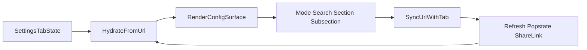

# Stage 53 - Settings Navigation Parity

## Goal

Сделать `config`-family вкладки частью canonical operator routing: после refresh, popstate или пересылки ссылки оператор должен возвращаться не просто на ту же settings-вкладку, а в тот же navigation context внутри неё.

## Why This Step

После закрытия `cron`, `bootstrap/artifacts` и `instances` именно settings-family остаётся самым явным parity gap'ом:

- В [C:\Users\Tanya\source\repos\god-mode-core\ui\src\ui\app-settings.ts](C:\Users\Tanya\source\repos\god-mode-core\ui\src\ui\app-settings.ts) `applyTabQueryStateToUrl()` покрывает `agents`, `bootstrap`, `artifacts`, `channels`, `instances`, `sessions`, `cron`, `usage`, `skills`, `debug`, `logs`, `nodes`, но не `config`/`communications`/`appearance`/`automation`/`infrastructure`/`aiAgents`.
- В [C:\Users\Tanya\source\repos\god-mode-core\ui\src\ui\app-render.ts](C:\Users\Tanya\source\repos\god-mode-core\ui\src\ui\app-render.ts) эти surface'ы уже держат operator-useful state, но callbacks пока меняют только память:

```1806:1813:C:\Users\Tanya\source\repos\god-mode-core\ui\src\ui\app-render.ts
onFormModeChange: (mode) => (state.configFormMode = mode),
onSearchChange: (query) => (state.configSearchQuery = query),
onSectionChange: (section) => {
  state.configActiveSection = section;
  state.configActiveSubsection = null;
},
onSubsectionChange: (section) => (state.configActiveSubsection = section),
```

- В [C:\Users\Tanya\source\repos\god-mode-core\ui\src\ui\app.ts](C:\Users\Tanya\source\repos\god-mode-core\ui\src\ui\app.ts) и [C:\Users\Tanya\source\repos\god-mode-core\ui\src\ui\app-view-state.ts](C:\Users\Tanya\source\repos\god-mode-core\ui\src\ui\app-view-state.ts) уже есть все нужные state slices для шести вкладок, то есть stage не требует новой UX-модели.

## Scope

Сериализовать только минимально ценный navigation state для каждой settings-вкладки:

- `formMode` (`form` vs `raw`)
- `searchQuery`
- `activeSection`
- `activeSubsection`

Не сериализовать:

- raw JSON/config payload
- dirty/saving/applying/updating state
- validation issues
- form values и любые transient editor details

## Contract Choice

По умолчанию использовать tab-prefixed query keys, а не один shared `settings*` contract.

Почему это лучший default:

- он совпадает с текущим стилем `app-settings.ts` (`cron*`, `usage*`, `bootstrap*`, `artifact*`)
- не требует дублировать active tab в query
- упрощает clear-on-tab-switch semantics

Рабочий shape:

- `configMode`, `configQ`, `configSection`, `configSubsection`
- `communicationsMode`, `communicationsQ`, `communicationsSection`, `communicationsSubsection`
- `appearanceMode`, `appearanceQ`, `appearanceSection`, `appearanceSubsection`
- `automationMode`, `automationQ`, `automationSection`, `automationSubsection`
- `infrastructureMode`, `infrastructureQ`, `infrastructureSection`, `infrastructureSubsection`
- `aiAgentsMode`, `aiAgentsQ`, `aiAgentsSection`, `aiAgentsSubsection`

## Implementation

1. Расширить URL hydrate/persist contract в [C:\Users\Tanya\source\repos\god-mode-core\ui\src\ui\app-settings.ts](C:\Users\Tanya\source\repos\god-mode-core\ui\src\ui\app-settings.ts).

- Добавить новые поля в `SettingsHost` для всех шести tab slices, если их ещё нет в type surface.
- В `applyDeepLinkStateFromUrl()` читать mode/query/section/subsection для соответствующих tabs.
- В `applyTabQueryStateToUrl()` очищать новые keys вне активной settings-вкладки и записывать их только для текущего tab path.
- Нормализовать invalid values мягко: неизвестный mode -> `form`, пустые строки -> `null`/`""`, битый `subsection` не должен ломать остальной tab state.

1. Подключить canonical URL sync в [C:\Users\Tanya\source\repos\god-mode-core\ui\src\ui\app-render.ts](C:\Users\Tanya\source\repos\god-mode-core\ui\src\ui\app-render.ts).

- После `onFormModeChange`, `onSearchChange`, `onSectionChange`, `onSubsectionChange` для каждого из шести `renderConfig(...)` surface вызывать `syncUrlWithTab(state, <tab>, true)`.
- Если код становится слишком повторяющимся, вынести маленький helper для settings-tab sync, но не расширять scope до рефакторинга всего `renderConfig` plumbing.
- Сохранить текущую semantics `loadConfig()`, `saveConfig()`, `applyConfig()`, `runUpdate()`, `openConfigFile()` без изменений.

1. Добавить focused regressions и docs.

- В [C:\Users\Tanya\source\repos\god-mode-core\ui\src\ui\app-settings.test.ts](C:\Users\Tanya\source\repos\god-mode-core\ui\src\ui\app-settings.test.ts):
  - hydrate representative settings tabs из URL
  - persist mode/query/section/subsection через `syncUrlWithTab(..., true)`
  - clear params при переходе на другой tab
  - fallback для invalid mode/section/subsection
- При необходимости добавить один focused UI regression рядом с config-related tests, если нужно подтвердить, что user-driven navigation callbacks действительно триггерят URL sync без изменения save/apply semantics.
- Обновить [C:\Users\Tanya\source\repos\god-mode-core\docs\help\testing.md](C:\Users\Tanya\source\repos\god-mode-core\docs\help\testing.md) и [C:\Users\Tanya\source\repos\god-mode-core\docs\web\control-ui.md](C:\Users\Tanya\source\repos\god-mode-core\docs\web\control-ui.md) короткой note про settings navigation parity.

## Suggested Sequence



## Expected Outcome

После stage settings-family перестанет быть memory-only surface: ссылка будет восстанавливать тот же navigation context внутри нужной settings-вкладки, а остаток v1 сузится уже до более точечных overview/entrypoint handoff gaps, а не до крупного family-wide пробела.
