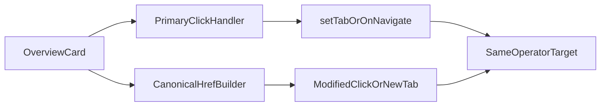

# Stage 58 - Overview Card Link Parity

## Goal

Сделать dashboard cards в `overview` такими же canonical, как sidebar tabs и inline links в `sessions`/`cron`: обычный click остаётся быстрым JS-nav flow, а middle-click / Ctrl/Cmd+click / open-in-new-tab получает тот же shareable URL contract.

## Why This Step

После Stage 55 и Stage 56 общий routing contract уже работает для sidebar и inline links, но `overview` cards всё ещё живут как click-only buttons без `href`.

```42:56:C:\Users\Tanya\source\repos\god-mode-core\ui\src\ui\views\overview-cards.ts
function renderStatCard(
  card: StatCard,
  onNavigate: (tab: string, options?: { skillFilter?: string }) => void,
) {
  return html`
    <button
      class="ov-card"
      data-kind=${card.kind}
      @click=${() => onNavigate(card.tab, card.navigateOptions)}
    >
```

В `app-render.helpers.ts` sidebar уже использует общий canonical href builder:

```68:75:C:\Users\Tanya\source\repos\god-mode-core\ui\src\ui\app-render.helpers.ts
export function renderTab(state: AppViewState, tab: Tab, opts?: { collapsed?: boolean }) {
  const href = buildCanonicalTabHref(state, tab);
  const isActive = state.tab === tab;
  return html`
    <a
      href=${href}
```

А `overview` сейчас делает только memory-first nav через callback:

```717:722:C:\Users\Tanya\source\repos\god-mode-core\ui\src\ui\app-render.ts
onNavigate: (tab, options) => {
  if (tab === "skills") {
    state.skillsFilter = options?.skillFilter ?? "";
  }
  state.setTab(tab as import("./navigation.ts").Tab);
},
```

Это значит, что с overview нельзя открыть card target в новой вкладке тем же способом, которым уже открываются sidebar tabs и Stage 56 inline links.

## Scope

Включить только overview card parity для уже существующего state:

- canonical `href` generation для stat cards в `overview`
- сохранение existing `onNavigate(...)` semantics на primary click
- проброс representative tab-specific context хотя бы для одного card с доп. query state (`skills` + `skillFilter`)

Не включать:

- redesign overview cards или layout
- новый URL contract для recent sessions list
- новый query contract для `overview` как отдельной вкладки
- backend API или data-loading changes

## Main Files

- [C:\Users\Tanya\source\repos\god-mode-core\ui\src\ui\views\overview-cards.ts](C:\Users\Tanya\source\repos\god-mode-core\ui\src\ui\views\overview-cards.ts)
- [C:\Users\Tanya\source\repos\god-mode-core\ui\src\ui\views\overview.ts](C:\Users\Tanya\source\repos\god-mode-core\ui\src\ui\views\overview.ts)
- [C:\Users\Tanya\source\repos\god-mode-core\ui\src\ui\app-render.ts](C:\Users\Tanya\source\repos\god-mode-core\ui\src\ui\app-render.ts)
- [C:\Users\Tanya\source\repos\god-mode-core\ui\src\ui\app-settings.ts](C:\Users\Tanya\source\repos\god-mode-core\ui\src\ui\app-settings.ts)
- [C:\Users\Tanya\source\repos\god-mode-core\ui\src\ui\views\overview-attention.test.ts](C:\Users\Tanya\source\repos\god-mode-core\ui\src\ui\views\overview-attention.test.ts)
- При необходимости: [C:\Users\Tanya\source\repos\god-mode-core\ui\src\ui\app-settings.test.ts](C:\Users\Tanya\source\repos\god-mode-core\ui\src\ui\app-settings.test.ts), [C:\Users\Tanya\source\repos\god-mode-core\docs\help\testing.md](C:\Users\Tanya\source\repos\god-mode-core\docs\help\testing.md), [C:\Users\Tanya\source\repos\god-mode-core\docs\web\control-ui.md](C:\Users\Tanya\source\repos\god-mode-core\docs\web\control-ui.md)

## Implementation

1. Добавить shared href plumbing для `overview` cards.

- Вынести в `overview-cards.ts` явный `href` field в `StatCard` или маленький helper, который умеет рендерить anchor-like card.
- Не дублировать manual `pathForTab(...)` string assembly; использовать общий routing contract из `app-settings.ts`.

1. Подключить canonical destination state из `app-render.ts`.

- Передавать в `renderOverview(...)` не только `onNavigate`, но и способ собрать `href` для каждой card.
- Для `skills` card сохранить существующую special-case semantics с `skillFilter`, чтобы href и primary-click указывали на один и тот же filtered target.
- Для tabs без extra query state (`usage`, `sessions`, `cron`) использовать canonical tab href без inventing new state.

1. Сохранить current click behavior, но открыть modified-click/new tab.

- На обычный left-click перехватывать событие и оставлять existing `onNavigate(...)` flow.
- На modified-click / middle-click / open-in-new-tab не мешать браузеру использовать canonical `href`.

1. Зафиксировать focused regressions и docs note.

- Добавить regression на то, что хотя бы одна plain card (`sessions` или `usage`) рендерит canonical `href`.
- Добавить regression на то, что `skills` card с blocked/missing filter рендерит canonical href с тем же `skillFilter`, который использует current click handler.
- Коротко отметить в `docs/help/testing.md`, что overview cards тоже должны использовать shared routing contract, а не click-only button navigation.

## Suggested Flow



## Expected Outcome

После stage `overview` перестанет быть последним high-traffic entry surface без настоящих canonical card links. Оператор сможет открыть usage/sessions/skills/cron cards в новой вкладке тем же shareable способом, что уже работает в sidebar и inline links, а routing contract для overview entry navigation снова будет жить в одном месте, а не в button-only callbacks.
