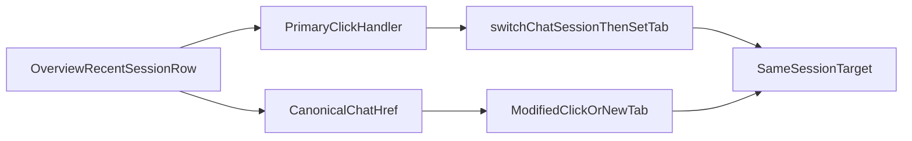

# Stage 59 - Overview Recent Session Link Parity

## Goal

Сделать строки в блоке `Recent Sessions` внутри `overview` такими же canonical, как sidebar tabs, inline links и overview cards: обычный click остаётся быстрым JS navigation flow, а middle-click / Ctrl/Cmd+click / open-in-new-tab открывает тот же shareable target через настоящий `href`.

## Why This Step

`Stage 58` выровнял overview stat cards, но recent sessions list всё ещё остаётся purely presentational и не участвует в routing contract.

Сейчас блок рендерится без `href` и без navigation handoff в `[C:\Users\Tanya\source\repos\god-mode-core\ui\src\ui\views\overview-cards.ts](C:\Users\Tanya\source\repos\god-mode-core\ui\src\ui\views\overview-cards.ts)`:

```206:210:C:\Users\Tanya\source\repos\god-mode-core\ui\src\ui\views\overview-cards.ts
<li class="ov-recent__row">
  <span class="ov-recent__key">...</span>
  <span class="ov-recent__model">...</span>
  <span class="ov-recent__time">...</span>
</li>
```

При этом нужный canonical session target уже существует в shared helpers и в других surfaces:

- `[C:\Users\Tanya\source\repos\god-mode-core\ui\src\ui\app-settings.ts](C:\Users\Tanya\source\repos\god-mode-core\ui\src\ui\app-settings.ts)` уже умеет строить canonical tab/session href через `buildTabHref(...)` и `buildCanonicalTabHref(...)`.
- `[C:\Users\Tanya\source\repos\god-mode-core\ui\src\ui\views\sessions.ts](C:\Users\Tanya\source\repos\god-mode-core\ui\src\ui\views\sessions.ts)` и `[C:\Users\Tanya\source\repos\god-mode-core\ui\src\ui\views\cron.ts](C:\Users\Tanya\source\repos\god-mode-core\ui\src\ui\views\cron.ts)` уже используют реальный `chat` href + primary-click callback handoff.
- `[C:\Users\Tanya\source\repos\god-mode-core\ui\src\ui\app-render.ts](C:\Users\Tanya\source\repos\god-mode-core\ui\src\ui\app-render.ts)` уже знает, как сделать быстрый in-memory session handoff через `switchChatSession(...)` + `setTab("chat")`.

Это делает `overview` recent sessions последним заметным entry surface внутри overview, где оператор всё ещё не может открыть session target в новой вкладке тем же способом, что работает в остальных canonical entrypoints.

## Scope

Включить только parity для `overview` recent-session rows на уже существующем contract:

- рендерить recent-session rows как реальные session links
- использовать existing canonical `chat?session=...` target, без inventing new query model
- сохранить текущий primary-click handoff как быстрый JS navigation path
- разрешить modified-click / middle-click / open-in-new-tab уйти в браузерный `href`

Не включать:

- redesign overview layout или row visuals
- новый URL contract для `overview`
- новый runtime-inspect contract для recent rows
- расширение `usage` / `command palette` / других surfaces в этом же stage

## Main Files

- `[C:\Users\Tanya\source\repos\god-mode-core\ui\src\ui\views\overview-cards.ts](C:\Users\Tanya\source\repos\god-mode-core\ui\src\ui\views\overview-cards.ts)`
- `[C:\Users\Tanya\source\repos\god-mode-core\ui\src\ui\views\overview.ts](C:\Users\Tanya\source\repos\god-mode-core\ui\src\ui\views\overview.ts)`
- `[C:\Users\Tanya\source\repos\god-mode-core\ui\src\ui\app-render.ts](C:\Users\Tanya\source\repos\god-mode-core\ui\src\ui\app-render.ts)`
- `[C:\Users\Tanya\source\repos\god-mode-core\ui\src\ui\app-settings.ts](C:\Users\Tanya\source\repos\god-mode-core\ui\src\ui\app-settings.ts)`
- `[C:\Users\Tanya\source\repos\god-mode-core\ui\src\ui\views\overview-cards.test.ts](C:\Users\Tanya\source\repos\god-mode-core\ui\src\ui\views\overview-cards.test.ts)`
- При необходимости: `[C:\Users\Tanya\source\repos\god-mode-core\ui\src\ui\views\chat.test.ts](C:\Users\Tanya\source\repos\god-mode-core\ui\src\ui\views\chat.test.ts)`, `[C:\Users\Tanya\source\repos\god-mode-core\ui\src\ui\views\specialist-context.test.ts](C:\Users\Tanya\source\repos\god-mode-core\ui\src\ui\views\specialist-context.test.ts)`, `[C:\Users\Tanya\source\repos\god-mode-core\docs\help\testing.md](C:\Users\Tanya\source\repos\god-mode-core\docs\help\testing.md)`

## Implementation

1. Определить canonical target для recent-session rows.

- Использовать existing `chat` session deep link через shared helper из `[C:\Users\Tanya\source\repos\god-mode-core\ui\src\ui\app-settings.ts](C:\Users\Tanya\source\repos\god-mode-core\ui\src\ui\app-settings.ts)`, а не новый overview-specific query contract.
- Считать этот target operator-facing equivalent текущему in-memory handoff `switchChatSession(...)` + `setTab("chat")`.

1. Пробросить shared href и click handoff в overview rendering.

- Расширить contract между `[C:\Users\Tanya\source\repos\god-mode-core\ui\src\ui\app-render.ts](C:\Users\Tanya\source\repos\god-mode-core\ui\src\ui\app-render.ts)`, `[C:\Users\Tanya\source\repos\god-mode-core\ui\src\ui\views\overview.ts](C:\Users\Tanya\source\repos\god-mode-core\ui\src\ui\views\overview.ts)` и `[C:\Users\Tanya\source\repos\god-mode-core\ui\src\ui\views\overview-cards.ts](C:\Users\Tanya\source\repos\god-mode-core\ui\src\ui\views\overview-cards.ts)`, чтобы rows получали `href` и callback navigation так же, как это уже сделали overview cards.
- На обычный left-click перехватывать событие и оставлять current fast JS path.
- На modified-click / middle-click / open-in-new-tab не мешать браузеру использовать canonical `href`.

1. Зафиксировать focused regressions.

- В `[C:\Users\Tanya\source\repos\god-mode-core\ui\src\ui\views\overview-cards.test.ts](C:\Users\Tanya\source\repos\god-mode-core\ui\src\ui\views\overview-cards.test.ts)` добавить regression на rendered canonical `chat` href для хотя бы одной recent-session row.
- Добавить regression на то, что обычный click делегирует в JS handoff callback, а modified-click остаётся browser-driven.
- Коротко отметить в `[C:\Users\Tanya\source\repos\god-mode-core\docs\help\testing.md](C:\Users\Tanya\source\repos\god-mode-core\docs\help\testing.md)`, что `overview` recent sessions, как и cards, должны использовать shared routing contract, а не click-only rows.

## Suggested Flow




## Expected Outcome

После `Stage 59` весь верхний `overview` surface будет жить на одном routing contract: stat cards и recent-session rows одинаково поддерживают shareable/open-in-new-tab behavior, а оператор больше не упирается в click-only list внутри overview. Следующий routing change для session entrypoints снова пойдёт через shared helpers, а не через ещё один локальный row-specific handoff.
