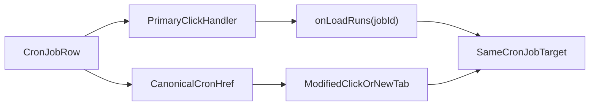

# Stage 61 - Cron Job Link Parity

## Goal

Сделать строки списка джобов во вкладке `cron` частью того же canonical routing contract, что уже используют sidebar, `overview`, `sessions`, cron run links и `usage`: primary click остаётся быстрым JS handoff в текущем табе, а browser-native действия работают через реальный `href`.

## Why This Step

`cron` уже умеет жить в shareable URL и после выбора джобы синхронизирует route через `syncUrlWithTab(state, "cron", true)`, но сам основной entry surface всё ещё click-only.

Сейчас row рендерится как `div` с `@click` в [C:\Users\Tanya\source\repos\god-mode-core\ui\src\ui\views\cron.ts](C:\Users\Tanya\source\repos\god-mode-core\ui\src\ui\views\cron.ts), а не как link. При этом query contract уже существует в [C:\Users\Tanya\source\repos\god-mode-core\ui\src\ui\app-settings.ts](C:\Users\Tanya\source\repos\god-mode-core\ui\src\ui\app-settings.ts): `cronQ`, `cronEnabled`, `cronSchedule`, `cronStatus`, `cronSort`, `cronDir`, `cronRunsScope`, `cronRunsQ`, `cronRunsSort`, `cronRunsStatus`, `cronRunsDelivery`, `cronJob`.

Это делает `cron job rows` самым сильным следующим шагом: high-value операторский screen уже canonical по state, но ещё не canonical по link behavior.

## Scope

Включить:

- сделать job rows реальными anchor targets
- строить `href` через shared routing helpers в [C:\Users\Tanya\source\repos\god-mode-core\ui\src\ui\app-settings.ts](C:\Users\Tanya\source\repos\god-mode-core\ui\src\ui\app-settings.ts)
- сохранить обычный left-click как текущий `onLoadRuns` JS path
- разрешить modified-click / middle-click / open-in-new-tab уйти в браузерный `href`
- сохранить существующую семантику action buttons внутри строки: `Edit`, `Clone`, `Enable/Disable`, `Run`, `Run if due`, `History`, `Remove`

Не включать:

- новый query contract для `cron`
- redesign cron cards/layout
- расширение stage на `channels`, `bootstrap/artifacts`, `settings family` или command palette
- изменение data-loading логики runs explorer сверх нужного для href parity

## Main Files

- [C:\Users\Tanya\source\repos\god-mode-core\ui\src\ui\views\cron.ts](C:\Users\Tanya\source\repos\god-mode-core\ui\src\ui\views\cron.ts)
- [C:\Users\Tanya\source\repos\god-mode-core\ui\src\ui\app-render.ts](C:\Users\Tanya\source\repos\god-mode-core\ui\src\ui\app-render.ts)
- [C:\Users\Tanya\source\repos\god-mode-core\ui\src\ui\app-settings.ts](C:\Users\Tanya\source\repos\god-mode-core\ui\src\ui\app-settings.ts)
- [C:\Users\Tanya\source\repos\god-mode-core\ui\src\ui\views\cron.test.ts](C:\Users\Tanya\source\repos\god-mode-core\ui\src\ui\views\cron.test.ts)
- [C:\Users\Tanya\source\repos\god-mode-core\ui\src\ui\app-settings.test.ts](C:\Users\Tanya\source\repos\god-mode-core\ui\src\ui\app-settings.test.ts)
- [C:\Users\Tanya\source\repos\god-mode-core\docs\help\testing.md](C:\Users\Tanya\source\repos\god-mode-core\docs\help\testing.md)

## Implementation

1. Зафиксировать canonical target для одной cron row.

- Использовать existing `cron` URL contract, а не новый row-specific query model.
- Canonical `href` для строки должен означать: текущие `cron` jobs/runs filters плюс именно эта `cronJob` как primary target.
- Предпочтительно вынести это в небольшой shared helper по образцу `buildCanonicalUsageSessionHref(...)`, чтобы row не собирала query вручную и не расходилась с `applyTabQueryStateToUrl(...)`.

1. Пробросить shared href и click handoff в cron rendering.

- Расширить contract между [C:\Users\Tanya\source\repos\god-mode-core\ui\src\ui\app-render.ts](C:\Users\Tanya\source\repos\god-mode-core\ui\src\ui\app-render.ts) и [C:\Users\Tanya\source\repos\god-mode-core\ui\src\ui\views\cron.ts](C:\Users\Tanya\source\repos\god-mode-core\ui\src\ui\views\cron.ts), чтобы job row получала `href` и callback так же, как это уже сделано в `overview` и `usage` surfaces.
- На обычный left-click перехватывать событие и оставлять current fast `onLoadRuns(job.id)` path.
- На modified-click не мешать браузеру открыть canonical link.
- Не сломать вложенные action buttons: они должны продолжать делать локальные действия и, где это уже задумано, сохранять существующий row-selection side effect без случайной навигации через anchor.

1. Зафиксировать focused regressions.

- В [C:\Users\Tanya\source\repos\god-mode-core\ui\src\ui\app-settings.test.ts](C:\Users\Tanya\source\repos\god-mode-core\ui\src\ui\app-settings.test.ts) добавить helper-level regression на canonical cron-job href, если появится новый shared helper.
- В [C:\Users\Tanya\source\repos\god-mode-core\ui\src\ui\views\cron.test.ts](C:\Users\Tanya\source\repos\god-mode-core\ui\src\ui\views\cron.test.ts) добавить regression на rendered `href` для job row и на primary click vs modified-click behavior.
- Сохранить или расширить проверку, что action buttons внутри row не удваивают navigation path и не ломают текущую семантику `onLoadRuns`.
- Коротко отметить в [C:\Users\Tanya\source\repos\god-mode-core\docs\help\testing.md](C:\Users\Tanya\source\repos\god-mode-core\docs\help\testing.md), что `cron` job rows должны использовать shared routing helpers и не откатываться к click-only `div` rows.

## Suggested Flow

## Expected Outcome

После `Stage 61` оператор сможет открыть конкретную cron job history в новой вкладке или скопировать ссылку прямо из списка джобов, получая тот же drill-down, который раньше был доступен только через local click state. Это подтягивает `cron` к v1-уровню browser-native navigation без раздувания routing model и без потери уже богатого action flow внутри строки.
