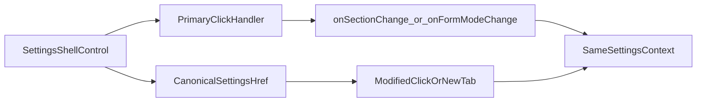

# Stage 63 - Settings Shell Link Parity

## Goal

Сделать section tabs и form/raw toggles внутри settings-family частью того же canonical routing contract, что уже используют sidebar, `overview`, `usage`, `cron` и `channels`: primary click остаётся быстрым JS handoff в текущем табе, а browser-native действия работают через реальный `href`.

## Why This Step

`config`, `communications`, `appearance`, `automation`, `infrastructure` и `aiAgents` уже умеют жить в shareable URL через tab-prefixed query state из [C:\Users\Tanya\source\repos\god-mode-core\ui\src\ui\app-settings.ts](C:\Users\Tanya\source\repos\god-mode-core\ui\src\ui\app-settings.ts): `*Mode`, `*Q`, `*Section`, `*Subsection` уже гидратируются и сериализуются.

Но основной shell внутри этих вкладок всё ещё button-only. В shared renderer [C:\Users\Tanya\source\repos\god-mode-core\ui\src\ui\views\config.ts](C:\Users\Tanya\source\repos\god-mode-core\ui\src\ui\views\config.ts) section tabs и form/raw toggle рендерятся как `<button>` с `@click`, без реального `href`.

Это делает settings-family самым сильным следующим шагом после `channels`: URL contract уже готов, surface очень operator-heavy, а browser-native affordances там до сих пор отсутствуют именно на главных navigation controls.

## Scope

Включить:

- сделать section tabs реальными anchor targets во всех six settings-family surfaces через shared shell
- сделать form/raw mode toggle реальными anchor targets там, где toggle уже отображается
- строить `href` через shared routing helpers в [C:\Users\Tanya\source\repos\god-mode-core\ui\src\ui\app-settings.ts](C:\Users\Tanya\source\repos\god-mode-core\ui\src\ui\app-settings.ts)
- сохранить обычный left-click как текущий JS path через existing callbacks
- разрешить modified-click / middle-click / open-in-new-tab уйти в браузерный `href`

Не включать:

- новый query contract для settings-family
- redesign settings layout
- переписывание search field в link-driven control
- изменение save/apply/update/config file semantics
- расширение этого же stage на `agents`, `bootstrap/artifacts`, `debug` или другие surfaces

## Main Files

- [C:\Users\Tanya\source\repos\god-mode-core\ui\src\ui\views\config.ts](C:\Users\Tanya\source\repos\god-mode-core\ui\src\ui\views\config.ts)
- [C:\Users\Tanya\source\repos\god-mode-core\ui\src\ui\app-render.ts](C:\Users\Tanya\source\repos\god-mode-core\ui\src\ui\app-render.ts)
- [C:\Users\Tanya\source\repos\god-mode-core\ui\src\ui\app-settings.ts](C:\Users\Tanya\source\repos\god-mode-core\ui\src\ui\app-settings.ts)
- [C:\Users\Tanya\source\repos\god-mode-core\ui\src\ui\app-settings.test.ts](C:\Users\Tanya\source\repos\god-mode-core\ui\src\ui\app-settings.test.ts)
- [C:\Users\Tanya\source\repos\god-mode-core\ui\src\ui\views\config.browser.test.ts](C:\Users\Tanya\source\repos\god-mode-core\ui\src\ui\views\config.browser.test.ts)
- [C:\Users\Tanya\source\repos\god-mode-core\docs\help\testing.md](C:\Users\Tanya\source\repos\god-mode-core\docs\help\testing.md)

## Implementation

1. Зафиксировать canonical targets для settings shell controls.

- Использовать existing settings-family URL contract, а не новый shell-specific query model.
- Canonical `href` для section tab должен означать: тот же settings tab path плюс target `*Section`, с сохранением релевантного context по текущему tab.
- Canonical `href` для mode toggle должен означать: тот же settings tab path плюс target `*Mode`, без ручной сборки query прямо в renderer.
- Предпочтительно добавить маленький shared helper поверх existing settings navigation bindings, чтобы shell не дублировал знание о `configMode` / `communicationsMode` / `appearanceMode` и т.д.

1. Пробросить shared href и click handoff в shared settings shell.

- Расширить contract между [C:\Users\Tanya\source\repos\god-mode-core\ui\src\ui\app-render.ts](C:\Users\Tanya\source\repos\god-mode-core\ui\src\ui\app-render.ts) и [C:\Users\Tanya\source\repos\god-mode-core\ui\src\ui\views\config.ts](C:\Users\Tanya\source\repos\god-mode-core\ui\src\ui\views\config.ts), чтобы shared shell получал href builders для section и mode targets.
- На обычный left-click перехватывать событие и оставлять current callbacks `onSectionChange(...)` и `onFormModeChange(...)` как single source of truth.
- На modified-click не мешать браузеру открыть canonical link.
- Не трогать search input: он остаётся existing input-driven control и не входит в scope этого stage.

1. Зафиксировать focused regressions.

- В [C:\Users\Tanya\source\repos\god-mode-core\ui\src\ui\app-settings.test.ts](C:\Users\Tanya\source\repos\god-mode-core\ui\src\ui\app-settings.test.ts) добавить helper-level regression на canonical settings shell hrefs, если появится новый shared helper.
- В [C:\Users\Tanya\source\repos\god-mode-core\ui\src\ui\views\config.browser.test.ts](C:\Users\Tanya\source\repos\god-mode-core\ui\src\ui\views\config.browser.test.ts) добавить regression на rendered `href` для representative section tab и mode toggle, а также на primary click vs modified-click behavior.
- Сохранить существующие проверки save/apply/search semantics, чтобы shell parity не сломала остальной config behavior.
- Коротко отметить в [C:\Users\Tanya\source\repos\god-mode-core\docs\help\testing.md](C:\Users\Tanya\source\repos\god-mode-core\docs\help\testing.md), что settings-family shell controls должны использовать shared routing helpers и не откатываться к click-only buttons.

## Suggested Flow

## Expected Outcome

После `Stage 63` оператор сможет открыть конкретный settings section или form/raw mode в новой вкладке и получить тот же navigation context, который раньше был доступен только через local click state. Это подтягивает весь settings-family shell к v1-уровню browser-native navigation без раздувания routing model и без поломки existing config workflows.
