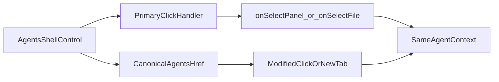

# Stage 64 - Agents Link Parity

## Goal

Сделать `agents` следующим сильным шагом в canonical routing: panel tabs и file rows должны рендерить настоящий `href`, чтобы refresh, copy link и browser-native open-in-new-tab открывали тот же agent context, который уже умеет гидратироваться из URL.

## Why This Step

В [C:\Users\Tanya\source\repos\god-mode-core\ui\src\ui\app-settings.ts](C:\Users\Tanya\source\repos\god-mode-core\ui\src\ui\app-settings.ts) `agents` уже имеет готовый deep-link contract: `agent`, `agentsPanel`, `agentFile`, а для skills panel уже сериализуется `skillFilter`. При этом в [C:\Users\Tanya\source\repos\god-mode-core\ui\src\ui\views\agents.ts](C:\Users\Tanya\source\repos\god-mode-core\ui\src\ui\views\agents.ts) panel tabs всё ещё рендерятся как `<button>`, а в [C:\Users\Tanya\source\repos\god-mode-core\ui\src\ui\views\agents-panels-status-files.ts](C:\Users\Tanya\source\repos\god-mode-core\ui\src\ui\views\agents-panels-status-files.ts) file drill-down тоже остаётся button-only.

Это хороший следующий этап после settings shell parity: surface operator-heavy, query contract уже существует, а риск остаётся локальным и понятным.

## Scope

Включить:

- добавить shared canonical href builder для `agents` targets поверх existing tab query serialization
- превратить agent panel tabs в anchor-based controls с primary-click handoff
- превратить file rows в canonical links к тому же agent + `agentsPanel=files` + `agentFile`
- сохранить текущие callbacks и side effects (`onSelectPanel`, `onSelectFile`, lazy loads, URL sync)
- покрыть helper-level и render-level regressions и обновить короткую testing note

Не включать:

- новый query contract для `agents`
- redesign самого agents layout
- перевод agent `<select>` в custom link-driven picker
- расширение stage на `bootstrap`, `artifacts`, `sessions` или `debug`
- переписывание skills filter / tools / cron / channels panel semantics вне их текущего scope

## Main Files

- [C:\Users\Tanya\source\repos\god-mode-core\ui\src\ui\app-settings.ts](C:\Users\Tanya\source\repos\god-mode-core\ui\src\ui\app-settings.ts)
- [C:\Users\Tanya\source\repos\god-mode-core\ui\src\ui\app-render.ts](C:\Users\Tanya\source\repos\god-mode-core\ui\src\ui\app-render.ts)
- [C:\Users\Tanya\source\repos\god-mode-core\ui\src\ui\views\agents.ts](C:\Users\Tanya\source\repos\god-mode-core\ui\src\ui\views\agents.ts)
- [C:\Users\Tanya\source\repos\god-mode-core\ui\src\ui\views\agents-panels-status-files.ts](C:\Users\Tanya\source\repos\god-mode-core\ui\src\ui\views\agents-panels-status-files.ts)
- [C:\Users\Tanya\source\repos\god-mode-core\ui\src\styles\components.css](C:\Users\Tanya\source\repos\god-mode-core\ui\src\styles\components.css)
- [C:\Users\Tanya\source\repos\god-mode-core\ui\src\ui\app-settings.test.ts](C:\Users\Tanya\source\repos\god-mode-core\ui\src\ui\app-settings.test.ts)
- [C:\Users\Tanya\source\repos\god-mode-core\ui\src\ui\views\agents.test.ts](C:\Users\Tanya\source\repos\god-mode-core\ui\src\ui\views\agents.test.ts)
- [C:\Users\Tanya\source\repos\god-mode-core\docs\help\testing.md](C:\Users\Tanya\source\repos\god-mode-core\docs\help\testing.md)

## Implementation

1. Зафиксировать canonical agents targets.

- Добавить небольшой shared helper в [C:\Users\Tanya\source\repos\god-mode-core\ui\src\ui\app-settings.ts](C:\Users\Tanya\source\repos\god-mode-core\ui\src\ui\app-settings.ts), который строит canonical `href` для `agents` с override для `panel` и optional `file`.
- Не дублировать ручную сборку query в renderer: helper должен использовать тот же tab-scoped serialization, что уже понимает `applyTabQueryStateToUrl(...)`.
- Для files panel canonical target должен означать: текущий `agents` path + выбранный `agent` + `agentsPanel=files` + target `agentFile`, без потери уже релевантного state.

1. Пробросить href builders и primary-click handoff в agents shell.

- Расширить wiring между [C:\Users\Tanya\source\repos\god-mode-core\ui\src\ui\app-render.ts](C:\Users\Tanya\source\repos\god-mode-core\ui\src\ui\app-render.ts) и [C:\Users\Tanya\source\repos\god-mode-core\ui\src\ui\views\agents.ts](C:\Users\Tanya\source\repos\god-mode-core\ui\src\ui\views\agents.ts), чтобы renderer получал `buildPanelHref` и `buildFileHref`.
- В `renderAgentTabs(...)` заменить click-only `<button>` на `<a>` и сохранить current `onSelectPanel(...)` path для обычного left-click.
- В `renderAgentFileRow(...)` сделать тот же handoff: обычный click идёт через existing `onSelectFile`, а modified-click / open-in-new-tab уходит в браузерный `href`.
- Сохранить текущую lazy-loading semantics и `syncUrlWithTab(...)`; stage не должен менять поведение agent `<select>`.

1. Зафиксировать focused regressions.

- В [C:\Users\Tanya\source\repos\god-mode-core\ui\src\ui\app-settings.test.ts](C:\Users\Tanya\source\repos\god-mode-core\ui\src\ui\app-settings.test.ts) добавить helper-level regression на canonical agents hrefs.
- В [C:\Users\Tanya\source\repos\god-mode-core\ui\src\ui\views\agents.test.ts](C:\Users\Tanya\source\repos\god-mode-core\ui\src\ui\views\agents.test.ts) добавить render-level проверки на `href` для representative panel tab и file row, а также на primary click vs modified-click behavior.
- Сохранить уже существующую проверку restored file drill-down и коротко закрепить expectation в [C:\Users\Tanya\source\repos\god-mode-core\docs\help\testing.md](C:\Users\Tanya\source\repos\god-mode-core\docs\help\testing.md), чтобы `agents` не откатились к button-only navigation.

## Suggested Flow

## Expected Outcome

После `Stage 64` оператор сможет открыть конкретную panel внутри `agents` или сразу file drill-down в новой вкладке и получить тот же context после refresh/popstate. Это подтянет один из самых operator-heavy surfaces к browser-native navigation без расширения routing model и без вмешательства в сложные editor flows.
