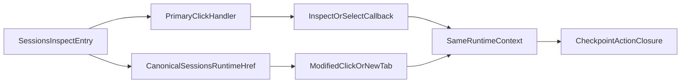

# Stage 65 - Sessions Runtime Link Parity

## Goal

Сделать runtime-investigation внутри `sessions` частью того же canonical routing contract, что уже используют `usage`, `cron`, `channels`, settings shell и `agents`: оператор должен уметь открыть `Inspect`, конкретный checkpoint, action или closure в новой вкладке и получить тот же runtime context после refresh/popstate.

## Why This Step

В [C:\Users\Tanya\source\repos\god-mode-core\ui\src\ui\app-settings.ts](C:\Users\Tanya\source\repos\god-mode-core\ui\src\ui\app-settings.ts) `sessions` уже сериализует весь нужный runtime state через `runtimeSession`, `runtimeRun`, `checkpoint`, `runtimeAction`, `runtimeClosure`, но в [C:\Users\Tanya\source\repos\god-mode-core\ui\src\ui\views\sessions.ts](C:\Users\Tanya\source\repos\god-mode-core\ui\src\ui\views\sessions.ts) главный runtime flow всё ещё button-only: `Inspect` CTA в session rows, список checkpoints, список actions и список closures идут через `@click` callbacks без canonical `href`.

Это следующий сильный шаг после `agents`, потому что surface уже operator-heavy, query contract готов, а разрыв остаётся именно в browser-native affordances для расследования и recovery handoff.

## Scope

Включить:

- добавить shared canonical href builder для runtime-inspector targets внутри `sessions`
- перевести `Inspect` CTA в session row на anchor semantics с primary-click handoff
- перевести checkpoint / action / closure selectors внутри runtime inspector на anchor semantics
- сохранить текущие callbacks и side effects (`onInspectRuntimeSession`, `onSelectRuntimeCheckpoint`, `onSelectRuntimeAction`, `onSelectRuntimeClosure`, `syncUrlWithTab(...)`)
- добавить focused helper/render regressions и короткую testing note

Не включать:

- новый query contract для `sessions`
- перевод sort headers, pagination, filters или checkbox selection в link-driven controls
- redesign runtime inspector layout
- изменение recovery write-path semantics или controller truth model
- расширение stage на `bootstrap`, `artifacts`, `nodes`, `debug` или `logs`

## Main Files

- [C:\Users\Tanya\source\repos\god-mode-core\ui\src\ui\app-settings.ts](C:\Users\Tanya\source\repos\god-mode-core\ui\src\ui\app-settings.ts)
- [C:\Users\Tanya\source\repos\god-mode-core\ui\src\ui\app-render.ts](C:\Users\Tanya\source\repos\god-mode-core\ui\src\ui\app-render.ts)
- [C:\Users\Tanya\source\repos\god-mode-core\ui\src\ui\views\sessions.ts](C:\Users\Tanya\source\repos\god-mode-core\ui\src\ui\views\sessions.ts)
- [C:\Users\Tanya\source\repos\god-mode-core\ui\src\ui\app-settings.test.ts](C:\Users\Tanya\source\repos\god-mode-core\ui\src\ui\app-settings.test.ts)
- [C:\Users\Tanya\source\repos\god-mode-core\ui\src\ui\views\sessions.test.ts](C:\Users\Tanya\source\repos\god-mode-core\ui\src\ui\views\sessions.test.ts)
- [C:\Users\Tanya\source\repos\god-mode-core\docs\help\testing.md](C:\Users\Tanya\source\repos\god-mode-core\docs\help\testing.md)

## Key Evidence

В [C:\Users\Tanya\source\repos\god-mode-core\ui\src\ui\app-settings.ts](C:\Users\Tanya\source\repos\god-mode-core\ui\src\ui\app-settings.ts) уже есть весь runtime URL contract:

```typescript
if (tab === "sessions") {
  setQueryValue(url, "runtimeSession", host.runtimeSessionKey);
  setQueryValue(url, "runtimeRun", host.runtimeRunId);
  setQueryValue(url, "checkpoint", host.runtimeSelectedCheckpointId);
  setQueryValue(url, "runtimeAction", host.runtimeSelectedActionId);
  setQueryValue(url, "runtimeClosure", host.runtimeSelectedClosureRunId);
}
```

А в [C:\Users\Tanya\source\repos\god-mode-core\ui\src\ui\views\sessions.ts](C:\Users\Tanya\source\repos\god-mode-core\ui\src\ui\views\sessions.ts) runtime navigation controls пока click-only:

```typescript
<button type="button" @click=${() => onInspectRuntimeSession(row.key, resolveSessionRuntimeInspectRunId(row))}>
  ${t("sessions.runtime.inspect")}
</button>

<button type="button" @click=${() => props.onSelectRuntimeCheckpoint(checkpoint.id)}>
  ...
</button>
```

## Implementation

1. Зафиксировать canonical runtime targets.

- Добавить небольшой shared helper в [C:\Users\Tanya\source\repos\god-mode-core\ui\src\ui\app-settings.ts](C:\Users\Tanya\source\repos\god-mode-core\ui\src\ui\app-settings.ts), который строит canonical `sessions` href с override для `runtimeSession`, `runtimeRun`, `checkpoint`, `runtimeAction`, `runtimeClosure` поверх existing `applyTabQueryStateToUrl(...)`.
- Helper должен уметь выражать как entrypoint `Inspect`, так и более глубокий runtime drill-down, не дублируя ручную сборку query в renderer.
- При переходе на checkpoint/action/closure helper должен оставлять остальной релевантный `sessions` context нетронутым, а не собирать path/query ad hoc через `buildTabHref(...)` в каждом месте.

1. Пробросить href builders и primary-click handoff в runtime UI.

- Расширить wiring между [C:\Users\Tanya\source\repos\god-mode-core\ui\src\ui\app-render.ts](C:\Users\Tanya\source\repos\god-mode-core\ui\src\ui\app-render.ts) и [C:\Users\Tanya\source\repos\god-mode-core\ui\src\ui\views\sessions.ts](C:\Users\Tanya\source\repos\god-mode-core\ui\src\ui\views\sessions.ts), чтобы view получал builders для inspect/checkpoint/action/closure targets.
- В session rows заменить click-only `Inspect` button на `<a>` с canonical `href`, сохранив обычный left-click через current `onInspectRuntimeSession(...)` path.
- В runtime inspector сделать тот же handoff для checkpoint / action / closure lists: primary click идёт через existing callbacks и `preventDefault()`, modified-click / middle-click / open-in-new-tab уходит в браузерный `href`.
- Не менять recovery action buttons, filter/search/sort/pagination и selection controls: они остаются в своём текущем interaction model.

1. Зафиксировать focused regressions.

- В [C:\Users\Tanya\source\repos\god-mode-core\ui\src\ui\app-settings.test.ts](C:\Users\Tanya\source\repos\god-mode-core\ui\src\ui\app-settings.test.ts) добавить helper-level regression на canonical runtime inspector hrefs для representative inspect target и более глубокого action/closure target.
- В [C:\Users\Tanya\source\repos\god-mode-core\ui\src\ui\views\sessions.test.ts](C:\Users\Tanya\source\repos\god-mode-core\ui\src\ui\views\sessions.test.ts) добавить render-level проверки на `href` для `Inspect` CTA и representative checkpoint/action/closure controls, плюс primary click vs modified-click handoff semantics.
- Сохранить уже существующие regressions на runtime recovery context и linked bootstrap/artifact records, чтобы link parity не сломала текущий investigation flow.
- Коротко отметить в [C:\Users\Tanya\source\repos\god-mode-core\docs\help\testing.md](C:\Users\Tanya\source\repos\god-mode-core\docs\help\testing.md), что runtime inspector controls в `sessions` должны использовать shared canonical routing helper и не откатываться к button-only navigation.

## Suggested Flow




## Expected Outcome

После `Stage 65` оператор сможет открыть runtime inspect path из `sessions`, а затем и конкретный checkpoint/action/closure, в новой вкладке и получить тот же investigation context после refresh/popstate. Это подтянет один из самых важных recovery-heavy surfaces к browser-native navigation без расширения routing model и без вмешательства в существующую controller truth model.
