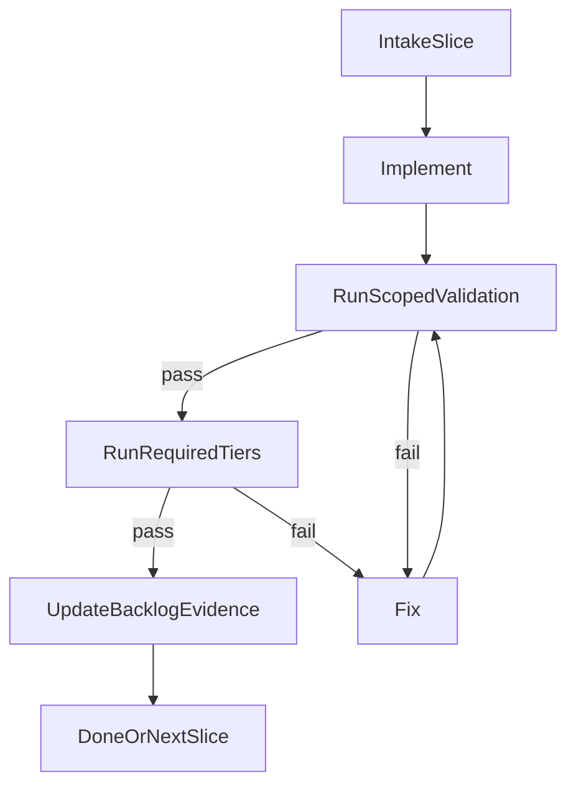

# V1 Execution Checklist

Короткий операционный контракт для любого нового чата, который продолжает `Horizon 1 / v1`.

## Что читать на старте

1. [master_v1_roadmap.md](master_v1_roadmap.md)
2. [master_orchestrator_context.md](master_orchestrator_context.md), если нужен полный продуктовый и архитектурный контекст
3. [autonomous_v1_active_backlog.md](autonomous_v1_active_backlog.md)
4. Текущий активный `stage_XX_*.plan.md`, если работа идёт внутри stage
5. [multi_agent_execution_protocol.md](multi_agent_execution_protocol.md), если нужны подагенты
6. [../stage86_test_cases.md](../stage86_test_cases.md) — foundation Stage 86 (**8/8** кейсов, ручной прогон как пользователь)
7. [../v1_user_acceptance_cases.md](../v1_user_acceptance_cases.md) — главный live gate Horizon 1 (**10/10** сценариев)
8. [docs/help/testing.md](../../docs/help/testing.md) — полная картина тестовых команд и optional heavy gates

## Validation ladder и live gates

Автоматические tier’ы и ручной прогон **не заменяют** друг друга. Конкретный набор tier’ов для slice задаётся в [autonomous_v1_active_backlog.md](autonomous_v1_active_backlog.md) (`requiredValidation`). Общая лестница:

| Tier | Тип | Типичная команда / доказательство | Когда обязателен |
| ---- | --- | ----------------------------------- | ---------------- |
| T1 | unit/integration | `pnpm test -- <relevant-paths>` | Почти всегда после правок кода |
| T2 | lint/type/build | `pnpm check`; при необходимости `pnpm build` | Типы, UI bundle, широкий wiring |
| T3 | e2e smoke (deterministic) | `pnpm test:e2e:smoke` | Затронуты gateway boot, chat, runtime wiring |
| T4 | v1-gate bundle | `pnpm test:v1-gate` | Recovery/session-event/release-boundary; **всегда** перед заявлением `v1 ready` |
| T5 | продуктовая приёмка | Ручной прогон по чеклистам ниже | Когда slice требует live proof |

**E2E в CI:** T3 (`pnpm test:e2e:smoke`) — это автоматический интеграционный барьер, не «я написал в бота».

**E2E шире:** при необходимости touched area — broader `pnpm test:e2e` (см. [master_v1_roadmap.md](master_v1_roadmap.md), Release Ladder, и [docs/help/testing.md](../../docs/help/testing.md)).

**Как пользователь (обязательно для T5, не заменяется T1–T4):** отправить реальное сообщение в канал (например Telegram), дождаться ответа, сверить ожидания сценария, снять **gateway log** (шаблон в конце [../stage86_test_cases.md](../stage86_test_cases.md)) и при необходимости проверить control UI (Sessions, bootstrap, usage). Результат зафиксировать в backlog (`lastValidation`, `evidence`).

**Два разных продукта проверки:**

- **Stage 86 foundation** — полный проход **8/8** по [../stage86_test_cases.md](../stage86_test_cases.md).
- **Точная проверка Horizon 1** — полный проход **10/10** по [../v1_user_acceptance_cases.md](../v1_user_acceptance_cases.md) (включает foundation, но шире; без **10/10** нельзя считать трек полностью проверенным по продукту).

Подробнее по связке automated + manual для runtime track: [runtime_stabilization_recovery_b9c4d525.plan.md](runtime_stabilization_recovery_b9c4d525.plan.md) (раздел «E2E и как пользователь»).

## Цикл исполнения



## Допустимые состояния

- `status: open` + `executionState: queued` — slice ещё не взят в работу.
- `status: in_progress` + `executionState: implementing|verifying|fixing|waiting_manual` — работа идёт, validation обязан продолжаться до зелёного статуса или явного блокера.
- `status: blocked` + `executionState: blocked_external|blocked_scope` — продолжение невозможно без внешнего действия или согласования scope.
- `status: done` + `executionState: completed` — выполнены `doneWhen` и обязательные tier’ы.

## Обязательные поля backlog

У каждого активного slice должны быть заполнены:

- `lastValidation`
- `blockerOwner`
- `resumeFrom`
- `evidence`

## Жёсткие правила

- Нельзя останавливаться на состоянии «код написан, но тесты ещё не запускал».
- Нельзя писать пользователю `готово`, пока не выполнены требуемые tier’ы slice или не оформлен `blocked`.
- При любом провале цикл только один: `fix -> rerun same validation -> continue`.
- Если нужен ручной/live шаг, deterministic часть всё равно должна быть доведена до зелёного состояния до handoff.
- Если чат прервался, следующий агент продолжает с `resumeFrom`, а не начинает discovery заново.
- Для финального `v1 ready` главным сигналом считается прохождение **10/10** сценариев из [../v1_user_acceptance_cases.md](../v1_user_acceptance_cases.md), а не только зелёный automated ladder.

## Что писать в `lastValidation`

- Дата.
- Какие tier’ы запускались.
- Какими командами или группами тестов это подтверждено.
- Итог: `pass|fail|pending_manual`.

Пример:

```md
2026-04-08: T1 pass (`pnpm test -- src/agents/model-fallback.test.ts`), T2 pending, T5 pending_manual.
```

## Что писать в `resumeFrom`

- Один конкретный следующий шаг.
- Если шаг manual/live, указать точный сценарий или кейс.
- Если есть блокер, указать, что запускать сразу после разблокировки.

## Что писать в `evidence`

- Самые важные артефакты, которые доказывают готовность.
- Не пересказывать весь чат; только факты, полезные следующему агенту.

## Условие остановки

Останавливаться можно только в одном из двух состояний:

1. `done`: slice действительно закрыт.
2. `blocked`: есть владелец блокера, точная причина и понятный `resumeFrom`.

## Финальный релизный gate

Перед заявлением `v1 ready` нужно одновременно:

- довести deterministic проверки затронутых slice до требуемого уровня;
- пройти **10/10** живых пользовательских сценариев из [../v1_user_acceptance_cases.md](../v1_user_acceptance_cases.md);
- убедиться, что bot реально отвечает, устанавливает, продолжает, создаёт артефакты и не падает на живом прогоне.
