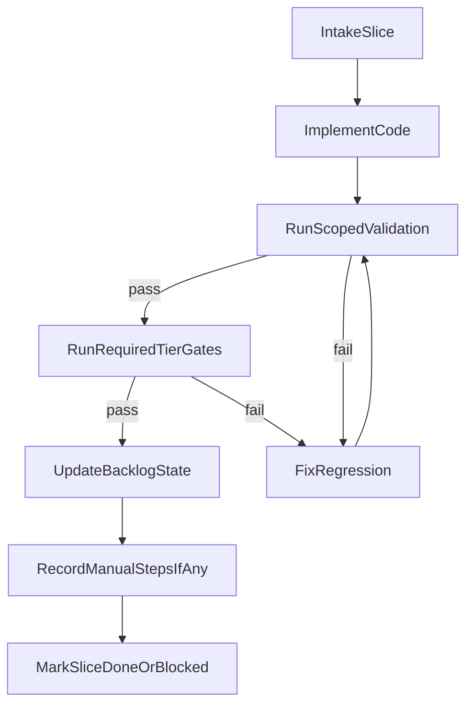

# V1 Plan Hardening and Execution Contract

## Что меняем

- Обновить канонический хенд-офф и границы v1 в [c:\Users\Tanya\source\repos\god-mode-corecursor\plans\master_v1_roadmap.md](c:\Users\Tanya\source\repos\god-mode-core.cursor\plans\master_v1_roadmap.md), чтобы он ссылался на единый execution-контракт и фиксировал правило «не останавливаемся на коде без проверки». 
- Ужесточить рабочий бэклог в [c:\Users\Tanya\source\repos\god-mode-corecursor\plans\autonomous_v1_active_backlog.md](c:\Users\Tanya\source\repos\god-mode-core.cursor\plans\autonomous_v1_active_backlog.md): для каждого slice добавить обязательные поля `executionState`, `lastValidation`, `blockerOwner`, `resumeFrom`, чтобы любое прерывание автоматически продолжалось с конкретной точки.
- Переписать протокол исполнения в [c:\Users\Tanya\source\repos\god-mode-corecursor\plans\multi_agent_execution_protocol.md](c:\Users\Tanya\source\repos\god-mode-core.cursor\plans\multi_agent_execution_protocol.md) как «операционную конституцию»:
  - когда запускать подагентов параллельно;
  - что считается done;
  - когда строго запрещено репортить «готово»;
  - как фиксируются результаты тестов и повторные прогоны.
- Добавить отдельный целевой документ execution-контракта (новый файл в `.cursor/plans/`, например `v1_execution_contract.md`) как краткий чеклист на каждый цикл работы, чтобы не зависеть от длинной истории чата.

## Новый обязательный цикл (Do-Verify-Fix-Repeat)

- Нельзя завершать slice после `ImplementCode`; минимум — `RunScopedValidation` + все требуемые tier-гейты по слайсу.
- Если есть падения, цикл обязателен до зелёного состояния или явного `blocked` с владельцем блокера и точной причиной.
- Любой ответ пользователю о прогрессе должен включать: что проверено, что не проверено, что будет запущено следующим шагом.

## Правила качества результата

- Статус `done` только при выполненных `doneWhen` + обязательных validation-tier для затронутой области.
- Статус `blocked` только с полями: причина, владелец, требуемое действие, путь продолжения (`resumeFrom`).
- Для каждого slice фиксировать «доказательства» (какие команды и какие группы тестов были пройдены) в самом backlog-файле.
- В конце каждого рабочего цикла обновлять master/handoff-документ, чтобы следующий чат продолжал с актуальной точки без повторного discovery.

## Порядок внедрения

- Сначала закрепить execution-контракт и определения статусов.
- Затем синхронизировать `master_v1_roadmap` и `active_backlog` под этот контракт.
- После этого привести multi-agent protocol к тем же терминам и правилам переходов.
- В финале проверить консистентность ссылок и критериев «v1 ready» между всеми четырьмя документами.

## Критерий успеха

- Любой новый чат может стартовать только по `master_v1_roadmap + active_backlog + execution_contract` и сразу продолжать работу без потери контекста.
- В документах отсутствует состояние «код написан, но не протестирован» как допустимая остановка.
- Для каждого активного slice есть чёткий next action и проверяемый путь до `done` или `blocked`.
