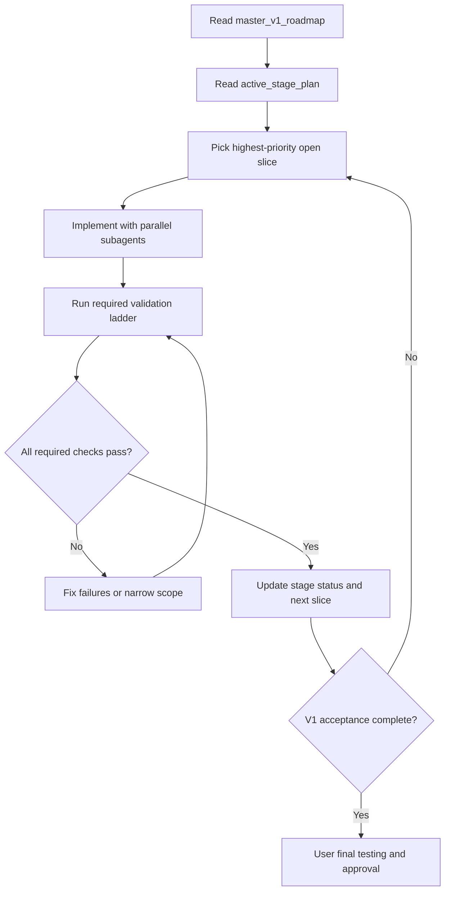

# Autonomous V1 Delivery Loop

## Goal

Перевести работу по `v1` из режима "жду следующую команду пользователя" в режим непрерывной автономной итерации: агент сам берёт следующий незакрытый кусок, реализует, проверяет, обновляет плановое состояние и продолжает, пока `v1` не станет одновременно `implemented + validated + user-testable`.

## Current Truth Sources

- Главный продуктовый план находится в `[.cursor/plans/autonomous_v1_roadmap_cb6fe0e6.plan.md](.cursor/plans/autonomous_v1_roadmap_cb6fe0e6.plan.md)`.
- `[.cursor/plans/master_v1_roadmap.md](.cursor/plans/master_v1_roadmap.md)` остаётся коротким handoff и release-context файлом.
- Текущий active execution stage и multi-agent ownership уже есть в `[.cursor/plans/stage_85_cursor_execution_4d2f9c10.plan.md](.cursor/plans/stage_85_cursor_execution_4d2f9c10.plan.md)`.
- Product-facing acceptance для текущего smart-routing/bootstrap трека уже есть в `[.cursor/stage86_test_cases.md](.cursor/stage86_test_cases.md)`.
- Долгосрочная продуктовая карта есть в `[.cursor/plans/sovereign_ai_map_8e04210e.plan.md](.cursor/plans/sovereign_ai_map_8e04210e.plan.md)`, но сейчас она не является операционным backlog для ежедневной автономной работы.

## Problem To Fix

Сейчас планы хорошо объясняют intent человеку, но не дают агенту одного машиночитаемого ответа на вопросы:

- что именно является текущим `active backlog`;
- какой следующий slice брать после завершения текущего;
- какие проверки обязательны перед продолжением;
- когда агент обязан остановиться и ждать пользователя.

## Desired Operating Model

## Plan Changes

### 1. Establish one operational source of truth for active work

Create a dedicated active backlog artifact under `.cursor/plans/` that is narrower than the sovereign map and more actionable than the master roadmap.

- Keep `[.cursor/plans/master_v1_roadmap.md](.cursor/plans/master_v1_roadmap.md)` as the short canonical handoff file.
- Keep `[.cursor/plans/sovereign_ai_map_8e04210e.plan.md](.cursor/plans/sovereign_ai_map_8e04210e.plan.md)` as long-horizon product map only.
- **Done:** [`autonomous_v1_active_backlog.md`](autonomous_v1_active_backlog.md) contains ordered slices with fields:
  - `id`
  - `priority`
  - `status`
  - `dependsOn`
  - `userValue`
  - `ownedFiles`
  - `requiredValidation`
  - `doneWhen`
- Use that file as the only answer to `what next right now`.

### 2. Normalize every stage plan to the same template

Update the active stage plan structure so every future `stage_XX_*.plan.md` contains the same blocks:

- `Goal`
- `Out of scope`
- `Ordered backlog slices`
- `Validation ladder`
- `Hard stop conditions`
- `Continue conditions`
- `User-facing test protocol`
- `Next stage handoff`

The template should make it obvious whether the agent should:

- continue coding autonomously;
- stop and fix regressions;
- stop because a manual/live gate is required.

### 3. Define a strict validation ladder for autonomous continuation

Ground the ladder in existing repo truth from `[.cursor/plans/master_v1_roadmap.md](.cursor/plans/master_v1_roadmap.md)`, `[.cursor/plans/stage_84_v1_gate_bd5c3d01.plan.md](.cursor/plans/stage_84_v1_gate_bd5c3d01.plan.md)`, and `[docs/help/testing.md](docs/help/testing.md)`.

Required ladder per slice:

- `Tier 1`: focused tests for touched modules.
- `Tier 2`: `pnpm check` and `pnpm build` when the touched area warrants it.
- `Tier 3`: `pnpm test:e2e:smoke` when gateway/chat/runtime boot flows are affected.
- `Tier 4`: `pnpm test:v1-gate` when touching recovery/session-event/release-boundary surfaces, and always before declaring v1 ready.
- `Tier 5`: current product acceptance protocol from `[.cursor/stage86_test_cases.md](.cursor/stage86_test_cases.md)` for the smart-routing/bootstrap track.

For each backlog slice, encode exactly which tiers are mandatory before the agent may continue.

### 4. Encode stop/continue rules explicitly

Add repo-local rules to the active backlog/stage plan that answer:

- `Continue automatically` when required code + validations for the current slice are green.
- `Do not stop after a small successful patch` if there is still an open higher-priority slice in the active backlog and no hard-stop condition is hit.
- `Stop and report` only when one of these occurs:
  - required validation cannot be made green without broadening scope;
  - a manual/live gate is the next blocker;
  - conflicting product directions are discovered;
  - external secret/infra/user action is required.

### 5. Turn Stage 86 into the first autonomous execution queue

Use `[.cursor/stage86_test_cases.md](.cursor/stage86_test_cases.md)` as acceptance, but convert it into an ordered engineering queue under the active backlog:

- routing parity and session-aware preflight
- prompt optimization visibility
- bootstrap approve-resume flow
- runtime inspector visibility (`modelRouteTier`, blocked resume, lifecycle)
- usage/cost visibility
- Telegram E2E proof

Each item should explicitly say:

- which code surfaces are in play;
- which automated tests prove the deterministic part;
- which manual/live checks remain before calling the item done.

### 6. Define the multi-agent execution protocol once

Lift the useful parts of `[.cursor/plans/stage_85_cursor_execution_4d2f9c10.plan.md](.cursor/plans/stage_85_cursor_execution_4d2f9c10.plan.md)` into a reusable protocol:

- main agent owns shared seams and final integration;
- subagents own disjoint file packs;
- every iteration starts with a short split: exploration agent(s), implementation agent(s), verification agent(s);
- use stronger models only for genuinely complex planning or integration slices; use faster models for narrow exploration, targeted edits, and focused verification;
- the main agent merges results, runs validation, updates backlog state, and immediately starts the next slice if no hard-stop applies.

### 7. Define the final `v1 ready for user test` condition

A slice-complete repo is not enough. `v1 ready for user test` should require:

- active backlog empty for the v1 scope;
- all mandatory automated tiers green;
- current live/manual acceptance checklist satisfied for the targeted track;
- concise final report listing what the user can now test manually and what was verified automatically.

## First Execution Starting Point

Start from Stage 86 rather than inventing a new frontier.

- Keep `[.cursor/plans/master_v1_roadmap.md](.cursor/plans/master_v1_roadmap.md)` as high-level v1 boundary.
- Keep Stage 85 as the last execution-stage precedent.
- Convert Stage 86 from a chat-local initiative into the first fully autonomous backlog-driven delivery loop.
- First backlog slices should target the remaining visible user value gaps: bootstrap auto-continue, Sessions/runtime visibility, usage/cost visibility, and Telegram E2E stability.

## Expected Outcome

После этого агент будет ориентироваться не на очередной пинг пользователя, а на связку:

- `autonomous_v1_roadmap` for product boundary,
- `master_v1_roadmap` for short handoff and release context,
- [`autonomous_v1_active_backlog.md`](autonomous_v1_active_backlog.md) for next slice,
- [`stage_86_smart_routing_bootstrap.plan.md`](stage_86_smart_routing_bootstrap.plan.md) (и далее `stage_XX_*.plan.md`) for execution and validation rules,
- [`multi_agent_execution_protocol.md`](multi_agent_execution_protocol.md) for dev-subagent waves,
- [`stage_plan_template.md`](stage_plan_template.md) for новых stage,
- [`.cursor/stage86_test_cases.md`](../stage86_test_cases.md) for live acceptance.

Это позволит продолжать итерации автономно до состояния: `всё реализовано`, `обязательные проверки зелёные`, `есть финальный user-testable handoff`.
