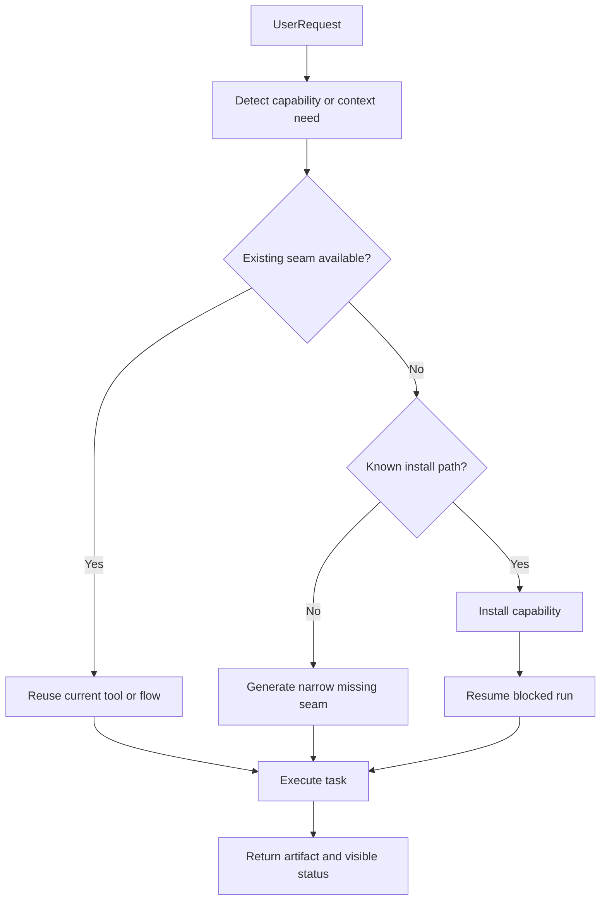

# v1 Roadmap: Autonomous Capability Agent

## Plan Role

This file is the main product plan.

- `[.cursor/plans/autonomous_v1_loop_a69b9e98.plan.md](.cursor/plans/autonomous_v1_loop_a69b9e98.plan.md)` is the execution protocol.
- `[.cursor/plans/autonomous_v1_active_backlog.md](.cursor/plans/autonomous_v1_active_backlog.md)` is the operational **next-slice** backlog for the current Horizon 1 queue (Stage 86 active, post-Stage 86 doc/report/context slices queued next).
- This roadmap answers `what v1 is`, `what is in the investor build`, and `what comes immediately after`.
- The loop tells the agent how to keep iterating with subagents until the current slice is fully implemented and validated.

## Product Vision

God-mode-core v1 should feel like a strong autonomous assistant that:

- does not stop at "I cannot do this" when a tool, format, or report can be installed, generated, or routed differently;
- is token-smart by default through smart routing, prompt shaping, and local-first control-plane decisions;
- turns messy user intent into better model input, such as `нарисуй веселый банан` into a compact but high-quality image prompt;
- can produce useful business artifacts without friction, where PDF generation is ordinary rather than special;
- can operate in practical professional workflows, including builder and project-designer scenarios.

Reference point: abacus.ai level of perceived competence, but focused on a fast, impressive personal assistant cut rather than enterprise SaaS breadth.

## Investor v1 Boundary

The investor-facing v1 for this week is not the entire long-term autonomy vision.

It is a sharply scoped first version that proves:

- visible smart routing between local and cloud models;
- visible prompt optimization and token economy;
- capability bootstrap with approve, install, resume;
- strong file and report handling;
- a convincing domain-aware experience for builder and project-designer scenarios.

### In scope for investor v1 this week

| Capability                    | Target for this week                                                             |
| ----------------------------- | -------------------------------------------------------------------------------- |
| Smart routing                 | Local for simple turns, stronger route for heavy turns, visible in logs or UI    |
| Prompt optimization           | Normalization and compact enhancement are visible and measurable                 |
| Bootstrap install-resume      | Missing capability can be approved, installed, and resumed automatically         |
| PDF/report generation         | Generate polished report outputs without brittle manual steps                    |
| Universal file and table flow | Read CSV/Excel, normalize, compare, summarize; keep simple parsing local         |
| Reasoning-led calculations    | Let the model calculate, explain assumptions, and keep units explicit            |
| Lightweight domain context    | Domain preset (norms, units, typical formulas) layered on top of universal flows |
| Telegram proof                | End-to-end demo through Telegram and session inspector                           |

### Explicitly out of scope for this week

These remain important, but they are not realistic for a 3-5 day investor sprint:

- full general-purpose multi-runtime code generation across Node, .NET, Python, and Docker;
- full autonomous tool authoring for arbitrary domains;
- rich AutoCAD authoring or full DWG round-trip editing;
- enterprise data platform behavior;
- broad zero-touch "never says no" across every tool family.

### Near-next after investor v1

Immediately after the investor cut, continue into:

- broader capability catalog;
- runtime adapters beyond Node;
- generated tool scaffolds;
- additional domain context presets;
- more autonomous installation and recovery paths.

## Universal Flows + Lightweight Context

### Core principle

Spreadsheet comparison, calculation-style reasoning, and PDF generation are **universal flows** available to any request. They are not locked behind profiles.

The "builder/project-designer" layer is a **lightweight context preset** that adds domain vocabulary and typical assumptions (SNiP norms, common units, standard formulas) but does not require separate infrastructure or special tooling.

### Model routing for table/calculation tasks

| Task                        | Complexity | Typical Route                | Example                                    |
| --------------------------- | ---------- | ---------------------------- | ------------------------------------------ |
| CSV/Excel row comparison    | Low        | Local (Ollama/qwen)          | Match supplier names, compare prices       |
| Basic calculations          | Low        | Local                        | Room volume × air exchange rate            |
| Report structuring          | Medium     | Mid-tier (Hydra/gpt-4o-mini) | Format results into tables with units      |
| Complex multi-step analysis | High       | Strong (Hydra/gpt-4o)        | Multi-sheet reconciliation with edge cases |

### Demo scenarios (using universal flows + builder context)

1. **Supplier comparison:**

- User uploads two CSV/Excel price files
- The file and table path parses and normalizes rows
- Local model matches comparable items
- Mid-tier model formats recommendation table with rationale
- Output: ranked comparison with "buy from X because..."

2. **Ventilation calculation:**

- User provides dimensions and constraints
- The model performs the calculation and explains the steps
- Builder context supplies typical air exchange norms, SNiP references
- Mid-tier model structures output with explicit assumptions
- Output: calculation summary + report (PDF/markdown)

3. **Context is context, not code:**

- Context preset = pre-loaded system prompt segment with domain norms
- No separate tool installation per context
- Same universal flows, different default context

### Out of scope (remains true)

- Full DWG editing or AutoCAD authoring from scratch
- Engineering certification or legal sign-off
- Guaranteed jurisdiction-specific code compliance

## Capability Resolution Strategy

For the investor cut, use the fastest practical route:

1. Prefer existing tools and capabilities already available in repo/runtime.
2. Install from catalog or package source when a known tool exists.
3. Only after that, generate or scaffold missing capability in a narrow targeted way.

This means the investor v1 should optimize for believable autonomous behavior, not for maximal architectural purity.

## Delivery Horizons

## Horizon 1: Investor Demo Cut

Target: 3-5 days of continuous multi-agent work.

This is the real commitment for the current loop.

### What must be done in Horizon 1

1. Stage 86 must be closed in a user-visible way:

- routing parity is stable;
- prompt optimization is visible;
- bootstrap approve to resume works;
- Telegram end-to-end proof is green.

2. Universal document, table, and report flows:

- CSV/Excel reading enables comparison flows;
- the model handles dimensional inputs and formula summaries directly;
- PDF/markdown report generation works without brittle steps;
- routing logs show appropriate model selection (local for parsing, mid-tier for formatting).

3. Lightweight builder context preset:

- domain vocabulary and typical norms available as context preset;
- demo scenarios (ventilation calculation, supplier comparison) show domain awareness without separate infrastructure;
- investor understands this is context, not a separate heavy product surface.

4. Investor story must be demoable:

- a short simple prompt routes local;
- a complex analytical prompt routes stronger;
- missing capability resumes after install;
- spreadsheet comparison produces a sensible recommendation;
- calculation flow produces a structured, professional result.

## Horizon 2: Post-demo v1 Hardening

Target: 1-2 additional weeks after the investor cut.

This horizon expands confidence and polish:

- stronger usage and cost visibility;
- broader capability catalog (more document types and richer file flows);
- additional lightweight context presets (domain vocabulary packs, not heavy modules);
- fewer rough edges in tool installation and session recovery;
- better documentation and repeatable demos.

## Horizon 3: Broader Autonomy

Target: later follow-up, not this week's promise.

This includes:

- runtime adapters beyond the current fast path;
- generated tools for missing capabilities;
- richer document and artifact workflows (more formats, richer templates);
- deeper engineering integrations (AutoCAD and more domain-specific flows) if justified and user-requested.

## Immediate Implementation Queue

### Slice A: Close Stage 86 visibly

Goal:

- make routing, bootstrap, and prompt optimization visibly demonstrable to the user and investor.

Likely surfaces:

- `src/agents/agent-command.ts`
- `src/agents/model-fallback.ts`
- `src/platform/decision/`
- `src/auto-reply/reply/`
- session inspection and Telegram-facing status surfaces

Done when:

- existing Stage 86 tests pass;
- live demo path shows route tier and successful fallback behavior;
- bootstrap state is understandable in UI or chat.

### Slice B: Universal file, table, and report flows

Goal:

- strengthen universal CSV/Excel, comparison, summary, and report flows without locking them to any context;
- ensure these flows route to cost-appropriate models (local for simple parsing or arithmetic, mid-tier for formatting);
- enable PDF and markdown report generation without brittle manual steps.

Core user value:

- investor sees the bot handle practical business workflows (comparison, calculation, reporting) without requiring heavy setup;
- token economy is preserved by routing simple table operations to cheap models.

Implementation notes:

- spreadsheet parsing and row matching → local model (fast, cheap);
- recommendation rationale and table formatting → mid-tier model (Hydra/gpt-4o-mini);
- calculation steps and unit handling → local model first, stronger model only when reasoning depth is needed;
- report layout and PDF generation → mid-tier model for formatting, then tool execution.

Done when:

- two CSV/Excel files can be uploaded and compared with normalized output;
- dimensional inputs produce structured calculation summaries;
- reports render as clean PDF or markdown;
- routing logs show local/mid-tier/strong model selection appropriate to task complexity.

### Slice C: Lightweight builder context preset

Goal:

- create a lightweight context preset that adds domain norms (SNiP references, typical units, common formulas) without separate tooling or heavy infrastructure.

Core user value:

- investor sees domain-aware responses in construction/calculation scenarios, but understands this is context, not a separate product module.

Implementation notes:

- context preset = compact system prompt segment with domain vocabulary and defaults;
- same universal flows, just with builder-oriented defaults;
- no separate install or capability bootstrap needed for the context itself.

Done when:

- builder-style requests use the context preset automatically or on explicit trigger;
- ventilation calculations reference appropriate norms and units naturally;
- no perceptible latency or capability install delay for context activation.

## Success Criteria

| Demo scenario                                          | Expected result                                                        |
| ------------------------------------------------------ | ---------------------------------------------------------------------- |
| `Просто поздоровайся`                                  | Routes local, responds fast, visible low-cost path                     |
| `Сделай подробный анализ`                              | Routes stronger, structured response, visible stronger path            |
| `Сгенерируй PDF-отчет`                                 | Capability path succeeds and returns usable output                     |
| `Сравни эти два прайса и скажи, у кого лучше покупать` | Bot returns ranked summary table plus recommendation                   |
| `Посчитай вентиляцию по этим размерам и сделай сводку` | Bot returns structured calculation summary with assumptions and report |

## Realistic Timing

### For this loop

Realistic commitment: 3-5 days for a strong investor-facing first version if we keep the boundary disciplined and use parallel subagents aggressively.

### Not realistic in 3-5 days

The following would be misleading to promise this week:

- universal self-writing tools across arbitrary runtimes;
- full AutoCAD creation pipeline;
- deeply verified engineering calculations across all code regimes;
- enterprise-grade "never says no" across every domain.

## Market Position For This Week

The strongest claims we can honestly demonstrate this week are:

1. `Smart and cheaper`: local-first routing and prompt optimization reduce unnecessary expensive calls.
2. `Autonomous when blocked`: the bot can detect a missing capability and continue after install.
3. `Produces business artifacts`: reports, summaries, and structured outputs are natural, not fragile.
4. `Domain-ready`: builder/project-designer workflows already look useful rather than generic.

## Relationship To The Loop

- The roadmap is the product truth.
- The loop is the operating instruction.
- Each iteration should use subagents, assign the stronger model only where the slice is genuinely complex, and keep simpler exploration or verification on faster models.
- The agent should not stop after a small patch if the current roadmap slice is still open and validations are not yet complete.

## Files Likely In Play

### Existing areas

- `src/platform/decision/`
- `src/context-engine/`
- `src/agents/`
- `src/auto-reply/reply/`
- Telegram or session-inspection surfaces
- `docs/providers/`

### Likely new or expanded areas

- builder-context planning docs under `.cursor/plans/`
- domain prompt shaping for spreadsheet and calculation tasks
- report-generation and file-handling seams

## Next Planning Move

Use this file as the main plan and let the loop drive execution against it.

The next stage plan should be a 3-5 day investor-delivery plan derived from this roadmap, not a broad autonomy manifesto.
