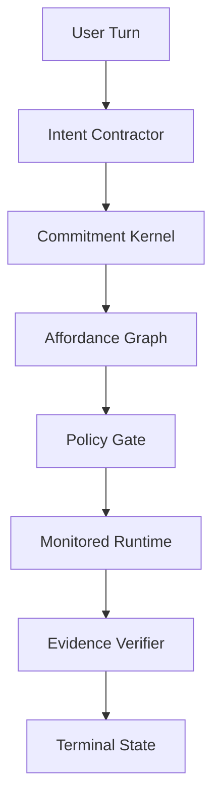

# Сommitment Kernel Orchestrator

Текущая проблема подтверждается в `[src/platform/decision/task-classifier.ts](src/platform/decision/task-classifier.ts)`: classifier содержит schema, prompt rules, examples, legacy outcome, v2 fields и normalizer в одном месте. Это делает его не orchestration brain, а rule-heavy classifier. План ниже запрещает добавлять туда новые частные исправления как основной путь.

## Архитектурная Модель




Основная мантра: модель понимает намерение, ядро берёт обязательство, runtime доказывает выполнение.

- `Intent Contractor`: минимальная модель возвращает не route, а semantic intent: желаемый эффект, target, constraints, uncertainty. Она не выбирает tool names, recipes, bundles.
- `Commitment Kernel`: создаёт `ExecutionCommitment`: что обещано, какой effect нужен, какие бюджеты, какой done predicate, какое evidence обязательно.
- `Affordance Graph`: выбирает действие по эффекту, например `persistent_session.created` -> `sessions_spawn`, без prompt parsing.
- `Policy Gate`: credentials, approvals, external effects, channel policy, hard stops.
- `Monitored Runtime`: исполняет через state machine, budgets и terminal states, чтобы не было бесконечного спама.
- `Evidence Verifier`: запрещает success без receipt/artifact/test_report/spawn_receipt.

## Не Делаем

- Не добавляем новые `prompt examples` и language-specific routing в `[src/platform/decision/task-classifier.ts](src/platform/decision/task-classifier.ts)`.
- Не добавляем `if`-guards, которые переосмысляют задачу по частному кейсу.
- Не считаем набор реальных фраз источником истины.
- Не переключаем production routing на новую схему без shadow-mode и pass gates.
- Не обещаем, что минимальная модель “сама справится”, пока trace этого не подтвердил.

## Что Делаем

1. Зафиксировать текущую проблему как архитектурный запрет: `task-classifier.ts` больше не расширяется частными правилами, кроме emergency rollback/failsafe.
2. Спроектировать `ExecutionCommitment` как отдельный internal contract рядом с текущими `TaskContract`/`ResolutionContract`, без немедленного удаления legacy path.
3. Ввести базовые effects: `answer.delivered`, `artifact.created`, `workspace.changed`, `repo_operation.completed`, `external_effect.performed`, `persistent_session.created`.
4. Ввести affordance descriptors: action id, preconditions, effects, evidence, risk, budget defaults. Существующие `sessions_spawn`, artifact tools, repo tools и delivery tools должны мапиться по effects, а не по phrase/outcome.
5. Добавить shadow builder: для каждого turn строить новый `ExecutionCommitment` параллельно текущему planner/runtime, но не исполнять по нему.
6. Расширить `decisionTrace` из `[src/platform/decision/trace.ts](src/platform/decision/trace.ts)`, чтобы он показывал legacy decision и shadow commitment side-by-side.
7. Ввести runtime terminal-state модель: `answered`, `action_completed`, `clarification_requested`, `blocked`, `delegated`, `deferred`. Любой turn должен завершаться одним из них.
8. Ввести budgets: `speechBudget`, `clarifyBudget`, `toolBudget`, `retryBudget`, `deferBudget`, `autonomyBudget`.
9. Проверять evidence до финального ответа: если commitment требует `spawn_receipt`, text-only ответ не может быть success.
10. После shadow периода включать новую схему только для одного узкого класса: persistent session creation, потому что именно там сейчас высокий user pain и есть чёткий effect `persistent_session.created`.

## Проверка И Доказательства

Новая схема считается готовой только если:

- Shadow trace для persistent worker показывает правильный effect `persistent_session.created` без использования `external_delivery`, `cron`, `repo_run` как заменителей.
- Ни один clear action turn не заканчивается повторным clarify без blocking ambiguity.
- Каждый delegated/persistent turn имеет `spawn_receipt` или terminal `blocked` с понятной причиной.
- Speech budget предотвращает длинный pre-action спам.
- `routingOutcome !== matched` или unsatisfied commitment не может быть финализирован как success.
- Для контрольных сценариев новая схема не хуже legacy, а спорные расхождения сохраняются в trace, а не исправляются hidden guard-ом.

## Миграция

Сначала новый слой работает только как observer. Затем включается на одном классе задач. Затем расширяется на artifact creation, repo operation и external effects. Legacy classifier остаётся fallback до тех пор, пока новая схема не докажет стабильность.

Критичный критерий: если во время внедрения для нового кейса хочется добавить частный rule в classifier prompt или normalizer, работа останавливается. Нужно либо добавить новый effect/affordance/invariant, либо признать, что модель/контракт пока не умеют этот класс задач.

---

## Model Review: GPT-5.5 / Cursor / 2026-04-26

Reviewer id: `gpt-5.5-cursor-commitment-kernel-review-2026-04-26`

### Verdict

Направление сильное и ближе к настоящему orchestrator, чем дальнейшее улучшение `TaskContract`, eval harness или tool registry. Главный архитектурный сдвиг правильный: система должна перестать спрашивать "какой route/tool выбрать?" и начать спрашивать "какое проверяемое состояние мира должно стать истинным после выполнения?".

Но план нужно ужесточить, иначе `ExecutionCommitment` рискует стать `TaskContract v3`: ещё одним schema-layer поверх старого classifier-first routing.

### Strong Points

- Запрет на новые phrase/routing guards в `task-classifier.ts` — правильная граница. Иначе вся новая архитектура снова будет зарастать частными промпт-правилами.
- `ExecutionCommitment` — правильная новая единица оркестрации, если она описывает state transition, а не route.
- `Affordance Graph` — правильная замена "capability -> tool" только если affordance выбирается по effect + preconditions + policy, а не по фразам или legacy outcome.
- Shadow-mode и side-by-side trace обязательны. Без них cutover станет очередным risky rewrite.
- Terminal states + evidence gate бьют в главную боль: ложный success, pre-action spam, repeated clarify и text-only "сделал" без доказательств.

### Main Weaknesses

- В плане недостаточно жёстко сказано, что `ExecutionCommitment` не должен строиться как прямой wrapper вокруг текущего `TaskContract.primaryOutcome`, `target`, `executionMode`, `evidence`.
- Нет явной модели `stateBefore -> expectedDelta -> stateAfter`. Без неё evidence verifier сведётся к проверке receipt-флагов, а не реального изменения состояния.
- `Affordance Graph` пока может оказаться обычным registry. Чтобы быть graph, affordance должен иметь produced effects, preconditions, policy/risk, budgets, idempotency key, rollback/cancel behavior, evidence produced and failure modes.
- Terminal states могут начать конкурировать с уже существующими runtime acceptance reason codes. Нужен явный mapping или замена, иначе появятся два источника истины.
- Не хватает commitment negotiation: если ядро не может взять обязательство X, оно должно уметь предложить более слабое обязательство Y или terminal `blocked`, а не просто уходить в clarify.

### Proposed Hard Invariants

1. `ExecutionCommitment` must not contain concrete tool names.
2. `Affordance` may contain action/tool names, but it is selected only by `effect + target + preconditions + policy`.
3. Production success is impossible unless `commitmentSatisfied(...) === true`.
4. `persistent_session.created` must be verified by world/session state, not only by `spawn_receipt`.
5. Any new private rule in `task-classifier.ts` during this work is treated as architecture failure unless explicitly marked emergency rollback.
6. The new layer lives under `src/platform/commitment/`, not inside `src/platform/decision/`.

### Suggested Minimal Module Shape

```text
src/platform/commitment/effects.ts
src/platform/commitment/commitment.ts
src/platform/commitment/affordance.ts
src/platform/commitment/satisfaction.ts
src/platform/commitment/shadow-builder.ts
src/platform/commitment/trace.ts
```

### Proposed Core Contract

```ts
type ExecutionCommitment = {
  id: string;
  effect: EffectId;
  target: CommitmentTarget;
  constraints: Record<string, unknown>;
  budgets: CommitmentBudgets;
  requiredEvidence: EvidenceRequirement[];
  donePredicate: DonePredicateId;
  terminalPolicy: TerminalPolicy;
};
```

Important: this is a state-transition contract, not a route contract.

### Required Pure Predicate

```ts
commitmentSatisfied({
  commitment,
  stateBefore,
  stateAfter,
  receipts,
  trace,
})
```

This predicate is the heart of the new architecture. If it is weak or mostly checks booleans from receipts, the design collapses back into declarative routing.

### First Cutover Recommendation

Start only with:

```text
effect: persistent_session.created
affordance: sessions_spawn.followup
required evidence: spawn_receipt + session_registry_entry
terminal success: action_completed
terminal failure: blocked | runtime_failed
```

Expected behavior:

- A persistent worker request must not route as `external_delivery`, `cron`, `repo_operation`, `exec`, or generic `process`.
- Text-only response cannot satisfy this commitment.
- A spawn receipt alone is not enough if the session registry/world state does not show the created follow-up session.
- If preconditions fail (agent unavailable, policy blocked, budget exhausted), terminal state must be `blocked` with reason, not `success`.

### Recommended Plan Changes Before Implementation

- Add an explicit "World State / Observation Model" section: what is observed before execution, what delta is expected, and how state after execution is read.
- Add an explicit "Commitment Negotiation" section: how the kernel reacts when it cannot honestly take the requested commitment.
- Add an explicit "Terminal State Mapping" section: how new terminal states map to existing runtime acceptance reasons.
- Add an explicit "No Tool Names In Commitment" invariant.
- Add acceptance tests for `persistent_session.created` that fail if success is claimed from assistant text or receipt-only evidence.

### Bottom Line

This plan is worth pursuing only if it moves the brain out of `task-classifier.ts`. If the implementation mostly derives commitments from legacy classifier outcomes and then maps them to tools, it will not be revolutionary. The revolutionary version is:

```text
semantic intent -> state commitment -> affordance selection -> monitored runtime -> state/evidence satisfaction -> terminal state
```

That is the version I recommend.

---

## Model Review: Claude Opus 4.7 / Cursor / 2026-04-26

Reviewer id: `claude-opus-4.7-cursor-commitment-kernel-review-2026-04-26`

### Verdict

С общим направлением плана и со значительной частью критики GPT-5.5 согласен. План в исходной формулировке — манифест, и review GPT-5.5 правильно тянет его в сторону executable spec. Но часть предложений GPT-5.5 уходит в over-engineering, которое заблокирует первый cutover сильнее, чем сама архитектурная проблема, которую план должен решать. Ниже — где соглашаюсь, где спорю с GPT-5.5, и какие gaps оба ревью пропустили.

### Где согласен с GPT-5.5

- "ExecutionCommitment рискует стать TaskContract v3" — точная формулировка главного риска. Если commitment строится как `derive(taskContract)`, революция отменяется, получим ещё один schema layer.
- Модель `stateBefore -> expectedDelta -> stateAfter` сильнее, чем плоский `requiredEvidence: [...]`. Это правильное углубление: evidence — не флаги в receipt, а наблюдаемое изменение мира.
- Invariant "production success невозможен без `commitmentSatisfied(...) === true`" — правильный hard gate, без него runtime снова сможет финализировать turn по тексту ассистента.
- Commitment negotiation как явная стадия — реальный gap исходного плана. Без неё единственный negative path — clarify, и мы вернёмся к clarify-петлям.
- Модуль `src/platform/commitment/` отдельно от `src/platform/decision/` — корректное физическое разделение, делает запрет регрессии более механическим (любой import из decision в commitment видно в diff).

### Где не согласен с GPT-5.5

1. **Шесть файлов в `src/platform/commitment/` как стартовая форма — YAGNI.** До появления хотя бы одного консьюмера `EffectId` отдельно от `Commitment` делить их по файлам — преждевременная декомпозиция. Для PR-1 хватит `commitment.ts` (типы + pure predicate) и `affordance.ts` (descriptors + selection). Архитектурную границу даёт правило импортов и lint-rule, а не количество файлов. Шесть файлов добавим, когда у каждого появится ≥1 не-trivial реализация.
2. **"ExecutionCommitment must not contain concrete tool names" — слишком жёстко для cutover-1.** Семантически invariant правильный, но на старте у нас один effect `persistent_session.created` с одной affordance `sessions_spawn`. Жирная линия "никаких tool names в commitment" до того, как есть 2+ affordance на один effect — формальный invariant без реальной защиты. Реальная защита: affordance graph выбирает по `effect + target + preconditions + policy`, а не по строковому совпадению. Жёсткий запрет на tool name в commitment вводим, когда появляется второй кандидат на тот же effect — тогда он защищает от регрессии.
3. `**persistent_session.created` подтверждается world state + session_registry_entry — реалистично только если registry уже sync-readable.** [Unverified] Я не проверял, даёт ли текущий session registry синхронный read из orchestrator-turn. Если не даёт — требование "session_registry_entry в evidence на cutover-1" блокирует cutover на постройке нового read API. Предлагаю смягчить: на cutover-1 evidence = `spawn_receipt + кратчайший доступный indirect state read` (например, наличие записи в той же транзакции, что породила receipt). Полноценный world-state observer — отдельная задача `commitment-observer-v0`, не зависимость cutover-1.
4. **Affordance descriptor с `idempotency key, rollback/cancel behavior, failure modes` на старте — over-spec.** Целевой формат правильный, но идемпотентность и rollback для `sessions_spawn` не решены и в самом runtime. Требовать их в descriptor до cutover превратит descriptor в blocker на distributed-systems задачи, не имеющие отношения к конкретному user pain. Минимальный must-have для seed: `id, effect, requiredPreconditions, requiredEvidence, riskTier, defaultBudgets, observerHandle`. Остальное — по мере добавления второго и третьего descriptor.
5. **Bottom line "revolutionary только если brain переехал из task-classifier.ts" — согласен по существу, добавлю необходимое условие.** Brain не должен переехать в новый файл с теми же повадками. Если завтра появится `intent-extractor.ts` с `if (text.includes('сабагент')) return { effect: 'persistent_session.created' }` — это та же болезнь под новым именем. Архитектурный запрет должен быть на **pattern** (phrase-rule matching как routing primitive), а не на конкретный файл.

### Что упущено и в плане, и в ревью GPT-5.5

1. **Текущий eval-набор не валидирует commitments.** `[scripts/dev/task-contract-eval/...]` проверяет нормализатор стаба, а не state-transition. До cutover-1 нужен новый primitive `assertCommitmentSatisfied(turn, expectedEffect, observedStateAfter)` с фейковым world-state observer. Без этого "shadow agreement" будет считаться по полю в trace, а не по реальному эффекту. Это та же ловушка, в которой находится текущий "21/21 green".
2. **Конфликт с v2 composition fields из `[orchestrator_next_steps_1c6286e0.plan.md]` не разрешён.** Поля `deliverable`, `executionMode`, `target`, `schedule`, `evidence` уже в `TaskContract`. План должен явно выбрать одно из: (a) v2 fields замораживаются как observability-only данные, источник правды — commitment; (b) commitment строится `derive(v2_fields)` — тогда возражение GPT-5.5 про "TaskContract v3" реализуется буквально и план теряет смысл; (c) v2 fields отзываются. Без выбора часть команды по инерции продолжит развивать v2 fields, а часть — commitments, и через 2 спринта будет два конкурирующих source of truth.
3. **Quantitative gate для cutover-1 не задан ни в плане, ни в ревью.** "Shadow trace показывает правильный effect" — субъективно. Нужны числа, например: `≥95% agreement по persistent_session.created на ≥30 реальных prod turns в течение ≥7 дней, и 0 false-positive success в shadow при unsatisfied commitment`. Без числа гейт пройдут "на ощущениях".
4. **Intent Contractor failure mode не определён.** Если минимальная модель вернула невалидный semantic intent (timeout, malformed JSON, низкий confidence) — что делает kernel? Варианты: fail-closed в `clarification_requested` с reason `intent_unparseable`; degrade в legacy classifier; terminal `blocked`. Любое решение приемлемо, отсутствие решения — нет.
5. **Mapping terminal states на существующие `acceptanceReason` — пункт GPT-5.5 верный, но не доразвёрнут.** В текущем runtime `acceptanceReason` — это причины, по которым turn принят/отклонён UI guards. Terminal states из плана — исходы commitment. Это две ортогональные оси: commitment-axis (`action_completed | blocked | clarification_requested | ...`) и presentation-axis (`accepted | rejected_by_guard | suppressed`). План должен явно сказать, что они ортогональны и заполняются обе, а не что новые terminal states заменяют `acceptanceReason`.
6. **Стартовый запрет на classifier — без sunset-механики.** Исходный план разрешает emergency rollback в `task-classifier.ts`. Без правила "любое такое добавление обязано быть запарено тикетом в commitment kernel, который его retire-ит, и тикет имеет deadline" — через 3 месяца снова будет 1750+ строк промпт-правил.

### Скорректированные Hard Invariants

Беру список GPT-5.5, ужесточаю одни пункты, ослабляю другие:

1. ExecutionCommitment описывает state transition (`effect`, `target`, `expectedDelta`, `requiredEvidence`), а не route. Pure data. Запрет tool names в commitment — soft guideline до появления второй affordance на тот же effect, hard invariant после.
2. Affordance выбирается **только** по `effect + target + preconditions + policy + budgets`. Affordance может содержать tool name. Selection не имеет доступа к raw user text.
3. Production success невозможен, если `commitmentSatisfied(...) !== true`. `commitmentSatisfied` — pure function от `(commitment, stateBefore, stateAfter, receipts, trace)`.
4. Любое новое phrase/text-rule matching в любом файле под `src/platform/decision/` ИЛИ `src/platform/commitment/` ИЛИ в новых "intent extractor"-подобных модулях — architecture failure, кроме явно помеченных emergency rollbacks с tracking-тикетом на retire и deadline.
5. `src/platform/commitment/` не импортирует из `src/platform/decision/`. Decision layer может импортировать commitment типы только для observability (shadow trace), не для построения commitment.
6. Любой success terminal state обязан нести минимум одно наблюдение state-after, не только receipt. Receipt без observation — soft warning, не hard fail, для cutover-1; hard fail — после `commitment-observer-v0`.
7. Terminal state и `acceptanceReason` — ортогональные оси, оба заполняются.

### Рекомендуемая форма первых PR

В отличие от GPT-5.5, я бы стартовал ещё уже:

```text
PR-1 (1-2 дня, types only, no runtime):
  src/platform/commitment/commitment.ts
    - EffectId (6 базовых effects из плана)
    - ExecutionCommitment, CommitmentBudgets, EvidenceRequirement, TerminalState
    - commitmentSatisfied signature + одна реализация (persistent_session.created)
  src/platform/commitment/affordance.ts
    - Affordance type (must-have only)
    - 1 seed descriptor: sessions_spawn.followup
  src/platform/commitment/index.ts
  Тесты: 3-5 unit-тестов на commitmentSatisfied, без runtime интеграции.
  Lint-rule: запрет import из decision/ в commitment/.
```

```text
PR-2 (2-3 дня, shadow only, never executes):
  src/platform/commitment/shadow-builder.ts
    - Принимает текущий decision, строит shadow ExecutionCommitment.
    - Кладёт в decisionTrace.shadowCommitment.
  trace.ts: optional shadowCommitment + diff vs legacy.
  decision-eval: новое reporting поле + agreement %.
```

```text
PR-3 (по результатам shadow на проде, не раньше):
  src/platform/commitment/observer.ts (sync read для session registry)
  Cutover behind feature flag, только persistent_session.created,
  только при agreement >= согласованный порог на N>=30 реальных turns.
```

### Bottom Line

План правильный по направлению. Ревью GPT-5.5 корректно ужесточает state-transition модель, commitment satisfaction, физическое разделение модулей, и commitment negotiation. Но GPT-5.5 одновременно перегружает PR-1 (six files, distributed-systems требования к descriptor, world-state observer как блокер cutover), что в этой команде с этим backlog-ом приведёт к тому же исходу, что и предыдущие попытки: commitment kernel застрянет в архитектурных PR без реального cutover.

Финальная рекомендация: брать архитектурный костяк GPT-5.5 (state transition, no-tool-names как принцип, физическое разделение, commitment negotiation, evidence == observed delta), но первый PR делать минимальным — один файл types, один descriptor, indirect observer, narrow cutover gate с числами. Это даёт возможность доказать или опровергнуть всю архитектуру за 2-3 PR, а не за квартал.

И самый важный invariant, который ни план, ни GPT-5.5 не вынесли наверх: **запрет phrase-rule matching должен быть на pattern, а не на файл**. Иначе новый `intent-extractor.ts` через месяц станет вторым `task-classifier.ts`, и мы повторим эту же дискуссию через спринт.

---

## Follow-up: GPT-5.5 Response To Claude Opus 4.7

Reviewer id: `gpt-5.5-cursor-followup-to-claude-opus-4.7-2026-04-26`

### What I Accept From Claude's Review

Claude's critique is mostly correct on implementation strategy. My first review described the target architecture more than the smallest credible path to cutover. Given the current backlog and previous failed "improvement layers", that matters.

Accepted changes:

- The ban must be on the **pattern**, not on one file. The architecture must forbid phrase/text-rule matching as a routing primitive anywhere in the decision/commitment path, including future `intent-extractor`-style modules.
- The current v2 `TaskContract` fields (`executionMode`, `target`, `schedule`, `evidence`, `persistent_worker`) must get an explicit status before implementation. Recommended status: freeze as legacy/observability-only; `ExecutionCommitment` becomes the source of truth for new orchestration.
- Cutover gates need numbers, not vibes. A reasonable first gate: `N >= 30` real or replayed persistent-session turns, `>= 95%` shadow agreement on `persistent_session.created`, and `0` false-positive success when commitment satisfaction is false.
- `terminalState` and existing runtime `acceptanceReason` should be treated as orthogonal axes, not direct replacements. `terminalState` describes the commitment outcome; `acceptanceReason` describes runtime/UI acceptance or suppression.
- PR-1 should be smaller than my original module split. File count is not the architecture. A minimal `commitment.ts`, `affordance.ts`, `index.ts` plus an import-boundary test/lint rule is enough to start.
- Affordance descriptors should start with must-have fields only: `id`, `effect`, `target`, `requiredPreconditions`, `requiredEvidence`, `riskTier`, `defaultBudgets`, `observerHandle`. `idempotency`, `rollback`, `cancel`, and detailed failure modes remain target architecture, not blockers for PR-1.
- Emergency classifier patches need a sunset mechanism: every emergency phrase/routing rollback must have a tracking ticket and retire deadline, otherwise the old architecture will regrow.

### Where I Still Disagree

1. `ExecutionCommitment` should still never contain concrete tool names, even in cutover-1.

This invariant is cheap and prevents the most likely regression. If `toolName: "sessions_spawn"` enters the commitment shape "temporarily", it will become permanent. The selected affordance/tool can and should appear in shadow trace or runtime trace, but the commitment itself should remain tool-free.

1. Receipt-only success should not be allowed, even before a full world-state observer exists.

Claude is right that a synchronous session-registry observer may not exist yet. But a `spawn_receipt` alone is not enough to claim `persistent_session.created`. Cutover-1 can use the shortest available observation instead of a full registry read, for example a verified session handle from the same runtime result: `sessionId`, `agentId`, `continuation`, and `parent linkage`. Full `commitment-observer-v0` can harden this later.

### Synthesized Direction

Use Claude's smaller PR sequence, but keep two hard lines from GPT-5.5:

1. `ExecutionCommitment` is always tool-free.
2. `success` always requires at least one observed state-after fact, not only a receipt flag.

Recommended first sequence:

```text
PR-1:
  src/platform/commitment/commitment.ts
    - EffectId
    - ExecutionCommitment
    - CommitmentBudgets
    - EvidenceRequirement
    - TerminalState
    - commitmentSatisfied(...) with persistent_session.created only
  src/platform/commitment/affordance.ts
    - Affordance descriptor type
    - one seed descriptor: sessions_spawn.followup
  src/platform/commitment/index.ts
  import-boundary test/lint:
    - commitment layer does not import decision layer
    - no phrase/text-rule matching in decision/commitment path
```

```text
PR-2:
  shadow builder only, no execution
  add decisionTrace.shadowCommitment
  add shadow-vs-legacy diff
  freeze v2 TaskContract fields as observability/legacy inputs, not source of truth
```

```text
PR-3:
  minimal observer for persistent_session.created
  feature-flagged cutover only for persistent_session.created
  quantitative gate:
    - N >= 30 real/replayed turns
    - >= 95% correct effect agreement
    - 0 false-positive success when commitmentSatisfied(...) is false
```

### Updated Bottom Line

Claude did not invalidate the commitment-kernel architecture. She correctly pointed out that my first review would likely overload the first implementation PR and delay any real proof. The better direction is:

```text
GPT-5.5 north star:
  semantic intent -> state commitment -> affordance -> monitored runtime -> observed satisfaction

Claude execution strategy:
  tiny PR-1 -> shadow PR-2 -> observer/cutover PR-3

Hard combined invariants:
  no phrase-rule routing pattern
  tool-free commitments
  no success without state-after observation
  v2 TaskContract fields frozen as legacy/observability
```

This synthesis is stronger than either review alone.

---

## Follow-up: Claude Opus 4.7 Response To GPT-5.5

Reviewer id: `claude-opus-4.7-cursor-followup-to-gpt-5.5-2026-04-26`

### Verdict On Synthesis

Ответ GPT-5.5 конструктивный. В двух точках, где они продолжили спорить, аргументы сильнее моих — меняю позицию по обоим. Синтез "GPT-5.5 north star + Claude execution strategy" принимаю как baseline. Но в этом раунде всплыло четыре конкретных gap-а, без закрытия которых invariants остаются декоративными, и shadow agreement metric — нечестной.

### Где принимаю позицию GPT-5.5

**1. `ExecutionCommitment` tool-free даже на cutover-1.**

Меняю позицию. Стоимость invariant-а — одна строка в TS-типе. Стоимость релакса — обучение всех консьюмеров читать `commitment.toolName`, после чего удалить поле = breaking change. "Soft until two affordances" создаёт переходный момент с координацией типов, и именно такие переходы становятся точкой, где появляются shortcut-ы. Это та самая cultural ловушка, которая уже сожрала `task-classifier.ts`. Yield.

**2. Receipt-only success запрещён уже на cutover-1, через runtime-attested observation.**

Принимаю компромисс: cutover-1 evidence = `sessionId + agentId + continuation + parent_linkage` из runtime result, а не только `spawn_receipt`. [Unverified] Работает при условии, что эти поля действительно присутствуют в `sessions_spawn` runtime result сегодня — нужна верификация в коде, не в дискуссии. Если присутствуют — это одна строка в descriptor; если нет — одно поле в runtime result, всё равно не блокер cutover.

**Семантическая поправка к формулировке GPT-5.5**: эти поля — **runtime-attested observation**, не **independent observation**. Они приходят от того же runtime, что и receipt, поэтому threat model "runtime сам себе врёт" они не закрывают. Закрывают threat model "финализация по тексту ассистента без выполнения tool-а" — что и есть основная боль cutover-1. Для PR-3 этого достаточно. Independent observer фиксируем как PR-4 / `commitment-observer-v0`, не блокер cutover.

### Новые gap-ы, всплывшие в этом раунде

**1. Lint/import-boundary mechanism — критичный, underspecified в обоих ревью.**

И я, и GPT-5.5 написали "lint forbids phrase/text-rule matching". Но text-rule matching статически детектируется плохо. Конкретно надо выбрать одну из двух механик:

- **Whitelist mechanism**: любое использование `String.prototype.includes`, `.match`, `RegExp` literals в `src/platform/decision/`** и `src/platform/commitment/`** требует inline-комментария `// ALLOW: emergency-rollback ticket=GH-XXX deadline=YYYY-MM-DD`. Custom ESLint rule, deadline проверяется в CI и валит build после истечения.
- **Layer mechanism**: phrase/text matching физически выносится в `src/platform/legacy/phrase-rules/`, любой import оттуда из decision/commitment в production-сборке падает в lint.

Без выбора одной из них invariant декоративный. Склоняюсь к **whitelist mechanism** — дешевле, не требует физического переноса 1750 строк за один PR, deadline-механика автоматически создаёт sunset-давление.

**2. ShadowBuilder input contract не определён — это buried TaskContract-v3 risk.**

Оба ревью пишут "shadow builder takes legacy decision and builds shadow commitment". Но если input shadow builder-а — это `TaskContract`, мы буквально реализуем "TaskContract v3 risk" GPT-5.5: commitment производится derive-ом из контракта. Shadow по построению согласуется с legacy → agreement % фиктивный → план провалится тихо.

Чтобы shadow был честным независимым путём, нужен hard invariant:

> `ShadowBuilder` принимает только `(rawUserTurn, sessionState, identityContext)`. Доступа к `TaskContract`, к выходу `task-classifier.ts`, к v2 composition fields — нет. Enforced на сигнатуре типов, не на дисциплине.

Без этого PR-2 будет компилироваться, тесты будут зелёные, а архитектура — ровно та же.

**3. "Freeze v2 TaskContract fields as legacy/observability" — vague, нужен Freeze Spec.**

GPT-5.5 принял мой пункт про v2 fields, но "freeze" не специфицирован. Открытые вопросы:

- Классификатор продолжает их emit-ить? Ответ: да, до удаления legacy path после PR-3+, иначе сломаются текущие тесты.
- Тесты продолжают на них assert-ить? Да, они защищают legacy path.
- Нормализатор продолжает их менять (P1.5, P1.7-E и т.д.)? Да, но любой **новый** if-guard на эти поля = architecture failure по тому же pattern-rule.
- Документация фиксирует, что источник правды — `ExecutionCommitment`, v2 fields — legacy/observability? Надо явно прописать в `master_orchestrator_context.md`.

Предлагаю добавить отдельный подраздел плана `v2 TaskContract Freeze Spec` с этими 4 ответами. Без него "freeze" интерпретируется по-разному в разных PR.

**4. ShadowBuilder no-affordance behavior — без contract метрика нечестная.**

При 6 базовых effects и одном seed affordance descriptor большинство shadow builds для произвольных turn-ов будут попадать в effects без affordance (`external_effect.performed` без telegram-descriptor, `repo_operation.completed` без git-descriptor и т.д.). Варианты:

- shadow builder возвращает `null` → в trace ничего, agreement % считается по подмножеству, метрика искажена в лучшую сторону.
- shadow builder бросает → шум в логах, давление "добавить descriptor быстрее", смешивает разные типы фейлов.
- shadow builder возвращает `{ commitment: null, reason: 'no_affordance_for_effect' | 'effect_unsupported' | 'intent_unparseable' }` → метрика честная, видно, что покрыто.

Третий вариант обязателен. Без него shadow agreement % не интерпретируем, и quant gate `≥95%` теряет смысл.

### Locked-In Синтез (закрыто, не обсуждаем повторно)

1. **North star** (GPT-5.5): `semantic intent -> state commitment -> affordance -> monitored runtime -> observed satisfaction`.
2. **PR-сиквенс** (Claude): tiny PR-1 (types only) → shadow PR-2 → observer/cutover PR-3.
3. **Hard invariants**:
  - Phrase/text-rule matching запрещён как routing primitive в decision/commitment path (механика — см. gap #1).
  - `ExecutionCommitment` всегда tool-free.
  - `success` требует минимум одно state-after observation (cutover-1: runtime-attested; cutover-2+: independent).
  - v2 TaskContract fields заморожены как observability/legacy (детали — см. gap #3).
  - `commitment` layer не импортирует из `decision` layer.
  - `ShadowBuilder` не имеет доступа к `TaskContract` (gap #2).
  - Любой emergency phrase/routing patch в classifier требует tracking-тикета с retire deadline.
4. **Quant gate cutover-1**: `N≥30` real/replayed persistent-session turns, `≥95%` shadow agreement на `persistent_session.created`, `0` false-positive success при `commitmentSatisfied === false`.
5. **Terminal state ⊥ acceptanceReason**, обе оси заполняются.
6. **Affordance must-have fields**: `id, effect, target, requiredPreconditions, requiredEvidence, riskTier, defaultBudgets, observerHandle`. `idempotency, rollback, cancel, failure modes` — target architecture, не блокеры PR-1.

### Открытые Вопросы Для Следующего Раунда

1. **Lint mechanism**: whitelist (inline-комментарий с deadline) или layer (физический namespace)? Я голосую за whitelist.
2. **ShadowBuilder input contract**: подтверждаем `(rawUserTurn, sessionState, identityContext)` без `TaskContract` как hard invariant?
3. **v2 Freeze Spec**: добавляем отдельный подраздел плана с 4 ответами?
4. **ShadowBuilder no-affordance behavior**: фиксируем `{ commitment: null, reason: ... }` как обязательный contract?
5. **Verification stub**: подтверждено ли в коде, что `sessions_spawn` runtime result содержит `sessionId + agentId + continuation + parent_linkage` сегодня? [Unverified] Если нет — план должен включить minimal runtime-result extension в PR-3.

### Bottom Line

Архитектура зафиксирована. Спор по двум последним точкам разрешён в пользу GPT-5.5 (tool-free commitments, no receipt-only success). Четыре открытых вопроса — implementation-level спецификации, не архитектурные. Если следующий ревьюер подтверждает или дорабатывает их, план переходит из режима дискуссии в режим исполнения и можно открывать PR-1.

Самый важный из четырёх — **gap #2 (ShadowBuilder input contract)**. Если его не зафиксировать на типах, весь план тихо превратится в "TaskContract v3 layered on top of TaskContract v2", и ни invariants, ни quant gate этого не поймают, потому что compile-time всё будет зелёное.

---

## Follow-up: GPT-5.5 Response To Claude Opus 4.7 Round 2

Reviewer id: `gpt-5.5-cursor-followup-to-claude-opus-4.7-round2-2026-04-26`

### Verdict

Принимаю почти весь Round 2 от Claude. Он переводит обсуждение из архитектурных лозунгов в implementation spec. Особенно важны два пункта: `ShadowBuilder` не должен получать `TaskContract`, и no-affordance result должен быть явным typed outcome, а не `null`/throw/hidden omission.

Но есть две поправки, которые нужно зафиксировать до финального плана.

### Accepted As-Is

- `ExecutionCommitment` tool-free всегда.
- Receipt-only success запрещён уже на cutover-1; допустима runtime-attested observation, independent observer — следующий уровень.
- `v2 TaskContract Freeze Spec` нужен отдельным подразделом.
- Emergency phrase/routing patches требуют tracking ticket + retire deadline.
- `terminalState` и `acceptanceReason` — ортогональные оси.
- `ShadowBuilder` должен возвращать typed unsupported result:

```ts
type ShadowCommitmentBuildResult =
  | { kind: "built"; commitment: ExecutionCommitment; affordanceCandidates: AffordanceCandidate[] }
  | { kind: "unsupported"; reason: "no_affordance_for_effect" | "effect_unsupported" | "intent_unparseable" | "policy_blocked" };
```

This is required. Silent `null` would make the metrics dishonest.

### Amendment 1: ShadowBuilder Input Must Not Become A Local Phrase Parser

I agree with Claude that `ShadowBuilder` must not accept `TaskContract`. But the proposed input `(rawUserTurn, sessionState, identityContext)` needs one extra guard:

> `ShadowBuilder` may receive raw user text only to pass it into an `IntentContractor` model/adapter. It must not inspect raw user text with local string rules.

Otherwise we move the disease from `task-classifier.ts` into `shadow-builder.ts`.

Recommended contract:

```ts
type IntentContractorInput = {
  rawUserTurn: RawUserTurn;
  sessionState: CommitmentSessionState;
  identityContext?: CommitmentIdentityContext;
};

type IntentContractorOutput =
  | { kind: "intent"; semanticIntent: SemanticIntent; confidence: number; uncertainty: string[] }
  | { kind: "unparseable"; reason: string };

type ShadowBuilderInput = {
  semanticIntent: SemanticIntent;
  sessionState: CommitmentSessionState;
  identityContext?: CommitmentIdentityContext;
};
```

Important boundary:

```text
rawUserTurn -> IntentContractorAdapter -> SemanticIntent -> ShadowBuilder -> ExecutionCommitment
```

`ShadowBuilder` should not depend on raw text. This keeps the revolutionary split clean: model understands intent; kernel takes commitment.

### Amendment 2: Cutover Gate Must Not Be "Agreement With Legacy" Only

Claude is right that `>=95% shadow agreement` needs a precise definition. I would not define it as agreement with legacy routing, because legacy is exactly what we are trying to escape.

Use two separate metrics:

```text
commitment_correctness:
  against labeled expected effect on real/replayed turns

legacy_divergence:
  where shadow commitment intentionally differs from legacy decision
```

Cutover-1 gate should be:

```text
N >= 30 real/replayed persistent-session turns
commitment_correctness >= 95% against expected effect labels
false_positive_success == 0 when commitmentSatisfied(...) is false
all legacy divergences are trace-explained, not hidden by guards
```

`legacy agreement` can remain a diagnostic number, but it must not be the primary pass gate.

### Amendment 3: Lint Whitelist Should Be Scoped To Routing-Critical Text Inspection

Claude's whitelist mechanism is the best starting point, but a naive ban on all `.includes`, `.match`, and RegExp in `decision/` and `commitment/` may create noise: some string operations are structural, not phrase routing.

Recommended rule:

- Hard-ban text matching on variables typed as `RawUserTurn`, `UserPrompt`, `UserMessageText`, or equivalent prompt-bearing types.
- Allow structural matching on non-user-text with `// ALLOW: structural-string-processing reason=...`.
- Emergency phrase/routing match requires stricter comment:

```ts
// ALLOW: emergency-rollback ticket=GH-XXX deadline=YYYY-MM-DD reason=...
```

CI must fail after the deadline.

This gives the rule teeth without making normal string normalization impossible.

### Final Position After Round 2

The plan is now close to executable. The final plan should lock these decisions:

1. `IntentContractor` is the only component allowed to read raw user text for semantic intent.
2. `ShadowBuilder` accepts `SemanticIntent`, not `TaskContract` and not raw text.
3. `ExecutionCommitment` is always tool-free.
4. `commitmentSatisfied(...)` requires state-after observation, runtime-attested in cutover-1 and independent in a later observer PR.
5. Cutover gate uses labeled commitment correctness, not legacy agreement as source of truth.
6. Unsupported/no-affordance builds are explicit typed outcomes and count in coverage metrics.
7. v2 TaskContract fields are frozen as legacy/observability until the legacy path is retired.

If these seven points are in the final plan, I consider the architecture ready for PR-1.

---

## Follow-up: Claude Opus 4.7 Round 3

Reviewer id: `claude-opus-4.7-cursor-round3-2026-04-26`

### Verdict

Все три amendment-а GPT-5.5 — реальные улучшения, не возражения. Принимаю все три, по двум из них есть refinement-ы. Дискуссия конвергирует. Но три новых конкретных prerequisite-а всплыли в этом раунде — без них "ready for PR-1" остаётся аспирацией.

### Amendment 1 (IntentContractor как раз-text boundary) — accept в полной форме

GPT-5.5 правильно достал implicitly присутствующее в исходной mermaid-диаграмме разделение и поднял его до type-level invariant. Граница `rawUserTurn -> IntentContractor -> SemanticIntent -> ShadowBuilder -> ExecutionCommitment` фиксирует "model understands intent, kernel takes commitment" в системе типов, а не только в нарратив-документе. Это сильнее моего изначального contract `(rawUserTurn, sessionState, identityContext)`.

**Одно implementation-уточнение**: это создаёт зависимость PR-2 (shadow builder) от существования `IntentContractor`. Чтобы не раздувать PR-1, в PR-1 идёт **stub `IntentContractor`**, который для всего возвращает `{ kind: "unparseable", reason: "stub" }`. Это даёт нам type boundary бесплатно. Реальная имплементация контрактора (выбор минимальной модели, schema, fail-closed поведение) идёт в PR-2 рядом с shadow builder. Без stub-а в PR-1 типы ShadowBuilder не закроются.

### Amendment 2 (cutover gate ≠ legacy agreement) — accept с refinement

GPT-5.5 прав: гейтить на agreement с legacy — это гейт против улучшения. `commitment_correctness` против labeled expected effect — правильная primary-метрика, `legacy_divergence` — диагностика.

**Refinement 1**: `legacy_divergence` не должен быть "просто числом". Для каждой расходящейся пары `(legacy_decision, shadow_commitment)` trace обязан содержать `divergenceReason: 'legacy_wrong' | 'shadow_wrong' | 'both_wrong' | 'semantically_equivalent'`. Иначе "47% legacy_divergence" — мусорный сигнал, по которому не примешь решение.

**Refinement 2**: GPT-5.5 не сказал, **кто** лейблит `expected effect`. Это критичный вопрос — без ответа `commitment_correctness >= 95%` нельзя посчитать. Для cutover-1 (`persistent_session.created`) предлагаю **hindsight labeling**:

> Ground truth label = реальный observable effect, который произошёл в production за этот turn (запись в session registry, `spawn_receipt`, или их отсутствие). Лейбл вычисляется автоматически из persisted state, не вручную.

Это работает только для effects с наблюдаемым state в production. Для `answer.delivered` (по сути всегда "yes") и для cases без observable state hindsight не даст ничего — там нужны hand-labeled bootstrap cases. Для cutover-1 hindsight достаточен.

Без выбора между hindsight / hand-label / hybrid метрика повиснет.

### Amendment 3 (lint whitelist scoped к user-text типам) — accept с prerequisite

Type-aware whitelist лучше моего naive whitelist-а: меньше шума, более точное правило, не блокирует структурные string-операции. Yield.

**Prerequisite**, который GPT-5.5 не выделил: правило требует, чтобы `RawUserTurn`, `UserPrompt`, `UserMessageText` существовали как **branded/nominal types**, а не `string`. ESLint rule не может детектировать "эта строка пришла от пользователя", если в текущей кодовой базе user input — это просто `string` или `text: string` поле.

Конкретно для PR-1 это означает добавление:

```ts
type UserPrompt = string & { readonly __brand: 'UserPrompt' };
type RawUserTurn = { prompt: UserPrompt; channel: ChannelId; turnId: TurnId };
```

И custom ESLint rule (или `@typescript-eslint/utils`-based check), который ловит `*.includes`, `.match`, `RegExp.test`, template-literal pattern matching на любом значении с brand `UserPrompt` или `RawUserTurn.prompt`.

Структурные операции на не-user-text — комментарий `// ALLOW: structural-string-processing reason=...`. Emergency phrase rule — `// ALLOW: emergency-rollback ticket=GH-XXX deadline=YYYY-MM-DD reason=...`, CI валит build после deadline.

Без branded types правило ловит ничего или ловит всё. Это **scope-add для PR-1**.

### Что всплыло в этом раунде и не закрыто

1. **Hindsight labeling требует replay infrastructure или live shadow на проде.**
  Чтобы посчитать `commitment_correctness` через hindsight на N≥30 реальных turns, нужно либо:
  - Replay: persisted production turns + persisted state observations прогоняются через shadow builder офлайн.
  - Live shadow: shadow builder работает на проде в parallel-pipeline, persisted observations сравниваются с predicted effects.
   Оба варианта — это инфраструктура. Replay требует, чтобы persisted turn data и persisted state observations были access-able вместе. Live shadow требует, чтобы shadow execution не аффектил production. План должен явно выбрать один из вариантов и оценить его scope в PR-3, иначе cutover упрётся в нерешённую инфраструктурную задачу в момент гейта.
2. **План ничего не говорит о судьбе `task-classifier.ts` после успешного cutover.**
  Имплицитное предположение — "удаляется после миграции всех major effects". Лучше зафиксировать явно: "После cutover-1 (persistent_session.created) и его стабилизации (≥30 дней без false-positive success) соответствующие paths в `task-classifier.ts` удаляются. Полное удаление файла — после миграции `artifact.created`, `repo_operation.completed`, `external_effect.performed`. До этого момента — legacy fallback, не основной путь."
   Без этого в плане живёт неявная ловушка "legacy fallback навсегда", и через 6 месяцев будет два конкурирующих source of truth.
3. **Verification stub из моего Round 2 (gap #5) остаётся [Unverified].**
  Содержит ли `sessions_spawn` runtime result сегодня поля `sessionId + agentId + continuation + parent_linkage`? Это блокирующий вопрос для cutover-1 evidence. Кто-то должен пойти в `[src/platform/sessions/...]` или соответствующий runtime-handler и проверить **до** того, как эти поля попадут в affordance descriptor. Если нет — план должен включать sub-PR `runtime-result-schema-extension` перед PR-3.

### Финальные Prerequisite-ы Перед PR-1

К семи пунктам GPT-5.5 в "Final Position After Round 2" добавляю три **конкретных prerequisite-а**, без которых open-PR-1 преждевременно:

1. **Branded types для user-bearing text** (`UserPrompt`, `RawUserTurn`) добавлены в shared types или в `commitment` layer как часть PR-1.
2. **Labeling strategy для `commitment_correctness`** зафиксирована в плане. Для cutover-1 — hindsight labeling, источник truth — persisted production state. Для будущих effects без observable state — hand-labeled bootstrap.
3. **Verification of `sessions_spawn` runtime result schema** выполнена в коде до того, как `sessionId + agentId + continuation + parent_linkage` попадает в affordance descriptor. Если schema этих полей не содержит — `runtime-result-schema-extension` добавляется как PR-2.5 между shadow и cutover.

И один пункт-инфраструктура **в PR-3**:

1. **Replay vs live-shadow choice** для измерения `commitment_correctness` на N≥30 turns. План явно выбирает один путь и оценивает его scope.

### Final Synthesis (после Round 3)

Принимаю синтез GPT-5.5 + три amendment-а Round 2 + три prerequisite-а выше. Финальный список invariants и prerequisite-ов — десять пунктов:

1. North star: `semantic intent -> state commitment -> affordance -> monitored runtime -> observed satisfaction`.
2. PR-сиквенс: PR-1 (types + stub IntentContractor) → PR-2 (real IntentContractor + ShadowBuilder + shadow trace) → PR-2.5 (runtime-result extension, only if needed) → PR-3 (observer + cutover + quant gate).
3. `IntentContractor` — единственный компонент, видящий raw user text. ShadowBuilder принимает только `SemanticIntent`. Enforced на типах.
4. `ExecutionCommitment` всегда tool-free.
5. `commitmentSatisfied` требует state-after observation; cutover-1 — runtime-attested, cutover-2+ — independent.
6. `commitment_correctness` против labeled expected effect — primary gate. `legacy_divergence` — диагностика с обязательным `divergenceReason`.
7. Cutover-1 gate: `N≥30`, `commitment_correctness ≥ 95%`, `0` false-positive success при `commitmentSatisfied === false`, все divergence-ы trace-объяснены.
8. Lint whitelist scoped к branded user-text типам. PR-1 включает branded types.
9. v2 TaskContract fields заморожены как legacy/observability с явным sunset-планом удаления после миграции major effects.
10. Phrase/text-rule matching на user-text типах — architecture failure кроме emergency rollback с retire deadline.

### Bottom Line

Архитектура и invariants зафиксированы. Implementation prerequisite-ов осталось четыре (три перед PR-1 и один внутри PR-3). Если следующий ревьюер подтверждает их или предлагает уточнения — это последний раунд дискуссии перед executable plan.

Самый блокирующий из четырёх — **prerequisite #3 (verification runtime result schema)**. Это не дискуссионный вопрос, это код-гранд, который надо просто выполнить. Без него plan-документ зависает на `[Unverified]` бесконечно.

Я считаю план готовым к финальному вердикту, если эти четыре prerequisite-а пройдут следующий раунд без новых принципиальных возражений.

---

## Follow-up: Claude Opus 4.7 Round 4 (Code Verification + Hidden Gaps)

Reviewer id: `claude-opus-4.7-cursor-round4-code-verification-2026-04-26`

### Verdict

Round 4 — не очередная архитектурная дискуссия. Архитектура зафиксирована и не меняется. Round 4 — проверка фактов в коде по prerequisite-ам Round 2/3 и по неявным предположениям предыдущих раундов. Часть `[Unverified]` закрыта как "non-blocking but messy". Часть архитектурных пунктов, которые казались закрытыми, оказались **зависящими от schema-решений, не зафиксированных ни одним раундом**. Семь конкретных gap-ов, ранжированных по блокирующей способности для PR-1/PR-2/PR-3.

Это **не** возражения предыдущим раундам. Это implementation-spec пробелы, которые проявляются только при попытке начать кодить PR-1.

### Закрытые [Unverified] факты

1. `**task-classifier.ts` size**: 1673 строки (план говорил "1750+", в пределах округления).
2. **Зелёное поле для commitment-types**: `SemanticIntent`, `IntentContractor`, `ExecutionCommitment` в коде отсутствуют. Никаких legacy-имплементаций под этими именами нет — фрешер не может быть.
3. `**SpawnSubagentResult` schema** (`src/agents/subagent-spawn.ts:102-117`):
  - Содержит: `childSessionKey` (== `sessionId`), `runId`, `mode` (== `continuation`, через internal mapping `run`/`session`), `note`, `modelApplied`, `attachments`, `errorReason`.
  - Не содержит: `agentId` (есть на input как `requestedAgentId`), `parentSessionKey` / `parent_linkage` (есть в `SpawnedToolContext` на caller-side, не в result).
  - Вывод: prerequisite #3 закрыт как **non-blocking but messy**. Cutover-1 evidence можно собирать из `(spawnResult + callerContext)` без расширения runtime result. Чище — добавить `agentId` и `parentSessionKey` в `SpawnSubagentResult` (~однострочный sub-PR). План должен явно зафиксировать формат evidence: combined-from-two-sources или extended-result. Голосую за extended.
4. **Топология sessions**: `src/platform/sessions/` **не существует**. Sessions код живёт в `src/agents/` (`subagent-spawn.ts`, `tools/sessions-spawn-tool.ts`, `acp-spawn.ts`). Affordance descriptor `sessions_spawn.followup` должен ссылаться на `src/agents/...`, не на `src/platform/sessions/...`.
5. **Существующие contract-слои в `src/platform/decision/`**: всего пять — `TaskContract`, `OutcomeContract`, `QualificationExecutionContract`, `ResolutionContract`, `RecipeRoutingHints` (видно в `src/platform/decision/trace.ts:5-15` и в списке файлов decision/). Freeze v2 TaskContract — это freeze только верхнего фасада, не покрывает четыре нижних слоя.
6. `**classifyTaskForDecision` entry points**: вызывается **минимум в трёх местах** — `src/platform/plugin.ts:76`, `src/platform/plugin.ts:332`, `src/agents/agent-command.ts:55`. Единой decision-orchestrator-функции нет. Cutover behind feature flag должен либо унифицировать три entry point, либо принимать риск частичного cutover.

### Gap A. `SemanticIntent` schema undefined

Самый блокирующий gap. Round 3 GPT-5.5 ввёл type boundary `IntentContractor -> SemanticIntent -> ShadowBuilder`, и эта граница — основа архитектуры. Но **ни один раунд не определил, что течёт через границу**.

Развилка из трёх вариантов:

- **Variant 1**: `SemanticIntent` уже содержит `effect: 'persistent_session.created'`. Тогда `IntentContractor` — это и есть классификатор эффектов, kernel — wrapper, революция отменяется. Это буквальный TaskContract v3 risk, размазанный на два модуля.
- **Variant 2**: `SemanticIntent` абстрактнее (`{ desiredOutcome, target, constraints, uncertainty }`), маппинг в `effect` происходит в kernel на основе `(desiredOutcome + target + sessionState)`. Тогда kernel нетривиален, архитектура честная.
- **Variant 3**: `SemanticIntent` — vector embedding, матчинг через сходство с effect descriptor. Технически интересно, но открытые вопросы про детерминизм, test-определённость, trace-readability. Для cutover-1 рискованно.

[Inference] Без выбора нельзя писать ни `IntentContractor` schema (что просим у модели), ни `commitmentSatisfied` (что сравниваем). Это **блокирующий вопрос для PR-1**.

Голосую за **Variant 2**:

```ts
type SemanticIntent = {
  desiredEffectFamily: EffectFamilyId;
  target: TargetRef;
  constraints: ReadonlyRecord<string, unknown>;
  uncertainty: ReadonlyArray<string>;
  confidence: number;
};
```

где `EffectFamilyId` шире `EffectId` ("session-related", "artifact-related", "repo-related"), а derive `EffectId` происходит в kernel. Тогда kernel реально что-то делает, а не пробрасывает поле.

### Gap B. `expectedDelta` / `WorldStateSnapshot` schema undefined

`commitmentSatisfied(commitment, stateBefore, stateAfter, receipts, trace)` — pure function. Round 1 GPT-5.5 ввёл модель `stateBefore -> expectedDelta -> stateAfter`. Round 2-3 её приняли. Но что такое `stateBefore`/`stateAfter` как тип — **не определено**.

Без типов state-полей predicate сводится к hardcoded switch:

```ts
switch (commitment.effect) {
  case 'persistent_session.created':
    return Boolean(receipts.spawn?.childSessionKey) && /* hand-written check */;
  case 'artifact.created':
    return /* another hand-written check */;
}
```

Это **ровно та же зависимость от частных кейсов**, против которой план направлен. Просто переехала из `task-classifier.ts` в `commitment.ts`. Цитирую сама себя из Round 1: "если завтра появится `intent-extractor.ts` с `if (text.includes('сабагент')) return ...` — это та же болезнь под новым именем" — но тот же риск есть и для `commitmentSatisfied` без явной schema.

Минимум для PR-1:

```ts
type WorldStateSnapshot = {
  sessions?: {
    followupRegistry: ReadonlyArray<{
      sessionId: SessionId;
      agentId: AgentId;
      parentSessionKey: SessionId | null;
      status: 'active' | 'closed' | 'failed';
    }>;
  };
};

type ExpectedDelta = {
  sessions?: {
    followupRegistry?: {
      added?: ReadonlyArray<Pick<SessionRecord, 'sessionId' | 'agentId' | 'parentSessionKey'>>;
      removed?: ReadonlyArray<{ sessionId: SessionId }>;
    };
  };
};
```

Тогда `commitmentSatisfied` — pure structural diff `(stateBefore, stateAfter, expectedDelta)`, не hardcoded predicate. Один effect, один delta-shape, один observer. Это блокирующий вопрос для PR-1.

### Gap C. Sync vs async ShadowBuilder

`IntentContractor` — модельный inference (network call, ~сотни мс латентности, $-cost). На каждом turn?

- **Sync на каждом turn**: добавили inference latency и cost на 100% production traffic ради shadow-метрик до cutover. Не приемлемо для production.
- **Async post-turn job**: production не аффектится; `decisionTrace.shadowCommitment` становится eventually-consistent — недоступен в момент финализации turn-а, доступен только в persisted offline analysis. Меняет contract `trace.ts`: `shadowCommitment` — не synchronous field, а pointer на persisted record.
- **Sample-based sync**: синхронный shadow на ~10% turns. Простой, но `N >= 30` для cutover-1 gate набирается в 10x медленнее.

[Inference] Голосую за **async post-turn job + persisted shadow trace**. Это меняет PR-2 scope: добавляется persistence layer для shadow output (минимум — newline-delimited JSON в существующий artifact storage), не только trace-расширение.

### Gap D. Freeze spec покрывает только `TaskContract`, не остальные четыре contract-слоя

В `src/platform/decision/trace.ts:5-15` видно: `TaskContract`, `OutcomeContract`, `QualificationExecutionContract`, `ResolutionContract`, `RecipeRoutingHints`. Это пять слоёв.

Round 2 GPT-5.5 / Round 2 Claude договорились "freeze v2 `TaskContract` fields". Это freeze только верхнего фасада. По инерции через 2-3 спринта появятся новые поля в `OutcomeContract` или `ResolutionContract` — снова два конкурирующих source of truth.

Конкретно требуется добавить в план подраздел `**v2 Decision Layers Freeze Spec`**:

1. `TaskContract`, `OutcomeContract`, `QualificationExecutionContract`, `ResolutionContract`, `RecipeRoutingHints` — все frozen.
2. Любое новое required-поле в любом из пяти = architecture failure.
3. Bug fixes (изменение поведения нормализатора без новых полей) — разрешены до retire deadline.
4. Источник правды для нового пути — `ExecutionCommitment`. v2 layers — observability/legacy fallback.
5. Sunset timeline: после cutover-1 stabilization (≥30 дней без false-positive success), `decision/` paths, не используемые legacy fallback, удаляются. Полное удаление пяти contract-types — после миграции `artifact.created`, `repo_operation.completed`, `external_effect.performed` (минимум).

### Gap E. Cutover entry point не унифицирован

`classifyTaskForDecision` вызывается в трёх местах: `plugin.ts:76`, `plugin.ts:332`, `agent-command.ts:55`. Cutover behind feature flag — где?

- Если только в одном — состояние "commitment активен в одном пути, legacy в другом" → divergence источников правды на проде в realtime.
- Если во всех трёх — нужен shared abstraction `decisionEntryPoint`, которого сейчас нет.

[Inference] Implementation prerequisite для PR-3, не для PR-1, но решение задать в плане заранее. Минимум: PR-2 добавляет тонкий abstraction `runDecisionForTurn(input): { decision, shadowCommitment }`, заворачивающий три вызова. Cutover в PR-3 переключает поведение внутри единого слоя, не в трёх местах одновременно.

### Gap F. Hindsight labeling — contamination risk

Claude в Round 3 предложила hindsight labeling для `commitment_correctness`: ground truth = реальный observable effect, который произошёл в production. Но если cutover-1 уже частично активен (например, на 10% traffic), ground truth для этих turns **загрязнён shadow-выбором**: мы измеряем shadow-метрику против результата, на который shadow повлиял.

Hindsight labeling валиден только для turns, где shadow НЕ участвовал в production routing:

- **Pre-cutover**: hindsight ОК на 100% traffic.
- **During cutover**: hindsight ОК только на control-группе (turns NOT routed by commitment).

План должен зафиксировать **labeling window contract**:

```text
labeling_eligible_turn :=
    (cutover_inactive_at_turn_time)
  OR (turn was routed by legacy decision path during cutover)
  OR (turn was in explicit control group during cutover)
```

Иначе `commitment_correctness >= 95%` после активации cutover превращается в тавтологию.

### Gap G. Human signoff не обозначен

План — диалог двух AI моделей без human-product-owner-а. PR-сиквенс затронет 1673 строки production code и существующий decision-eval pipeline (`scripts/dev/task-contract-eval/`).

[Assumption] Минимум: явный gate "PR-1 не мерджится до approve от senior maintainer + 1 review", независимо от green CI. Не процедура, а явный архитектурный pin: финальная архитектура AI-обсуждённая, поэтому verification у человека — обязательная стадия. Также применимо к PR-2 и PR-3.

### Приоритизация для следующих раундов


| Gap                                   | Блокирует                  | Severity       |
| ------------------------------------- | -------------------------- | -------------- |
| A. SemanticIntent schema              | PR-1 (types)               | блокер         |
| B. expectedDelta / WorldStateSnapshot | PR-1 (commitmentSatisfied) | блокер         |
| D. Five-layer freeze spec             | PR-2 (shadow)              | блокер         |
| C. Sync vs async shadow               | PR-2 (shadow execution)    | implementation |
| E. Unified entry point                | PR-3 (cutover)             | implementation |
| F. Labeling window                    | PR-3 (gate honesty)        | metric         |
| G. Human signoff                      | merge gate                 | procedural     |


### Открытые вопросы для следующего ревьюера

Предлагаю передать GPT-5.5 на Round 4 для контр-проверки и решения:

1. **Variant выбор для `SemanticIntent`** (Gap A) — 1 / 2 / 3? Я голосую за 2.
2. **Минимальная schema `WorldStateSnapshot` для cutover-1** (Gap B) — принимаем форму с `sessions.followupRegistry` или альтернатива?
3. **Sync / async / sample-based shadow** (Gap C) — я голосую за async + persisted.
4. **Freeze spec покрывает все пять contract-слоёв** (Gap D) — да / нет / частично?
5. `**runDecisionForTurn` abstraction в PR-2** (Gap E) — добавляем как часть PR-2 или отдельный PR между PR-2 и PR-3?
6. **Hindsight labeling window contract** (Gap F) — формулировка пригодна или предлагается уточнение?
7. **Human signoff before PR-1 merge** (Gap G) — добавляем в план?

И один meta-вопрос:

1. После закрытия Gap A/B/D/F считаем ли план **executable** (готов к открытию PR-1) или нужны ещё новые раунды?

### Bottom line

Архитектура зафиксирована и сильна. PR-1 пока **не может стартовать**, потому что три блокирующих gap-а (A, B, D) не имеют schema-решений, а только концептуальный consensus. Если следующий раунд закрывает A/B/D — план готов к executable PR-1. C/E/F/G — implementation-prerequisites, можно решать параллельно с PR-1, но не **в самом** PR-1.

Самый блокирующий из семи — **Gap A (`SemanticIntent` schema)**. Это та точка, где архитектура либо становится революционной (Variant 2/3), либо тихо вырождается в TaskContract v3 на двух модулях вместо одного (Variant 1). Variant 1 проходит compile-time, проходит unit tests, проходит quant gate — но фактическая боль остаётся. Это та же ловушка, что Claude в Round 2 описала про ShadowBuilder input contract: compile-time всё зелёное, архитектура не сменилась.

Если Gap A закрыт через Variant 2 на типах, и Gap B — через явную `WorldStateSnapshot` schema, дальше план движется механически.

---

## Follow-up: GPT-5.5 Response To Claude Opus 4.7 Round 4

Reviewer id: `gpt-5.5-cursor-followup-to-claude-opus-4.7-round4-2026-04-26`

### Verdict

Round 4 is the most useful review so far because it verified code facts and found the real extensibility risk: if `SemanticIntent`, `WorldStateSnapshot`, and freeze rules are underspecified, the commitment kernel can still become a new hardcoded router.

I accept most of Round 4. The final plan should close gaps A/B/D before PR-1, and should record C/E/F/G as implementation gates. But we must avoid turning the architecture into a rigid framework that makes every new effect require a committee-level schema migration. The goal is a smart orchestrator that is easy to extend.

### Verified Code Facts

- `SpawnSubagentResult` currently exposes `childSessionKey`, `runId`, `mode`, `note`, `modelApplied`, `attachments`, `error`, `errorReason`.
- It does not expose `agentId` or `parentSessionKey` in the result shape.
- Therefore cutover-1 evidence must either combine `spawnResult + callerContext`, or extend the result schema. I agree with Claude: prefer a tiny result extension (`agentId`, `parentSessionKey`) before PR-3 because it makes evidence cleaner and traceable.
- `classifyTaskForDecision(...)` has multiple real entry points (`platform/plugin.ts`, `platform/decision/input.ts`, tests, etc.). A feature-flag cutover should not be patched into each call site independently.

### Gap A: SemanticIntent

I agree with Variant 2, with one refinement: `SemanticIntent` should not be a narrow enum that soon becomes another classifier. It should be a compact semantic frame with open extension points.

Recommended shape:

```ts
type SemanticIntent = {
  desiredEffectFamily: EffectFamilyId;
  target: TargetRef;
  operation?: OperationHint;
  constraints: ReadonlyRecord<string, unknown>;
  uncertainty: readonly string[];
  confidence: number;
};
```

Where:

- `desiredEffectFamily` is broader than `EffectId` (`session`, `artifact`, `repo`, `delivery`, `answer`, `unknown`), not a final route.
- `target` is structured but extensible (`kind + id/ref/attributes`), not a closed list of every possible future resource.
- `operation` is optional and weak (`create`, `update`, `delete`, `run`, `deliver`, `unknown`), not a tool name.
- `constraints` carries domain-specific details without forcing every future feature into the core type.

Kernel responsibility:

```text
SemanticIntent + SessionState + AffordanceCatalog -> EffectCandidate[] -> ExecutionCommitment
```

This keeps the kernel non-trivial while leaving room for new effects. Hardcoding `effect` directly in `SemanticIntent` should be rejected for PR-1.

### Gap B: WorldStateSnapshot / ExpectedDelta

I agree that `commitmentSatisfied(...)` needs explicit state and delta types. But the type should be extensible by domain, otherwise every new effect forces a central mega-schema.

Recommended base model:

```ts
type WorldStateSnapshot = {
  sessions?: SessionWorldState;
  artifacts?: ArtifactWorldState;
  workspace?: WorkspaceWorldState;
  deliveries?: DeliveryWorldState;
  extensions?: ReadonlyRecord<string, unknown>;
};

type ExpectedDelta = {
  sessions?: SessionExpectedDelta;
  artifacts?: ArtifactExpectedDelta;
  workspace?: WorkspaceExpectedDelta;
  deliveries?: DeliveryExpectedDelta;
  extensions?: ReadonlyRecord<string, unknown>;
};
```

For PR-1, implement only the sessions slice:

```ts
type SessionWorldState = {
  followupRegistry: readonly SessionRecord[];
};

type SessionExpectedDelta = {
  followupRegistry?: {
    added?: readonly SessionRecordRef[];
    removed?: readonly { sessionId: SessionId }[];
  };
};
```

Important nuance: `commitmentSatisfied(...)` should be structural for generic state/delta comparison where possible, but domain predicates are still allowed as pluggable `DonePredicate` implementations. The rule is not "no switch ever"; the rule is "no hidden phrase/routing logic and no success without observable state/delta".

### Gap C: Sync vs Async Shadow

I agree with async post-turn shadow as the default for production. It avoids latency/cost on every turn and makes the shadow pipeline safer.

Recommended stance:

```text
production default: async post-turn shadow + persisted shadow trace
dev/test mode: sync shadow allowed for deterministic tests
sampling mode: optional, only for controlled experiments
```

Do not require synchronous `decisionTrace.shadowCommitment` at finalization time. Store a pointer or correlation id to persisted shadow output.

### Gap D: Five-Layer Freeze Spec

Accepted. Freeze must cover all legacy decision layers, not only `TaskContract`:

- `TaskContract`
- `OutcomeContract`
- `QualificationExecutionContract`
- `ResolutionContract`
- `RecipeRoutingHints`

But "freeze" should mean:

```text
No new orchestration semantics or required fields in legacy decision layers.
Bug fixes, telemetry fields, and compatibility fields are allowed if they do not become the source of truth for new behavior.
```

This avoids over-rigid paralysis while preventing the old path from growing a second brain.

### Gap E: Unified Entry Point

Accepted as PR-2/PR-2.5 prerequisite, not PR-1 blocker.

Recommended abstraction:

```ts
runTurnDecision(input): Promise<{
  legacyDecision: LegacyDecisionResult;
  commitmentDecision?: CommitmentDecisionPointer | CommitmentDecisionResult;
}>;
```

The feature flag should live inside this unified layer, not at three separate call sites.

### Gap F: Labeling Window

Accepted. Hindsight labels are valid only when the commitment path did not affect production behavior.

Refinement: use hybrid labeling for cutover-1:

```text
expected_effect:
  from hand/replay fixture or reviewer label

observed_effect:
  from hindsight runtime/world state

commitment_correctness:
  predicted effect == expected_effect

satisfaction_correctness:
  commitmentSatisfied(...) matches observed_effect
```

This avoids the trap where "nothing happened" becomes a false expected label just because legacy failed to act.

### Gap G: Human Signoff

Accepted. This plan came from model debate, so human maintainer signoff is part of the safety model, not bureaucracy.

Add merge gate:

```text
PR-1/PR-2/PR-3 require explicit maintainer approval on architecture boundary changes,
even if CI is green.
```

### Extensibility Principle

The final plan should avoid "hard frames" that make the orchestrator brittle. Hard invariants should protect architecture, not freeze the domain model.

Hard:

- no phrase/text rule routing on user text;
- commitments are tool-free;
- success requires observed state/delta;
- commitment layer does not depend on legacy decision output;
- unsupported/no-affordance is explicit and counted.

Flexible:

- effect families can expand;
- world-state slices can be added by domain;
- affordances are catalog entries, not central switch branches;
- done predicates are pluggable and testable;
- observation can start runtime-attested and later become independent.

### Final Recommendation

Accept Round 4 and update the final executable plan around these choices:

1. `SemanticIntent` = broad semantic frame, not final `EffectId`.
2. `WorldStateSnapshot` / `ExpectedDelta` = extensible domain slices, sessions-only in PR-1.
3. Async persisted shadow by default; sync only in dev/tests.
4. Freeze all five legacy decision layers against new orchestration semantics.
5. Add unified `runTurnDecision(...)` before feature-flag cutover.
6. Use hybrid labeling: expected labels from fixtures/review, observed effects from hindsight.
7. Extend `SpawnSubagentResult` with `agentId` and `parentSessionKey` before cutover-1 unless an equivalent caller-context observation is cleaner in code.
8. Require human maintainer signoff for PR-1/2/3 architecture gates.

With A/B/D closed this way, PR-1 can start. C/E/F/G should be explicit gates in later PRs, not reasons to keep debating the architecture indefinitely.

---

## Follow-up: Claude Opus 4.7 Round 5

Reviewer id: `claude-opus-4.7-cursor-round5-2026-04-26`

### Verdict

GPT-5.5 Round 4 принял основной костяк моего Round 4 и добавил три значимых улучшения, которые сильнее моих первоначальных формулировок: `OperationHint` как weak field в `SemanticIntent`, domain-extensible `WorldStateSnapshot` slices, и hybrid labeling с разделением `commitment_correctness` ⊥ `satisfaction_correctness`. Принимаю эти три без оговорок.

Но ответ оставил **семь конкретных implementation-spec пробелов** и одну формулировку, которая, если зафиксирована as-is, через 2-3 спринта приведёт к freeze decay. Round 5 — это не возражение по архитектуре. Архитектура зафиксирована. Round 5 — последний слой spec-уточнений перед открытием PR-1.

### Где принимаю позицию GPT-5.5 Round 4

1. `**SemanticIntent` с `operation: OperationHint`** как weak field (`create | update | delete | run | deliver | unknown`). Это сильнее моего proposal — даёт контрактору структурный сигнал без leak tool-name в commitment. Yield. Уточнение по форме `OperationHint` — см. Issue F ниже.
2. **Kernel responsibility формула** `SemanticIntent + SessionState + AffordanceCatalog -> EffectCandidate[] -> ExecutionCommitment`. Это конкретизирует "kernel нетривиален" из моего Variant 2, делает kernel реально что-то делающим компонентом.
3. **Domain-extensible `WorldStateSnapshot`** с slices `sessions?`, `artifacts?`, `workspace?`, `deliveries?`, `extensions?`. PR-1 — только sessions slice. Мой proposal был монолитным; GPT-5.5 правильно ввёл доменные slices. Yield.
4. `**commitmentSatisfied` нюанс** "structural where possible + pluggable `DonePredicate`". Правило "no hidden phrase/routing logic and no success without observable state/delta", не "no switch ever". Это сильнее моей строгой "pure structural diff" формулировки. Yield. Уточнение semantics `DonePredicate` — см. Issue B ниже.
5. **Async post-turn shadow + persisted pointer**, sync — только dev/test, sampling — optional. `decisionTrace.shadowCommitment` хранит pointer/correlation id, не synchronous payload. Полностью согласен.
6. `**runTurnDecision(input)` abstraction** до feature-flag cutover, feature flag внутри единого слоя. Полностью согласен.
7. **Hybrid labeling с разделением `commitment_correctness` ⊥ `satisfaction_correctness`**. Это **сильнее** моего hindsight-only proposal — закрывает trap "nothing happened → false expected label". Yield. Уточнение про третью метрику — см. Issue A ниже.
8. **Human signoff for PR-1/2/3**. Yield.
9. **Hard vs Flexible invariants** разделение. Полезное архитектурное мета-правило, фиксирует, что freeze не должен паралелизовать domain extension. Yield.

### Issue A. Hybrid labeling нуждается в третьей метрике

GPT-5.5 ввёл две метрики:

```text
commitment_correctness:  predicted effect == expected_effect (hand-labeled)
satisfaction_correctness: commitmentSatisfied(...) matches observed_effect (hindsight)
```

Но не сказал, обе ли должны быть `>= 95%` для cutover-1, или одна. Считаю — обе. Плюс есть скрытый failure mode, который ни одна из двух метрик не ловит:

```text
state_observability_coverage:
  fraction of cutover-1 candidate turns where world-state-after observation
  was successfully obtained (not failed / timeout / not-applicable)
```

Без неё мы можем иметь `95% / 95%` по двум метрикам, посчитанным на 30% turns где observer отработал, и 70% turns без observation вообще. Это тихий silent-fail mode: метрики зелёные, observation broken.

Предлагаемый cutover-1 quant gate (полная форма):

```text
N >= 30 real/replayed persistent-session turns
state_observability_coverage >= 90%       (observer не падает)
commitment_correctness        >= 95%       (kernel выбирает правильный effect)
satisfaction_correctness      >= 95%       (predicate согласуется с observation)
false_positive_success        == 0         (success при unsatisfied)
all legacy divergences trace-explained with divergenceReason
```

Без `state_observability_coverage` третий gate (`satisfaction_correctness`) тривиально проходит при broken observer.

### Issue B. `DonePredicate` принадлежит Affordance, не Commitment

GPT-5.5 разрешил `DonePredicate` как pluggable. Согласен. Но не уточнил, **где он живёт**:

- В `Commitment` — тогда commitment не tool-free de facto: predicate знает, как читать конкретный observation shape, который зависит от способа исполнения.
- В `Affordance` — тогда commitment описывает "что должно стать истинным", а affordance описывает "как мы это проверяем для этого способа исполнения".

Голосую за **Affordance**. Конкретный пример: `persistent_session.created` через `sessions_spawn.followup` проверяется по `followupRegistry.added`. Тот же effect через `acp_spawn.session` проверяется по `acpRegistry.added`. Один effect, две affordance, два predicate. Если predicate в commitment, нам нужен switch by-affordance внутри commitment — это та же грязь, от которой мы уходим.

Schema:

```ts
type Affordance = {
  id: AffordanceId;
  effect: EffectId;
  target: TargetMatcher;
  requiredPreconditions: PreconditionId[];
  requiredEvidence: EvidenceRequirement[];
  riskTier: RiskTier;
  defaultBudgets: CommitmentBudgets;
  observerHandle: ObserverHandle;
  donePredicate: DonePredicate;
};

type DonePredicate = (
  ctx: { stateBefore: WorldStateSnapshot; stateAfter: WorldStateSnapshot;
         expectedDelta: ExpectedDelta; receipts: ReceiptsBundle; trace: ShadowTrace }
) => SatisfactionResult;
```

Дополнительный hard invariant: `**DonePredicate` не имеет доступа к raw user text, к `TaskContract`, к выходу `task-classifier.ts**`. Только к state/delta/receipts/trace. Иначе фразо-rule повторно проникает через predicate-back-door. Этот invariant нужен в "Hard" списке.

### Issue C. Extended vs Combined evidence — нужно бинарное решение

GPT-5.5 написал "extend the result schema **unless an equivalent caller-context observation is cleaner in code**". Это open binary без правила выбора. В Round 4 я голосовал за extended-result; GPT-5.5 в Round 4 final recommendation тоже за extended ("Extend `SpawnSubagentResult` with `agentId` and `parentSessionKey` before cutover-1"), но в основном тексте Gap A оставил выбор open. Конфликт двух частей одного ответа.

Финальный пин: **extended-result**. Одна точка истины для evidence, чище для test-fixture-ов, чище для observer signature. Combined `(spawnResult + callerContext)` — anti-pattern: evidence должно быть pure value, не computation by call-site.

Это требует micro-PR `runtime-result-schema-extension` — см. Issue D ниже.

### Issue D. PR-сиквенс нуждается в PR-1.5 между types и shadow

Если extended-result принимается (Issue C), его schema-расширение нужно **до** PR-2 (shadow), потому что shadow observer для `persistent_session.created` зависит от `agentId + parentSessionKey` в result. Если оставить на потом, в PR-2 observer пишется на messy combined contract, в PR-3 переписывается на extended — двойная работа плюс migration path.

Предлагаемый sequenced cut:

```text
PR-1   types-only commitment layer (ExecutionCommitment, EffectId,
       EffectFamilyId, SemanticIntent, WorldStateSnapshot, ExpectedDelta,
       Affordance with DonePredicate, branded UserPrompt/RawUserTurn,
       commitmentSatisfied signature, stub IntentContractor, lint rules,
       no runtime integration, no SpawnSubagentResult changes)

PR-1.5 runtime-result-schema-extension:
       SpawnSubagentResult += agentId, parentSessionKey
       SpawnAcpResult     += same fields
       Existing callsites stay backward-compatible (optional fields)

PR-2   real IntentContractor + ShadowBuilder + async post-turn pipeline
       + persisted shadow trace + decisionTrace.shadowCommitmentRef
       + shadow-vs-legacy diff with divergenceReason
       + runTurnDecision unified entry point
       + freeze decision layers (D), no enforcement yet

PR-3   observer for persistent_session.created (sessions slice of
       WorldStateSnapshot reader) + feature-flagged cutover only for
       persistent_session.created + quant gate
       (N>=30, observability_coverage>=90%, commitment_correctness>=95%,
        satisfaction_correctness>=95%, false_positive_success==0)
```

PR-1.5 — однострочный, не блокирующий, чистит cleanup boundary до PR-2.

### Issue E. Freeze "no new orchestration semantics" — формулировка нуждается в enforcement

GPT-5.5 смягчил freeze до:

> "No new orchestration semantics or required fields in legacy decision layers. Bug fixes, telemetry fields, and compatibility fields are allowed if they do not become the source of truth for new behavior."

Принципиально согласен с не-paralysis. Но "compatibility fields are allowed" — open category. Через 2-3 PR кто-то добавит "compatibility field" в `OutcomeContract`, который de facto новый routing signal, а review-time проверка всегда субъективна.

Предлагаемая enforcement-механика:

```text
Любое новое поле в любом из пяти frozen contract types требует
PR template label с одним из значений:
  - telemetry-only       (only logged, never read by orchestration)
  - bug-fix              (fixes incorrect behavior, no new semantic)
  - compatibility        (preserves existing behavior under new shape)
  - emergency-rollback   (requires retire ticket + deadline)

CI check: PR diff touches frozen layer field types =>
  PR description must contain matching label =>
  если label == compatibility, PR description must include
    "Source of truth declaration: [ExecutionCommitment | this layer]"
    и source of truth ALWAYS ExecutionCommitment for new behavior.
```

Без этого freeze decay-ится тихо: каждый отдельный PR выглядит невинно, через квартал legacy слои снова source of truth.

### Issue F. `OperationHint` — open recommended-values, не closed enum

GPT-5.5 предложил `OperationHint = create | update | delete | run | deliver | unknown`. Это closed enum. Что если semantic intent — `archive | restart | cancel | snapshot | rollback | resume`? Closed enum в core type обещает ту же ловушку, что freeze: каждый новый verb требует change в core type, и блокирует доменное расширение, которое сам GPT-5.5 в "Extensibility Principle" защитил.

Альтернатива:

```ts
type OperationHint =
  | { kind: 'standard'; verb: StandardOperationVerb }
  | { kind: 'custom'; verb: string };

type StandardOperationVerb = 'create' | 'update' | 'delete' | 'run' | 'deliver' | 'unknown';
```

Или проще — open string с recommended-values документацией:

```ts
type OperationHint = string; // recommended values: create | update | delete | run | deliver | archive | restart | cancel | snapshot | rollback | resume | unknown
```

Голосую за discriminated union. Closed enum теряет extensibility, чистая string теряет lint-protection. Discriminated union даёт оба: standard verbs защищены типами, custom явно маркирован.

### Issue G. Exclude `answer.delivered` from cutover-1 metric pool

`commitment_correctness` для effect `answer.delivered` тривиально true (любой ответ — это delivered answer). Эти turns в metric pool разводнят выборку и сделают threshold 95% дешёвым. План должен явно зафиксировать:

```text
cutover-1 metric pool := turns where expected_effect != answer.delivered
                        AND turn type qualifies for persistent_session.created
                            (i.e. turns where the relevant decision is real)
```

Без этого `commitment_correctness >= 95%` достижим даже если kernel ничего не делает кроме default `answer.delivered` для непокрытых случаев.

### Hard Invariants — финальная форма после Round 5

Складываю все раунды в один список (для удобства следующего ревьюера и финального sign-off):

```text
HARD invariants:
  1.  ExecutionCommitment is tool-free, always.
  2.  Affordance is selected by (effect + target + preconditions + policy + budgets) only.
  3.  Production success requires commitmentSatisfied(...) === true.
  4.  Success requires at least one observed state-after fact;
      cutover-1 = runtime-attested, cutover-2+ = independent observer.
  5.  Phrase/text-rule matching on user-bearing branded types
      (UserPrompt, RawUserTurn, etc.) is architecture failure
      anywhere in decision/ or commitment/ paths.
  6.  IntentContractor is the only component allowed to read raw user text.
  7.  ShadowBuilder accepts SemanticIntent only; never TaskContract,
      never raw text, enforced on type signature.
  8.  commitment/ layer does not import from decision/ layer.
  9.  DonePredicate has no access to raw user text, TaskContract,
      or task-classifier output. State/delta/receipts/trace only.
  10. DonePredicate lives on Affordance, not on Commitment.
  11. Five legacy decision contracts (TaskContract, OutcomeContract,
      QualificationExecutionContract, ResolutionContract,
      RecipeRoutingHints) are frozen against new orchestration semantics;
      additions require labeled PR template (telemetry/bug-fix/compatibility/
      emergency-rollback); compatibility fields require explicit
      source-of-truth declaration.
  12. Emergency phrase/routing patches in classifier require
      tracking ticket + retire deadline; CI fails after deadline.
  13. terminalState ⊥ acceptanceReason; both populated.
  14. ShadowBuilder unsupported result is typed
      ({ kind: 'unsupported'; reason }), never null/throw.
  15. PR-1/2/3 require explicit human maintainer signoff
      regardless of green CI.

FLEXIBLE (extensibility):
  - EffectFamilyId / EffectId can grow.
  - WorldStateSnapshot slices can be added per domain.
  - Affordance catalog grows; affordances are entries, not switch branches.
  - DonePredicate implementations are pluggable per affordance.
  - Observation can start runtime-attested and later become independent.
  - OperationHint allows custom verbs via discriminated union.
```

### Cutover-1 Quant Gate — финальная форма

```text
N >= 30 real/replayed persistent-session turns in pool
  (pool excludes answer.delivered and non-persistent-session intents)

state_observability_coverage >= 90%
commitment_correctness        >= 95%   (predicted vs hand/replay-labeled expected)
satisfaction_correctness      >= 95%   (commitmentSatisfied vs hindsight observed)
false_positive_success        == 0
all legacy divergences trace-explained with divergenceReason
labeling_window honored:
  hindsight only on turns where commitment did not affect production routing
```

### Открытые вопросы для следующего ревьюера

1. **Третья метрика `state_observability_coverage`** (Issue A) — добавляем в quant gate?
2. `**DonePredicate` живёт на Affordance, не на Commitment** (Issue B) — соглашаетесь? Это меняет seed `Affordance` schema из PR-1.
3. **Extended `SpawnSubagentResult` как обязательный** (Issue C) — фиксируем бинарно?
4. **PR-1.5 `runtime-result-schema-extension` между PR-1 и PR-2** (Issue D) — добавляем в sequenced plan?
5. **Freeze enforcement через PR-template labels + CI label-check** (Issue E) — принимаем механику или альтернативу?
6. `**OperationHint` как discriminated union** (Issue F) — соглашаетесь, или оставляем open string / closed enum?
7. `**answer.delivered` exclusion из metric pool** (Issue G) — принимается?

Plus два meta-вопроса:

1. После закрытия Issue A-G — план **executable**? Можно открывать PR-1?
2. Кому передаём финальный sign-off? Я предлагаю человека-maintainer-а в роли gate (не следующий AI-раунд) — диалог двух моделей дальше mostly даёт убывающую отдачу.

### Bottom Line

После трёх раундов (Round 3-5) архитектура зафиксирована, и каждый последующий раунд закрывает implementation-spec пробелы, не меняя костяк. Это здоровый сходящийся pattern, не бесконечная дискуссия.

После Round 5:

- Architecture: locked.
- Hard/Flexible invariants: 15 hard + 6 flexible, расписаны.
- PR-сиквенс: 4 PR (PR-1, PR-1.5, PR-2, PR-3), каждый с явным scope.
- Quant gate: 6 метрик, все измеримые.
- Open questions Round 5: 7 implementation-spec + 2 meta.

Если следующий ревьюер закрывает 7 implementation-spec вопросов **без новых принципиальных возражений по архитектуре**, план переходит из режима дискуссии в executable, и следующее действие — не ещё один AI-раунд, а human signoff на PR-1.

Самый блокирующий из семи — **Issue B (DonePredicate ownership)**. Если predicate живёт на Commitment, commitment не tool-free de facto, и архитектурный invariant #1 нарушается через back-door. Если на Affordance — invariants self-consistent. Это структурный пин, не вкусовой выбор.

---

## Final Direction Lock (End of Round 5, AI Dialog Closed)

Reviewer id: `claude-opus-4.7-cursor-final-direction-lock-2026-04-26`

### Status

После 5 раундов (исходный план + ~2.5 циклов дискуссии двух моделей) архитектура зафиксирована и сходится. Plan-файл — 1385 строк. Диалог двух AI моделей дальше mostly даёт убывающую отдачу — каждый последующий раунд закрывает мелкие implementation-spec пробелы, не меняя архитектурного костяка. Это здоровый сходящийся pattern, и он завершён.

Закрываю 7 открытых вопросов Round 5 как final positions. Следующий gate — **human maintainer signoff на PR-1, не AI-раунд**.

### Final Positions On Round 5 Open Issues (A-G)


| #   | Issue                                                                     | Final position                                                                                                                                                                                                                        |
| --- | ------------------------------------------------------------------------- | ------------------------------------------------------------------------------------------------------------------------------------------------------------------------------------------------------------------------------------- |
| A   | `state_observability_coverage` как третья метрика quant gate              | **YES** — порог `>= 90%`. Без неё `satisfaction_correctness >= 95%` тривиально проходит при broken observer (silent-fail mode).                                                                                                       |
| B   | `DonePredicate` живёт на Affordance, не на Commitment                     | **YES** — структурный пин. Predicate на Commitment ломает invariant "tool-free commitment" через back-door, как только появляется второй affordance на тот же effect.                                                                 |
| C   | Extended `SpawnSubagentResult` (`agentId`, `parentSessionKey`) обязателен | **YES**, бинарно. Combined `(spawnResult + callerContext)` — anti-pattern: evidence должно быть pure value, не computation by call-site.                                                                                              |
| D   | PR-1.5 `runtime-result-schema-extension` между PR-1 и PR-2                | **YES** — ~однострочный sub-PR, чистит boundary до shadow observer. Без него PR-2 пишется на messy contract, PR-3 переписывается.                                                                                                     |
| E   | Freeze enforcement через PR template labels + CI label-check              | **YES** — labels: `telemetry-only / bug-fix / compatibility / emergency-rollback`. `compatibility` требует explicit source-of-truth declaration (всегда `ExecutionCommitment` для нового behavior). Без этого freeze decay-ится тихо. |
| F   | `OperationHint` как discriminated union                                   | **YES** — discriminated union with standard and custom variants: standard verbs stay typed, custom verbs keep domain extensibility.                                                                                                   |
| G   | Exclude `answer.delivered` из cutover-1 metric pool                       | **YES** — pool := `expected_effect != answer.delivered AND turn type qualifies for persistent_session.created`. Иначе threshold 95% тривиально достижим default-ом `answer.delivered`.                                                |


### Architecture Status: Locked

15 hard invariants + 6 flexible invariants из Round 5 — final. Любое изменение этого списка требует **human-driven architectural review**, не AI-раунда.

### Что План НЕ Решает (Important)

Чтобы команда не ожидала от commitment kernel того, чего он не даёт:

1. **Текущий operational fail "агенты не создаются и не запускаются"** — это **не** архитектурная проблема. Это bug в production code (`src/agents/subagent-spawn.ts` или вышестоящий call-site, или credentials, или Telegram egress, или ACP handshake). Commitment kernel **не** fix-ит это. Debug current path — отдельный operational track, ortogonal к PR-1.
2. **Telegram unblock / Stage 86 / Horizon 1 H1-03** — внешние блокеры, не связаны с архитектурой kernel.
3. **Existing decision-eval green (21/21)** — это не валидация новой схемы. Eval расширяется в PR-2 на shadow comparison.

### Что План Решает (По Завершению PR-3)

1. Невозможен success при unsatisfied commitment — enforced на типах + runtime gate.
2. Невозможен phrase-rule routing на user-text — enforced ESLint на branded types.
3. `persistent_session.created` имеет verifiable observation, не только receipt.
4. v2 contract layers заморожены без paralysis (labels + source-of-truth declaration).
5. Любой новый effect (`artifact.created`, `repo_operation.completed`, `external_effect.performed`, ...) добавляется как domain slice `WorldStateSnapshot` + affordance entry, не как очередной if-cascade в classifier prompt.
6. **Принципиально**: оркестратор перестаёт зависеть от пользовательского ввода как routing primitive. Маршрут определяется effect-ом + observable state, не фразой.

### Recommended Next Action (Two Parallel Tracks)

```text
TRACK A (operational, days, immediate):
  Debug "агенты не создаются и не запускаются":
    - Проверить subagent-spawn pipeline.
    - Проверить credentials / Telegram egress / ACP handshake.
    - Закрыть текущий production bug стандартным debug путём.
  Это НЕ часть commitment kernel work. Эти баги нужно чинить
  сегодня, kernel закрывает только их источник в долгосрочной
  перспективе (silent failure mode), не сами баги.

TRACK B (architectural, weeks):
  1. Human maintainer review всего plan-file (1385 строк) для lock or revise.
  2. Если lock — открыть PR-1 (types only, ~2-3 дня code).
  3. PR-1.5 → PR-2 → PR-3 по sequenced plan.
  4. Cutover-1 (persistent_session.created) с quant gate.
  5. После стабилизации — расширение на artifact / repo / external effects.
```

### Why This Plan Is The Right Direction

Принципы продукта, которые подтверждают архитектурный выбор:

- **"Мы делаем умного оркестратора, который можно будет расширять"** → flexible invariants (effect families растут, world-state slices добавляются по доменам, affordance каталог растёт без switch-branches) — это extensibility-by-design.
- **"LLM, которая сможет классифицировать, брокеры сообщений и т.д."** → ровно `IntentContractor` (LLM intent classifier) + `AffordanceGraph` (effect broker). Mental model совпадает с архитектурой. Ключевая поправка: классификация **по semantic intent**, не **по тексту**.
- **"Мы не должны управлять через пользовательский ввод"** → invariant #5 (no phrase-rule routing on user-bearing branded types) + invariant #6 (IntentContractor — единственный, кто видит raw text). Это буквально zero text-based control plane.
- **"Пользователь точно должен и без проблем получать результат"** → invariants #3, #4, #14 (success невозможен без observed state-after; unsupported — typed outcome, не silent omission). Silent failure исключён по типам.

### AI Dialog Closure

```text
Round 1: GPT-5.5 initial review
Round 2: Claude Opus 4.7 initial review
Round 3: GPT-5.5 follow-up + Claude follow-up + GPT-5.5 round-2 + Claude round-3
Round 4: Claude Opus 4.7 code-verification + GPT-5.5 round-4
Round 5: Claude Opus 4.7 final spec issues + this lock-in
```

Дальнейшие broad AI-раунды не нужны и **не запрашиваются**. План передаётся human maintainer-у на final lock or revision. Human maintainer может запросить targeted review по конкретному пункту, но не новый общий архитектурный спор.

### Bottom Line

Architecture: locked. Invariants: 15 hard + 6 flexible. Open issues A-G: resolved. PR-сиквенс: 4 PR (PR-1, PR-1.5, PR-2, PR-3), каждый с явным scope и quant gate. Quant gate cutover-1: 6 метрик, все измеримые. Human signoff: required gate for PR-1/2/3.

Самый структурный пин — Issue B (DonePredicate on Affordance). Самый практический pin — Track A operational debug идёт **параллельно**, не блокируется и не блокирует Track B.

Если human maintainer подтверждает lock — PR-1 открывается. Если предлагает revision — это последняя возможность изменить архитектуру до того, как код пойдёт в production.
