# Commitment Kernel v1 — Master Plan

## 0. Provenance & Status


| Field               | Value                                                                                                 |
| ------------------- | ----------------------------------------------------------------------------------------------------- |
| Plan version        | v1                                                                                                    |
| Architecture status | **LOCKED** (после 5 раундов AI-дискуссии: GPT-5.5 + Claude Opus 4.7)                                  |
| Discussion artefact | `.cursor/plans/commitment_kernel_design_dialog.plan.md` (1481 строк, Round 1 -> Final Direction Lock) |
| Hard invariants     | 16 (final)                                                                                            |
| Flexible invariants | 6 (extensibility points)                                                                              |
| PR sequence         | 4 PR (PR-1, PR-1.5, PR-2, PR-3)                                                                       |
| Quant gate          | 6 measurable metrics                                                                                  |
| Last updated        | 2026-04-26                                                                                            |
| Next gate           | Human maintainer signoff -> PR-1                                                                      |


Этот документ — **executable spec**. Он сам — план-концепция оркестратора v1 и одновременно мастер-план implementation. Из каждой секции `## §N` нарезается отдельный sub-plan, когда стадия идёт в работу.

---

## 1. Vision

### 1.1. Что мы строим

Умного оркестратора, который:

1. **Понимает intent**, а не парсит фразы. Классификация — по семантике задачи, не по тексту.
2. **Берёт верифицируемое обязательство** до запуска инструментов. Обязательство декларирует ожидаемый эффект и даёт предикат проверки.
3. **Доказывает выполнение** через observed state, а не через факт срабатывания tool-а.

### 1.2. Почему так

Текущий `src/platform/decision/task-classifier.ts` (1673 строки на момент Round 4 verification) — rule-heavy классификатор, выросший в де-факто оркестрационный мозг. Каждый новый кейс ("Валера", "напоминание", "deliverable variant") добавляет ещё один phrase-rule или outcome-enum. Оркестратор зависит от пользовательского ввода как routing primitive — это структурный долг, не bug.

Commitment Kernel разворачивает зависимость: route определяется **effect-ом + observable state**, не фразой. Pipeline становится:

```
SemanticIntent  ->  ExecutionCommitment  ->  Affordance  ->  MonitoredRuntime  ->  EvidenceVerifier  ->  TerminalState
       ^                 ^                      ^                 ^                       ^
   semantic           tool-free              (effect +         budgeted               commitmentSatisfied
   intent only        commitment             precondition +    state machine          (state-after based)
                      with predicate         policy + budget)
```

### 1.3. Принципы продукта (из дискуссии)


| Принцип                                                  | Архитектурное соответствие                                                                                                   |
| -------------------------------------------------------- | ---------------------------------------------------------------------------------------------------------------------------- |
| "Расширяемый умный оркестратор"                          | Flexible invariants: effect families, world-state slices, affordance catalog растут без switch-branches.                     |
| "LLM, классифицирующая семантически + брокеры сообщений" | `IntentContractor` (LLM intent classifier, единственный читатель сырого текста) + `AffordanceGraph` (effect broker).         |
| "Не управляем оркестратором через пользовательский ввод" | Hard invariants #5 + #6: zero text-based control plane на user-bearing branded types вне `IntentContractor`.                 |
| "Пользователь точно должен получить результат"           | Hard invariants #3, #4, #14: success невозможен без observed state-after; `unsupported` — typed outcome, не silent omission. |


### 1.4. Что НЕ строим (anti-goals)

- Не "TaskContract v3" с новыми outcome-полями.
- Не очередной phrase-rule pass поверх классификатора.
- Не "fix all bugs" одним рывком — operational debug идёт параллельно (см. §10 Track A).

---

## 2. Architecture

### 2.1. North-star формула

```
TerminalState_t :=
  classify( IntentContractor( RawTurn ) )
  -> negotiate( ExecutionCommitment )
  -> select( Affordance | effect, target, preconditions, policy, budgets )
  -> run( MonitoredRuntime )
  -> verify( commitmentSatisfied( stateBefore, stateAfter, expectedDelta, receipts ) )
  -> { answered | action_completed | clarification_requested | rejected | unsupported }
```

Любой path, обходящий хотя бы одну стрелку, — архитектурный fail (ловится на типах + lint + CI).

### 2.2. Pipeline

```mermaid
flowchart LR
  raw["RawUserTurn (branded)"] --> intentContractor["IntentContractor<br/>(only raw-text reader)"]
  intentContractor --> semanticIntent["SemanticIntent"]
  semanticIntent --> shadowBuilder["ShadowBuilder<br/>(async, typed unsupported)"]
  shadowBuilder --> commitment["ExecutionCommitment<br/>(tool-free)"]
  commitment --> affordanceGraph["AffordanceGraph<br/>select by effect+target+policy+budget"]
  affordanceGraph --> affordance["Affordance<br/>(carries DonePredicate)"]
  affordance --> policyGate["PolicyGate<br/>(credentials, approvals, channel policy)"]
  policyGate --> monitoredRuntime["MonitoredRuntime<br/>(state machine + budgets)"]
  monitoredRuntime --> evidenceVerifier["EvidenceVerifier<br/>commitmentSatisfied(...)"]
  evidenceVerifier --> terminal["TerminalState<br/>+ acceptanceReason"]
```




### 2.3. Components (responsibility map)


| Component             | Single responsibility                                                                                                 | Path (target)                                     |
| --------------------- | --------------------------------------------------------------------------------------------------------------------- | ------------------------------------------------- |
| `IntentContractor`    | LLM intent classifier; **единственный** компонент, читающий `RawUserTurn`.                                            | `src/platform/commitment/intent-contractor.ts`    |
| `SemanticIntent`      | Tool-free семантическое описание.                                                                                     | `src/platform/commitment/semantic-intent.ts`      |
| `ShadowBuilder`       | Async построитель `ExecutionCommitment` из `SemanticIntent`. Возвращает typed `unsupported`.                          | `src/platform/commitment/shadow-builder.ts`       |
| `ExecutionCommitment` | Verifiable обязательство: effect + target + budgets + requiredEvidence. **Tool-free.**                                | `src/platform/commitment/execution-commitment.ts` |
| `AffordanceGraph`     | Селектор Affordance по effect + target + preconditions + policy + budgets.                                            | `src/platform/commitment/affordance-graph.ts`     |
| `Affordance`          | Каталоговая запись: effect, target matcher, preconditions, evidence requirements, **DonePredicate**, default budgets. | `src/platform/commitment/affordance.ts`           |
| `PolicyGate`          | Credentials, approvals, external effects, channel policy, hard stops.                                                 | `src/platform/commitment/policy-gate.ts`          |
| `MonitoredRuntime`    | Исполнение через state machine с budgets и terminal states.                                                           | `src/platform/commitment/monitored-runtime.ts`    |
| `EvidenceVerifier`    | Запуск `DonePredicate(stateBefore, stateAfter, expectedDelta, receipts)`.                                             | `src/platform/commitment/evidence-verifier.ts`    |
| `WorldStateSnapshot`  | Extensible domain slices (sessions, artifacts, workspace, deliveries, ...).                                           | `src/platform/commitment/world-state.ts`          |
| `runTurnDecision`     | Unified entry point. Все вызовы legacy `classifyTaskForDecision` уходят сюда.                                         | `src/platform/commitment/run-turn-decision.ts`    |


Legacy `src/platform/decision/` остаётся неприкосновенным до cutover-3+. См. §6 freeze.

---

## 3. Hard Invariants (16) — final lock

Любое нарушение — архитектурный fail, enforced на типах + lint + CI.

```text
1.  ExecutionCommitment is tool-free, always.
2.  Affordance is selected by (effect + target + preconditions + policy + budgets) only.
3.  Production success requires commitmentSatisfied(...) === true.
4.  Success requires at least one observed state-after fact;
    cutover-1 = runtime-attested, cutover-2+ = independent observer.
5.  Phrase / text-rule matching on user-bearing branded types
    (UserPrompt, RawUserTurn, ...) is architecture failure
    anywhere in decision/ or commitment/ paths.
6.  IntentContractor is the only component allowed to read raw user text.
7.  ShadowBuilder accepts SemanticIntent only; never TaskContract,
    never raw text. Enforced on type signature.
8.  commitment/ layer does not import from decision/ layer.
9.  DonePredicate has no access to raw user text, TaskContract,
    or task-classifier output. State / delta / receipts / trace only.
10. DonePredicate lives on Affordance, not on Commitment.
11. Five legacy decision contracts (TaskContract, OutcomeContract,
    QualificationExecutionContract, ResolutionContract,
    RecipeRoutingHints) are frozen against new orchestration semantics.
    Additions require labeled PR template
    (telemetry-only / bug-fix / compatibility / emergency-rollback);
    compatibility fields require explicit source-of-truth declaration
    (always ExecutionCommitment for new behavior).
12. Emergency phrase / routing patches in classifier require
    tracking ticket + retire deadline; CI fails after deadline.
13. terminalState orthogonal to acceptanceReason; both populated.
14. ShadowBuilder unsupported result is typed
    ({ kind: 'unsupported'; reason }), never null / throw.
15. PR-1 / PR-1.5 / PR-2 / PR-3 require explicit human maintainer signoff
    regardless of green CI.
16. SemanticIntent.desiredEffectFamily is typed as EffectFamilyId, never as EffectId.
    AffordanceGraph performs (effect family + target + preconditions + policy + budgets)
    -> effect resolution. Direct carry-over of EffectId from intent to commitment is
    architecture failure. EffectFamilyId and EffectId are distinct branded types with
    no implicit conversion. Prevents classifier-v3 degradation by construction:
    AffordanceGraph cannot become a one-to-one lookup if intent and commitment
    speak different domain languages.
```

---

## 4. Flexible Invariants (6) — extensibility points

Точки роста системы. Архитектура **поощряет** их расширение.

```text
F1. EffectFamilyId / EffectId can grow.
F2. WorldStateSnapshot domain slices can be added per domain
    (sessions, artifacts, workspace, deliveries, repo, external_effects, ...).
F3. Affordance catalog grows; affordances are entries, not switch branches.
F4. DonePredicate implementations are pluggable per Affordance.
F5. Observation can start runtime-attested (cutover-1)
    and later become independent observer (cutover-2+).
F6. OperationHint allows custom verbs via discriminated union
    (standard verbs stay typed; custom verbs keep domain extensibility).
```

---

## 5. Type System Sketch (для PR-1)

> Все типы — illustrative. Final shape определяется в PR-1 review. Ключевые **shape constraints** зафиксированы в §3 hard invariants.

### 5.1. Branded user-text types

```ts
declare const UserPromptBrand: unique symbol;
export type UserPrompt = string & { readonly [UserPromptBrand]: true };

declare const RawUserTurnBrand: unique symbol;
export type RawUserTurn = {
  readonly text: string & { readonly [RawUserTurnBrand]: true };
  readonly channel: ChannelId;
  readonly receivedAt: ISO8601;
  readonly attachments: readonly AttachmentRef[];
};
```

Цель: ESLint правило `no-raw-user-text-import` блокирует импорт этих типов везде, кроме whitelist `src/platform/commitment/intent-contractor.ts`. Любой phrase-rule pass на этих типах за пределами whitelist — ошибка линта.

### 5.2. SemanticIntent

```ts
export type SemanticIntent = {
  readonly desiredEffectFamily: EffectFamilyId;
  readonly target: TargetRef;
  readonly operation?: OperationHint;
  readonly constraints: ReadonlyRecord<string, unknown>;
  readonly uncertainty: readonly string[];
  readonly confidence: number;
};

export type OperationHint =
  | { kind: 'create' }
  | { kind: 'update'; updateOf?: TargetRef }
  | { kind: 'cancel'; cancelOf?: TargetRef }
  | { kind: 'observe' }
  | { kind: 'custom'; verb: string };
```

`SemanticIntent` намеренно decoupled от tools и routes. Hard invariant #1, #7.

### 5.3. ExecutionCommitment (tool-free)

```ts
export type ExecutionCommitment = {
  readonly id: CommitmentId;
  readonly effect: EffectId;
  readonly target: CommitmentTarget;
  readonly constraints: ReadonlyRecord<string, unknown>;
  readonly budgets: CommitmentBudgets;
  readonly requiredEvidence: readonly EvidenceRequirement[];
  readonly terminalPolicy: TerminalPolicy;
};
```

> NB. `**DonePredicate` не лежит на Commitment** (hard invariant #10). Predicate живёт на Affordance, иначе invariant #1 ломается через back-door, как только появляется второй affordance на тот же effect.

### 5.4. WorldStateSnapshot — extensible slices

```ts
export type WorldStateSnapshot = {
  readonly sessions?: SessionWorldState;
  readonly artifacts?: ArtifactWorldState;
  readonly workspace?: WorkspaceWorldState;
  readonly deliveries?: DeliveryWorldState;
};

export type SessionWorldState = {
  readonly followupRegistry: readonly SessionRecord[];
};
```

Для PR-1 / PR-3 cutover-1 нужна только `SessionWorldState`. Остальные slices добавляются в порядке cutover-2..N (artifacts, workspace, deliveries, repo, external_effects).

### 5.5. ExpectedDelta — symmetric to WorldStateSnapshot

```ts
export type ExpectedDelta = {
  readonly sessions?: SessionExpectedDelta;
  readonly artifacts?: ArtifactExpectedDelta;
  readonly workspace?: WorkspaceExpectedDelta;
  readonly deliveries?: DeliveryExpectedDelta;
};

// NB. Поля `extensions: Record<string, unknown>` намеренно ОТСУТСТВУЮТ.
// Любой новый домен добавляется как named slice через TS-extension с code review.
// Это force-the-decision: запрещает превращение state-store в свалку.

export type SessionExpectedDelta = {
  readonly followupRegistry?: {
    readonly added?: readonly SessionRecordRef[];
    readonly removed?: readonly { readonly sessionId: SessionId }[];
  };
};
```

### 5.6. Affordance + DonePredicate

```ts
export type Affordance = {
  readonly id: AffordanceId;
  readonly effect: EffectId;
  readonly target: TargetMatcher;
  readonly requiredPreconditions: readonly PreconditionId[];
  readonly requiredEvidence: readonly EvidenceRequirement[];
  readonly riskTier: RiskTier;
  readonly defaultBudgets: CommitmentBudgets;
  readonly observerHandle: ObserverHandle;
  readonly donePredicate: DonePredicate;
};

export type DonePredicate = (ctx: {
  readonly stateBefore: WorldStateSnapshot;
  readonly stateAfter: WorldStateSnapshot;
  readonly expectedDelta: ExpectedDelta;
  readonly receipts: ReceiptsBundle;
  readonly trace: ShadowTrace;
}) => SatisfactionResult;

export type SatisfactionResult =
  | { readonly satisfied: true; readonly evidence: readonly EvidenceFact[] }
  | { readonly satisfied: false; readonly missing: readonly string[] };
```

Hard invariants #9 + #10. Predicate видит только state / delta / receipts / trace — никакого raw text, никакого TaskContract, никакого classifier output.

### 5.7. ShadowBuilder typed unsupported

```ts
export type ShadowBuildResult =
  | { readonly kind: 'commitment'; readonly value: ExecutionCommitment }
  | { readonly kind: 'unsupported'; readonly reason: ShadowUnsupportedReason };
```

Hard invariant #14. Никаких null / throw / silent omission.

### 5.8. DecisionTrace.shadowCommitment

```ts
export type DecisionTrace = {
  // ...existing legacy fields...
  readonly shadowCommitment?: ShadowBuildResult;
  readonly divergenceReason?: DivergenceReason;
};
```

Cutover-2/3 использует это для quant gate (см. §7).

---

## 6. Five-Layer Freeze (legacy decision/)

### 6.1. Frozen surface


| Layer                          | File (target)                                       | Status     |
| ------------------------------ | --------------------------------------------------- | ---------- |
| TaskContract                   | `src/platform/decision/contracts.ts` (and adjacent) | **frozen** |
| OutcomeContract                | `src/platform/decision/...`                         | **frozen** |
| QualificationExecutionContract | `src/platform/decision/...`                         | **frozen** |
| ResolutionContract             | `src/platform/decision/resolution-contract.ts`      | **frozen** |
| RecipeRoutingHints             | `src/platform/decision/...`                         | **frozen** |


Frozen against **new orchestration semantics**. Не frozen against:

- bug-fixes, не меняющих routing,
- telemetry / logging additions,
- compatibility shims с явной декларацией source-of-truth.

### 6.2. Enforcement mechanism

**PR template labels** (mandatory на любой PR, трогающий пять слоёв):

```text
- [ ] telemetry-only          (логи / трейс / метрика)
- [ ] bug-fix                 (фикс, не меняющий routing)
- [ ] compatibility           (shim; обязательно поле "source-of-truth: ExecutionCommitment.<...>")
- [ ] emergency-rollback      (revert, требует tracking ticket + retire deadline)
```

**CI label-check job**: PR на любой из пяти файлов без label-а блокируется.

**Emergency clause** (hard invariant #12): emergency phrase / routing patch -> tracking ticket -> retire deadline -> CI fails after deadline. Без этого freeze decay-ится тихо.

---

## 7. Cutover-1 Quant Gate (6 metrics)

Cutover-1 включает только **persistent_session.created**. `answer.delivered` и прочие интенты остаются на legacy decision до cutover-2+.

```text
N >= 30 real or replayed persistent-session turns in pool
  (pool excludes answer.delivered and non-persistent-session intents)

state_observability_coverage >= 90%
  -- доля turns, где observer успешно собрал stateAfter

commitment_correctness        >= 95%
  -- predicted ExecutionCommitment vs hand- or replay-labeled expected

satisfaction_correctness      >= 95%
  -- commitmentSatisfied(...) vs hindsight observed

false_positive_success        == 0
  -- ни одного turn-а с success=true при unsatisfied commitment

all legacy divergences trace-explained with divergenceReason

labeling window honored:
  hindsight labels only on turns where commitment did NOT affect production routing
```

### 7.1. Почему именно эти 6 метрик

- `**state_observability_coverage**` — без неё `satisfaction_correctness` тривиально проходит при broken observer (silent-fail mode).
- `**commitment_correctness` отдельно от `satisfaction_correctness**` — разделяет ошибку построения обязательства и ошибку проверки.
- `**false_positive_success == 0**` — единственный non-percentage-метрика. Ноль, потому что любой false positive — это unsatisfied commitment, который проскочил, и он architecturally недопустим.
- `**divergenceReason` обязателен на каждой расхождении** — иначе нет audit trail для пост-факт разбора.
- `**answer.delivered` исключён из pool** (hard invariant + invariant эффекта): иначе threshold 95% тривиально достижим default-ом `answer.delivered`.

### 7.2. Hybrid labeling strategy

```text
1. auto-label by replay rules where legacy outcome is unambiguous;
2. hindsight observer label where state-after is determinative;
3. human signoff on remaining ambiguous cases (small fraction expected).
```

Human signoff — единственный gate, который НЕ может быть обойден green CI (hard invariant #15).

---

## 8. PR Sequence (4 PR)

Каждая стадия — отдельный sub-plan, нарезается из этой секции в момент старта работы.

### 8.1. PR-1 — types-only seed + shadow skeleton

**Scope** (только PR-1, ничего больше):

- `src/platform/commitment/` директория с типами (см. §5).
- `IntentContractor` stub (signature + TODO body).
- `ShadowBuilder` skeleton (signature + typed `unsupported` for всех intent-ов).
- `DecisionTrace.shadowCommitment` опциональное поле.
- Branded `UserPrompt` + `RawUserTurn` (см. §5.1).
- ESLint правило `no-raw-user-text-import` с whitelist на `intent-contractor.ts`.
- ESLint правило: `commitment/` не импортирует из `decision/` (hard invariant #8).
- Обновление PR template с freeze labels (см. §6.2).

**Out of scope для PR-1**:

- Реальная работа `IntentContractor` (только stub: возвращает фиксированный `SemanticIntent` с `confidence: 0`, `desiredEffectFamily: 'unknown' as EffectFamilyId`, `uncertainty: ['pr1_stub']`).
- Реальный `ShadowBuilder` (skeleton: для любого intent возвращает `{ kind: 'unsupported', reason: 'pr1_stub' }`).
- Любое изменение production routing.
- `runTurnDecision` (приходит в PR-2).
- Affordance catalog (приходит в PR-3).

> NB. Терминология. `unsupported` — это shape `ShadowBuildResult`, не `IntentContractor`. У `IntentContractor` нет `unsupported`-выхода: непонятый intent — это `low-confidence intent` с `confidence: 0`. Это намеренное разделение: `IntentContractor` всегда возвращает `SemanticIntent`, `ShadowBuilder` решает, можно ли построить `ExecutionCommitment` для этого intent-а.

**Exit criteria**:

- TypeScript build green.
- ESLint правила работают (unit-tests на правила, fail-cases coverage).
- **Bit-identical decision-eval snapshot before / after PR-1**: все существующие decision-eval scenarios (минимум 21) производят идентичный legacy output. Любое отличие — PR не green. Это превращает "no production routing changes" из обещания в проверяемое условие.
- Human signoff на schema (hard invariants #15, #16).

**Estimated effort**: 2-3 дня кода. Большая часть — review шейпов типов.

### 8.2. PR-1.5 — runtime-result-schema-extension

**Scope** (минимальный sub-PR между PR-1 и PR-2):

- Расширить `SpawnSubagentResult` полями:
  - `agentId: AgentId`
  - `parentSessionKey: SessionKey | null`
- Обновить call-sites (`src/agents/subagent-spawn.ts`, `src/agents/acp-spawn.ts`).
- Обновить tests.

**Почему отдельный PR**:

Combined `(spawnResult + callerContext)` — anti-pattern: evidence должно быть **pure value**, не computation by call-site. Без extension PR-2 пишется на messy contract, PR-3 переписывается. Один PR — одна schema-точка.

**Exit criteria**:

- Все existing tests green.
- Все existing call-sites обновлены.
- Human signoff (hard invariant #15).

**Estimated effort**: ~однострочный sub-PR + test updates. 0.5-1 день.

### 8.3. PR-2 — IntentContractor + ShadowBuilder + freeze enforcement

**Scope**:

- Реальный `IntentContractor` (LLM call, schema validation, branded result).
- Реальный `ShadowBuilder` (async, typed unsupported).
- `runTurnDecision` unified entry point — все вызовы legacy `classifyTaskForDecision` (минимум `src/platform/plugin.ts`, `src/agents/agent-command.ts`) переходят сюда.
- `DecisionTrace.shadowCommitment` заполняется на каждом turn-е.
- `decision-eval` расширен на shadow comparison (показывает legacy outcome + shadow commitment side-by-side, считает `commitment_correctness` против hand/replay labels).
- `affordance_branching_factor` shadow telemetry: на каждом turn-е логируется число candidate Affordances для построенного `ExecutionCommitment` (canary для invariant #16 — если граф вырождается в lookup, среднее < 1.5 на pool, и это видно в trace до cutover).
- CI label-check job для пяти legacy слоёв (см. §6.2).
- Freeze enforcement: попытка добавить новое orchestration-semantics поле в один из пяти legacy contracts без label-а -> CI fail.

**Out of scope для PR-2**:

- Affordance catalog (PR-3).
- WorldStateSnapshot observer (PR-3).
- Production routing change — production по-прежнему на legacy.

**Exit criteria**:

- Shadow mode active в `dev`: каждый turn имеет `shadowCommitment` в trace.
- `decision-eval` считает 4 из 6 quant-gate метрик (`commitment_correctness`, `state_observability_coverage` — пока на mock observer, `false_positive_success`, divergence trace).
- Production behavior bit-identical (legacy routing).
- Hard invariants #1, #5, #6, #7, #8, #11, #14 enforced на типах + lint.
- Human signoff (hard invariant #15).

**Estimated effort**: 1-2 недели.

### 8.4. PR-3 — observer + cutover + quant gate

**Scope**:

- `SessionWorldState` observer (читает `followupRegistry`).
- `Affordance(persistent_session.created)` с `donePredicate` (см. §5.6).
- `commitmentSatisfied` gate в production path для `persistent_session.created` only.
- Все 6 метрик (§7) считаются на real / replayed traffic.
- Quant gate measurement period (минимум N=30 turns в pool).
- Cutover-1: `persistent_session.created` идёт через commitment kernel; всё остальное — на legacy.

**Out of scope для PR-3**:

- Cutover-2+ (artifacts, workspace, deliveries, repo, external_effects).
- Independent observer (cutover-2 миграция с runtime-attested на observer-based).

**Exit criteria**:

- Все 6 quant-gate метрик passing (см. §7).
- Hard invariants #2, #3, #4, #9, #10, #12, #13, #15 enforced runtime.
- `false_positive_success == 0` на N>=30 turns.
- Human signoff (hard invariant #15).

**Estimated effort**: 2-3 недели.

### 8.5. После PR-3


| Cutover   | Scope                                                | Quant gate                                                                      |
| --------- | ---------------------------------------------------- | ------------------------------------------------------------------------------- |
| Cutover-2 | `artifact.created` (документы, отчёты)               | независимый observer; те же 6 метрик пересчитываются на `artifact.created` pool |
| Cutover-3 | `repo_operation.completed`                           | то же                                                                           |
| Cutover-4 | `external_effect.performed` (Telegram publish, etc.) | то же                                                                           |
| Cutover-N | ...                                                  | F2 (WorldStateSnapshot growing slices)                                          |


Каждый cutover — отдельный sub-plan, наследует master invariants.

---

## 9. Lint & CI Enforcement Matrix


| Rule                                  | Enforces               | Mechanism                                                                                               |
| ------------------------------------- | ---------------------- | ------------------------------------------------------------------------------------------------------- |
| `no-raw-user-text-import`             | Hard invariants #5, #6 | ESLint custom rule + whitelist `intent-contractor.ts`                                                   |
| `no-decision-imports-from-commitment` | Hard invariant #8      | ESLint `no-restricted-imports`                                                                          |
| `freeze-label-required`               | Hard invariant #11     | CI label-check job                                                                                      |
| `emergency-patch-deadline`            | Hard invariant #12     | CI date-check job (fail after retire deadline)                                                          |
| `shadow-builder-input-typed`          | Hard invariant #7      | TypeScript signature only (compile error)                                                               |
| `commitment-tool-free`                | Hard invariant #1      | TypeScript: `ExecutionCommitment` shape не имеет `tool` / `recipe` / `route` полей                      |
| `done-predicate-on-affordance`        | Hard invariant #10     | TypeScript: `ExecutionCommitment` не имеет `donePredicate`; `Affordance` имеет required `donePredicate` |
| `human-signoff-required`              | Hard invariant #15     | Branch protection rule на `dev` для PR-1/1.5/2/3 paths                                                  |
| `effect-family-distinct-from-effect`  | Hard invariant #16     | TypeScript: `EffectFamilyId` и `EffectId` — distinct branded types без implicit conversion              |


---

## 10. Two Parallel Tracks (Track A + Track B)

```text
TRACK A (operational, days, immediate, NOT this plan):
  Debug current production fail "агенты не создаются и не запускаются":
    - subagent-spawn pipeline
    - credentials / Telegram egress / ACP handshake
  This is NOT part of commitment kernel work. Standard debug path.
  Kernel addresses the SOURCE of silent-fail mode in long-term,
  not the immediate bugs.

TRACK B (architectural, weeks, this plan):
  PR-1 -> PR-1.5 -> PR-2 -> PR-3 -> Cutover-1.
  Each PR has explicit human signoff gate.
```

Track A не блокирует Track B и обратно. Track A — стандартный operational debug; Track B — этот документ.

---

## 11. What This Plan Does NOT Solve

Чтобы команда не ожидала от commitment kernel того, чего он не даёт:

1. **Текущий operational fail** (Track A) — не архитектурная проблема. Bug в production code или окружении. Kernel не fix-ит это.
2. **Telegram unblock / Stage 86 / Horizon 1 H1-03** — внешние блокеры, не связаны с архитектурой kernel.
3. **Existing decision-eval green (21/21)** — это не валидация новой схемы. Eval расширяется в PR-2 на shadow comparison.

---

## 12. What This Plan Solves (по завершению PR-3)

1. Невозможен success при unsatisfied commitment — enforced на типах + runtime gate.
2. Невозможен phrase-rule routing на user-text — enforced ESLint на branded types.
3. `persistent_session.created` имеет verifiable observation, не только receipt.
4. Five legacy contract layers заморожены без paralysis (labels + source-of-truth declaration).
5. Любой новый effect (`artifact.created`, `repo_operation.completed`, `external_effect.performed`, ...) добавляется как domain slice `WorldStateSnapshot` + affordance entry, не как очередной if-cascade в classifier prompt.
6. **Принципиально**: оркестратор перестаёт зависеть от пользовательского ввода как routing primitive. Маршрут определяется effect-ом + observable state, не фразой.

---

## 13. Open Architectural Questions (non-blocking, ловятся cutover-2+)

Эти вопросы НЕ блокируют PR-1..PR-3. Они появятся в работе на cutover-2+.

1. Independent observer (cutover-2) — какая абстракция: per-domain probe или единый event bus?
2. Affordance catalog versioning — как hot-swap predicate без cutover?
3. Cross-effect commitments (например, `artifact.created` AND `external_effect.performed` в одном turn-е) — атомарно или последовательно?
4. `affordance_branching_factor` shadow telemetry — пороговое значение для "lookup degradation" canary (см. invariant #16). Сейчас читается человеком при review; нужен ли automated alert?

Эти вопросы фиксируются в backlog как `cutover-2-questions.md` после PR-3, не сейчас.

---

## 14. Sub-Plan Boundaries (как нарезать на стадии)


| Sub-plan filename (proposed)                            | Source section                 | Trigger                                 |
| ------------------------------------------------------- | ------------------------------ | --------------------------------------- |
| `commitment_kernel_pr1_types_seed.plan.md`              | §5 + §8.1 + §9                 | После human signoff master plan         |
| `commitment_kernel_pr1_5_runtime_result_schema.plan.md` | §8.2                           | После merge PR-1                        |
| `commitment_kernel_pr2_shadow_and_freeze.plan.md`       | §6 + §8.3 + §9                 | После merge PR-1.5                      |
| `commitment_kernel_pr3_observer_and_cutover.plan.md`    | §5.4 + §5.5 + §5.6 + §7 + §8.4 | После merge PR-2 + 1 неделя shadow data |
| `commitment_kernel_cutover2_artifacts.plan.md`          | §8.5 + §13 (subset)            | После passing quant gate cutover-1      |


Каждый sub-plan наследует hard / flexible invariants из этого документа без изменений. Sub-plan может уточнять scope, типы, exit criteria — но не invariants.

---

## 15. Reference Material

- **Discussion artefact**: `.cursor/plans/commitment_kernel_design_dialog.plan.md` — полный artefact 5 раундов AI-дискуссии (Round 1 GPT-5.5 -> Round 5 Claude Opus 4.7 -> Final Direction Lock). Вся аргументация, отвергнутые альтернативы, обоснование invariants — там. Этот master plan — выжимка финальных позиций.
- **Code references** (Round 4 verification):
  - `src/platform/decision/task-classifier.ts` — 1673 строки, целевой источник overgrowth.
  - `src/platform/decision/trace.ts` — расширяется в PR-1 (`shadowCommitment`).
  - `src/agents/tools/sessions-spawn-tool.ts`, `src/agents/subagent-spawn.ts`, `src/agents/acp-spawn.ts` — целевые в PR-1.5 (расширение `SpawnSubagentResult`).
  - `src/platform/plugin.ts`, `src/agents/agent-command.ts` — call-sites для unification под `runTurnDecision` в PR-2.
- **Archive**: `.cursor/plans/_archive/` — 99 legacy планов (orchestrator_v1_1_*, stage_1..stage_87, audit-планы). Сохранены для git history; на новом direction не используются.

---

## 16. Final Direction Lock

Architecture: **locked** после 5 раундов.
Invariants: **16 hard + 6 flexible**.
Open issues Round 5 (A-G): **resolved YES**.
PR sequence: **4 PR**, каждый с human signoff gate.
Quant gate cutover-1: **6 measurable metrics**, все определены.

**Next gate**: human maintainer signoff на этом master plan -> старт PR-1.

После PR-1 кода — не AI-раунд, а review кода человеком против §3 (hard invariants) + §5 (type sketch) + §8.1 (PR-1 scope).
