# Commitment Kernel v1 — Master Plan

## 0. Provenance & Status


| Field               | Value                                                                                                 |
| ------------------- | ----------------------------------------------------------------------------------------------------- |
| Plan version        | v1                                                                                                    |
| Architecture status | **LOCKED** (после 5 раундов AI-дискуссии: GPT-5.5 + Claude Opus 4.7)                                  |
| Discussion artefact | `.cursor/plans/commitment_kernel_design_dialog.plan.md` (1481 строк, Round 1 -> Final Direction Lock) |
| Hard invariants     | 16 (final)                                                                                            |
| Flexible invariants | 6 (extensibility points)                                                                              |
| PR sequence         | PR-1..PR-3 merged; active next work = **PR-4a** (3 commits: idempotency-fix → routing flip → DEBUG cleanup) → PR-4b (cutover-2 chat-effects). idempotency-fix НЕ landed standalone. |
| Quant gate          | 6 measurable metrics                                                                                  |
| Last updated        | 2026-04-27 (post-audit, two-wave PR-4 split)                                                          |
| Cutover-1 reality   | **Shadow-only**: synthetic 6-metric gate passed; production routing for `persistent_session.created` is still legacy. Closes after **PR-4a** (single PR includes idempotency-fix as first commit). See §0.5. |
| Next gate           | PR-4a (single PR, three commits: (1) idempotency-fix → G3+G4, (2) routing flip → G1+G2, (3) DEBUG cleanup → G5) → PR-4b (G6, cutover-2 chat-effects). Между PR-4a и PR-4b обязательна green CI с реальной production маршрутизацией. |


### PR Progress Log (append-only)

Финальный коммит каждого PR-чата (`docs(plan): mark PR-N completed`) дописывает сюда строку. Trailer формат: `Plan-Step: PR-N` / `Plan-Status: completed`. См. `.cursor/rules/pr-session-bootstrap.mdc` "Final step of every PR chat".


| Date       | PR     | Chat-completion SHA | Next gate               |
| ---------- | ------ | ------------------- | ----------------------- |
| 2026-04-27 | PR-1   | bdd4f0af0a          | PR-1.5 sub-plan kickoff |
| 2026-04-27 | PR-1.5 | 9eeeeb6568          | PR-2 sub-plan kickoff   |
| 2026-04-27 | PR-2   | d09d128a19          | PR-3 sub-plan kickoff   |
| 2026-04-27 | PR-3   | addcb196be          | v1 UAT (cutover-1)      |


### Active Work Handoff Protocol

Каждый commitment-kernel чат обязан оставить следующему чату достаточно состояния, чтобы продолжать без раскопок по transcript history.

1. **Bootstrap (mandatory, в первом ответе чата):**
   1. Прочитать этот master plan §0, **§0.5 Audit Findings**, активный sub-plan, последнюю запись `### Handoff Log` в нём.
   2. Прочитать `.cursor/rules/commitment-kernel-invariants.mdc` (16 hard invariants — это always-applied rule, оно уже в контексте).
   3. **Default bootstrap output = 4 строки** (см. `pr-session-bootstrap.mdc` §"At chat start" п.5):
      - `Wave: <A|B|N/A>`
      - `Scope: <ссылка на §sub-plan, без re-list файлов>`
      - `Audit gaps closing: <G-numbers>`
      - `Preconditions: <pass | fail + что не так>`
      Затем сразу старт работы по первому todo. Никаких Q1..Q5 в чат.
   4. **Q1..Q5 (§0.5.5) печатаются ТОЛЬКО при триггере** — preconditions check failed, sub-plan vs master conflict, или scope creep detected. Это не обязательная часть bootstrap-а; это эскалация при сбое.
2. До изменения кода явно повторить active scope и перечислить TODO ids, над которыми идёт работа, **только если** scope требует затронуть call-sites из §0.5.1 (4 точки destructuring `legacyDecision`) — тогда перечислить их явно по именам файлов и строк. В обычном случае — переходить к работе.
3. Во время работы менять статусы TODO в active sub-plan только когда реализация и соответствующие тесты для этого TODO реально завершены. Тесты, мокающие защищаемый guard через `vi.spyOn(...)` напрямую, **не считаются доказательством фикса** для G3/G4 (см. §0.5.2).
4. Перед передачей следующему чату добавить в active sub-plan одну датированную запись `### Handoff Log`:
   - completed TODO ids,
   - touched files,
   - tests/lints run and result,
   - **которые из G1..G6 закрыты этой итерацией** (если применимо),
   - unresolved blockers,
   - exact next recommended TODO id.
5. Когда PR/sub-plan завершён, отметить его frontmatter todos как `completed`, обновить соответствующий master frontmatter todo, добавить строку в PR Progress Log и включить plan-progress commit в PR. Если PR закрывает G1..G6 — обновить таблицу §0.5.3 (помечать gap-ы closed строкой "closed by PR-N <SHA>").

Active handoff source of truth:

| Work item | Plan file | Status |
| --------- | --------- | ------ |
| **PR-4a — single PR, three commits** (G1+G2+G3+G4+G5) | `.cursor/plans/commitment_kernel_pr4_chat_effects_cutover.plan.md` (Wave A) + `.cursor/plans/commitment_kernel_idempotency_fix.plan.md` (first commit details) | pending; first commit = idempotency-fix (session-store guard, not runs-based), затем routing flip, затем DEBUG cleanup |
| PR-4b — cutover-2 chat-effects + minimal PolicyGate (G6.a+G6.b) | `.cursor/plans/commitment_kernel_pr4_chat_effects_cutover.plan.md` (Wave B) | pending; blocked on PR-4a green CI with real production routing |
| Full PolicyGate (post-cutover-2, future) | `.cursor/plans/commitment_kernel_policy_gate_full.plan.md` (TBD) | not started; required before cutover-4 |


### Merged into `dev` (2026-04-27)


| PR     | PR #                                                         | Merge commit | Source branch                            | Method |
| ------ | ------------------------------------------------------------ | ------------ | ---------------------------------------- | ------ |
| PR-1.5 | [#100](https://github.com/Primus-max/god-mode-core/pull/100) | 5826b46db9   | `pr/1.5/runtime-result-schema-extension` | merge  |
| PR-2   | [#101](https://github.com/Primus-max/god-mode-core/pull/101) | b439261f6f   | `pr/2/shadow-mode-and-freeze`            | merge  |
| PR-3   | [#102](https://github.com/Primus-max/god-mode-core/pull/102) | f412c17348   | `pr/3/observer-and-cutover-phase-a`      | merge  |


Этот документ — **executable spec**. Он сам — план-концепция оркестратора v1 и одновременно мастер-план implementation. Из каждой секции `## §N` нарезается отдельный sub-plan, когда стадия идёт в работу.

---

## 0.5. Audit Findings (2026-04-27) — must-read for every kernel chat

Раздел зафиксирован после ревью master + sub-plans + кода. Любой новый чат, начинающий работу над PR-4a / PR-4b / idempotency-fix / cutover-N, **обязан** прочитать этот раздел и явно подтвердить в первом ответе, что он понимает текущее расхождение между «PR-3 merged» и реальным production routing.

### 0.5.1. Что заявлено vs что в коде

| Заявление | Реальность в коде | Где смотреть |
| --- | --- | --- |
| `§0 «PR-3 merged → cutover-1»` | `productionDecision === legacyDecision` всегда; trace расширен, routing не сменён | `src/platform/decision/run-turn-decision.ts:122-140` |
| `§8.4 «persistent_session.created идёт через commitment kernel»` | `monitoredRuntime` / `expectedDeltaResolver` не передаются ни одним call-site → `cutoverGate = gate_in_uncertain (monitored_runtime_unavailable)` для каждого live turn-а | `src/platform/plugin.ts:76`, `src/platform/plugin.ts:332`, `src/platform/decision/input.ts:440`, `src/platform/decision/input.ts:475` |
| `§7 «6 quant-gate metrics on real or replayed traffic»` | Gate passed на synthetic corpus (30 cases, auto=24/hindsight=4/human=2) | `scripts/dev/task-contract-eval/cutover1-synthetic-cases.jsonl`, `scripts/dev/task-contract-eval/cutover1-gate-report.json` |
| Idempotency-guard для `persistent_session.created` работает в TG | Guard смотрит `runs` registry с фильтром `endedAt === undefined`, но `endedAt` ставится после каждого turn-а → reuse в реальном TG flow никогда не срабатывает | `src/agents/subagent-registry-queries.ts:32-53`, `src/agents/subagent-spawn.ts:439-464` |
| `Invariant #5 — zero text-control plane на user-bearing reply` | Блок `[DEBUG ROUTING]` всё ещё выводится в user-facing TG-ответ | `src/agents/command/delivery.ts:44-83` |
| `§2.3 AffordanceGraph` как отдельный компонент | Файла `affordance-graph.ts` нет; функция `findByFamily(...)` лежит в `affordance-registry.ts` и не использует preconditions / policy / budgets для tie-break | `src/platform/commitment/affordance-registry.ts:94-111` |
| `PolicyGate` интегрирован в pipeline | `runShadowBranch` использует `allowAllPolicyGate` (no-op stub); реальные credentials/approvals/channel-policy через kernel не проходят | `src/platform/decision/run-turn-decision.ts:158` |

### 0.5.2. Six critical gaps (каждый закрывается в указанном scope)

```text
G1. PRODUCTION ROUTING NOT SWITCHED.
    runTurnDecision returns productionDecision === legacyDecision.
    All four call-sites destructure { legacyDecision }, ignoring productionDecision.
    Owner: PR-4a (Wave A) todo `kernel-derived-decision-contract` + `tg-entrypoint-kernel-first`.

G2. RUNTIME / EXPECTED-DELTA NEVER PASSED IN PRODUCTION.
    Production call-sites omit monitoredRuntime + expectedDeltaResolver.
    cutoverGate evaluates to gate_in_uncertain on every live turn.
    Owner: PR-4a (Wave A) todo `tg-entrypoint-kernel-first` (must wire runtime + delta resolver into all 4 call-sites).

G3. IDEMPOTENCY GUARD UNREACHABLE IN TG FLOW.
    findActiveSubagentByLabelFromRuns filters `endedAt === undefined`,
    but every TG turn closes the run, leaving no live "active" run.
    Persistent session itself is alive in gateway session store.
    Owner: PR-4a (Wave A), FIRST COMMIT (per idempotency-fix sub-plan; no standalone PR).

G4. IDEMPOTENCY TESTS DO NOT PROVE FIX.
    Existing `subagent-spawn.idempotency.test.ts` mocks findActiveSubagentByLabel via vi.spyOn,
    so it only exercises the early-return branch in spawnSubagentDirect.
    Owner: PR-4a (Wave A), FIRST COMMIT — tests rewritten alongside guard replacement
    (in-memory session-store fixture, no vi.spyOn on guard).

G5. `[DEBUG ROUTING]` BLOCK STILL IN USER-FACING REPLY.
    Violates invariant #5; visible in every TG answer.
    Owner: PR-4a (Wave A) todo `debug-routing-cleanup`.

G6.a. EFFECT-FAMILY REGISTRY NOT EXTENDED.
    EFFECT_FAMILY_REGISTRY contains only `persistent_session` + `unknown`,
    so branching factor canary (invariant #16, §13.4) is structurally 1.0
    until cutover-2 introduces multiple affordances per family `communication`.
    Owner: PR-4b (Wave B) todo `effect-family-extend`.

G6.b. POLICY GATE STILL STUBBED.
    allowAllPolicyGate is no-op; invariant #2 (Affordance selected by ... policy ...) is not enforced.
    Owner: PR-4b (Wave B) todo `policy-gate-real` (minimal — credentials + channel-disabled only;
    approvals/budgets/role-based deferred to G6.c).

G6.c. FULL POLICYGATE (DEFERRED, NOT IN PR-4b SCOPE).
    Approvals, budgets per-user/per-channel/per-effect, role-based access,
    retry policies, escalation hooks. Required before cutover-4 (`repo_operation.completed`).
    Owner: future sub-plan `commitment_kernel_policy_gate_full.plan.md`
    (created after cutover-2; see §8.5.1).
```

### 0.5.3. Scope-of-fix matrix (где какой gap закрывается)

PR-4 разделён на **две волны** (PR-4a / PR-4b) для review-ability и rollback safety. Между волнами должна быть green CI с реальной production маршрутизацией хотя бы одного эффекта. **Idempotency-fix НЕ выпускается standalone PR-ом** — он идёт первым коммитом внутри PR-4a (см. правило ниже).

| Gap | PR / коммит | Todo id | Что становится зелёным после merge |
| --- | --- | --- | --- |
| G3 | **PR-4a (Wave A), commit 1 — idempotency-fix** | `design-session-store-query`, `implement-session-query`, `replace-guard-in-spawn` | Persistent sessions reuse в TG flow без `label already in use` |
| G4 | **PR-4a (Wave A), commit 1 — idempotency-fix** | `tests` (переписан, см. §3 в idempotency-fix sub-plan; без `vi.spyOn` на guard) | Regression на endedAt не вернётся незаметно |
| G1 | **PR-4a (Wave A), commit 2 — routing flip** | `kernel-derived-decision-contract`, `tg-entrypoint-kernel-first` | `productionDecision !== legacyDecision` на cutover-1 turn-ах с runtime attestation |
| G2 | **PR-4a (Wave A), commit 2 — routing flip** | `tg-entrypoint-kernel-first` (4 call-sites + runtime/delta wiring) | `cutoverGate` больше не возвращает `monitored_runtime_unavailable` на live turn-ах |
| G5 | **PR-4a (Wave A), commit 3 — DEBUG cleanup** | `debug-routing-cleanup` | `[DEBUG ROUTING]` не появляется в user-bearing reply |
| G6.a | **PR-4b** (Wave B) | `effect-family-extend` (`communication`) | Affordance branching factor становится осмысленным (>1.0) на cutover-2 pool |
| G6.b | **PR-4b** (Wave B) | `policy-gate-real` (минимальный contract: credentials + channel-disabled) | Invariant #2 (Affordance selected by ... policy ...) реально enforce-ится |
| G6.c | **future sub-plan** (post-cutover-2) | full PolicyGate (approvals, budgets, role-based) | Полная policy-система для cutover-3+ |

**Правило раздельности волн**:

- PR-4a не вводит новые effect-families и не трогает PolicyGate stub (он остаётся `allowAllPolicyGate` ещё одну итерацию).
- PR-4b не трогает routing flip — он наследует уже работающий `productionDecision` путь от PR-4a.

**Правило idempotency-fix внутри PR-4a (final, no fork)**:

- idempotency-fix-persistent-session = **первый коммит** PR-4a. Не standalone PR.
- Обоснование: фикс трогает те же layers (session store, spawn path), что уровнем выше используют 4 production call-sites; общий dry-run покрывает оба фикса; разделение даёт два review/rollback цикла там, где достаточно одного.
- Sub-plan `commitment_kernel_idempotency_fix.plan.md` остаётся отдельным файлом как detail-spec для commit-а, но не рождает отдельный PR.
- На уровне CI/lint: PR-4a-CI прогоняет идемпотентность-тесты как часть `wave-a` пула; отдельной check-точки на standalone idempotency-fix нет.

### 0.5.4. Что значит «cutover-1 ready» / «cutover-2 ready»

- **«cutover-1 ready»** = после merge PR-4a (one PR, three commits, закрывает **G3+G4+G1+G2+G5** одной merge-SHA). `persistent_session.created` реально маршрутизируется через kernel в TG flow, идемпотентность работает, DEBUG чистый. Это **первый честный production cutover**. До этого «cutover-1 merged» означало только shadow + observer + synthetic gate — нормальная стадия зрелости, но не production routing.
- **«cutover-2 ready»** = после дополнительного закрытия **G6.a+G6.b** (PR-4b). Chat-effects (`answer.delivered`, `clarification_requested`, `external_effect.performed`) маршрутизируются через kernel с минимальным реальным PolicyGate.
- **«cutover-N ready» (N≥3)** = отдельный full-PolicyGate sub-plan + новые WorldStateSnapshot slices. Не пытаться раньше.

### 0.5.5. Bootstrap output + Q1..Q5 (trigger-conditional, не на каждый старт)

**Default bootstrap output = 4 строки**, которые агент печатает в первом сообщении чата перед началом работы. Никаких Q1..Q5 в чат при норме. Цель — минимизировать ceremony, дать агенту немедленно стартовать.

```text
Wave: <A | B | N/A>
Scope: <PR-id + ссылка на §sub-plan, без re-list файлов>
Audit gaps closing: <G-numbers, либо "none">
Preconditions: <pass | fail: <что не так>>
```

Пример валидного bootstrap для PR-4a:

```text
Wave: A
Scope: PR-4a, см. commitment_kernel_pr4_chat_effects_cutover.plan.md §4 [Wave A] + commitment_kernel_idempotency_fix.plan.md (commit 1).
Audit gaps closing: G1, G2, G3, G4, G5.
Preconditions: pass.
```

Пример bootstrap для PR-4b:

```text
Wave: B
Scope: PR-4b, см. commitment_kernel_pr4_chat_effects_cutover.plan.md §4 [Wave B]. Disclaimer: approvals/budgets/role-based PolicyGate not in scope (см. §8.5.1, future commitment_kernel_policy_gate_full.plan.md).
Audit gaps closing: G6.a, G6.b.
Preconditions: pass (PR-4a merged at <SHA>; dry-run ≥1h passed: no `label already in use`, no `[DEBUG ROUTING]`).
```

**Q1..Q5 печатаются в чат ТОЛЬКО при триггере**. Триггеры:

1. `Preconditions: fail` — статус-таблица §0 расходится с git, либо предшествующий PR не merged, либо dry-run для PR-4b не прошёл.
2. **Sub-plan vs master conflict** — sub-plan говорит одно, master другое (например, scope shifted между waves без обновления §0.5.3).
3. **Scope creep detected** — задача требует тронуть файлы за пределами объявленного wave (см. wave discipline в `pr-session-bootstrap.mdc`).
4. **Прямая просьба пользователя** «дай self-check» / «расскажи Q1..Q5».

Если ни один триггер не сработал — Q1..Q5 не пишутся, агент сразу идёт в первый todo. При триггере self-check выглядит так (1-2 строки на ответ, не reasoning-эссе):

```text
Q1. <PR-id> + 1-3 todo ids.
Q2. <G-numbers либо "none">.
Q3. <call-sites; для G1/G2 — все 4 сразу>.
Q4. <как доказывается production-flow, не мок; для G3/G4 — без vi.spyOn на guard>.
Q5. <freeze-label + 16 hard invariants enforced>.
```

Если хотя бы один ответ «не знаю» — стоп, surface user-у. Это единственный stop-сигнал внутри Q1..Q5.

---

## 1. Vision

### 1.1. Что мы строим

Умного оркестратора, который:

1. **Понимает intent**, а не парсит фразы. Классификация — по семантике задачи, не по тексту.
2. **Берёт верифицируемое обязательство** до запуска инструментов. Обязательство декларирует ожидаемый эффект и даёт предикат проверки.
3. **Доказывает выполнение** через observed state, а не через факт срабатывания tool-а.

### 1.2. Почему так

Текущий `src/platform/decision/task-classifier.ts` (1673 строки на момент Round 4 verification) — rule-heavy классификатор, выросший в де-факто оркестрационный мозг. Каждый новый кейс ("Валера", "напоминание", "deliverable variant") добавляет ещё один phrase-rule или outcome-enum. Оркестратор зависит от пользовательского ввода как routing primitive — это структурный долг, не bug.

Commitment Kernel разворачивает зависимость: route определяется **effect-ом + observable state**, не фразой. Pipeline становится:

```
SemanticIntent  ->  ExecutionCommitment  ->  Affordance  ->  MonitoredRuntime  ->  EvidenceVerifier  ->  TerminalState
       ^                 ^                      ^                 ^                       ^
   semantic           tool-free              (effect +         budgeted               commitmentSatisfied
   intent only        commitment             precondition +    state machine          (state-after based)
                      with predicate         policy + budget)
```

### 1.3. Принципы продукта (из дискуссии)


| Принцип                                                  | Архитектурное соответствие                                                                                                   |
| -------------------------------------------------------- | ---------------------------------------------------------------------------------------------------------------------------- |
| "Расширяемый умный оркестратор"                          | Flexible invariants: effect families, world-state slices, affordance catalog растут без switch-branches.                     |
| "LLM, классифицирующая семантически + брокеры сообщений" | `IntentContractor` (LLM intent classifier, единственный читатель сырого текста) + `AffordanceGraph` (effect broker).         |
| "Не управляем оркестратором через пользовательский ввод" | Hard invariants #5 + #6: zero text-based control plane на user-bearing branded types вне `IntentContractor`.                 |
| "Пользователь точно должен получить результат"           | Hard invariants #3, #4, #14: success невозможен без observed state-after; `unsupported` — typed outcome, не silent omission. |


### 1.4. Что НЕ строим (anti-goals)

- Не "TaskContract v3" с новыми outcome-полями.
- Не очередной phrase-rule pass поверх классификатора.
- Не "fix all bugs" одним рывком — operational debug идёт параллельно (см. §10 Track A).

---

## 2. Architecture

### 2.1. North-star формула

```
TerminalState_t :=
  classify( IntentContractor( RawTurn ) )
  -> negotiate( ExecutionCommitment )
  -> select( Affordance | effect, target, preconditions, policy, budgets )
  -> run( MonitoredRuntime )
  -> verify( commitmentSatisfied( stateBefore, stateAfter, expectedDelta, receipts ) )
  -> { answered | action_completed | clarification_requested | rejected | unsupported }
```

Любой path, обходящий хотя бы одну стрелку, — архитектурный fail (ловится на типах + lint + CI).

### 2.2. Pipeline

```mermaid
flowchart LR
  raw["RawUserTurn (branded)"] --> intentContractor["IntentContractor<br/>(only raw-text reader)"]
  intentContractor --> semanticIntent["SemanticIntent"]
  semanticIntent --> shadowBuilder["ShadowBuilder<br/>(async, typed unsupported)"]
  shadowBuilder --> commitment["ExecutionCommitment<br/>(tool-free)"]
  commitment --> affordanceGraph["AffordanceGraph<br/>select by effect+target+policy+budget"]
  affordanceGraph --> affordance["Affordance<br/>(carries DonePredicate)"]
  affordance --> policyGate["PolicyGate<br/>(credentials, approvals, channel policy)"]
  policyGate --> monitoredRuntime["MonitoredRuntime<br/>(state machine + budgets)"]
  monitoredRuntime --> evidenceVerifier["EvidenceVerifier<br/>commitmentSatisfied(...)"]
  evidenceVerifier --> terminal["TerminalState<br/>+ acceptanceReason"]
```




### 2.3. Components (responsibility map)


| Component             | Single responsibility                                                                                                 | Path (target)                                     |
| --------------------- | --------------------------------------------------------------------------------------------------------------------- | ------------------------------------------------- |
| `IntentContractor`    | LLM intent classifier; **единственный** компонент, читающий `RawUserTurn`.                                            | `src/platform/commitment/intent-contractor.ts`    |
| `SemanticIntent`      | Tool-free семантическое описание.                                                                                     | `src/platform/commitment/semantic-intent.ts`      |
| `ShadowBuilder`       | Async построитель `ExecutionCommitment` из `SemanticIntent`. Возвращает typed `unsupported`.                          | `src/platform/commitment/shadow-builder.ts`       |
| `ExecutionCommitment` | Verifiable обязательство: effect + target + budgets + requiredEvidence. **Tool-free.**                                | `src/platform/commitment/execution-commitment.ts` |
| `AffordanceGraph`     | Селектор Affordance по effect + target + preconditions + policy + budgets. **NB (audit 2026-04-27)**: на cutover-1 эту роль выполняет `affordance-registry.ts:findByFamily(...)` по effect-family + target + operationKind. Выделение в отдельный модуль `affordance-graph.ts` с реальной policy/budget-tiebreaker логикой — обязательное действие в момент, когда в одном семействе появится >1 affordance (cutover-2 `communication`). До этого граф вырожден, branching factor = 1. | `src/platform/commitment/affordance-registry.ts` (cutover-1 placeholder) → `src/platform/commitment/affordance-graph.ts` (cutover-2+) |
| `Affordance`          | Каталоговая запись: effect, target matcher, preconditions, evidence requirements, **DonePredicate**, default budgets. | `src/platform/commitment/affordance.ts`           |
| `PolicyGate`          | Credentials, approvals, external effects, channel policy, hard stops.                                                 | `src/platform/commitment/policy-gate.ts`          |
| `MonitoredRuntime`    | Исполнение через state machine с budgets и terminal states.                                                           | `src/platform/commitment/monitored-runtime.ts`    |
| `EvidenceVerifier`    | Запуск `DonePredicate(stateBefore, stateAfter, expectedDelta, receipts)`.                                             | `src/platform/commitment/evidence-verifier.ts`    |
| `WorldStateSnapshot`  | Extensible domain slices (sessions, artifacts, workspace, deliveries, ...).                                           | `src/platform/commitment/world-state.ts`          |
| `runTurnDecision`     | Unified entry point. Все вызовы legacy `classifyTaskForDecision` уходят сюда.                                         | `src/platform/commitment/run-turn-decision.ts`    |


Legacy `src/platform/decision/` остаётся неприкосновенным до cutover-3+. См. §6 freeze.

---

## 3. Hard Invariants (16) — final lock

Любое нарушение — архитектурный fail, enforced на типах + lint + CI.

```text
1.  ExecutionCommitment is tool-free, always.
2.  Affordance is selected by (effect + target + preconditions + policy + budgets) only.
3.  Production success requires commitmentSatisfied(...) === true.
4.  Success requires at least one observed state-after fact;
    cutover-1 = runtime-attested, cutover-2+ = independent observer.
5.  Phrase / text-rule matching on user-bearing branded types
    (UserPrompt, RawUserTurn, ...) is architecture failure
    anywhere in decision/ or commitment/ paths.
6.  IntentContractor is the only component allowed to read raw user text.
7.  ShadowBuilder accepts SemanticIntent only; never TaskContract,
    never raw text. Enforced on type signature.
8.  commitment/ layer does not import from decision/ layer.
9.  DonePredicate has no access to raw user text, TaskContract,
    or task-classifier output. State / delta / receipts / trace only.
10. DonePredicate lives on Affordance, not on Commitment.
11. Five legacy decision contracts (TaskContract, OutcomeContract,
    QualificationExecutionContract, ResolutionContract,
    RecipeRoutingHints) are frozen against new orchestration semantics.
    Additions require labeled PR template
    (telemetry-only / bug-fix / compatibility / emergency-rollback);
    compatibility fields require explicit source-of-truth declaration
    (always ExecutionCommitment for new behavior).
12. Emergency phrase / routing patches in classifier require
    tracking ticket + retire deadline; CI fails after deadline.
13. terminalState orthogonal to acceptanceReason; both populated.
14. ShadowBuilder unsupported result is typed
    ({ kind: 'unsupported'; reason }), never null / throw.
15. PR-1 / PR-1.5 / PR-2 / PR-3 require explicit human maintainer signoff
    regardless of green CI.
16. SemanticIntent.desiredEffectFamily is typed as EffectFamilyId, never as EffectId.
    AffordanceGraph performs (effect family + target + preconditions + policy + budgets)
    -> effect resolution. Direct carry-over of EffectId from intent to commitment is
    architecture failure. EffectFamilyId and EffectId are distinct branded types with
    no implicit conversion. Prevents classifier-v3 degradation by construction:
    AffordanceGraph cannot become a one-to-one lookup if intent and commitment
    speak different domain languages.
```

---

## 4. Flexible Invariants (6) — extensibility points

Точки роста системы. Архитектура **поощряет** их расширение.

```text
F1. EffectFamilyId / EffectId can grow.
F2. WorldStateSnapshot domain slices can be added per domain
    (sessions, artifacts, workspace, deliveries, repo, external_effects, ...).
F3. Affordance catalog grows; affordances are entries, not switch branches.
F4. DonePredicate implementations are pluggable per Affordance.
F5. Observation can start runtime-attested (cutover-1)
    and later become independent observer (cutover-2+).
F6. OperationHint allows custom verbs via discriminated union
    (standard verbs stay typed; custom verbs keep domain extensibility).
```

---

## 5. Type System Sketch (для PR-1)

> Все типы — illustrative. Final shape определяется в PR-1 review. Ключевые **shape constraints** зафиксированы в §3 hard invariants.

### 5.1. Branded user-text types

```ts
declare const UserPromptBrand: unique symbol;
export type UserPrompt = string & { readonly [UserPromptBrand]: true };

declare const RawUserTurnBrand: unique symbol;
export type RawUserTurn = {
  readonly text: string & { readonly [RawUserTurnBrand]: true };
  readonly channel: ChannelId;
  readonly receivedAt: ISO8601;
  readonly attachments: readonly AttachmentRef[];
};
```

Цель: lint check `no-raw-user-text-import` (Node-скрипт `scripts/check-no-raw-user-text-import.mjs`, по конвенции репо `lint:routing:no-prompt-parsing`) блокирует импорт этих типов везде, кроме whitelist `src/platform/commitment/intent-contractor.ts`. Любой phrase-rule pass на этих типах за пределами whitelist — ошибка линта.

### 5.2. SemanticIntent

```ts
export type SemanticIntent = {
  readonly desiredEffectFamily: EffectFamilyId;
  readonly target: TargetRef;
  readonly operation?: OperationHint;
  readonly constraints: ReadonlyRecord<string, unknown>;
  readonly uncertainty: readonly string[];
  readonly confidence: number;
};

export type OperationHint =
  | { kind: 'create' }
  | { kind: 'update'; updateOf?: TargetRef }
  | { kind: 'cancel'; cancelOf?: TargetRef }
  | { kind: 'observe' }
  | { kind: 'custom'; verb: string };
```

`SemanticIntent` намеренно decoupled от tools и routes. Hard invariant #1, #7.

### 5.3. ExecutionCommitment (tool-free)

```ts
export type ExecutionCommitment = {
  readonly id: CommitmentId;
  readonly effect: EffectId;
  readonly target: CommitmentTarget;
  readonly constraints: ReadonlyRecord<string, unknown>;
  readonly budgets: CommitmentBudgets;
  readonly requiredEvidence: readonly EvidenceRequirement[];
  readonly terminalPolicy: TerminalPolicy;
};
```

> NB. `**DonePredicate` не лежит на Commitment** (hard invariant #10). Predicate живёт на Affordance, иначе invariant #1 ломается через back-door, как только появляется второй affordance на тот же effect.

### 5.4. WorldStateSnapshot — extensible slices

```ts
export type WorldStateSnapshot = {
  readonly sessions?: SessionWorldState;
  readonly artifacts?: ArtifactWorldState;
  readonly workspace?: WorkspaceWorldState;
  readonly deliveries?: DeliveryWorldState;
};

export type SessionWorldState = {
  readonly followupRegistry: readonly SessionRecord[];
};
```

Для PR-1 / PR-3 cutover-1 нужна только `SessionWorldState`. Остальные slices добавляются в порядке cutover-2..N (artifacts, workspace, deliveries, repo, external_effects).

### 5.5. ExpectedDelta — symmetric to WorldStateSnapshot

```ts
export type ExpectedDelta = {
  readonly sessions?: SessionExpectedDelta;
  readonly artifacts?: ArtifactExpectedDelta;
  readonly workspace?: WorkspaceExpectedDelta;
  readonly deliveries?: DeliveryExpectedDelta;
};

// NB. Поля `extensions: Record<string, unknown>` намеренно ОТСУТСТВУЮТ.
// Любой новый домен добавляется как named slice через TS-extension с code review.
// Это force-the-decision: запрещает превращение state-store в свалку.

export type SessionExpectedDelta = {
  readonly followupRegistry?: {
    readonly added?: readonly SessionRecordRef[];
    readonly removed?: readonly { readonly sessionId: SessionId }[];
  };
};
```

### 5.6. Affordance + DonePredicate

```ts
export type Affordance = {
  readonly id: AffordanceId;
  readonly effect: EffectId;
  readonly target: TargetMatcher;
  readonly requiredPreconditions: readonly PreconditionId[];
  readonly requiredEvidence: readonly EvidenceRequirement[];
  readonly riskTier: RiskTier;
  readonly defaultBudgets: CommitmentBudgets;
  readonly observerHandle: ObserverHandle;
  readonly donePredicate: DonePredicate;
};

export type DonePredicate = (ctx: {
  readonly stateBefore: WorldStateSnapshot;
  readonly stateAfter: WorldStateSnapshot;
  readonly expectedDelta: ExpectedDelta;
  readonly receipts: ReceiptsBundle;
  readonly trace: ShadowTrace;
}) => SatisfactionResult;

export type SatisfactionResult =
  | { readonly satisfied: true; readonly evidence: readonly EvidenceFact[] }
  | { readonly satisfied: false; readonly missing: readonly string[] };
```

Hard invariants #9 + #10. Predicate видит только state / delta / receipts / trace — никакого raw text, никакого TaskContract, никакого classifier output.

### 5.7. ShadowBuilder typed unsupported

```ts
export type ShadowBuildResult =
  | { readonly kind: 'commitment'; readonly value: ExecutionCommitment }
  | { readonly kind: 'unsupported'; readonly reason: ShadowUnsupportedReason };
```

Hard invariant #14. Никаких null / throw / silent omission.

### 5.8. DecisionTrace.shadowCommitment

```ts
export type DecisionTrace = {
  // ...existing legacy fields...
  readonly shadowCommitment?: ShadowBuildResult;
  readonly divergenceReason?: DivergenceReason;
};
```

Cutover-2/3 использует это для quant gate (см. §7).

---

## 6. Five-Layer Freeze (legacy decision/)

### 6.1. Frozen surface


| Layer                          | File (target)                                       | Status     |
| ------------------------------ | --------------------------------------------------- | ---------- |
| TaskContract                   | `src/platform/decision/contracts.ts` (and adjacent) | **frozen** |
| OutcomeContract                | `src/platform/decision/...`                         | **frozen** |
| QualificationExecutionContract | `src/platform/decision/...`                         | **frozen** |
| ResolutionContract             | `src/platform/decision/resolution-contract.ts`      | **frozen** |
| RecipeRoutingHints             | `src/platform/decision/...`                         | **frozen** |


Frozen against **new orchestration semantics**. Не frozen against:

- bug-fixes, не меняющих routing,
- telemetry / logging additions,
- compatibility shims с явной декларацией source-of-truth.

### 6.2. Enforcement mechanism

**PR template labels** (mandatory на любой PR, трогающий пять слоёв):

```text
- [ ] telemetry-only          (логи / трейс / метрика)
- [ ] bug-fix                 (фикс, не меняющий routing)
- [ ] compatibility           (shim; обязательно поле "source-of-truth: ExecutionCommitment.<...>")
- [ ] emergency-rollback      (revert, требует tracking ticket + retire deadline)
```

**CI label-check job**: PR на любой из пяти файлов без label-а блокируется.

**Emergency clause** (hard invariant #12): emergency phrase / routing patch -> tracking ticket -> retire deadline -> CI fails after deadline. Без этого freeze decay-ится тихо.

---

## 7. Cutover-1 Quant Gate (6 metrics)

Cutover-1 включает только **persistent_session.created**. `answer.delivered` и прочие интенты остаются на legacy decision до cutover-2+.

```text
N >= 30 real or replayed persistent-session turns in pool
  (pool excludes answer.delivered and non-persistent-session intents)

state_observability_coverage >= 90%
  -- доля turns, где observer успешно собрал stateAfter

commitment_correctness        >= 95%
  -- predicted ExecutionCommitment vs hand- or replay-labeled expected

satisfaction_correctness      >= 95%
  -- commitmentSatisfied(...) vs hindsight observed

false_positive_success        == 0
  -- ни одного turn-а с success=true при unsatisfied commitment

all legacy divergences trace-explained with divergenceReason

labeling window honored:
  hindsight labels only on turns where commitment did NOT affect production routing
```

### 7.1. Почему именно эти 6 метрик

- `**state_observability_coverage**` — без неё `satisfaction_correctness` тривиально проходит при broken observer (silent-fail mode).
- `**commitment_correctness` отдельно от `satisfaction_correctness**` — разделяет ошибку построения обязательства и ошибку проверки.
- `**false_positive_success == 0**` — единственный non-percentage-метрика. Ноль, потому что любой false positive — это unsatisfied commitment, который проскочил, и он architecturally недопустим.
- `**divergenceReason` обязателен на каждой расхождении** — иначе нет audit trail для пост-факт разбора.
- `**answer.delivered` исключён из pool** (hard invariant + invariant эффекта): иначе threshold 95% тривиально достижим default-ом `answer.delivered`.

### 7.2. Hybrid labeling strategy

```text
1. auto-label by replay rules where legacy outcome is unambiguous;
2. hindsight observer label where state-after is determinative;
3. human signoff on remaining ambiguous cases (small fraction expected).
```

Human signoff — единственный gate, который НЕ может быть обойден green CI (hard invariant #15).

---

## 8. PR Sequence (4 PR)

Каждая стадия — отдельный sub-plan, нарезается из этой секции в момент старта работы.

### 8.1. PR-1 — types-only seed + shadow skeleton

**Scope** (только PR-1, ничего больше):

- `src/platform/commitment/` директория с типами (см. §5).
- `IntentContractor` stub (signature + TODO body).
- `ShadowBuilder` skeleton (signature + typed `unsupported` for всех intent-ов).
- `DecisionTrace.shadowCommitment` опциональное поле.
- Branded `UserPrompt` + `RawUserTurn` (см. §5.1).
- Lint check `no-raw-user-text-import` (`scripts/check-no-raw-user-text-import.mjs` + `package.json` script `lint:commitment:no-raw-user-text-import`) с whitelist на `intent-contractor.ts`.
- Lint check: `commitment/` не импортирует из `decision/` (hard invariant #8) — `scripts/check-no-decision-imports-from-commitment.mjs` + `lint:commitment:no-decision-imports`.
- Обновление PR template с freeze labels (см. §6.2).

**Out of scope для PR-1**:

- Реальная работа `IntentContractor` (только stub: возвращает фиксированный `SemanticIntent` с `confidence: 0`, `desiredEffectFamily: 'unknown' as EffectFamilyId`, `uncertainty: ['pr1_stub']`).
- Реальный `ShadowBuilder` (skeleton: для любого intent возвращает `{ kind: 'unsupported', reason: 'pr1_stub' }`).
- Любое изменение production routing.
- `runTurnDecision` (приходит в PR-2).
- Affordance catalog (приходит в PR-3).

> NB. Терминология. `unsupported` — это shape `ShadowBuildResult`, не `IntentContractor`. У `IntentContractor` нет `unsupported`-выхода: непонятый intent — это `low-confidence intent` с `confidence: 0`. Это намеренное разделение: `IntentContractor` всегда возвращает `SemanticIntent`, `ShadowBuilder` решает, можно ли построить `ExecutionCommitment` для этого intent-а.

**Exit criteria**:

- TypeScript build green.
- Lint check-скрипты работают (Vitest unit-tests на скрипты, fail-cases coverage; оба `lint:commitment:`* запускаются успешно на чистом репо).
- **Bit-identical decision-eval snapshot before / after PR-1**: все существующие decision-eval scenarios (минимум 21) производят идентичный legacy `results` (исключая недетерминированные `generatedAt` / `casesPath`). Любое отличие — PR не green. Это превращает "no production routing changes" из обещания в проверяемое условие.
- Human signoff на schema (hard invariants #15, #16).

**Estimated effort**: 2-3 дня кода. Большая часть — review шейпов типов.

### 8.2. PR-1.5 — runtime-result-schema-extension

**Scope** (минимальный sub-PR между PR-1 и PR-2):

- Расширить `SpawnSubagentResult` полями:
  - `agentId: AgentId`
  - `parentSessionKey: SessionKey | null`
- Обновить call-sites (`src/agents/subagent-spawn.ts`, `src/agents/acp-spawn.ts`).
- Обновить tests.

**Почему отдельный PR**:

Combined `(spawnResult + callerContext)` — anti-pattern: evidence должно быть **pure value**, не computation by call-site. Без extension PR-2 пишется на messy contract, PR-3 переписывается. Один PR — одна schema-точка.

**Exit criteria**:

- Все existing tests green.
- Все existing call-sites обновлены.
- Human signoff (hard invariant #15).

**Estimated effort**: ~однострочный sub-PR + test updates. 0.5-1 день.

### 8.3. PR-2 — IntentContractor + ShadowBuilder + freeze enforcement

**Scope**:

- Реальный `IntentContractor` (LLM call, schema validation, branded result).
- Реальный `ShadowBuilder` (async, typed unsupported).
- `runTurnDecision` unified entry point — все вызовы legacy `classifyTaskForDecision` (минимум `src/platform/plugin.ts`, `src/agents/agent-command.ts`) переходят сюда.
- `DecisionTrace.shadowCommitment` заполняется на каждом turn-е.
- `decision-eval` расширен на shadow comparison (показывает legacy outcome + shadow commitment side-by-side, считает `commitment_correctness` против hand/replay labels).
- `affordance_branching_factor` shadow telemetry: на каждом turn-е логируется число candidate Affordances для построенного `ExecutionCommitment` (canary для invariant #16 — если граф вырождается в lookup, среднее < 1.5 на pool, и это видно в trace до cutover).
- CI label-check job для пяти legacy слоёв (см. §6.2).
- Freeze enforcement: попытка добавить новое orchestration-semantics поле в один из пяти legacy contracts без label-а -> CI fail.

**Out of scope для PR-2**:

- Affordance catalog (PR-3).
- WorldStateSnapshot observer (PR-3).
- Production routing change — production по-прежнему на legacy.

**Exit criteria**:

- Shadow mode active в `dev`: каждый turn имеет `shadowCommitment` в trace.
- `decision-eval` считает 4 из 6 quant-gate метрик (`commitment_correctness`, `state_observability_coverage` — пока на mock observer, `false_positive_success`, divergence trace).
- Production behavior bit-identical (legacy routing).
- Hard invariants #1, #5, #6, #7, #8, #11, #14 enforced на типах + lint.
- Human signoff (hard invariant #15).

**Estimated effort**: 1-2 недели.

### 8.4. PR-3 — observer + cutover + quant gate

**Scope**:

- `SessionWorldState` observer (читает `followupRegistry`).
- `Affordance(persistent_session.created)` с `donePredicate` (см. §5.6).
- `commitmentSatisfied` gate в production path для `persistent_session.created` only.
- Все 6 метрик (§7) считаются на real / replayed traffic.
- Quant gate measurement period (минимум N=30 turns в pool).
- Cutover-1: `persistent_session.created` идёт через commitment kernel; всё остальное — на legacy.

**Out of scope для PR-3**:

- Cutover-2+ (artifacts, workspace, deliveries, repo, external_effects).
- Independent observer (cutover-2 миграция с runtime-attested на observer-based).

**Exit criteria** (PR-3 формальные — выполнены на synthetic surface):

- Все 6 quant-gate метрик passing (см. §7) на synthetic corpus `scripts/dev/task-contract-eval/cutover1-synthetic-cases.jsonl` (N=30, label_source_breakdown auto/hindsight/human).
- Hard invariants #2, #3, #4, #9, #10, #12, #13, #15 enforced на типах + check-script-ах. Runtime-уровневое enforcement (`commitmentSatisfied` в production gate) — only при наличии `monitoredRuntime` в call-site, что в PR-3 ещё не подключено.
- `false_positive_success == 0` на synthetic pool.
- Human signoff (hard invariant #15).

**Audit clarification (2026-04-27)**: PR-3 merged означает «shadow + observer + synthetic gate passed», **не** «cutover-1 production routing change live». User-visible cutover приходит с PR-4 (см. §0.5 G1+G2). Эту разницу формулировки в §8.4 раньше скрывали; теперь явно зафиксирована здесь и в §0 «Cutover-1 reality» row.

**Estimated effort**: 2-3 недели.

### 8.5. После PR-3


| Cutover    | Scope                                                                            | Wave / PR    | Quant gate                                                                      |
| ---------- | -------------------------------------------------------------------------------- | ------------ | ------------------------------------------------------------------------------- |
| Cutover-1  | `persistent_session.created` — production routing flip (от shadow к kernel) + idempotency-fix как commit 1 | **PR-4a (Wave A), single PR, three commits** | те же 6 метрик master §7 на cutover-1 pool, теперь runtime-attested на live TG (не synthetic) |
| Cutover-2  | chat-bound subset: `answer.delivered`, `clarification_requested`, `external_effect.performed` | **PR-4b (Wave B)** | runtime-attested observer; те же 6 метрик на cutover-2 pool (≥30 turns)         |
| Cutover-3  | `artifact.created` (документы, отчёты)                                           | отдельный sub-plan | независимый observer; те же 6 метрик пересчитываются на `artifact.created` pool |
| Cutover-4  | `repo_operation.completed` + полный PolicyGate (approvals, budgets, role-based) | отдельный sub-plan | то же + PolicyGate compliance metrics |
| Cutover-N  | ...                                                                              | ...          | F2 (WorldStateSnapshot growing slices)                                          |

**Note (2026-04-27)**: Cutover-2 был пересмотрен с `artifact.created` на chat-bound subset. Причина — производственный TG-flow не ходит через kernel ни на одном эффекте после PR-3 (cutover-1 покрыл `persistent_session.created`, но это spawn-side эффект, не доступный пользователю напрямую). Чтобы получить видимый результат в TG (нет `[DEBUG ROUTING]` шума, нет дублей persistent сабагентов, простые ответы идут через kernel) — cutover-2 расширяется на эффекты, реально триггерящиеся в каждом turn-е. `artifact.created` отодвигается в cutover-3.

**Note (2026-04-27, post-audit)**: PR-4 разделён на две волны (см. §0.5.3):

- **Wave A (PR-4a)** = single PR, three commits, closure G1+G2+G3+G4+G5. Структура: (1) idempotency-fix (G3+G4), (2) routing flip для `persistent_session.created` (G1+G2), (3) `[DEBUG ROUTING]` cleanup (G5). Idempotency-fix НЕ выпускается standalone PR-ом (см. §0.5.3). **Не вводит** новых effect-families, **не трогает** PolicyGate stub (он остаётся `allowAllPolicyGate` ещё одну итерацию).
- **Wave B (PR-4b)** = closure G6.a+G6.b. Расширение на cutover-2 chat-effects + минимальный реальный PolicyGate. Наследует уже работающий `productionDecision` путь от Wave A.

Между Wave A и Wave B обязательна **green CI с реальной production маршрутизацией хотя бы одного эффекта** (`persistent_session.created`). Это и есть промежуточный тестируемый шаг, без которого PR-4 как монолит был бы нереviewable и неоткатываемый по частям.

#### 8.5.1. PolicyGate split (PR-4b minimum vs future sub-plan)

PolicyGate реализуется в **два уровня**, чтобы не раздуть PR-4b:

| Уровень | Scope | Где | Когда |
| --- | --- | --- | --- |
| **Minimum** | Контракт `evaluate(commitment, affordance, ctx) → { ok: true } \| { ok: false; reason }`. Reasons: `'no_credentials'`, `'channel_disabled'`. Реализация только для chat-effects. | PR-4b todo `policy-gate-real` | вместе с cutover-2 |
| **Full** | Approvals, budgets (per-user / per-channel / per-effect), role-based access, retry policies, escalation hooks. | отдельный sub-plan `commitment_kernel_policy_gate_full.plan.md` (создаётся после cutover-2) | до cutover-4 (`repo_operation.completed` его требует обязательно) |

**Правило**: PR-4b **не реализует** approvals / budgets / role-based; их попадание в scope = stop, surface user-у. Full PolicyGate = отдельный PR + invariant #15 signoff.

Каждый cutover — отдельный sub-plan, наследует master invariants.

---

## 9. Lint & CI Enforcement Matrix


| Rule                                  | Enforces               | Mechanism                                                                                                                                                 |
| ------------------------------------- | ---------------------- | --------------------------------------------------------------------------------------------------------------------------------------------------------- |
| `no-raw-user-text-import`             | Hard invariants #5, #6 | Node check-script `scripts/check-no-raw-user-text-import.mjs` + whitelist `intent-contractor.ts` (конвенция репо: `lint:routing:no-prompt-parsing` style); npm script `lint:commitment:no-raw-user-text-import` |
| `no-decision-imports-from-commitment` | Hard invariant #8      | Node check-script `scripts/check-no-decision-imports-from-commitment.mjs`; npm script `lint:commitment:no-decision-imports`                               |
| `no-classifier-imports-from-commitment` | Hard invariant #8 (внутренняя проекция: kernel не импортирует task-classifier даже косвенно) | Node check-script `scripts/check-no-classifier-imports-from-commitment.mjs`; npm script `lint:commitment:no-classifier-imports` |
| `freeze-label-required`               | Hard invariant #11     | CI label-check job + `scripts/check-frozen-layer-label.mjs`                                                                                              |
| `emergency-patch-deadline`            | Hard invariant #12     | CI date-check job (fail after retire deadline)                                                                                                            |
| `shadow-builder-input-typed`          | Hard invariant #7      | TypeScript signature only (compile error)                                                                                                                 |
| `commitment-tool-free`                | Hard invariant #1      | TypeScript: `ExecutionCommitment` shape не имеет `tool` / `recipe` / `route` полей                                                                        |
| `done-predicate-on-affordance`        | Hard invariant #10     | TypeScript: `ExecutionCommitment` не имеет `donePredicate`; `Affordance` имеет required `donePredicate`                                                   |
| `human-signoff-required`              | Hard invariant #15     | Branch protection rule на `dev` для PR-1/1.5/2/3 paths                                                                                                    |
| `effect-family-distinct-from-effect`  | Hard invariant #16     | TypeScript: `EffectFamilyId` и `EffectId` — distinct branded types без implicit conversion                                                                |


---

## 10. Two Parallel Tracks (Track A + Track B)

```text
TRACK A (operational, days, immediate, NOT this plan):
  Debug current production fail "агенты не создаются и не запускаются":
    - subagent-spawn pipeline
    - credentials / Telegram egress / ACP handshake
  This is NOT part of commitment kernel work. Standard debug path.
  Kernel addresses the SOURCE of silent-fail mode in long-term,
  not the immediate bugs.

TRACK B (architectural, weeks, this plan):
  PR-1 -> PR-1.5 -> PR-2 -> PR-3 -> Cutover-1.
  Each PR has explicit human signoff gate.
```

Track A не блокирует Track B и обратно. Track A — стандартный operational debug; Track B — этот документ.

---

## 11. What This Plan Does NOT Solve

Чтобы команда не ожидала от commitment kernel того, чего он не даёт:

1. **Текущий operational fail** (Track A) — не архитектурная проблема. Bug в production code или окружении. Kernel не fix-ит это.
2. **Telegram unblock / Stage 86 / Horizon 1 H1-03** — внешние блокеры, не связаны с архитектурой kernel.
3. **Existing decision-eval green (21/21)** — это не валидация новой схемы. Eval расширяется в PR-2 на shadow comparison.

---

## 12. What This Plan Solves (по завершению PR-3)

1. Невозможен success при unsatisfied commitment — enforced на типах + runtime gate.
2. Невозможен phrase-rule routing на user-text — enforced Node lint check-скриптами на branded types.
3. `persistent_session.created` имеет verifiable observation, не только receipt.
4. Five legacy contract layers заморожены без paralysis (labels + source-of-truth declaration).
5. Любой новый effect (`artifact.created`, `repo_operation.completed`, `external_effect.performed`, ...) добавляется как domain slice `WorldStateSnapshot` + affordance entry, не как очередной if-cascade в classifier prompt.
6. **Принципиально**: оркестратор перестаёт зависеть от пользовательского ввода как routing primitive. Маршрут определяется effect-ом + observable state, не фразой.

---

## 13. Open Architectural Questions (non-blocking, ловятся cutover-2+)

Эти вопросы НЕ блокируют PR-1..PR-3. Они появятся в работе на cutover-2+.

1. Independent observer (cutover-2) — какая абстракция: per-domain probe или единый event bus?
2. Affordance catalog versioning — как hot-swap predicate без cutover?
3. Cross-effect commitments (например, `artifact.created` AND `external_effect.performed` в одном turn-е) — атомарно или последовательно?
4. `affordance_branching_factor` shadow telemetry — пороговое значение для "lookup degradation" canary (см. invariant #16). Сейчас читается человеком при review; нужен ли automated alert?

Эти вопросы фиксируются в backlog как `cutover-2-questions.md` после PR-3, не сейчас.

---

## 14. Sub-Plan Boundaries (как нарезать на стадии)


| Sub-plan filename (proposed)                                | Source section                 | Trigger                                                      | Status                                                                                  |
| ----------------------------------------------------------- | ------------------------------ | ------------------------------------------------------------ | --------------------------------------------------------------------------------------- |
| `commitment_kernel_pr1_types_seed.plan.md`                  | §5 + §8.1 + §9                 | После human signoff master plan                              | merged                                                                                  |
| `commitment_kernel_pr1_5_runtime_result_schema.plan.md`     | §8.2                           | После merge PR-1                                             | merged                                                                                  |
| `commitment_kernel_pr2_shadow_and_freeze.plan.md`           | §6 + §8.3 + §9                 | После merge PR-1.5                                           | merged                                                                                  |
| `commitment_kernel_pr3_observer_and_cutover.plan.md`        | §5.4 + §5.5 + §5.6 + §7 + §8.4 | После merge PR-2 + 1 неделя shadow data                      | merged                                                                                  |
| `commitment_kernel_idempotency_fix.plan.md`                 | cutover-1 surface              | Detail-spec для **commit 1 PR-4a**; не отдельный PR (см. §0.5.3)  | pending; merged как часть PR-4a                                                    |
| `commitment_kernel_pr4_chat_effects_cutover.plan.md` (Wave A = PR-4a) | §0.5.2 + §8.4 + §8.5  | Single PR, three commits: idempotency-fix → routing flip → DEBUG cleanup. Closure G1+G2+G3+G4+G5 | pending — **next**; первый честный production cutover                                              |
| `commitment_kernel_pr4_chat_effects_cutover.plan.md` (Wave B = PR-4b) | §8.5 (cutover-2 subset) + §8.5.1 (PolicyGate minimum) | После green CI PR-4a с реальной production routing | pending; closure G6.a+G6.b                                                              |
| `commitment_kernel_policy_gate_full.plan.md`                | §8.5.1 (PolicyGate full)       | После cutover-2; до cutover-4                                | not started; **never** в scope PR-4b                                                    |
| `commitment_kernel_cutover3_artifacts.plan.md`              | §8.5 + §13 (subset)            | После passing quant gate cutover-2                           | future                                                                                  |


Каждый sub-plan наследует hard / flexible invariants из этого документа без изменений. Sub-plan может уточнять scope, типы, exit criteria — но не invariants.

**Audit gap closure**: каждый sub-plan, закрывающий один или несколько gap-ов из §0.5.2 (G1..G6), должен:

1. В своём frontmatter явно перечислить какие gap-ы он закрывает (комментарием в `overview:` или отдельной строкой в Provenance table).
2. В `### Handoff Log` при завершении PR обновить §0.5.3 в master plan, помечая закрытые gap-ы строкой "closed by PR-N <merge-SHA>".
3. До начала кода ответить на §0.5.5 «Самопроверка нового чата» (Q1..Q5) явно в первом сообщении чата.

---

## 15. Reference Material

- **Discussion artefact**: `.cursor/plans/commitment_kernel_design_dialog.plan.md` — полный artefact 5 раундов AI-дискуссии (Round 1 GPT-5.5 -> Round 5 Claude Opus 4.7 -> Final Direction Lock). Вся аргументация, отвергнутые альтернативы, обоснование invariants — там. Этот master plan — выжимка финальных позиций.
- **Code references** (Round 4 verification):
  - `src/platform/decision/task-classifier.ts` — 1673 строки, целевой источник overgrowth.
  - `src/platform/decision/trace.ts` — расширяется в PR-1 (`shadowCommitment`).
  - `src/agents/tools/sessions-spawn-tool.ts`, `src/agents/subagent-spawn.ts`, `src/agents/acp-spawn.ts` — целевые в PR-1.5 (расширение `SpawnSubagentResult`).
  - `src/platform/plugin.ts`, `src/agents/agent-command.ts` — call-sites для unification под `runTurnDecision` в PR-2.
- **Archive**: `.cursor/plans/_archive/` — 99 legacy планов (orchestrator_v1_1_*, stage_1..stage_87, audit-планы). Сохранены для git history; на новом direction не используются.

---

## 16. Final Direction Lock

Architecture: **locked** после 5 раундов.
Invariants: **16 hard + 6 flexible**.
Open issues Round 5 (A-G): **resolved YES**.
PR sequence: **4 PR**, каждый с human signoff gate.
Quant gate cutover-1: **6 measurable metrics**, все определены; passing на synthetic corpus.

**Next gate (post-audit 2026-04-27, two-wave PR-4 split, idempotency fork closed)**:

1. **PR-4a** — single PR, three commits (G1+G2+G3+G4+G5 closed одной merge-SHA):
   - commit 1 = idempotency-fix (G3+G4), session-store guard. Detail-spec: `commitment_kernel_idempotency_fix.plan.md`. **Standalone PR не выпускается** (см. §0.5.3).
   - commit 2 = routing flip для `persistent_session.created` (G1+G2), 4 call-sites + monitoredRuntime/expectedDeltaResolver wiring.
   - commit 3 = DEBUG ROUTING cleanup в TG reply (G5).
2. Между PR-4a и PR-4b обязательна **green CI + ≥1 час dry-run в TG** с реальной production маршрутизацией `persistent_session.created`.
3. **PR-4b** (G6.a+G6.b) — cutover-2 chat-effects (`answer.delivered`, `clarification_requested`, `external_effect.performed`) + минимальный реальный PolicyGate (только `no_credentials` + `channel_disabled`).
4. После PR-4b — v1 user acceptance testing на cutover-1+cutover-2 surface уже в реальном TG flow.
5. Полный PolicyGate (approvals, budgets, role-based) → отдельный sub-plan `commitment_kernel_policy_gate_full.plan.md` **до cutover-4**, не пытаться в PR-4b.
6. Расширение CutoverPolicy на следующие effect-families (cutover-3+) — отдельные sub-plans.

После PR-1 кода — не AI-раунд, а review кода человеком против §3 (hard invariants) + §5 (type sketch) + §8.1 (PR-1 scope). После PR-3 — не «всё готово», а аудит против §0.5 перед каждым новым кутовером.
