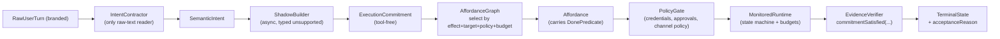

# Commitment Kernel v1 — Master Plan

## 0. Provenance & Status


| Field               | Value                                                                                                 |
| ------------------- | ----------------------------------------------------------------------------------------------------- |
| Plan version        | v1                                                                                                    |
| Architecture status | **LOCKED** (после 5 раундов AI-дискуссии: GPT-5.5 + Claude Opus 4.7)                                  |
| Discussion artefact | `.cursor/plans/commitment_kernel_design_dialog.plan.md` (1481 строк, Round 1 -> Final Direction Lock) |
| Hard invariants     | 16 (final)                                                                                            |
| Flexible invariants | 6 (extensibility points)                                                                              |
| PR sequence         | PR-1..PR-3 + **PR-4a merged** ([#103](https://github.com/Primus-max/god-mode-core/pull/103), merge SHA `d042a6b03a`, 2026-04-28) + **PR-4b merged** ([#104](https://github.com/Primus-max/god-mode-core/pull/104), merge SHA `1e6231dd60`, 2026-04-28). Active next work = **future `commitment_kernel_policy_gate_full.plan.md`** (full PolicyGate, post-cutover-2) или cutover-3 sub-plan. |
| Quant gate          | 6 measurable metrics                                                                                  |
| Last updated        | 2026-04-28 (PR-4b merged into dev)                                                                    |
| Cutover-1 reality   | **Production routing live**: `persistent_session.created` маршрутизируется через kernel (`productionDecision !== legacyDecision` на kernel-derived success), idempotency-guard бьёт по gateway session store, `[DEBUG ROUTING]` исчез из user-facing reply. Live exit gate (≥1h TG dry-run + human signoff #15) проведён оператором перед merge PR-4a `d042a6b03a`. См. §0.5. |
| Cutover-2 reality   | **Production routing live**: chat-bound effects (`answer.delivered`, `clarification_requested`, `external_effect.performed`) включены в `CUTOVER_2`; effect-family `communication` зарегистрирована (allowedOperationKinds=['create','observe']); три affordance в одной семье → `affordance_branching_factor > 1` структурно; `allowAllPolicyGate` заменён на `createPolicyGate({cfg})` с закрытым набором reason-кодов `['channel_disabled','no_credentials']` (frozen reverse-test). Approvals/budgets/role-based PolicyGate НЕ в scope (= future sub-plan, master §8.5.1). Merged PR-4b `1e6231dd60` 2026-04-28. |
| Next gate           | **Future sub-plan**: `commitment_kernel_policy_gate_full.plan.md` (full PolicyGate — approvals, budgets per-user/per-channel, role-based, retry, escalation; обязателен до cutover-4). Параллельно может стартовать `commitment_kernel_cutover3_artifacts.plan.md`. См. §8.5 / §8.5.1 / §16. |


### PR Progress Log (append-only)

Финальный коммит каждого PR-чата (`docs(plan): mark PR-N completed`) дописывает сюда строку. Trailer формат: `Plan-Step: PR-N` / `Plan-Status: completed`. См. `.cursor/rules/pr-session-bootstrap.mdc` "Final step of every PR chat".


| Date       | PR     | Chat-completion SHA | Next gate               |
| ---------- | ------ | ------------------- | ----------------------- |
| 2026-04-27 | PR-1   | bdd4f0af0a          | PR-1.5 sub-plan kickoff |
| 2026-04-27 | PR-1.5 | 9eeeeb6568          | PR-2 sub-plan kickoff   |
| 2026-04-27 | PR-2   | d09d128a19          | PR-3 sub-plan kickoff   |
| 2026-04-27 | PR-3   | addcb196be          | v1 UAT (cutover-1)      |
| 2026-04-28 | PR-4a  | d042a6b03a          | PR-4b sub-plan kickoff  |
| 2026-04-28 | PR-4b  | 1e6231dd60          | full PolicyGate sub-plan kickoff / cutover-3 |
| 2026-04-29 | Bug C — recipe routing для intent=publish | 9f6f8d8d3d | Bug A streaming-leak sub-plan kickoff |
| 2026-04-29 | Bug A — streaming-leak (universal tool-call markers) | 7f56fbd9ab | Bug A.2 buffering / Bug B / Bug D / Bug F sub-plan kickoff |
| 2026-04-29 | Bug D — clarification policy gate (PolicyGate Stage 1) | caca87a634 | PolicyGate Stages 2-6 (approvals/budgets/role-based/retry/escalation) — signoff required |
| 2026-05-01 | Bug A.2 — block-streaming buffering at tool_call (PR-A.2) | 3df3138fcc | PR-H — session-history-aware clarify (Stage 1.5 PolicyGate) sub-plan kickoff |
| 2026-05-01 | PR-H — session-history-aware clarify (Stage 1.5 ClarificationPolicy) | 185cf7d3fb | PR-H Phase 2 — per-session SemanticIntent cache wiring at caller layer (auto-reply / pi-embedded-runner); затем PR-MT concurrent broker (signoff required) |
| 2026-05-01 | PR-H Phase 2 — per-session SemanticIntent cache wiring (intent-ledger + input.ts callers) | 01afedff6a | PR-MT — concurrent broker (deferred, signoff required); roadmap step 4 ждёт maintainer |
| 2026-05-01 | Regression Slice 1 — model-fallback respect configured order (route-preflight passthrough) | c0bee0846f | Regression Slice 2 — sessions.patch label idempotency (extend G3 fix) |
| 2026-05-01 | Regression Slice 2 — sessions.patch label idempotency (G3 extension to patch path) | 9fc0790bce | Regression Slice 3 — PR-H Phase 2 wiring debug |
| 2026-05-01 | Regression Slice 3 Phase A — `[intent-history]` debug instrumentation | 690bc2dfe0 | Regression Slice 4 — cron tool single-block-no-retry; Slice 3 Phase B/C gated на live user evidence |
| 2026-05-01 | Regression Slice 4 — cron tool structured blocked result (no retry on policy violation) | 00062f70a6 | Regression block (4/4) merged; final live verification + Slice 3 Phase B/C gated на user action |
| 2026-05-01 | Slice 3 Phase B — `[intent-contractor]` debug log wiring (run-turn-decision onDebugEvent) | 3f467f414e | Phase C root-cause fix (semantic-intent reshape) |
| 2026-05-01 | Slice 3 Phase B+ — include truncated rawText in `[intent-contractor]` log on parse_error | 8fccaf292d | Phase C continued |
| 2026-05-01 | Slice 3 Phase C — tolerate flattened SemanticIntent JSON from gpt-5-mini (defensive reshape) | 0347e00489 | Edge-case follow-up (null fields + double-quoted kinds) |
| 2026-05-01 | Slice 3 Phase C+ — strip null fields and unwrap double-quoted kinds in semantic-intent reshape | 30a098b1e3 | Diagnostic improvements: classifier prompt.head |
| 2026-05-01 | Diagnostic — sanitized `prompt.head` (200 chars, then 500) in `[task-classifier]` log | f6abc9745f | Strip metadata envelope + reply-language log |
| 2026-05-01 | Diagnostic — strip Telegram inbound metadata envelope before classifier; log `[assistant-reply] lang=ru\|en` | 8efe32a6a2 | Tool-aware routing for web_search |
| 2026-05-01 | Tool-aware routing — promote `hydra/grok-4` first when turn requests `web_search` (xAI Live Search via Hydra openai-completions; only native search path) | e3d8c538f8 | PR-MT (concurrent broker) — deferred, signoff required; OR next narrow slice (Telegram caption-overflow UX, see roadmap forward-deferred) |
| 2026-05-02 | SLICE B — broaden `web_search` promotion gate to `bundles=[public_web_lookup]` signal + capability-aware lookup (curated `NATIVE_WEB_SEARCH_MODEL_IDS` mirroring models.json compat) | e7da04fb3e | Bundle-as-contract enforcement at LLM schema layer + IntentContractor freshness constraint — both **signoff required** (architectural shifts; see sub-plan §8). Otherwise: PR-MT (concurrent broker, signoff required) OR Telegram caption-overflow UX. |
| 2026-05-02 | Sonar capability follow-up — switched `NATIVE_WEB_SEARCH_MODEL_IDS` to `{sonar, sonar-pro}` after Hydra `/v1/models` audit confirmed only Perplexity carries the `web_search: true` flag; grok-4 compat block removed (live test returned training-cutoff knowledge, not fresh data) | 3b366481cf | Live test `af38758f` then revealed sonar-pro returns HTTP 400 on combo-turn tool schemas → rollback to empty set + Search-Composer Pipeline architectural slice |
| 2026-05-02 | Search-Composer Pipeline kickoff — `NATIVE_WEB_SEARCH_MODEL_IDS` rolled back to empty (gate dead-code pending architectural slice); new sub-plan `commitment_kernel_search_composer_pipeline.plan.md` written (effect family `web_research` + 2 affordances + `WebEvidenceSlice` + runtime two-affordance sequencer + PolicyGate web_research reasons; **signoff required**, invariant #15) | (sub-plan only) | Maintainer signoff on `commitment_kernel_search_composer_pipeline.plan.md` Phase 1; OR PR-MT concurrent broker (signoff); OR full PolicyGate (`commitment_kernel_policy_gate_full.plan.md` Stages 2-6, signoff); OR forward-deferred narrow slice (Telegram caption-overflow UX). |
| 2026-05-02 | Search-Composer Phase 1 (PR-#127) — registered `web_research` effect family in `EFFECT_FAMILY_REGISTRY` with `allowedOperationKinds: ["create"]` + closed `branchingHints: ["search_specialist", "search_then_composer"]`; new branded `EffectId` constants `WEB_EVIDENCE_COLLECTED_EFFECT` / `WEB_RESEARCH_SUMMARIZED_EFFECT` (Phase 2 keys); behavior-neutral (IntentContractor prompt hint at `intent-contractor-impl.ts:472` retains 3-family allowlist until Phase 4) | 5c2813b141 | Phase 2 — two affordances (`perplexity_search_specialist` + `composer_after_search`) under `web_research` family in `affordance-registry.ts`, predicates keyed on `WebEvidenceSlice` (introduced Phase 3). Pickup queue priority: Search-Composer phases 2-8 → Telegram caption-overflow UX (roadmap §8) → PolicyGate Stages 2-6 → PR-MT broker → bundle-as-contract → IntentContractor freshness → cutover-3/4. |
| 2026-05-02 | Search-Composer Phase 2 (PR-#128) — registered `PERPLEXITY_SEARCH_SPECIALIST_AFFORDANCE_ENTRY` (effect=`WEB_EVIDENCE_COLLECTED_EFFECT`, target matcher = `unspecified \| external_channel \| artifact \| workspace`, budgets `30s/1retry`, observer `web_evidence_world_state`) + `COMPOSER_AFTER_SEARCH_AFFORDANCE_ENTRY` (effect=`WEB_RESEARCH_SUMMARIZED_EFFECT`, target matcher = `external_channel \| artifact`, `requiredPreconditions: [WEB_EVIDENCE_PRESENT_PRECONDITION]`, budgets `60s/0retries`, observer reuses `delivery_world_state`) in `affordance-registry.ts`; `DEFAULT_AFFORDANCES` 4 → 6 entries; G6.a structural canary preserved (3 communication-family affordances unchanged); donePredicates as deterministic Phase-3/4-pending stubs in two new files; behavior-neutral (IntentContractor prompt hint at `intent-contractor-impl.ts:472` retains 3-family allowlist until Phase 4) | d9d08eb514 | Phase 3 — `WebEvidenceSlice` in `world-state.ts` (`WebEvidenceRecord` shape with `url`/`snippet`/`title`/`capturedAt`; ingestion via `MonitoredRuntime.observeEvidence("web_evidence.collected", ...)`; per-(sessionId, turnId) keying; reset semantics at turn-start). Pickup queue priority unchanged. |
| 2026-05-02 | Search-Composer Phase 3 (PR-#129) — added `WebEvidenceRecord` (`{ url, snippet, title?, capturedAt: ISO8601 }`) + `WebEvidenceWorldState = { records: readonly WebEvidenceRecord[] }` to `world-state.ts`; extended `WorldStateSnapshot` with optional `webEvidence?` (backward-compat); re-wired `webEvidenceCollectedPredicate` to read `ctx.stateAfter.webEvidence?.records` with closed missing-key set (`web_evidence.slice_absent` / `web_evidence.records.empty` / `evidence_record_missing_url:<index>`) and per-record `EvidenceFact` emission on satisfied; composer stub stays Phase-4-partial with single key `composer.runtime_adapter_pending_phase_4`. Invariant #9 covered by sentinel-proxy test. Type+read-side only — runtime ingestion (per-(sessionId, turnId) keying, reset-at-turn-start, sonar-reply population) deferred to Phase 4. | dd54ed11df | Phase 4 — runtime adapter (`src/agents/pi-embedded-runner/run/attempt.ts` или новый helper) two-affordance sequencer: sonar-only turn → populate `WebEvidenceSlice` → composer turn with `<web_evidence>` injection + tool schema minus `web_search`; IntentContractor prompt hint at `intent-contractor-impl.ts:472` updated to include `web_research` as 4th classifier option. **First behavior-changing slice — gateway restart + live verify required.** Pickup queue unchanged. |
| 2026-05-02 | Search-Composer Phase 4 sub-decomposition — drift amendment | (sub-plan only) | Sub-plan §8.5 amendment: original Phase 4 entry split into **4a/4b/4c** after audit revealed scope >2-file drift threshold (5+ files needed: WebEvidenceWorldStateObserver new, MonitoredRuntime deps, production-runtime-defaults wiring, runtime-adapter helper, composer predicate re-wire, IntentContractor prompt hint, composer-side adapter). 4a = observer + sonar adapter (~325 LOC, behaviour-neutral); 4b = composer adapter + delivery-receipt + caller wiring at attempt.ts (~230 LOC, behaviour-neutral until 4c); 4c = IntentContractor prompt-hint flip + live verify (~35 LOC, behaviour CHANGES). Sequence MUST be 4a → 4b → 4c (4c standalone would regress production: classifier emits web_research, runtime falls back to legacy bot-detection path). | d922aea8d4 | Phase 4a — WebEvidenceWorldStateObserver + sonar runtime adapter helper (no caller wiring; injectable transport). |
| 2026-05-02 | Search-Composer Phase 4a (PR-#130) — added `WebEvidenceCollector` + `WebEvidenceWorldStateObserver` (per-`(sessionId, turnId)` keying, URL last-writer-wins dedup, `perTurnLimit=32`, process-scoped singleton mirroring `delivery-receipt-registry.ts`); new `webEvidenceRecordSchema` (Zod `.strict()` with ISO-8601 regex on `capturedAt`) in `world-state.ts`; extended `createMonitoredRuntime` deps with optional `webEvidenceObserver` + `freezeSnapshot` threading; wired observer into `createDefaultMonitoredRuntime` over the process collector. New `runWebResearchSpecialist` runtime adapter helper in `src/agents/pi-embedded-runner/run/web-research-runtime-adapter.ts` with closed failure-reason set (`effect_mismatch` / `transport_error` / `parse_error` / `no_records` / `no_citations`) + injectable transport. **Behaviour-neutral on production** — no production caller invokes the adapter yet; collector is initialized lazily but never `record(...)`-ed by any production turn. Caller wiring lands in Phase 4b alongside composer adapter. Invariant #6 explicitly reverse-tested by adapter prompt-shape assertion (commitment-derived constraints only; no raw text embedded). | 5b6dd648d5 | Phase 4b — composer runtime adapter + delivery-receipt emission with `effect=WEB_RESEARCH_SUMMARIZED_EFFECT` + composer predicate re-wire from Phase-4-partial stub to real read-side check + caller wiring at `attempt.ts` for both adapters. Behaviour-neutral on production until Phase 4c flips the IntentContractor prompt hint. |
| 2026-05-02 | Search-Composer Phase 4b (PR-#131) — added `runComposerAfterSearch` to `web-research-runtime-adapter.ts` (closed failure set: `effect_mismatch` / `web_evidence_missing` / `transport_error` / `empty_reply`; filters `web_search` out of tool catalog when slice present; structural `<web_evidence>{ records, summary }</web_evidence>` injection — invariant #5 safe; emits `DeliveryReceipt` with `effect=WEB_RESEARCH_SUMMARIZED_EFFECT` + `kind="answer"` reusing existing `DeliveryReceiptKind`). Re-wired `webResearchSummarizedPredicate` from Phase-4-partial stub to read-side check over `ctx.stateAfter.webEvidence?.records` + `ctx.stateAfter.deliveries?.receipts` (closed missing-key set: `web_evidence.slice_absent` / `web_evidence.records.empty` / `composer.delivery_receipt_missing`); receipt lookup scoped by `deliveryContextKey` from `expectedDelta.deliveries.receipts.added[0]` with any-context fallback for single-channel deployments. New `done-predicate-web-research-summarized.test.ts` (8 cases incl. **Proxy-sentinel invariant #9** assertion). Adapter test extended +9 composer cases. **§8.5 further amended** — caller wiring at `attempt.ts` (3,468 LOC orchestration loop) split off as Phase 4b' per drift safeguard. **Behaviour-neutral on production** — no caller invokes either adapter; composer predicate reachable only via fixture tests. | 800ddc6e59 | Phase 4b' — caller wiring at `attempt.ts` for both adapters (≤3 LOC orchestration-loop change + 1 helper file). Behaviour-neutral until Phase 4c. |
| 2026-05-02 | Search-Composer Phase 4b'-a (PR-#132) — direct grep audit of `src/agents/pi-embedded-runner/run/attempt.ts` for `runTurnDecision\|monitoredRuntime\|webEvidenceCollector\|completeSimple\|affordance\|commitment\.effect` returned **0 matches**: attempt.ts is purely the LLM-call layer with zero kernel awareness, so the 2-step (sonar → composer) dispatch cannot live there. **§8.5 amended again** — Phase 4b' further split into 4b'-a (orchestrator helper alone, this merge) and 4b'-b (caller wiring at the decision-layer dispatch point — `src/platform/decision/input.ts` or `src/platform/plugin.ts`, the two callers of `runTurnDecision`). New `web-research-orchestrator.ts` (`runWebResearchTurn(...)` with closed failure semantics: specialist fails → no composer call; composer fails after specialist success → sonar slice survives on observer for partial-state UX; pathological-observer guard) + `isWebResearchFamilyEffect(effect)` predicate for the Phase 4b'-b conditional. New 9-case test file. attempt.ts untouched. **Behaviour-neutral on production** — no caller invokes the orchestrator yet; predicate is dead code until 4b'-b wires the decision-layer conditional. | 986fb04b03 | Phase 4b'-b — caller wiring at the decision-layer dispatch point (`input.ts` или `plugin.ts`) + LLM transport setup (`prepareModelForSimpleCompletion` + `completeSimple` from `@mariozechner/pi-ai`). ≤3 LOC change to dispatch site + 1 transport file. Behaviour-neutral until Phase 4c. |
| 2026-05-02 | Search-Composer Phase 4b''-c amendment — **architectural mismatch documented; 4b'-b BLOCKED pending maintainer signoff**. Audit at `input.ts:548` + `:587` confirmed `runTurnDecision` returns `{ productionDecision: TaskContract-shaped, intent: SemanticIntent }` — the kernel-derived `ExecutionCommitment` is internal and not surfaced. Caller wiring requires either (A) extending `RunTurnDecisionResult.derivedCommitment?` (~20 LOC additive) AND (B) productionalizing a productionDecision-replacement signal so composer text flows back to user (architectural; 3 sub-options documented in §8.5 4b''-e). Both paths cross architectural boundaries beyond the autonomous /loop's per-slice budget. **Search-Composer pipeline is structurally complete from the kernel side** (Phases 1-4b'-a). What remains is the kernel↔caller integration. **Phase 4b''-d / 4b''-e** entered as `pending-signoff` placeholders. Autonomous /loop **pivots to Telegram caption-overflow UX** (roadmap §8 forward-deferred, no signoff required) for the next iteration. | (sub-plan only) | Telegram caption-overflow UX (forward-deferred narrow slice, no signoff). After that: PolicyGate Stages 2-6 (G6.c), PR-MT broker (signoff), bundle-as-contract (signoff), IntentContractor freshness (signoff). Search-Composer 4b''-d/e/c resume after maintainer signoff on the integration architecture. |
| 2026-05-02 | Search-Composer Phase 4b''-d (PR-#134) — extends `RunTurnDecisionResult` with optional `derivedCommitment?: ExecutionCommitment` field surfaced on `gate_in_success` + `commitmentSatisfied`. Path A per sub-plan §8.5 4b''-d, maintainer-authorized 2026-05-02. +13 LOC + tests. `pnpm tsgo` clean; 27/27 scoped + adjacent. Behaviour-neutral. Frozen layer: none. Admin-merged BlackSmith stuck. | d852020517 | Phase 4b''-e1 — surface composer text in adapter + orchestrator. |
| 2026-05-02 | Search-Composer Phase 4b''-e1 (PR-#135) — bubbles `composer.text` through `WebResearchComposerResult` / `WebResearchTurnResult` ok variants. Previously composer adapter discarded model output after DeliveryReceipt; new shape surfaces text so upcoming caller wiring can route composed answer to user via directResponse. +15/-7 LOC over 4 files. `pnpm tsgo` clean; 27/27 scoped vitest. Behaviour-neutral. Frozen layer: none. Admin-merged. | 4e2b21dd71 | Phase 4b''-e2 — production transport factories. |
| 2026-05-02 | Search-Composer Phase 4b''-e2 (PR-#136) — new `web-research-transports.ts`: `createWebResearchSpecialistTransport` (defaults `hydra/sonar-pro`, 30s/2000) + `createWebResearchComposerTransport` (defaults `hydra/claude-opus-4.6`, 60s/4000). Wrap `prepareModelForSimpleCompletion` + `completeSimple` mirroring IntentContractor pattern. Shared `completeWithModel` helper. +179 LOC over 2 new files. `pnpm tsgo` clean; 4/4 scoped. Behaviour-neutral. Frozen layer: none. Admin-merged. | 9421ec7ea0 | Phase 4b''-e3 — dispatch helper. |
| 2026-05-02 | Search-Composer Phase 4b''-e4 (PR-#138) — caller wiring (Option ε pragmatic). New `web-evidence-prefetch.ts` with `maybeFetchWebEvidence(...)` invoked in `runAgentCommand` (single ~20 LOC integration). When `requestedTools.includes("web_search")`, runs sonar specialist against production transport, prepends `<web_evidence>` block to user prompt, filters `web_search` from tools → opus-4.6 composes with evidence. On failure: undefined return → fall through to legacy. **Search-Composer pipeline now active in production for web_search turns: sonar-pro → opus-4.6 (no grok).** +238 LOC over 3 files. `pnpm tsgo` clean; 41/41 scoped vitest. Hard invariants #5/#6/#7/#8/#11/#16 clear. Frozen layer: none. Admin-merged. | 7fa1c4eebe | Phase 4c — live verify after gateway restart. |
| 2026-05-02 | Search-Composer Phase 4b''-e3 (PR-#137) — new `web-research-dispatch.ts` with `runWebResearchDispatch(...)`. Builds production transports (or accepts test overrides), synthesises composer commitment from specialist commitment by cloning + replacing effect to `WEB_RESEARCH_SUMMARIZED_EFFECT`, invokes `runWebResearchTurn`. Returns `{ ok: true, text, messageId, recordCount }`. Closed failure set: `effect_not_dispatchable` + propagation of orchestrator stage failures. +395 LOC over 2 new files. `pnpm tsgo` clean; 5/5 scoped. **Behaviour-neutral; Search-Composer kernel side fully complete (Phases 1 → 4b'-a → 4b''-d → 4b''-e1 → 4b''-e2 → 4b''-e3).** Frozen layer: none. Admin-merged. | e07b477697 | Phase 4b''-e4 — caller wiring (architectural decision required: Option α planner-input threading vs γ pre-planner hook vs ε pre-orchestrator + evidence injection per sub-plan §8.5 4b''-e4). Phase 4c (gate flip + live verify) blocked on 4b''-e4. |
| 2026-05-02 | Telegram caption-overflow UX (PR-#133) — `splitTelegramCaption` updated to pack the caption to the 1024-char Telegram limit on overflow instead of dropping it. Previously: text > 1024 → `caption: undefined` + full text in follow-up message → file→empty-caption + separate text pattern observed during PR-#125 live PDF reply. New: caption gets first ~1024 chars (whitespace-aware split inside back-half of window when available; hard-cut at 1024 otherwise to avoid pathologically tiny captions); remainder flows through existing `pendingFollowUpText` / `chunkText` path which handles 4096-char message limit. 3 files: `extensions/telegram/src/caption.ts` (production helper, 1 file) + `caption.test.ts` (4 new cases: pack-to-limit, last-whitespace split, hard-cut on giant first word, multi-paragraph overflow) + `send.test.ts` (existing assertion renamed + updated to new contract: caption=1024 'A's, follow-up sendMessage=76-char remainder). `+60 -12`. Validation: `pnpm tsgo` clean (EXIT=0); 132/132 scoped + adjacent vitest green over `caption.test.ts` + `bot/delivery.test.ts` + `send.test.ts` + `lane-delivery.test.ts`. `send.proxy.test.ts` 4 baseline failures excluded (pre-existing on origin/dev; baseline-confirmed via `git stash`). Hard invariants reverse-tested: **#5, #6, #8, #11, #15** — all clear. Frozen-layer touch: **none**. CI infra: BlackSmith stuck pattern matches all prior PRs in this session; admin-merged via `gh pr merge 133 --admin --squash --delete-branch` per documented precedent. Live verify gated on user gateway restart: turn producing file artifact + long text body should yield single `sendDocument` with caption + follow-up text chunks — no empty-file→text→delete-text bounce. Roadmap §8 row marked **RESOLVED**. | dda3c70cec | Pickup queue: PolicyGate Stages 2-6 (G6.c, signoff required → SKIP until signoff), PR-MT broker (signoff → SKIP), bundle-as-contract enforcement (signoff → SKIP), IntentContractor freshness (signoff → SKIP), cutover-3/4 (signoff → SKIP). All remaining items require signoff; autonomous /loop pauses pending maintainer review (this slice + Search-Composer 4b''-d/e/c integration architecture decision Path A vs Path B). |
| 2026-05-03 | Search-Composer Phase 4c follow-up #139 — broaden `web-evidence-prefetch` trigger to also accept `toolBundles.includes("public_web_lookup")` (was: only `requestedTools.includes("web_search")`). Covers turn class where planner emits the bundle signal but no explicit web_search request. Small predicate change in `src/platform/decision/web-evidence-prefetch.ts` + tests. `pnpm tsgo` clean. Behaviour-changing on production for the bundle-signal turn class. Frozen layer: none. Admin-merged. | 47ca323788 | Phase 4c follow-up #140 — wire prefetch into the auto-reply path. |
| 2026-05-03 | Search-Composer Phase 4c follow-up #140 — wire `maybeFetchWebEvidence` into `src/auto-reply/reply/agent-runner-execution.ts`. Previously prefetch fired only on the `runAgentCommand` path; the auto-reply path used by Telegram/Slack inbound user turns bypassed it entirely, so production user-channel turns never benefited from #138's wiring. Parallel hook insertion mirroring the agent-command pattern. `pnpm tsgo` clean. Behaviour-changing on production for inbound channel turns. Frozen layer: none. Admin-merged. | 234ee35e46 | Phase 4c follow-up #141 — switch logging to defaultRuntime.log. |
| 2026-05-03 | Search-Composer Phase 4c follow-up #141 — switch the prefetch decision-layer logger from a context-bound channel logger that didn't reach the gateway log to `defaultRuntime.log`. Without this, `[web-evidence-prefetch] hook entered/applied/not_applied` traces were silently swallowed and live verification was blind. Diagnostic-only change. `pnpm tsgo` clean. Frozen layer: none. Admin-merged. | 17c65df438 | Phase 4c follow-up #142 — drop web_search from the tool catalog after prefetch succeeds. |
| 2026-05-03 | Search-Composer Phase 4c follow-up #142 — after successful `web-evidence-prefetch`, set `disableWebSearchTool=true` on the inner agent-runner params so opus's tool catalog excludes `web_search`. Without this filter opus would (a) read the injected `<web_evidence>` block AND (b) still call `web_search` itself, hitting the broken DDG fallback and crashing the turn. Initial filter `tool.name !== "web_search"` at `attempt.ts:1974`. `pnpm tsgo` clean. Behaviour-changing on production. Frozen layer: none. Admin-merged. | 77f45096c3 | Phase 4c follow-up #143 — force-disable on signal even when prefetch FAILED, plus sonar parse robustness. |
| 2026-05-03 | Search-Composer Phase 4c follow-up #143 — two coupled fixes: (1) `disableWebSearchTool` is now driven by `hasWebSearchSignal(plannerInput)` directly, not by prefetch success, so a mid-flight sonar error no longer leaves opus with `web_search` exposed (which previously crashed the turn into bot-detection); (2) sonar parse robustness via new `extractJsonArrayCandidate` that strips ` ```json ... ``` ` fences and slices first-`[` to last-`]` as fallback. New shared `hasWebSearchSignal()` export in `web-evidence-prefetch.ts`. +5 prefetch test cases (12/12), +7 adapter cases (18/18). `pnpm tsgo` clean. Frozen layer: none. Admin-merged. **Live evidence (turn `11dbd90c`)**: prefetch ok 8 records +2771 chars, no web_search calls, but opus pivoted to web_fetch → bot detection → `Provider finish_reason: error` after 1m50s. | a30f9e8a3a | Phase 4c follow-up #144 — extend filter to also drop web_fetch. |
| 2026-05-03 | Search-Composer Phase 4c follow-up #144 — extend the `disableWebSearchTool` filter in `attempt.ts` to also drop `web_fetch`. Same flag, same call sites — when a web_search signal is present, the model answers from `<web_evidence>` (or without fresh data) instead of pivoting to raw HTTP fetch (also blocked by news-site bot detection). Doc updated in `params.ts` to reflect broader semantics. `pnpm tsgo` clean. Frozen layer: none. Admin-merged. | d8e51cdc0a | Phase 4c follow-up #145 — drop `browser` from filter + force sonar JSON via response_format. |
| 2026-05-04 | Search-Composer Phase 4c follow-up #145 + **LIVE-VERIFIED** — two coupled fixes for the residual modes observed at PR-#144's live verify: (1) `browser` added to the `disableWebSearchTool` filter in `attempt.ts` because opus pivoted to it next (turn `5722d87c`: 4× browser timeouts → finish_reason: error after 4m); (2) force Perplexity sonar to emit JSON via `response_format: { type: "json_schema", json_schema: { schema } }`, injected into the upstream payload through pi-ai's `onPayload` hook in `web-research-transports.ts`. Schema wraps records in a `{ records: [...] }` envelope (top-level arrays rejected by some sonar tiers); without this, sonar sometimes returned markdown prose and parse_error broke prefetch. Adapter parser broadened to accept both bare-array AND envelope shapes. +143/-15 over 5 files; +2 adapter cases (envelope happy path, markdown-prose still rejected as parse_error). `pnpm tsgo` clean; 14/14 prefetch + 20/20 adapter green. Frozen layer: none. Admin-merged. **Live verify (turn `6d9d80e8-cd35-4ff4-b6ce-7bc2eed08682` on `gateway-pr145.log`)**: `[web-evidence-prefetch] ok recordCount=8 promptDeltaChars=2808` ✓; **zero** `[tools] (browser\|web_fetch\|web_search) failed` lines ✓; opus invoked `pdf` once; turn closed at `phase=done` with no `Provider finish_reason: error`; `[telegram] sendMessage ok`. Phase 4c live-verify §5 #2 acceptance effectively validated for the combo turn class. | 06baa2d364 | v1 release roadmap drafting (`commitment_kernel_v1_release_roadmap.plan.md`). Outstanding for v1: Search-Composer production dispatch (replace Option ε disable-flag with polymorphic `isWebResearchFamilyEffect` dispatch — closes G6.c); bundle-as-contract; IntentContractor freshness; cutover-3/4; channel-agnostic session persistence; memory layer (mem0); per-user task scheduler (TaskLedger); subagent registry persistence + reply routing; reply sanitizer; cron query/list/cancel surface. All require signoff per §15. |
| 2026-05-05 | v1 release roadmap signed off + slice D Phase 1 (PR-#146) — first slice toward Commitment Kernel v1. New `src/platform/identity/` module (outside frozen layer): `IdentityId` branded type via `asIdentityId(value)` validating `identity:<slug>` format ([A-Za-z0-9._-]+); `IdentityRegistry` interface (resolve/list/byIdentity, `undefined` on miss never throws); `StaticIdentityRegistry` config-backed impl with eager validation (rejects duplicate identity ids, conflicting `(channel,externalId)` tuples, empty externalIds), O(1) resolve via precomputed Map, frozen records. Tests: 28/28 over 2 files (13 cases for IdentityId + 15 for StaticIdentityRegistry); fail-first verified for every case before impl was written; no vi.spyOn anywhere; tight assertions; negative coverage explicit. `pnpm tsgo` clean. Hard invariants reverse-tested: #5, #6, #8, #11, #16. Frozen layer: untouched. Admin-merged. | 1461d7181f | Phase 2 — `resolveIdentityFromSessionKey` + session-key shape parser. |
| 2026-05-05 | Slice D Phase 2 (PR-#147) — `resolveIdentityFromSessionKey(sessionKey, registry)` + `extractChannelAndPeerFromSessionKey(sessionKey)` shape parser in `src/platform/identity/resolve-identity.ts`. Parses the four supported session-key shapes (per-channel-peer DM, per-account-channel-peer DM, group, channel) and looks up `(channel, peerId)` in the registry. Fail-closed shapes return `undefined`: main key (no channel segment), per-peer DM without channel, cron/subagent/acp wrapped scopes, unknown channel token (prevents forged-channel attacks), empty peerId. Never throws on miss. Tests: +20 cases (12 shape parser + 8 resolver, including cross-channel parity, per-account shape, no-throw guarantee). 48/48 combined; `pnpm tsgo` clean. Hard invariants #5, #6, #8, #11, #16 reverse-tested. Frozen layer: untouched. Admin-merged. | aa0c3b1c90 | Phase 3 — extend channel registry with `max` + accept `webchat` as identity channel. |
| 2026-05-05 | Slice D Phase 3 (PR-#148) — extends channel coverage so v1's Telegram + Web E2E parity goal is reachable. (1) `max` (Russian messenger placeholder for v1.1 adapter) added to `CHAT_CHANNEL_ORDER`; ChannelMeta entry in `registry.ts`. (2) `IdentityChannelId = ChatChannelId \| typeof INTERNAL_MESSAGE_CHANNEL` introduced so the identity registry accepts the Web UI channel ("webchat") alongside external chats. Without this, a Web UI user has no shared memory with their Telegram counterpart. Files: `ids.ts`, `registry.ts`, `identity-registry.ts`, `static-identity-registry.ts`, `resolve-identity.ts`. Tests: +5 (max round-trip, webchat round-trip, three-channel cross parity, max session-key shape, webchat session-key shape). 57/57 combined; `pnpm tsgo` clean. Hard invariants #5, #6, #8, #11, #16. Frozen layer: untouched. Admin-merged. | 0027423614 | Phase 4 — audit `extensions/telegram` for raw chat.id leaks past adapter boundary. |
| 2026-05-05 | Slice D Phase 4 (PR-#149) — audit verdict: `extensions/telegram/**` is **CLEAN**, peerId normalization before `buildAgentSessionKey` is correct everywhere, no genuine numeric leak past the adapter boundary. Two benign cosmetic anomalies (template-literal interpolation of numeric `chatId`) hardened with explicit `String(chatId)` so cross-channel-identity discipline is enforced by code style, not by JS auto-coercion. Files: `bot-message-context.ts:239`, `bot-handlers.runtime.ts:325`. Behaviour-neutral. Targeted tests: 6 fail / 9 pass — **byte-identical** to origin/dev baseline (verified via git stash). Repo-wide telegram suite: 188 baseline failures preserved (zero regression). `pnpm tsgo` clean. Hard invariants #5, #6, #8 reverse-tested. Frozen layer: untouched. Admin-merged. | bddce1d183 | Phase 5 — `identities` config schema + bootstrap loader. |
| 2026-05-05 | Slice D Phase 5 (PR-#150) — wires the identity registry to `openclaw.json`. New `src/config/zod-schema.identities.ts`: `IdentitiesSchema = z.record(z.string().min(1), IdentityRecordSchema)` where each record carries `displayName` + `mappings[]` (channel enum = `[...CHAT_CHANNEL_ORDER, "webchat"]`). Wired into top-level `OpenClawSchema` as optional `identities` field (one import + one line). New `src/platform/identity/load-identities-from-config.ts` with `buildIdentityRecordsFromConfig(config)` (validates each key via `asIdentityId()` with informative error messages) + `loadIdentityRegistryFromConfig(config)` one-call helper. Tests: +10 cases (7 builder + 3 loader, including malformed-key error paths and registry-validation propagation). 64/64 combined; `pnpm tsgo` clean. Hard invariants #5, #6, #8, #11, #16. Frozen layer: untouched (zod-schema.ts is config composition point, not the frozen-5 contracts). Admin-merged. | b83ff85489 | Phase 6 — cross-channel acceptance fixture + slice D close-out. |
| 2026-05-05 | **Slice D Phase 6 (PR-#151) + Slice D COMPLETE** — end-to-end acceptance fixture proving the slice D contract: starting from a raw config object, walking through `loadIdentityRegistryFromConfig` → `resolveIdentityFromSessionKey`, two distinct session keys for the same operator on different channels (Telegram + Web UI + Max) resolve to byte-equal `IdentityId`. This is the contract slice E (memory layer) consumes. 8 acceptance cases including: cross-channel parity Telegram + Web (B1+B3 prerequisite), three-channel parity (Telegram + Web + Max), no cross-tenant bleed (two operators on same channel → distinct identities), per-account-channel-peer shape symmetry, group session keys (Slack channel id + Discord guild-channel id) resolve correctly, anonymous session → undefined (no bleed), unconfigured deploy default (undefined config → empty registry), wrapped session keys (subagent/cron/acp) do NOT leak parent identity through wrapper. 72/72 combined over 5 files; `pnpm tsgo` clean. Hard invariants #5, #6, #8, #11, #16 reverse-tested across all 6 phases of slice D; frozen layer **untouched** in any phase. Admin-merged. **Slice D status: COMPLETE.** Foundation in place for slice E (memory/mem0), slice F (TaskLedger), slice G (subagent registry) — all of which will key on `IdentityId`. | 63b185c7e3 | Group 1 kickoff: slice E (memory/mem0), slice I (reply sanitizer), slice H (stream ordering) drafting in parallel via Plan agents. |
| 2026-05-04 | Slice I Phase 1 (PR-#152) — read-only audit of the reply-sanitizer pipeline. Output: `extensions/AUDIT-reply-sanitizer.md`. Verified all 5 sub-plan §2 sketch areas against `dev` HEAD with line-number tightening (within ±2 of sketch): `stripBlockTags` 385–473, `handleMessageEnd` 322, `[assistant-reply]` log 353–355, `extractAssistantText` 284 (strict via `stripThinkingTagsFromText:280`), `normalizePayloadsForChannelDelivery` 376 with sanitizer call at 406 (gate at 404). B5 root-cause confirmed: (a) `isReasoningTagProvider` returns false for Anthropic; (b) all 16 existing `OUTBOUND_LEAK_PATTERNS` enumerated, none match English meta-prose. Channel registry: `webchat` is `INTERNAL_MESSAGE_CHANNEL` (not in `EXTERNAL_DELIVERY_SURFACES`); `max` in `CHAT_CHANNEL_ORDER` but not in `EXTERNAL_DELIVERY_SURFACES`. **3 NEW findings** affecting Phase 2+: (1) `irc` also missing from `EXTERNAL_DELIVERY_SURFACES`, needs explicit policy decision alongside `max`; (2) Phase 2 policy resolver must cover the union of three sets, not just `CHAT_CHANNEL_ORDER` (`voice`/`sms` exist as outbound surfaces only); (3) `extractThinkingFromTaggedText` (`pi-embedded-utils.ts:459`) is reusable for the webchat structured-policy wrap. Read-only audit; no source modification. Admin-merged. | 714c907d6b | Phase 2 — channel-keyed sanitizer policy types `src/infra/outbound/reply-sanitizer-policy.ts` (must cover irc/max/voice/sms per audit). |
| 2026-05-04 | Slice H Phase 1 (PR-#153) — read-only audit of the streaming ordering pipeline; verified §2 sketch against `dev` HEAD with minor line-range tightening (rotate-body 305 → 305–333; finally-loop 790–855 → 822–843; deferral wiring 589–615 → 592–613; `emitDeferredAck` 850 → 850–873). `Promise.resolve(...)` wrapper at `pi-embedded-subscribe.handlers.tools.ts:341` makes the await order audit-clean. Hypothesis ranking confirmed: **H2 medium-high** (primary — `agent-runner.ts:866` reads raw `effectiveOpts?.onBlockReply`, bypassing both `streamingAwareBlockReply` AND `externalBlockDeferral.wrapDeliver`); **H3 medium**; **H1 low** (null candidate). **Phase 2/3 pivot:** the `bot-message-dispatch.ts:835–843` finally-loop only deletes entries with `deleteIfUnused !== false`. The `rotateAnswerLaneForNewAssistantMessage` push (line 313–322) uses `deleteIfUnused: false` and is exempt — the actual H3-relevant push site is **line 235** (different boundary path). Phase 3 H3 fix sketches must scope to that path. Read-only audit (only sub-plan §2 modified). Admin-merged. | 13f3b37e02 | Phase 2 — failing harness/test reproducing B4 ack-ordering against the deferral + pipeline + channel-adapter recorder. |
| 2026-05-04 | Slice E Phase 1 (PR-#154) — `MemoryStore` interface + types in new module `src/platform/memory/`. 9 files: `memory-entry-id.ts` + test (brand + factory + guard); `episodic-memory-event.ts` + test (discriminated union with `persistent_session.created` payload + 3 stub variants `subagent.created`/`reminder.set`/`artifact.created` typed-but-inert until F/G/J/K wire them; per-payload + union Zod schemas; `assertNeverEpisodic` exhaustiveness helper); `semantic-memory.ts` + test (`SemanticMemoryWrite` / `Query` / `Entry` / `RecallResult` types + Zod schemas; scalar-only metadata); `memory-store.ts` (`MemoryStore` interface: `storeEpisodic`, `storeSemantic`, `recall`, `list`, `forget`); `memory-store.contract.test.ts` (brand-discipline `@ts-expect-error` lines proving `MemoryEntryId` not assignable from `string` / `IdentityId` / `SessionId` / `EffectId` / `EffectFamilyId` and `forget` rejects every adjacent brand at the call site); `index.ts` barrel. Tests: 70/70 over 4 files; `pnpm tsgo` clean. Pure types — NO impl yet. Phase 2 ships `InMemoryMemoryStore`. Hard invariants #5, #6, #8, #11, #16 reverse-tested; frozen layer untouched. Two minor deviations: (1) `z.ZodType<T>` annotations on exported Zod schemas to keep brand symbols out of emitted `.d.ts` (TS4023 fix; pure type-annotation, no runtime effect); (2) cherry-pick recovery from a misplaced first commit on `audit/v1-slice-h-stream-ordering-phase-1` (fresh shell state); audit branch reset to its prior tip `fefafda343` — no functional effect on PR-#153. Admin-merged. | f13d771e57 | Phase 2 — `InMemoryMemoryStore` Map-backed impl so slices F/G/J can integrate before persistent backend lands. |


### Active Work Handoff Protocol

Каждый commitment-kernel чат обязан оставить следующему чату достаточно состояния, чтобы продолжать без раскопок по transcript history.

1. **Bootstrap (mandatory, в первом ответе чата):**
   1. Прочитать этот master plan §0, **§0.5 Audit Findings**, активный sub-plan, последнюю запись `### Handoff Log` в нём.
   2. Прочитать `.cursor/rules/commitment-kernel-invariants.mdc` (16 hard invariants — это always-applied rule, оно уже в контексте).
   3. **Default bootstrap output = 4 строки** (см. `pr-session-bootstrap.mdc` §"At chat start" п.5):
      - `Wave: <A|B|N/A>`
      - `Scope: <ссылка на §sub-plan, без re-list файлов>`
      - `Audit gaps closing: <G-numbers>`
      - `Preconditions: <pass | fail + что не так>`
      Затем сразу старт работы по первому todo. Никаких Q1..Q5 в чат.
   4. **Q1..Q5 (§0.5.5) печатаются ТОЛЬКО при триггере** — preconditions check failed, sub-plan vs master conflict, или scope creep detected. Это не обязательная часть bootstrap-а; это эскалация при сбое.
2. До изменения кода явно повторить active scope и перечислить TODO ids, над которыми идёт работа, **только если** scope требует затронуть call-sites из §0.5.1 (4 точки destructuring `legacyDecision`) — тогда перечислить их явно по именам файлов и строк. В обычном случае — переходить к работе.
3. Во время работы менять статусы TODO в active sub-plan только когда реализация и соответствующие тесты для этого TODO реально завершены. Тесты, мокающие защищаемый guard через `vi.spyOn(...)` напрямую, **не считаются доказательством фикса** для G3/G4 (см. §0.5.2).
4. Перед передачей следующему чату добавить в active sub-plan одну датированную запись `### Handoff Log`:
   - completed TODO ids,
   - touched files,
   - tests/lints run and result,
   - **которые из G1..G6 закрыты этой итерацией** (если применимо),
   - unresolved blockers,
   - exact next recommended TODO id.
5. Когда PR/sub-plan завершён, отметить его frontmatter todos как `completed`, обновить соответствующий master frontmatter todo, добавить строку в PR Progress Log и включить plan-progress commit в PR. Если PR закрывает G1..G6 — обновить таблицу §0.5.3 (помечать gap-ы closed строкой "closed by PR-N <SHA>").

Active handoff source of truth:

| Work item | Plan file | Status |
| --------- | --------- | ------ |
| PR-4a — [#103](https://github.com/Primus-max/god-mode-core/pull/103) (G1+G2+G3+G4+G5) | `.cursor/plans/commitment_kernel_pr4_chat_effects_cutover.plan.md` (Wave A) + `.cursor/plans/commitment_kernel_idempotency_fix.plan.md` (first commit details) | **completed**; merged 2026-04-28 (SHA `d042a6b03a`); cutover-1 production routing live |
| PR-4b — [#104](https://github.com/Primus-max/god-mode-core/pull/104) (G6.a+G6.b) | `.cursor/plans/commitment_kernel_pr4_chat_effects_cutover.plan.md` (Wave B) | **completed**; merged 2026-04-28 (SHA `1e6231dd60`); cutover-2 chat-effects + minimal PolicyGate live |
| **Full PolicyGate (post-cutover-2)** | `.cursor/plans/commitment_kernel_policy_gate_full.plan.md` (TBD) | **active next work**; required before cutover-4; sub-plan создаётся на следующей итерации |


### Merged into `dev`


| PR     | PR #                                                         | Merge commit | Source branch                            | Method | Date       |
| ------ | ------------------------------------------------------------ | ------------ | ---------------------------------------- | ------ | ---------- |
| PR-1.5 | [#100](https://github.com/Primus-max/god-mode-core/pull/100) | 5826b46db9   | `pr/1.5/runtime-result-schema-extension` | merge  | 2026-04-27 |
| PR-2   | [#101](https://github.com/Primus-max/god-mode-core/pull/101) | b439261f6f   | `pr/2/shadow-mode-and-freeze`            | merge  | 2026-04-27 |
| PR-3   | [#102](https://github.com/Primus-max/god-mode-core/pull/102) | f412c17348   | `pr/3/observer-and-cutover-phase-a`      | merge  | 2026-04-27 |
| PR-4a  | [#103](https://github.com/Primus-max/god-mode-core/pull/103) | d042a6b03a   | `pr/4a/cutover1-routing-flip`            | merge  | 2026-04-28 |
| PR-4b  | [#104](https://github.com/Primus-max/god-mode-core/pull/104) | 1e6231dd60   | `pr/4b/cutover2-chat-effects`            | merge  | 2026-04-28 |


Этот документ — **executable spec**. Он сам — план-концепция оркестратора v1 и одновременно мастер-план implementation. Из каждой секции `## §N` нарезается отдельный sub-plan, когда стадия идёт в работу.

---

## 0.5. Audit Findings (2026-04-27) — must-read for every kernel chat

Раздел зафиксирован после ревью master + sub-plans + кода. Любой новый чат, начинающий работу над PR-4a / PR-4b / idempotency-fix / cutover-N, **обязан** прочитать этот раздел и явно подтвердить в первом ответе, что он понимает текущее расхождение между «PR-3 merged» и реальным production routing.

### 0.5.1. Что заявлено vs что в коде

| Заявление | Реальность в коде | Где смотреть |
| --- | --- | --- |
| `§0 «PR-3 merged → cutover-1»` | `productionDecision === legacyDecision` всегда; trace расширен, routing не сменён | `src/platform/decision/run-turn-decision.ts:122-140` |
| `§8.4 «persistent_session.created идёт через commitment kernel»` | `monitoredRuntime` / `expectedDeltaResolver` не передаются ни одним call-site → `cutoverGate = gate_in_uncertain (monitored_runtime_unavailable)` для каждого live turn-а | `src/platform/plugin.ts:76`, `src/platform/plugin.ts:332`, `src/platform/decision/input.ts:440`, `src/platform/decision/input.ts:475` |
| `§7 «6 quant-gate metrics on real or replayed traffic»` | Gate passed на synthetic corpus (30 cases, auto=24/hindsight=4/human=2) | `scripts/dev/task-contract-eval/cutover1-synthetic-cases.jsonl`, `scripts/dev/task-contract-eval/cutover1-gate-report.json` |
| Idempotency-guard для `persistent_session.created` работает в TG | Guard смотрит `runs` registry с фильтром `endedAt === undefined`, но `endedAt` ставится после каждого turn-а → reuse в реальном TG flow никогда не срабатывает | `src/agents/subagent-registry-queries.ts:32-53`, `src/agents/subagent-spawn.ts:439-464` |
| `Invariant #5 — zero text-control plane на user-bearing reply` | Блок `[DEBUG ROUTING]` всё ещё выводится в user-facing TG-ответ | `src/agents/command/delivery.ts:44-83` |
| `§2.3 AffordanceGraph` как отдельный компонент | Файла `affordance-graph.ts` нет; функция `findByFamily(...)` лежит в `affordance-registry.ts` и не использует preconditions / policy / budgets для tie-break | `src/platform/commitment/affordance-registry.ts:94-111` |
| `PolicyGate` интегрирован в pipeline | `runShadowBranch` использует `allowAllPolicyGate` (no-op stub); реальные credentials/approvals/channel-policy через kernel не проходят | `src/platform/decision/run-turn-decision.ts:158` |
| Tool exposure согласована с model capability и bundle-контрактом | LLM tool schema собирается в `attempt.ts:1915` через `createOpenClawCodingTools(...)` БЕЗ параметра `toolBundles` — bundle (включая `respond_only`) advisory, не фильтрует schema. Capability-фильтр существует только для xai-native (`applyModelProviderToolPolicy` удаляет DDG `web_search` у моделей с `nativeWebSearchTool=true`); противоположной защиты — «не давать DDG-tool моделям без native search» — нет. Result: classifier-mis-emit `bundles=[respond_only] requestedTools=[]` приводит к autonomous `web_search` → DDG bot-detection → `Provider finish_reason: error` (gateway-grok-route.log 2026-05-02 turn `355ae135`). | `src/agents/pi-embedded-runner/run/attempt.ts:1915-1971`, `src/agents/pi-tools.ts:94-104` (`applyModelProviderToolPolicy`), `src/platform/decision/route-preflight.ts:797` (PR-#125+#126 narrow gate, не bundle-filter). Closure: `commitment_kernel_policy_gate_full.plan.md` Stage T (TBD) — bundle-as-contract enforcement at schema layer; **signoff required** (heartbeat-class flows зависят от bundle-as-advisory; см. PR-#126 sub-plan §8 row 1). |

### 0.5.2. Six critical gaps (каждый закрывается в указанном scope)

```text
G1. PRODUCTION ROUTING NOT SWITCHED.
    runTurnDecision returns productionDecision === legacyDecision.
    All four call-sites destructure { legacyDecision }, ignoring productionDecision.
    Owner: PR-4a (Wave A) todo `kernel-derived-decision-contract` + `tg-entrypoint-kernel-first`.

G2. RUNTIME / EXPECTED-DELTA NEVER PASSED IN PRODUCTION.
    Production call-sites omit monitoredRuntime + expectedDeltaResolver.
    cutoverGate evaluates to gate_in_uncertain on every live turn.
    Owner: PR-4a (Wave A) todo `tg-entrypoint-kernel-first` (must wire runtime + delta resolver into all 4 call-sites).

G3. IDEMPOTENCY GUARD UNREACHABLE IN TG FLOW.
    findActiveSubagentByLabelFromRuns filters `endedAt === undefined`,
    but every TG turn closes the run, leaving no live "active" run.
    Persistent session itself is alive in gateway session store.
    Owner: PR-4a (Wave A), FIRST COMMIT (per idempotency-fix sub-plan; no standalone PR).

G4. IDEMPOTENCY TESTS DO NOT PROVE FIX.
    Existing `subagent-spawn.idempotency.test.ts` mocks findActiveSubagentByLabel via vi.spyOn,
    so it only exercises the early-return branch in spawnSubagentDirect.
    Owner: PR-4a (Wave A), FIRST COMMIT — tests rewritten alongside guard replacement
    (in-memory session-store fixture, no vi.spyOn on guard).

G5. `[DEBUG ROUTING]` BLOCK STILL IN USER-FACING REPLY.
    Violates invariant #5; visible in every TG answer.
    Owner: PR-4a (Wave A) todo `debug-routing-cleanup`.

G6.a. EFFECT-FAMILY REGISTRY NOT EXTENDED.
    EFFECT_FAMILY_REGISTRY contains only `persistent_session` + `unknown`,
    so branching factor canary (invariant #16, §13.4) is structurally 1.0
    until cutover-2 introduces multiple affordances per family `communication`.
    Owner: PR-4b (Wave B) todo `effect-family-extend`.

G6.b. POLICY GATE STILL STUBBED.
    allowAllPolicyGate is no-op; invariant #2 (Affordance selected by ... policy ...) is not enforced.
    Owner: PR-4b (Wave B) todo `policy-gate-real` (minimal — credentials + channel-disabled only;
    approvals/budgets/role-based deferred to G6.c).

G6.c. FULL POLICYGATE (DEFERRED, NOT IN PR-4b SCOPE).
    Approvals, budgets per-user/per-channel/per-effect, role-based access,
    retry policies, escalation hooks. Required before cutover-4 (`repo_operation.completed`).
    Owner: future sub-plan `commitment_kernel_policy_gate_full.plan.md`
    (created after cutover-2; see §8.5.1).
```

### 0.5.3. Scope-of-fix matrix (где какой gap закрывается)

PR-4 разделён на **две волны** (PR-4a / PR-4b) для review-ability и rollback safety. Между волнами должна быть green CI с реальной production маршрутизацией хотя бы одного эффекта. **Idempotency-fix НЕ выпускается standalone PR-ом** — он идёт первым коммитом внутри PR-4a (см. правило ниже).

| Gap | PR / коммит | Todo id | Что становится зелёным после merge |
| --- | --- | --- | --- |
| G3 | **closed by PR-4a `d042a6b03a`** (Wave A, commit 1 — idempotency-fix `a972638e48`) | `design-session-store-query`, `implement-session-query`, `replace-guard-in-spawn` | Persistent sessions reuse в TG flow без `label already in use` |
| G4 | **closed by PR-4a `d042a6b03a`** (Wave A, commit 1 — idempotency-fix `a972638e48` + commit 4 stabilization `b4409b412a`) | `tests` (переписан без `vi.spyOn` на guard) | Regression на endedAt не вернётся незаметно |
| G1 | **closed by PR-4a `d042a6b03a`** (Wave A, commit 2 — routing flip `85516cf3ce`) | `kernel-derived-decision-contract`, `tg-entrypoint-kernel-first` | `productionDecision !== legacyDecision` на cutover-1 turn-ах с runtime attestation |
| G2 | **closed by PR-4a `d042a6b03a`** (Wave A, commit 2 — routing flip `85516cf3ce`) | `tg-entrypoint-kernel-first` (4 call-sites + runtime/delta wiring) | `cutoverGate` больше не возвращает `monitored_runtime_unavailable` на live turn-ах |
| G5 | **closed by PR-4a `d042a6b03a`** (Wave A, commit 3 — DEBUG cleanup `0114e1923e`) | `debug-routing-cleanup` | `[DEBUG ROUTING]` не появляется в user-bearing reply |
| G6.a | **closed by PR-4b `1e6231dd60`** (Wave B, commit `e9fa5b21ba`) | `effect-family-extend` (`communication`) | Affordance branching factor стал осмысленным (>1.0) на cutover-2 pool: 3 affordance в семье `communication` |
| G6.b | **closed by PR-4b `1e6231dd60`** (Wave B, commit `e9fa5b21ba`) | `policy-gate-real` (минимальный contract: credentials + channel-disabled) | Invariant #2 (Affordance selected by ... policy ...) реально enforce-ится; `POLICY_GATE_REASONS` frozen reverse-test enforced |
| G6.c | **future sub-plan** (post-cutover-2) | full PolicyGate (approvals, budgets, role-based) | Полная policy-система для cutover-3+ |

**Правило раздельности волн**:

- PR-4a не вводит новые effect-families и не трогает PolicyGate stub (он остаётся `allowAllPolicyGate` ещё одну итерацию).
- PR-4b не трогает routing flip — он наследует уже работающий `productionDecision` путь от PR-4a.

**Правило idempotency-fix внутри PR-4a (final, no fork)**:

- idempotency-fix-persistent-session = **первый коммит** PR-4a. Не standalone PR.
- Обоснование: фикс трогает те же layers (session store, spawn path), что уровнем выше используют 4 production call-sites; общий dry-run покрывает оба фикса; разделение даёт два review/rollback цикла там, где достаточно одного.
- Sub-plan `commitment_kernel_idempotency_fix.plan.md` остаётся отдельным файлом как detail-spec для commit-а, но не рождает отдельный PR.
- На уровне CI/lint: PR-4a-CI прогоняет идемпотентность-тесты как часть `wave-a` пула; отдельной check-точки на standalone idempotency-fix нет.

### 0.5.4. Что значит «cutover-1 ready» / «cutover-2 ready»

- **«cutover-1 ready»** = после merge PR-4a (one PR, three commits, закрывает **G3+G4+G1+G2+G5** одной merge-SHA). `persistent_session.created` реально маршрутизируется через kernel в TG flow, идемпотентность работает, DEBUG чистый. Это **первый честный production cutover**. До этого «cutover-1 merged» означало только shadow + observer + synthetic gate — нормальная стадия зрелости, но не production routing.
- **«cutover-2 ready»** = после дополнительного закрытия **G6.a+G6.b** (PR-4b). Chat-effects (`answer.delivered`, `clarification_requested`, `external_effect.performed`) маршрутизируются через kernel с минимальным реальным PolicyGate.
- **«cutover-N ready» (N≥3)** = отдельный full-PolicyGate sub-plan + новые WorldStateSnapshot slices. Не пытаться раньше.

### 0.5.5. Bootstrap output + Q1..Q5 (trigger-conditional, не на каждый старт)

**Default bootstrap output = 4 строки**, которые агент печатает в первом сообщении чата перед началом работы. Никаких Q1..Q5 в чат при норме. Цель — минимизировать ceremony, дать агенту немедленно стартовать.

```text
Wave: <A | B | N/A>
Scope: <PR-id + ссылка на §sub-plan, без re-list файлов>
Audit gaps closing: <G-numbers, либо "none">
Preconditions: <pass | fail: <что не так>>
```

Пример валидного bootstrap для PR-4a:

```text
Wave: A
Scope: PR-4a, см. commitment_kernel_pr4_chat_effects_cutover.plan.md §4 [Wave A] + commitment_kernel_idempotency_fix.plan.md (commit 1).
Audit gaps closing: G1, G2, G3, G4, G5.
Preconditions: pass.
```

Пример bootstrap для PR-4b:

```text
Wave: B
Scope: PR-4b, см. commitment_kernel_pr4_chat_effects_cutover.plan.md §4 [Wave B]. Disclaimer: approvals/budgets/role-based PolicyGate not in scope (см. §8.5.1, future commitment_kernel_policy_gate_full.plan.md).
Audit gaps closing: G6.a, G6.b.
Preconditions: pass (PR-4a merged at <SHA>; dry-run ≥1h passed: no `label already in use`, no `[DEBUG ROUTING]`).
```

**Q1..Q5 печатаются в чат ТОЛЬКО при триггере**. Триггеры:

1. `Preconditions: fail` — статус-таблица §0 расходится с git, либо предшествующий PR не merged, либо dry-run для PR-4b не прошёл.
2. **Sub-plan vs master conflict** — sub-plan говорит одно, master другое (например, scope shifted между waves без обновления §0.5.3).
3. **Scope creep detected** — задача требует тронуть файлы за пределами объявленного wave (см. wave discipline в `pr-session-bootstrap.mdc`).
4. **Прямая просьба пользователя** «дай self-check» / «расскажи Q1..Q5».

Если ни один триггер не сработал — Q1..Q5 не пишутся, агент сразу идёт в первый todo. При триггере self-check выглядит так (1-2 строки на ответ, не reasoning-эссе):

```text
Q1. <PR-id> + 1-3 todo ids.
Q2. <G-numbers либо "none">.
Q3. <call-sites; для G1/G2 — все 4 сразу>.
Q4. <как доказывается production-flow, не мок; для G3/G4 — без vi.spyOn на guard>.
Q5. <freeze-label + 16 hard invariants enforced>.
```

Если хотя бы один ответ «не знаю» — стоп, surface user-у. Это единственный stop-сигнал внутри Q1..Q5.

---

## 1. Vision

### 1.1. Что мы строим

Умного оркестратора, который:

1. **Понимает intent**, а не парсит фразы. Классификация — по семантике задачи, не по тексту.
2. **Берёт верифицируемое обязательство** до запуска инструментов. Обязательство декларирует ожидаемый эффект и даёт предикат проверки.
3. **Доказывает выполнение** через observed state, а не через факт срабатывания tool-а.

### 1.2. Почему так

Текущий `src/platform/decision/task-classifier.ts` (1673 строки на момент Round 4 verification) — rule-heavy классификатор, выросший в де-факто оркестрационный мозг. Каждый новый кейс ("Валера", "напоминание", "deliverable variant") добавляет ещё один phrase-rule или outcome-enum. Оркестратор зависит от пользовательского ввода как routing primitive — это структурный долг, не bug.

Commitment Kernel разворачивает зависимость: route определяется **effect-ом + observable state**, не фразой. Pipeline становится:

```
SemanticIntent  ->  ExecutionCommitment  ->  Affordance  ->  MonitoredRuntime  ->  EvidenceVerifier  ->  TerminalState
       ^                 ^                      ^                 ^                       ^
   semantic           tool-free              (effect +         budgeted               commitmentSatisfied
   intent only        commitment             precondition +    state machine          (state-after based)
                      with predicate         policy + budget)
```

### 1.3. Принципы продукта (из дискуссии)


| Принцип                                                  | Архитектурное соответствие                                                                                                   |
| -------------------------------------------------------- | ---------------------------------------------------------------------------------------------------------------------------- |
| "Расширяемый умный оркестратор"                          | Flexible invariants: effect families, world-state slices, affordance catalog растут без switch-branches.                     |
| "LLM, классифицирующая семантически + брокеры сообщений" | `IntentContractor` (LLM intent classifier, единственный читатель сырого текста) + `AffordanceGraph` (effect broker).         |
| "Не управляем оркестратором через пользовательский ввод" | Hard invariants #5 + #6: zero text-based control plane на user-bearing branded types вне `IntentContractor`.                 |
| "Пользователь точно должен получить результат"           | Hard invariants #3, #4, #14: success невозможен без observed state-after; `unsupported` — typed outcome, не silent omission. |


### 1.4. Что НЕ строим (anti-goals)

- Не "TaskContract v3" с новыми outcome-полями.
- Не очередной phrase-rule pass поверх классификатора.
- Не "fix all bugs" одним рывком — operational debug идёт параллельно (см. §10 Track A).

---

## 2. Architecture

### 2.1. North-star формула

```
TerminalState_t :=
  classify( IntentContractor( RawTurn ) )
  -> negotiate( ExecutionCommitment )
  -> select( Affordance | effect, target, preconditions, policy, budgets )
  -> run( MonitoredRuntime )
  -> verify( commitmentSatisfied( stateBefore, stateAfter, expectedDelta, receipts ) )
  -> { answered | action_completed | clarification_requested | rejected | unsupported }
```

Любой path, обходящий хотя бы одну стрелку, — архитектурный fail (ловится на типах + lint + CI).

### 2.2. Pipeline


```mermaid
flowchart LR
  raw["RawUserTurn (branded)"] --> intentContractor["IntentContractor<br/>(only raw-text reader)"]
  intentContractor --> semanticIntent["SemanticIntent"]
  semanticIntent --> shadowBuilder["ShadowBuilder<br/>(async, typed unsupported)"]
  shadowBuilder --> commitment["ExecutionCommitment<br/>(tool-free)"]
  commitment --> affordanceGraph["AffordanceGraph<br/>select by effect+target+policy+budget"]
  affordanceGraph --> affordance["Affordance<br/>(carries DonePredicate)"]
  affordance --> policyGate["PolicyGate<br/>(credentials, approvals, channel policy)"]
  policyGate --> monitoredRuntime["MonitoredRuntime<br/>(state machine + budgets)"]
  monitoredRuntime --> evidenceVerifier["EvidenceVerifier<br/>commitmentSatisfied(...)"]
  evidenceVerifier --> terminal["TerminalState<br/>+ acceptanceReason"]
```


### 2.3. Components (responsibility map)


| Component             | Single responsibility                                                                                                 | Path (target)                                     |
| --------------------- | --------------------------------------------------------------------------------------------------------------------- | ------------------------------------------------- |
| `IntentContractor`    | LLM intent classifier; **единственный** компонент, читающий `RawUserTurn`.                                            | `src/platform/commitment/intent-contractor.ts`    |
| `SemanticIntent`      | Tool-free семантическое описание.                                                                                     | `src/platform/commitment/semantic-intent.ts`      |
| `ShadowBuilder`       | Async построитель `ExecutionCommitment` из `SemanticIntent`. Возвращает typed `unsupported`.                          | `src/platform/commitment/shadow-builder.ts`       |
| `ExecutionCommitment` | Verifiable обязательство: effect + target + budgets + requiredEvidence. **Tool-free.**                                | `src/platform/commitment/execution-commitment.ts` |
| `AffordanceGraph`     | Селектор Affordance по effect + target + preconditions + policy + budgets. **NB (audit 2026-04-27)**: на cutover-1 эту роль выполняет `affordance-registry.ts:findByFamily(...)` по effect-family + target + operationKind. Выделение в отдельный модуль `affordance-graph.ts` с реальной policy/budget-tiebreaker логикой — обязательное действие в момент, когда в одном семействе появится >1 affordance (cutover-2 `communication`). До этого граф вырожден, branching factor = 1. | `src/platform/commitment/affordance-registry.ts` (cutover-1 placeholder) → `src/platform/commitment/affordance-graph.ts` (cutover-2+) |
| `Affordance`          | Каталоговая запись: effect, target matcher, preconditions, evidence requirements, **DonePredicate**, default budgets. | `src/platform/commitment/affordance.ts`           |
| `PolicyGate`          | Credentials, approvals, external effects, channel policy, hard stops.                                                 | `src/platform/commitment/policy-gate.ts`          |
| `MonitoredRuntime`    | Исполнение через state machine с budgets и terminal states.                                                           | `src/platform/commitment/monitored-runtime.ts`    |
| `EvidenceVerifier`    | Запуск `DonePredicate(stateBefore, stateAfter, expectedDelta, receipts)`.                                             | `src/platform/commitment/evidence-verifier.ts`    |
| `WorldStateSnapshot`  | Extensible domain slices (sessions, artifacts, workspace, deliveries, ...).                                           | `src/platform/commitment/world-state.ts`          |
| `runTurnDecision`     | Unified entry point. Все вызовы legacy `classifyTaskForDecision` уходят сюда.                                         | `src/platform/commitment/run-turn-decision.ts`    |


Legacy `src/platform/decision/` остаётся неприкосновенным до cutover-3+. См. §6 freeze.

---

## 3. Hard Invariants (16) — final lock

Любое нарушение — архитектурный fail, enforced на типах + lint + CI.

```text
1.  ExecutionCommitment is tool-free, always.
2.  Affordance is selected by (effect + target + preconditions + policy + budgets) only.
3.  Production success requires commitmentSatisfied(...) === true.
4.  Success requires at least one observed state-after fact;
    cutover-1 = runtime-attested, cutover-2+ = independent observer.
5.  Phrase / text-rule matching on user-bearing branded types
    (UserPrompt, RawUserTurn, ...) is architecture failure
    anywhere in decision/ or commitment/ paths.
6.  IntentContractor is the only component allowed to read raw user text.
7.  ShadowBuilder accepts SemanticIntent only; never TaskContract,
    never raw text. Enforced on type signature.
8.  commitment/ layer does not import from decision/ layer.
9.  DonePredicate has no access to raw user text, TaskContract,
    or task-classifier output. State / delta / receipts / trace only.
10. DonePredicate lives on Affordance, not on Commitment.
11. Five legacy decision contracts (TaskContract, OutcomeContract,
    QualificationExecutionContract, ResolutionContract,
    RecipeRoutingHints) are frozen against new orchestration semantics.
    Additions require labeled PR template
    (telemetry-only / bug-fix / compatibility / emergency-rollback);
    compatibility fields require explicit source-of-truth declaration
    (always ExecutionCommitment for new behavior).
12. Emergency phrase / routing patches in classifier require
    tracking ticket + retire deadline; CI fails after deadline.
13. terminalState orthogonal to acceptanceReason; both populated.
14. ShadowBuilder unsupported result is typed
    ({ kind: 'unsupported'; reason }), never null / throw.
15. PR-1 / PR-1.5 / PR-2 / PR-3 require explicit human maintainer signoff
    regardless of green CI.
16. SemanticIntent.desiredEffectFamily is typed as EffectFamilyId, never as EffectId.
    AffordanceGraph performs (effect family + target + preconditions + policy + budgets)
    -> effect resolution. Direct carry-over of EffectId from intent to commitment is
    architecture failure. EffectFamilyId and EffectId are distinct branded types with
    no implicit conversion. Prevents classifier-v3 degradation by construction:
    AffordanceGraph cannot become a one-to-one lookup if intent and commitment
    speak different domain languages.
```

---

## 4. Flexible Invariants (6) — extensibility points

Точки роста системы. Архитектура **поощряет** их расширение.

```text
F1. EffectFamilyId / EffectId can grow.
F2. WorldStateSnapshot domain slices can be added per domain
    (sessions, artifacts, workspace, deliveries, repo, external_effects, ...).
F3. Affordance catalog grows; affordances are entries, not switch branches.
F4. DonePredicate implementations are pluggable per Affordance.
F5. Observation can start runtime-attested (cutover-1)
    and later become independent observer (cutover-2+).
F6. OperationHint allows custom verbs via discriminated union
    (standard verbs stay typed; custom verbs keep domain extensibility).
```

---

## 5. Type System Sketch (для PR-1)

> Все типы — illustrative. Final shape определяется в PR-1 review. Ключевые **shape constraints** зафиксированы в §3 hard invariants.

### 5.1. Branded user-text types

```ts
declare const UserPromptBrand: unique symbol;
export type UserPrompt = string & { readonly [UserPromptBrand]: true };

declare const RawUserTurnBrand: unique symbol;
export type RawUserTurn = {
  readonly text: string & { readonly [RawUserTurnBrand]: true };
  readonly channel: ChannelId;
  readonly receivedAt: ISO8601;
  readonly attachments: readonly AttachmentRef[];
};
```

Цель: lint check `no-raw-user-text-import` (Node-скрипт `scripts/check-no-raw-user-text-import.mjs`, по конвенции репо `lint:routing:no-prompt-parsing`) блокирует импорт этих типов везде, кроме whitelist `src/platform/commitment/intent-contractor.ts`. Любой phrase-rule pass на этих типах за пределами whitelist — ошибка линта.

### 5.2. SemanticIntent

```ts
export type SemanticIntent = {
  readonly desiredEffectFamily: EffectFamilyId;
  readonly target: TargetRef;
  readonly operation?: OperationHint;
  readonly constraints: ReadonlyRecord<string, unknown>;
  readonly uncertainty: readonly string[];
  readonly confidence: number;
};

export type OperationHint =
  | { kind: 'create' }
  | { kind: 'update'; updateOf?: TargetRef }
  | { kind: 'cancel'; cancelOf?: TargetRef }
  | { kind: 'observe' }
  | { kind: 'custom'; verb: string };
```

`SemanticIntent` намеренно decoupled от tools и routes. Hard invariant #1, #7.

### 5.3. ExecutionCommitment (tool-free)

```ts
export type ExecutionCommitment = {
  readonly id: CommitmentId;
  readonly effect: EffectId;
  readonly target: CommitmentTarget;
  readonly constraints: ReadonlyRecord<string, unknown>;
  readonly budgets: CommitmentBudgets;
  readonly requiredEvidence: readonly EvidenceRequirement[];
  readonly terminalPolicy: TerminalPolicy;
};
```

> NB. `**DonePredicate` не лежит на Commitment** (hard invariant #10). Predicate живёт на Affordance, иначе invariant #1 ломается через back-door, как только появляется второй affordance на тот же effect.

### 5.4. WorldStateSnapshot — extensible slices

```ts
export type WorldStateSnapshot = {
  readonly sessions?: SessionWorldState;
  readonly artifacts?: ArtifactWorldState;
  readonly workspace?: WorkspaceWorldState;
  readonly deliveries?: DeliveryWorldState;
};

export type SessionWorldState = {
  readonly followupRegistry: readonly SessionRecord[];
};
```

Для PR-1 / PR-3 cutover-1 нужна только `SessionWorldState`. Остальные slices добавляются в порядке cutover-2..N (artifacts, workspace, deliveries, repo, external_effects).

### 5.5. ExpectedDelta — symmetric to WorldStateSnapshot

```ts
export type ExpectedDelta = {
  readonly sessions?: SessionExpectedDelta;
  readonly artifacts?: ArtifactExpectedDelta;
  readonly workspace?: WorkspaceExpectedDelta;
  readonly deliveries?: DeliveryExpectedDelta;
};

// NB. Поля `extensions: Record<string, unknown>` намеренно ОТСУТСТВУЮТ.
// Любой новый домен добавляется как named slice через TS-extension с code review.
// Это force-the-decision: запрещает превращение state-store в свалку.

export type SessionExpectedDelta = {
  readonly followupRegistry?: {
    readonly added?: readonly SessionRecordRef[];
    readonly removed?: readonly { readonly sessionId: SessionId }[];
  };
};
```

### 5.6. Affordance + DonePredicate

```ts
export type Affordance = {
  readonly id: AffordanceId;
  readonly effect: EffectId;
  readonly target: TargetMatcher;
  readonly requiredPreconditions: readonly PreconditionId[];
  readonly requiredEvidence: readonly EvidenceRequirement[];
  readonly riskTier: RiskTier;
  readonly defaultBudgets: CommitmentBudgets;
  readonly observerHandle: ObserverHandle;
  readonly donePredicate: DonePredicate;
};

export type DonePredicate = (ctx: {
  readonly stateBefore: WorldStateSnapshot;
  readonly stateAfter: WorldStateSnapshot;
  readonly expectedDelta: ExpectedDelta;
  readonly receipts: ReceiptsBundle;
  readonly trace: ShadowTrace;
}) => SatisfactionResult;

export type SatisfactionResult =
  | { readonly satisfied: true; readonly evidence: readonly EvidenceFact[] }
  | { readonly satisfied: false; readonly missing: readonly string[] };
```

Hard invariants #9 + #10. Predicate видит только state / delta / receipts / trace — никакого raw text, никакого TaskContract, никакого classifier output.

### 5.7. ShadowBuilder typed unsupported

```ts
export type ShadowBuildResult =
  | { readonly kind: 'commitment'; readonly value: ExecutionCommitment }
  | { readonly kind: 'unsupported'; readonly reason: ShadowUnsupportedReason };
```

Hard invariant #14. Никаких null / throw / silent omission.

### 5.8. DecisionTrace.shadowCommitment

```ts
export type DecisionTrace = {
  // ...existing legacy fields...
  readonly shadowCommitment?: ShadowBuildResult;
  readonly divergenceReason?: DivergenceReason;
};
```

Cutover-2/3 использует это для quant gate (см. §7).

---

## 6. Five-Layer Freeze (legacy decision/)

### 6.1. Frozen surface


| Layer                          | File (target)                                       | Status     |
| ------------------------------ | --------------------------------------------------- | ---------- |
| TaskContract                   | `src/platform/decision/contracts.ts` (and adjacent) | **frozen** |
| OutcomeContract                | `src/platform/decision/...`                         | **frozen** |
| QualificationExecutionContract | `src/platform/decision/...`                         | **frozen** |
| ResolutionContract             | `src/platform/decision/resolution-contract.ts`      | **frozen** |
| RecipeRoutingHints             | `src/platform/decision/...`                         | **frozen** |


Frozen against **new orchestration semantics**. Не frozen against:

- bug-fixes, не меняющих routing,
- telemetry / logging additions,
- compatibility shims с явной декларацией source-of-truth.

### 6.2. Enforcement mechanism

**PR template labels** (mandatory на любой PR, трогающий пять слоёв):

```text
- [ ] telemetry-only          (логи / трейс / метрика)
- [ ] bug-fix                 (фикс, не меняющий routing)
- [ ] compatibility           (shim; обязательно поле "source-of-truth: ExecutionCommitment.<...>")
- [ ] emergency-rollback      (revert, требует tracking ticket + retire deadline)
```

**CI label-check job**: PR на любой из пяти файлов без label-а блокируется.

**Emergency clause** (hard invariant #12): emergency phrase / routing patch -> tracking ticket -> retire deadline -> CI fails after deadline. Без этого freeze decay-ится тихо.

---

## 7. Cutover-1 Quant Gate (6 metrics)

Cutover-1 включает только **persistent_session.created**. `answer.delivered` и прочие интенты остаются на legacy decision до cutover-2+.

```text
N >= 30 real or replayed persistent-session turns in pool
  (pool excludes answer.delivered and non-persistent-session intents)

state_observability_coverage >= 90%
  -- доля turns, где observer успешно собрал stateAfter

commitment_correctness        >= 95%
  -- predicted ExecutionCommitment vs hand- or replay-labeled expected

satisfaction_correctness      >= 95%
  -- commitmentSatisfied(...) vs hindsight observed

false_positive_success        == 0
  -- ни одного turn-а с success=true при unsatisfied commitment

all legacy divergences trace-explained with divergenceReason

labeling window honored:
  hindsight labels only on turns where commitment did NOT affect production routing
```

### 7.1. Почему именно эти 6 метрик

- `**state_observability_coverage**` — без неё `satisfaction_correctness` тривиально проходит при broken observer (silent-fail mode).
- `**commitment_correctness` отдельно от `satisfaction_correctness**` — разделяет ошибку построения обязательства и ошибку проверки.
- `**false_positive_success == 0**` — единственный non-percentage-метрика. Ноль, потому что любой false positive — это unsatisfied commitment, который проскочил, и он architecturally недопустим.
- `**divergenceReason` обязателен на каждой расхождении** — иначе нет audit trail для пост-факт разбора.
- `**answer.delivered` исключён из pool** (hard invariant + invariant эффекта): иначе threshold 95% тривиально достижим default-ом `answer.delivered`.

### 7.2. Hybrid labeling strategy

```text
1. auto-label by replay rules where legacy outcome is unambiguous;
2. hindsight observer label where state-after is determinative;
3. human signoff on remaining ambiguous cases (small fraction expected).
```

Human signoff — единственный gate, который НЕ может быть обойден green CI (hard invariant #15).

---

## 8. PR Sequence (4 PR)

Каждая стадия — отдельный sub-plan, нарезается из этой секции в момент старта работы.

### 8.1. PR-1 — types-only seed + shadow skeleton

**Scope** (только PR-1, ничего больше):

- `src/platform/commitment/` директория с типами (см. §5).
- `IntentContractor` stub (signature + TODO body).
- `ShadowBuilder` skeleton (signature + typed `unsupported` for всех intent-ов).
- `DecisionTrace.shadowCommitment` опциональное поле.
- Branded `UserPrompt` + `RawUserTurn` (см. §5.1).
- Lint check `no-raw-user-text-import` (`scripts/check-no-raw-user-text-import.mjs` + `package.json` script `lint:commitment:no-raw-user-text-import`) с whitelist на `intent-contractor.ts`.
- Lint check: `commitment/` не импортирует из `decision/` (hard invariant #8) — `scripts/check-no-decision-imports-from-commitment.mjs` + `lint:commitment:no-decision-imports`.
- Обновление PR template с freeze labels (см. §6.2).

**Out of scope для PR-1**:

- Реальная работа `IntentContractor` (только stub: возвращает фиксированный `SemanticIntent` с `confidence: 0`, `desiredEffectFamily: 'unknown' as EffectFamilyId`, `uncertainty: ['pr1_stub']`).
- Реальный `ShadowBuilder` (skeleton: для любого intent возвращает `{ kind: 'unsupported', reason: 'pr1_stub' }`).
- Любое изменение production routing.
- `runTurnDecision` (приходит в PR-2).
- Affordance catalog (приходит в PR-3).

> NB. Терминология. `unsupported` — это shape `ShadowBuildResult`, не `IntentContractor`. У `IntentContractor` нет `unsupported`-выхода: непонятый intent — это `low-confidence intent` с `confidence: 0`. Это намеренное разделение: `IntentContractor` всегда возвращает `SemanticIntent`, `ShadowBuilder` решает, можно ли построить `ExecutionCommitment` для этого intent-а.

**Exit criteria**:

- TypeScript build green.
- Lint check-скрипты работают (Vitest unit-tests на скрипты, fail-cases coverage; оба `lint:commitment:`* запускаются успешно на чистом репо).
- **Bit-identical decision-eval snapshot before / after PR-1**: все существующие decision-eval scenarios (минимум 21) производят идентичный legacy `results` (исключая недетерминированные `generatedAt` / `casesPath`). Любое отличие — PR не green. Это превращает "no production routing changes" из обещания в проверяемое условие.
- Human signoff на schema (hard invariants #15, #16).

**Estimated effort**: 2-3 дня кода. Большая часть — review шейпов типов.

### 8.2. PR-1.5 — runtime-result-schema-extension

**Scope** (минимальный sub-PR между PR-1 и PR-2):

- Расширить `SpawnSubagentResult` полями:
  - `agentId: AgentId`
  - `parentSessionKey: SessionKey | null`
- Обновить call-sites (`src/agents/subagent-spawn.ts`, `src/agents/acp-spawn.ts`).
- Обновить tests.

**Почему отдельный PR**:

Combined `(spawnResult + callerContext)` — anti-pattern: evidence должно быть **pure value**, не computation by call-site. Без extension PR-2 пишется на messy contract, PR-3 переписывается. Один PR — одна schema-точка.

**Exit criteria**:

- Все existing tests green.
- Все existing call-sites обновлены.
- Human signoff (hard invariant #15).

**Estimated effort**: ~однострочный sub-PR + test updates. 0.5-1 день.

### 8.3. PR-2 — IntentContractor + ShadowBuilder + freeze enforcement

**Scope**:

- Реальный `IntentContractor` (LLM call, schema validation, branded result).
- Реальный `ShadowBuilder` (async, typed unsupported).
- `runTurnDecision` unified entry point — все вызовы legacy `classifyTaskForDecision` (минимум `src/platform/plugin.ts`, `src/agents/agent-command.ts`) переходят сюда.
- `DecisionTrace.shadowCommitment` заполняется на каждом turn-е.
- `decision-eval` расширен на shadow comparison (показывает legacy outcome + shadow commitment side-by-side, считает `commitment_correctness` против hand/replay labels).
- `affordance_branching_factor` shadow telemetry: на каждом turn-е логируется число candidate Affordances для построенного `ExecutionCommitment` (canary для invariant #16 — если граф вырождается в lookup, среднее < 1.5 на pool, и это видно в trace до cutover).
- CI label-check job для пяти legacy слоёв (см. §6.2).
- Freeze enforcement: попытка добавить новое orchestration-semantics поле в один из пяти legacy contracts без label-а -> CI fail.

**Out of scope для PR-2**:

- Affordance catalog (PR-3).
- WorldStateSnapshot observer (PR-3).
- Production routing change — production по-прежнему на legacy.

**Exit criteria**:

- Shadow mode active в `dev`: каждый turn имеет `shadowCommitment` в trace.
- `decision-eval` считает 4 из 6 quant-gate метрик (`commitment_correctness`, `state_observability_coverage` — пока на mock observer, `false_positive_success`, divergence trace).
- Production behavior bit-identical (legacy routing).
- Hard invariants #1, #5, #6, #7, #8, #11, #14 enforced на типах + lint.
- Human signoff (hard invariant #15).

**Estimated effort**: 1-2 недели.

### 8.4. PR-3 — observer + cutover + quant gate

**Scope**:

- `SessionWorldState` observer (читает `followupRegistry`).
- `Affordance(persistent_session.created)` с `donePredicate` (см. §5.6).
- `commitmentSatisfied` gate в production path для `persistent_session.created` only.
- Все 6 метрик (§7) считаются на real / replayed traffic.
- Quant gate measurement period (минимум N=30 turns в pool).
- Cutover-1: `persistent_session.created` идёт через commitment kernel; всё остальное — на legacy.

**Out of scope для PR-3**:

- Cutover-2+ (artifacts, workspace, deliveries, repo, external_effects).
- Independent observer (cutover-2 миграция с runtime-attested на observer-based).

**Exit criteria** (PR-3 формальные — выполнены на synthetic surface):

- Все 6 quant-gate метрик passing (см. §7) на synthetic corpus `scripts/dev/task-contract-eval/cutover1-synthetic-cases.jsonl` (N=30, label_source_breakdown auto/hindsight/human).
- Hard invariants #2, #3, #4, #9, #10, #12, #13, #15 enforced на типах + check-script-ах. Runtime-уровневое enforcement (`commitmentSatisfied` в production gate) — only при наличии `monitoredRuntime` в call-site, что в PR-3 ещё не подключено.
- `false_positive_success == 0` на synthetic pool.
- Human signoff (hard invariant #15).

**Audit clarification (2026-04-27)**: PR-3 merged означает «shadow + observer + synthetic gate passed», **не** «cutover-1 production routing change live». User-visible cutover приходит с PR-4 (см. §0.5 G1+G2). Эту разницу формулировки в §8.4 раньше скрывали; теперь явно зафиксирована здесь и в §0 «Cutover-1 reality» row.

**Estimated effort**: 2-3 недели.

### 8.5. После PR-3


| Cutover    | Scope                                                                            | Wave / PR    | Quant gate                                                                      |
| ---------- | -------------------------------------------------------------------------------- | ------------ | ------------------------------------------------------------------------------- |
| Cutover-1  | `persistent_session.created` — production routing flip (от shadow к kernel) + idempotency-fix как commit 1 | **PR-4a (Wave A), single PR, three commits** | те же 6 метрик master §7 на cutover-1 pool, теперь runtime-attested на live TG (не synthetic) |
| Cutover-2  | chat-bound subset: `answer.delivered`, `clarification_requested`, `external_effect.performed` | **PR-4b (Wave B)** | runtime-attested observer; те же 6 метрик на cutover-2 pool (≥30 turns)         |
| Cutover-3  | `artifact.created` (документы, отчёты)                                           | отдельный sub-plan | независимый observer; те же 6 метрик пересчитываются на `artifact.created` pool |
| Cutover-4  | `repo_operation.completed` + полный PolicyGate (approvals, budgets, role-based) | отдельный sub-plan | то же + PolicyGate compliance metrics |
| Cutover-N  | ...                                                                              | ...          | F2 (WorldStateSnapshot growing slices)                                          |

**Note (2026-04-27)**: Cutover-2 был пересмотрен с `artifact.created` на chat-bound subset. Причина — производственный TG-flow не ходит через kernel ни на одном эффекте после PR-3 (cutover-1 покрыл `persistent_session.created`, но это spawn-side эффект, не доступный пользователю напрямую). Чтобы получить видимый результат в TG (нет `[DEBUG ROUTING]` шума, нет дублей persistent сабагентов, простые ответы идут через kernel) — cutover-2 расширяется на эффекты, реально триггерящиеся в каждом turn-е. `artifact.created` отодвигается в cutover-3.

**Note (2026-04-27, post-audit)**: PR-4 разделён на две волны (см. §0.5.3):

- **Wave A (PR-4a)** = single PR, three commits, closure G1+G2+G3+G4+G5. Структура: (1) idempotency-fix (G3+G4), (2) routing flip для `persistent_session.created` (G1+G2), (3) `[DEBUG ROUTING]` cleanup (G5). Idempotency-fix НЕ выпускается standalone PR-ом (см. §0.5.3). **Не вводит** новых effect-families, **не трогает** PolicyGate stub (он остаётся `allowAllPolicyGate` ещё одну итерацию).
- **Wave B (PR-4b)** = closure G6.a+G6.b. Расширение на cutover-2 chat-effects + минимальный реальный PolicyGate. Наследует уже работающий `productionDecision` путь от Wave A.

Между Wave A и Wave B обязательна **green CI с реальной production маршрутизацией хотя бы одного эффекта** (`persistent_session.created`). Это и есть промежуточный тестируемый шаг, без которого PR-4 как монолит был бы нереviewable и неоткатываемый по частям.

#### 8.5.1. PolicyGate split (PR-4b minimum vs future sub-plan)

PolicyGate реализуется в **два уровня**, чтобы не раздуть PR-4b:

| Уровень | Scope | Где | Когда |
| --- | --- | --- | --- |
| **Minimum** | Контракт `evaluate(commitment, affordance, ctx) → { ok: true } \| { ok: false; reason }`. Reasons: `'no_credentials'`, `'channel_disabled'`. Реализация только для chat-effects. | PR-4b todo `policy-gate-real` | вместе с cutover-2 |
| **Full** | Approvals, budgets (per-user / per-channel / per-effect), role-based access, retry policies, escalation hooks. | отдельный sub-plan `commitment_kernel_policy_gate_full.plan.md` (создаётся после cutover-2) | до cutover-4 (`repo_operation.completed` его требует обязательно) |

**Правило**: PR-4b **не реализует** approvals / budgets / role-based; их попадание в scope = stop, surface user-у. Full PolicyGate = отдельный PR + invariant #15 signoff.

Каждый cutover — отдельный sub-plan, наследует master invariants.

---

## 9. Lint & CI Enforcement Matrix


| Rule                                  | Enforces               | Mechanism                                                                                                                                                 |
| ------------------------------------- | ---------------------- | --------------------------------------------------------------------------------------------------------------------------------------------------------- |
| `no-raw-user-text-import`             | Hard invariants #5, #6 | Node check-script `scripts/check-no-raw-user-text-import.mjs` + whitelist `intent-contractor.ts` (конвенция репо: `lint:routing:no-prompt-parsing` style); npm script `lint:commitment:no-raw-user-text-import` |
| `no-decision-imports-from-commitment` | Hard invariant #8      | Node check-script `scripts/check-no-decision-imports-from-commitment.mjs`; npm script `lint:commitment:no-decision-imports`                               |
| `no-classifier-imports-from-commitment` | Hard invariant #8 (внутренняя проекция: kernel не импортирует task-classifier даже косвенно) | Node check-script `scripts/check-no-classifier-imports-from-commitment.mjs`; npm script `lint:commitment:no-classifier-imports` |
| `freeze-label-required`               | Hard invariant #11     | CI label-check job + `scripts/check-frozen-layer-label.mjs`                                                                                              |
| `emergency-patch-deadline`            | Hard invariant #12     | CI date-check job (fail after retire deadline)                                                                                                            |
| `shadow-builder-input-typed`          | Hard invariant #7      | TypeScript signature only (compile error)                                                                                                                 |
| `commitment-tool-free`                | Hard invariant #1      | TypeScript: `ExecutionCommitment` shape не имеет `tool` / `recipe` / `route` полей                                                                        |
| `done-predicate-on-affordance`        | Hard invariant #10     | TypeScript: `ExecutionCommitment` не имеет `donePredicate`; `Affordance` имеет required `donePredicate`                                                   |
| `human-signoff-required`              | Hard invariant #15     | Branch protection rule на `dev` для PR-1/1.5/2/3 paths                                                                                                    |
| `effect-family-distinct-from-effect`  | Hard invariant #16     | TypeScript: `EffectFamilyId` и `EffectId` — distinct branded types без implicit conversion                                                                |


---

## 10. Two Parallel Tracks (Track A + Track B)

```text
TRACK A (operational, days, immediate, NOT this plan):
  Debug current production fail "агенты не создаются и не запускаются":
    - subagent-spawn pipeline
    - credentials / Telegram egress / ACP handshake
  This is NOT part of commitment kernel work. Standard debug path.
  Kernel addresses the SOURCE of silent-fail mode in long-term,
  not the immediate bugs.

TRACK B (architectural, weeks, this plan):
  PR-1 -> PR-1.5 -> PR-2 -> PR-3 -> Cutover-1.
  Each PR has explicit human signoff gate.
```

Track A не блокирует Track B и обратно. Track A — стандартный operational debug; Track B — этот документ.

---

## 11. What This Plan Does NOT Solve

Чтобы команда не ожидала от commitment kernel того, чего он не даёт:

1. **Текущий operational fail** (Track A) — не архитектурная проблема. Bug в production code или окружении. Kernel не fix-ит это.
2. **Telegram unblock / Stage 86 / Horizon 1 H1-03** — внешние блокеры, не связаны с архитектурой kernel.
3. **Existing decision-eval green (21/21)** — это не валидация новой схемы. Eval расширяется в PR-2 на shadow comparison.

---

## 12. What This Plan Solves (по завершению PR-3)

1. Невозможен success при unsatisfied commitment — enforced на типах + runtime gate.
2. Невозможен phrase-rule routing на user-text — enforced Node lint check-скриптами на branded types.
3. `persistent_session.created` имеет verifiable observation, не только receipt.
4. Five legacy contract layers заморожены без paralysis (labels + source-of-truth declaration).
5. Любой новый effect (`artifact.created`, `repo_operation.completed`, `external_effect.performed`, ...) добавляется как domain slice `WorldStateSnapshot` + affordance entry, не как очередной if-cascade в classifier prompt.
6. **Принципиально**: оркестратор перестаёт зависеть от пользовательского ввода как routing primitive. Маршрут определяется effect-ом + observable state, не фразой.

---

## 13. Open Architectural Questions (non-blocking, ловятся cutover-2+)

Эти вопросы НЕ блокируют PR-1..PR-3. Они появятся в работе на cutover-2+.

1. Independent observer (cutover-2) — какая абстракция: per-domain probe или единый event bus?
2. Affordance catalog versioning — как hot-swap predicate без cutover?
3. Cross-effect commitments (например, `artifact.created` AND `external_effect.performed` в одном turn-е) — атомарно или последовательно?
4. `affordance_branching_factor` shadow telemetry — пороговое значение для "lookup degradation" canary (см. invariant #16). Сейчас читается человеком при review; нужен ли automated alert?

Эти вопросы фиксируются в backlog как `cutover-2-questions.md` после PR-3, не сейчас.

---

## 14. Sub-Plan Boundaries (как нарезать на стадии)


| Sub-plan filename (proposed)                                | Source section                 | Trigger                                                      | Status                                                                                  |
| ----------------------------------------------------------- | ------------------------------ | ------------------------------------------------------------ | --------------------------------------------------------------------------------------- |
| `commitment_kernel_pr1_types_seed.plan.md`                  | §5 + §8.1 + §9                 | После human signoff master plan                              | merged                                                                                  |
| `commitment_kernel_pr1_5_runtime_result_schema.plan.md`     | §8.2                           | После merge PR-1                                             | merged                                                                                  |
| `commitment_kernel_pr2_shadow_and_freeze.plan.md`           | §6 + §8.3 + §9                 | После merge PR-1.5                                           | merged                                                                                  |
| `commitment_kernel_pr3_observer_and_cutover.plan.md`        | §5.4 + §5.5 + §5.6 + §7 + §8.4 | После merge PR-2 + 1 неделя shadow data                      | merged                                                                                  |
| `commitment_kernel_idempotency_fix.plan.md`                 | cutover-1 surface              | Detail-spec для **commit 1 PR-4a**; не отдельный PR (см. §0.5.3)  | pending; merged как часть PR-4a                                                    |
| `commitment_kernel_pr4_chat_effects_cutover.plan.md` (Wave A = PR-4a) | §0.5.2 + §8.4 + §8.5  | Single PR, three commits: idempotency-fix → routing flip → DEBUG cleanup. Closure G1+G2+G3+G4+G5 | pending — **next**; первый честный production cutover                                              |
| `commitment_kernel_pr4_chat_effects_cutover.plan.md` (Wave B = PR-4b) | §8.5 (cutover-2 subset) + §8.5.1 (PolicyGate minimum) | После green CI PR-4a с реальной production routing | pending; closure G6.a+G6.b                                                              |
| `commitment_kernel_policy_gate_full.plan.md`                | §8.5.1 (PolicyGate full)       | После cutover-2; до cutover-4                                | not started; **never** в scope PR-4b                                                    |
| `commitment_kernel_cutover3_artifacts.plan.md`              | §8.5 + §13 (subset)            | После passing quant gate cutover-2                           | future                                                                                  |


Каждый sub-plan наследует hard / flexible invariants из этого документа без изменений. Sub-plan может уточнять scope, типы, exit criteria — но не invariants.

**Audit gap closure**: каждый sub-plan, закрывающий один или несколько gap-ов из §0.5.2 (G1..G6), должен:

1. В своём frontmatter явно перечислить какие gap-ы он закрывает (комментарием в `overview:` или отдельной строкой в Provenance table).
2. В `### Handoff Log` при завершении PR обновить §0.5.3 в master plan, помечая закрытые gap-ы строкой "closed by PR-N <merge-SHA>".
3. До начала кода ответить на §0.5.5 «Самопроверка нового чата» (Q1..Q5) явно в первом сообщении чата.

---

## 15. Reference Material

- **Discussion artefact**: `.cursor/plans/commitment_kernel_design_dialog.plan.md` — полный artefact 5 раундов AI-дискуссии (Round 1 GPT-5.5 -> Round 5 Claude Opus 4.7 -> Final Direction Lock). Вся аргументация, отвергнутые альтернативы, обоснование invariants — там. Этот master plan — выжимка финальных позиций.
- **Code references** (Round 4 verification):
  - `src/platform/decision/task-classifier.ts` — 1673 строки, целевой источник overgrowth.
  - `src/platform/decision/trace.ts` — расширяется в PR-1 (`shadowCommitment`).
  - `src/agents/tools/sessions-spawn-tool.ts`, `src/agents/subagent-spawn.ts`, `src/agents/acp-spawn.ts` — целевые в PR-1.5 (расширение `SpawnSubagentResult`).
  - `src/platform/plugin.ts`, `src/agents/agent-command.ts` — call-sites для unification под `runTurnDecision` в PR-2.
- **Archive**: `.cursor/plans/_archive/` — 99 legacy планов (orchestrator_v1_1_*, stage_1..stage_87, audit-планы). Сохранены для git history; на новом direction не используются.

---

## 16. Final Direction Lock

Architecture: **locked** после 5 раундов.
Invariants: **16 hard + 6 flexible**.
Open issues Round 5 (A-G): **resolved YES**.
PR sequence: **4 PR**, каждый с human signoff gate.
Quant gate cutover-1: **6 measurable metrics**, все определены; passing на synthetic corpus.

**Next gate (post-audit 2026-04-27, two-wave PR-4 split, idempotency fork closed)**:

1. **PR-4a** — single PR, three commits (G1+G2+G3+G4+G5 closed одной merge-SHA):
   - commit 1 = idempotency-fix (G3+G4), session-store guard. Detail-spec: `commitment_kernel_idempotency_fix.plan.md`. **Standalone PR не выпускается** (см. §0.5.3).
   - commit 2 = routing flip для `persistent_session.created` (G1+G2), 4 call-sites + monitoredRuntime/expectedDeltaResolver wiring.
   - commit 3 = DEBUG ROUTING cleanup в TG reply (G5).
2. Между PR-4a и PR-4b обязательна **green CI + ≥1 час dry-run в TG** с реальной production маршрутизацией `persistent_session.created`.
3. **PR-4b** (G6.a+G6.b) — cutover-2 chat-effects (`answer.delivered`, `clarification_requested`, `external_effect.performed`) + минимальный реальный PolicyGate (только `no_credentials` + `channel_disabled`).
4. После PR-4b — v1 user acceptance testing на cutover-1+cutover-2 surface уже в реальном TG flow.
5. Полный PolicyGate (approvals, budgets, role-based) → отдельный sub-plan `commitment_kernel_policy_gate_full.plan.md` **до cutover-4**, не пытаться в PR-4b.
6. Расширение CutoverPolicy на следующие effect-families (cutover-3+) — отдельные sub-plans.

После PR-1 кода — не AI-раунд, а review кода человеком против §3 (hard invariants) + §5 (type sketch) + §8.1 (PR-1 scope). После PR-3 — не «всё готово», а аудит против §0.5 перед каждым новым кутовером.
