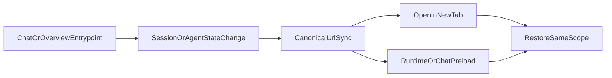

# Stage 55 - Entry Handoff Parity

## Goal

Сделать последние операторски-заметные handoff path'ы canonical: после смены агента в `chat`, смены сессии в `overview` и открытия вкладок через sidebar пользователь должен попадать в тот же URL и в тот же runtime/session scope, который уже видит в UI.

## Why This Step

После Stage 54 основной tab-level deep-link contract уже закрыт, но в entrypoint'ах ещё остаются тонкие разрывы:

- В [C:\Users\Tanya\source\repos\god-mode-core\ui\src\ui\app-render.ts](C:\Users\Tanya\source\repos\god-mode-core\ui\src\ui\app-render.ts) `onAgentChange` меняет `sessionKey`, очищает chat state и грузит историю, но не синхронизирует URL тем же способом, что `switchChatSession()`.
- В [C:\Users\Tanya\source\repos\god-mode-core\ui\src\ui\app-render.helpers.ts](C:\Users\Tanya\source\repos\god-mode-core\ui\src\ui\app-render.helpers.ts) `renderTab()` строит `href` только через `pathForTab(...)`, поэтому middle-click / new tab теряют canonical query context (`session`, tab-specific filters, runtime scope).
- В [C:\Users\Tanya\source\repos\god-mode-core\ui\src\ui\app-render.ts](C:\Users\Tanya\source\repos\god-mode-core\ui\src\ui\app-render.ts) `overview.onSessionKeyChange` всё ещё вызывает `loadRuntimeInspector(... runId: null ...)`, хотя в [C:\Users\Tanya\source\repos\god-mode-core\ui\src\ui\app-settings.ts](C:\Users\Tanya\source\repos\god-mode-core\ui\src\ui\app-settings.ts) уже есть общий routing слой и `loadOverview()` использует handoff-aware runtime preload.
- В [C:\Users\Tanya\source\repos\god-mode-core\ui\src\ui\app-settings.ts](C:\Users\Tanya\source\repos\god-mode-core\ui\src\ui\app-settings.ts) уже существуют `buildTabHref(...)`, `syncUrlWithTab(...)` и `syncUrlWithSessionKey(...)`, так что stage должен переиспользовать текущий contract, а не придумывать новый.

## Scope

Включить только handoff parity для уже существующего state:

- `chat` agent/session handoff
- `overview` session-to-runtime handoff
- canonical sidebar/tab href generation

Не включать:

- новый URL contract для chat draft/sidebar/layout
- новый tab-level parity для `usage`, `logs` или `machine`
- изменения backend API или новых UI surface

## Main Files

- [C:\Users\Tanya\source\repos\god-mode-core\ui\src\ui\app-render.ts](C:\Users\Tanya\source\repos\god-mode-core\ui\src\ui\app-render.ts)
- [C:\Users\Tanya\source\repos\god-mode-core\ui\src\ui\app-render.helpers.ts](C:\Users\Tanya\source\repos\god-mode-core\ui\src\ui\app-render.helpers.ts)
- [C:\Users\Tanya\source\repos\god-mode-core\ui\src\ui\app-settings.ts](C:\Users\Tanya\source\repos\god-mode-core\ui\src\ui\app-settings.ts)
- [C:\Users\Tanya\source\repos\god-mode-core\ui\src\ui\app-settings.test.ts](C:\Users\Tanya\source\repos\god-mode-core\ui\src\ui\app-settings.test.ts)
- При необходимости: [C:\Users\Tanya\source\repos\god-mode-core\ui\src\ui\views\overview-attention.test.ts](C:\Users\Tanya\source\repos\god-mode-core\ui\src\ui\views\overview-attention.test.ts), [C:\Users\Tanya\source\repos\god-mode-core\docs\help\testing.md](C:\Users\Tanya\source\repos\god-mode-core\docs\help\testing.md), [C:\Users\Tanya\source\repos\god-mode-core\docs\web\control-ui.md](C:\Users\Tanya\source\repos\god-mode-core\docs\web\control-ui.md)

## Implementation

1. Выравнять `chat` handoff с уже существующим session URL sync.

- В `onAgentChange` использовать тот же canonical sync path, что и в `switchChatSession()`.
- Убедиться, что после agent switch адресная строка сразу отражает новый `session`, без ожидания следующей навигации.
- Не менять semantics очистки истории, stream state, specialist context и assistant identity.

1. Сделать sidebar/tab ссылки canonical, а не path-only.

- Перевести `renderTab()` с `pathForTab(...)` на helper, который строит `href` через текущий URL contract.
- Для обычного click оставить существующий JS-nav flow через `setTab(...)`.
- Для middle-click, Ctrl/Cmd+click и открытия в новой вкладке выдавать ту же query-строку, которую дал бы `syncUrlWithTab(...)` для текущего host state.

1. Дотянуть `overview` session handoff до того же runtime truth source.

- При `overview.onSessionKeyChange` вычислять тот же runtime target, который использует текущий overview preload / sessions handoff, вместо жёсткого `runId: null`.
- Сохранить safe fallback на `null`, если session row или run ещё не известны.
- После смены сессии URL и preload runtime inspector должны ссылаться на один и тот же operator-visible scope.

1. Зафиксировать focused regressions и короткие docs notes.

- Добавить тест на то, что `chat` agent switch сразу canonical'изирует `session` в URL.
- Добавить тест на то, что sidebar/tab `href` включает актуальный query context хотя бы для одного runtime-aware tab и одного session-only tab.
- Добавить тест на то, что `overview` session switch не теряет truth-aware runtime handoff, когда run уже можно определить.
- Коротко отметить в docs, что новые entrypoint'ы должны либо звать canonical sync helper, либо строить `href` через общий routing contract.

## Suggested Flow

## Expected Outcome

После stage у оператора исчезнут последние заметные расхождения между тем, что уже открыто на экране, и тем, что лежит в URL. Смена агента в `chat`, смена сессии в `overview` и открытие вкладок через sidebar будут вести к одному и тому же shareable состоянию без скрытого stale session/runtime scope.
