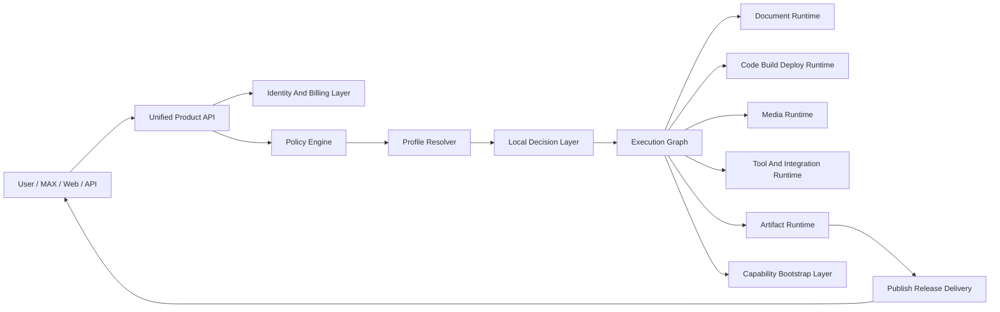

# Sovereign AI Platform Map

## Цель

Построить не просто кастомизированный форк `OpenClaw`, а суверенную агентную платформу для рынка РФ с единым внешним продуктом и подпиской, где:

- пользователь видит одного провайдера и один продуктовый UX;
- внутри работает собственный control plane, который выбирает execution path, модели, document/media/code backends и правила публикации;
- specialist-сценарии получают приоритетное окружение без ручной настройки пользователем;
- универсальные сценарии и развлекательные use cases не запрещаются, а контролируемо сосуществуют со specialist-first логикой;
- архитектура остаётся максимально совместимой с upstream, а основной слой кастомизации живёт поверх ядра.

## Текущая база в репозитории

Форк уже содержит сильные точки расширения, на которые нужно опираться, а не переписывать всё ядро:

- Плагинная и provider-архитектура в [C:/Users/Tanya/source/repos/god-mode-core/src/plugins/types.ts](C:/Users/Tanya/source/repos/god-mode-core/src/plugins/types.ts)
- Центральный вход агентного выполнения в [C:/Users/Tanya/source/repos/god-mode-core/src/commands/agent.ts](C:/Users/Tanya/source/repos/god-mode-core/src/commands/agent.ts)
- Текущий fallback/multi-model слой в [C:/Users/Tanya/source/repos/god-mode-core/src/agents/model-fallback.ts](C:/Users/Tanya/source/repos/god-mode-core/src/agents/model-fallback.ts)
- Встроенный runtime/model/auth retry loop в [C:/Users/Tanya/source/repos/god-mode-core/src/agents/pi-embedded-runner/run.ts](C:/Users/Tanya/source/repos/god-mode-core/src/agents/pi-embedded-runner/run.ts)
- OpenAI-compatible façade в [C:/Users/Tanya/source/repos/god-mode-core/src/gateway/openai-http.ts](C:/Users/Tanya/source/repos/god-mode-core/src/gateway/openai-http.ts)
- Каталог каналов и channel metadata в [C:/Users/Tanya/source/repos/god-mode-core/src/channels/plugins/catalog.ts](C:/Users/Tanya/source/repos/god-mode-core/src/channels/plugins/catalog.ts)
- Security audit baseline в [C:/Users/Tanya/source/repos/god-mode-core/src/security/audit.ts](C:/Users/Tanya/source/repos/god-mode-core/src/security/audit.ts)
- UI i18n база в [C:/Users/Tanya/source/repos/god-mode-core/ui/src/i18n/lib/registry.ts](C:/Users/Tanya/source/repos/god-mode-core/ui/src/i18n/lib/registry.ts) и [C:/Users/Tanya/source/repos/god-mode-core/ui/src/i18n/lib/translate.ts](C:/Users/Tanya/source/repos/god-mode-core/ui/src/i18n/lib/translate.ts)

## Главный архитектурный принцип

Не делать одну «магическую» LLM, которая всё решает. Вместо этого строить платформу из детерминированных и модельных слоёв.

## 8 платформенных модулей

### 1. Unified Product Facade

Назначение:

- единая точка входа для Web UI, MAX, API, mobile, future desktop;
- единая подписка и единый биллинг;
- единое внешнее contract/API, даже если внутри разные движки.

Что означает practically:

- снаружи продукт выглядит как один «провайдер»;
- OpenAI-compatible и native API работают как фасады, а не как центр логики;
- `routerai.ru` или любой внешний gateway становится временным backend, а не core architecture.

Точка опоры в текущем коде:

- [C:/Users/Tanya/source/repos/god-mode-core/src/gateway/openai-http.ts](C:/Users/Tanya/source/repos/god-mode-core/src/gateway/openai-http.ts)
- [C:/Users/Tanya/source/repos/god-mode-core/src/gateway/server-methods/agent.ts](C:/Users/Tanya/source/repos/god-mode-core/src/gateway/server-methods/agent.ts)

### 2. Policy Engine

Назначение:

- до любого модельного вызова определять ограничения исполнения;
- отделить безопасность, data governance и compliance от prompt engineering.

Что должен решать:

- можно ли отправлять данные во внешний backend;
- можно ли сохранять transcript/артефакт;
- допустимы ли tools/install/deploy/publish;
- какой профиль хранения и аудита нужен;
- какой уровень автономности доступен.

Важно:

- этот слой не должен зависеть от ответа LLM;
- правила должны быть проверяемыми, логируемыми и тестируемыми.

Точка опоры:

- [C:/Users/Tanya/source/repos/god-mode-core/src/security/audit.ts](C:/Users/Tanya/source/repos/god-mode-core/src/security/audit.ts)
- plugin hooks в [C:/Users/Tanya/source/repos/god-mode-core/src/plugins/types.ts](C:/Users/Tanya/source/repos/god-mode-core/src/plugins/types.ts)

### 3. Profile Resolver

Назначение:

- автоматически определять ведущий specialist-профиль пользователя и активный task profile на текущий запрос;
- не привязывать пользователя навсегда к одному профилю.

Ключевой принцип:

- у пользователя есть `base profile`, но каждый запрос получает `task overlay`.
- Строитель может запускать media-задачу, а разработчик может анализировать PDF.
- Specialist-first не должен запрещать general/fun use cases.

Модель работы:

- `base profile`: долгоживущий профиль пользователя или команды;
- `session profile`: текущая рабочая сессия;
- `task overlay`: временное переопределение под конкретную задачу;
- `execution recipe`: итоговый план среды, моделей, tools и publish targets.

Примеры профилей:

- `builder`
- `developer`
- `integrator`
- `operator`
- `media_creator`
- `general`

Как определять потребность пользователя без ручного участия:

- анализ первых диалогов и файловых/канальных сигналов;
- анализ повторяющихся artifact типов;
- анализ используемых tools и целевых publish workflows;
- анализ доменных сущностей (смета, PDF, GitHub, домен, релиз, видео и т.п.);
- soft scoring профилей, а не жёсткий one-shot выбор.

Правило безопасности:

- профиль никогда не даёт скрытых полномочий сам по себе;
- он только повышает приоритет окружения, подсказок и capability selection.

### 4. Local Decision Layer

Назначение:

- дешёвый локальный слой классификации, triage и plan selection.

Что именно должен делать:

- определить intent;
- определить домен;
- классифицировать задачу по типу исполнения;
- понять, нужен ли OCR/VLM/code/deploy/media pipeline;
- выбрать template execution recipe;
- оптимизировать prompt и context budget.

Что не должен делать:

- принимать финальные policy/compliance решения;
- быть единственным reasoner для сложных high-stakes задач;
- превращаться в новый непрозрачный монолит.

Подход:

- маленькая локальная модель через `Ollama` или аналогичный локальный runtime;
- deterministic post-processing поверх ответа модели;
- structured JSON output вместо свободного текста.

### 5. Execution Graph

Назначение:

- заменить текущий «размазанный» orchestration типизированным execution graph.

Почему это нужно:

- сейчас логика размазана между [C:/Users/Tanya/source/repos/god-mode-core/src/commands/agent.ts](C:/Users/Tanya/source/repos/god-mode-core/src/commands/agent.ts), [C:/Users/Tanya/source/repos/god-mode-core/src/agents/model-fallback.ts](C:/Users/Tanya/source/repos/god-mode-core/src/agents/model-fallback.ts) и [C:/Users/Tanya/source/repos/god-mode-core/src/agents/pi-embedded-runner/run.ts](C:/Users/Tanya/source/repos/god-mode-core/src/agents/pi-embedded-runner/run.ts);
- продукту нужен не только выбор модели, а выбор всего маршрута исполнения.

Что должен уметь execution graph:

- `general_reasoning`
- `doc_ingest`
- `ocr_extract`
- `table_extract`
- `diagram_understanding`
- `code_build_publish`
- `artifact_create`
- `media_generate`
- `tool_bootstrap`
- `deploy_release`

Ключевое уточнение:

- это не список жёстко прошитых ручек, который потом можно расширять только ручным деплоем ядра;
- это registry `execution recipes`, где каждый recipe описывается контрактом, capability requirements, тестами и policy-маркировкой;
- ядро должно знать не бизнес-логику каждого recipe, а только общий контракт запуска и оркестрации.

Как расширять execution graph без грязных патчей:

- новый recipe регистрируется как новый модуль/плагин;
- recipe декларирует свои входы, выходы, capability dependencies, risk level и publish behavior;
- planner выбирает recipe по registry и policy, а не по захардкоженному `if/else`;
- deployment нового recipe действительно потребует поставки нового модуля, но не переписывания orchestration core.

Минимальный контракт recipe:

- `id`
- `purpose`
- `accepted_inputs`
- `produced_artifacts`
- `required_capabilities`
- `allowed_profiles`
- `risk_level`
- `test_suite`
- `health_check`
- `publish_targets`

Следствие:

- если завтра нужен новый путь вроде `cad_extract` или `ifc_validate`, это не повод лезть в сердце системы;
- мы добавляем новый recipe package, тесты, health-check и capability descriptor.

### 6. Specialist Runtimes

Назначение:

- выполнять задачи не одной универсальной моделью, а подходящими runtime-классами.

Подмодули:

- `Document Runtime`
  - PDF, OCR, layout analysis, table extraction, structured outputs
  - кандидат на future integration: `GLM-OCR`
- `Code/Build/Deploy Runtime`
  - код, тесты, CI/CD, домены, preview, релизы, бинарники
- `Media Runtime`
  - image/video/avatar generation, async jobs, preview queue
  - future candidate: `LongCat-Video` как отдельный media backend, не core runtime
- `Tool/Integration Runtime`
  - GitHub, домены, облака, хранилища, каналы, внешние SaaS/APIs

Принцип:

- каждый runtime отвечает за свой класс артефактов и окружений;
- reasoning-модель лишь координирует, а не заменяет эти пайплайны.

### 7. Artifact Runtime

Назначение:

- сделать документы, сметы, сайты, релизы, бинарники, отчёты и видео first-class сущностями.

Почему это критично:

- без artifact runtime система остаётся «чатом», а не production assistant;
- пользователь должен получать не только текст, а материализованный результат.

Что нужно моделировать:

- `artifact.create`
- `artifact.update`
- `artifact.version`
- `artifact.preview`
- `artifact.publish`
- `artifact.approve`
- `artifact.retain/delete`

Примеры:

- строитель получает структурированный extraction + отчёт + экспорт;
- разработчик получает preview URL + git commit + release artifact;
- media user получает job status + rendered output + shareable asset.

### 8. Capability Bootstrap Layer

Назначение:

- дать системе возможность доустанавливать недостающие компоненты, но только контролируемо.

Главный принцип:

- не `install anything from the internet`;
- а `resolve approved capability package`.

Как должно работать:

- planner определяет недостающую capability;
- bootstrap layer ищет её в доверенном каталоге;
- capability ставится в sandbox или отдельный runtime;
- проходит health-check;
- регистрируется как доступный execution capability;
- логируется в audit trail.

Примеры capability-пакетов:

- `pdf-table-extractor`
- `ifc-parser`
- `ollama-local-tier`
- `github-publish-pack`
- `domain-bind-pack`
- `apk-build-pack`

## Механизм Specialist Profiles без ручного участия

Это центральный пробел, который надо закрыть чистой архитектурой.

### Базовая модель

Профили не создаются «вручную пользователем» и не фиксируются навсегда. Вместо этого нужен pipeline:

- `signal ingestion`
- `profile scoring`
- `profile proposal`
- `silent activation`
- `confidence-based refinement`

### Источники сигналов

- текст первых запросов;
- типы файлов и вложений;
- тип целевых действий (`проанализируй смету`, `задеплой сайт`, `сгенерируй видео`);
- подключённые аккаунты и интеграции;
- история последних артефактов;
- runtime success patterns.

### Как не сломать универсальность

Использовать двухслойную модель выбора:

- `who_the_user_usually_is`
- `what_this_request_needs_now`

То есть:

- строитель по умолчанию получает document-first окружение;
- но если он просит сделать image/video, task overlay включает media runtime;
- developer по умолчанию получает code/deploy-first;
- но может уйти в OCR или general chat без смены identity.

### Что не делать

- не запирать пользователя в жёсткий persona режим;
- не выбирать specialist profile один раз на onboarding и навсегда;
- не прятать от пользователя, что сейчас выбран runtime/class profile.

## Стартовая продуктовая стратегия

### Почему нужен не один жирный план

Один большой план здесь опасен по трём причинам:

- нельзя понять, что именно уже работает, а что существует только в тексте;
- сложно строить тестовое покрытие, когда границы этапов не определены;
- легко сломать upstream-совместимость, если начать менять ядро сразу во многих местах.

Поэтому реализация должна идти через короткие этапы с проверяемым результатом.

## Delivery Model

### Принцип движения

Каждый этап должен иметь:

- архитектурную цель;
- минимальный набор файлов и модулей;
- список тестов;
- критерий готовности;
- список того, что сознательно не делаем в этом этапе.

### Типы тестов по умолчанию

- `unit`: чистая логика, scoring, policy, recipe resolution
- `integration`: взаимодействие нескольких модулей
- `protocol`: совместимость с текущими gateway/provider contracts
- `safety`: запреты, approvals, high-risk actions
- `smoke`: быстрые end-to-end проверки основных сценариев

## Phased Roadmap

### Этап 0. Architecture Baseline

Цель:

- превратить текущую карту в рабочую программу поставки;
- определить стабильные seams в ядре;
- описать target modules и контракт их взаимодействия.

Что входит:

- decomposition архитектуры;
- описание extension seams поверх [C:/Users/Tanya/source/repos/god-mode-core/src/commands/agent.ts](C:/Users/Tanya/source/repos/god-mode-core/src/commands/agent.ts) и [C:/Users/Tanya/source/repos/god-mode-core/src/agents/pi-embedded-runner/run.ts](C:/Users/Tanya/source/repos/god-mode-core/src/agents/pi-embedded-runner/run.ts);
- описание registry execution recipes;
- описание базового artifact model.

Что тестируем:

- schema tests для profile, recipe, artifact и capability descriptors;
- contract tests на совместимость registry с текущим plugin API;
- snapshot tests для конфигурационных структур.

Критерий готовности:

- дальнейшие этапы можно строить без архитектурной двусмысленности;
- есть отдельные документы на profile system, execution graph, capability catalog и artifact model.

### Этап 1. Policy And Profile Foundation

Цель:

- научить систему автоматически понимать, какой контекст и какой runtime-path нужны пользователю, не лишая его универсальности.

Что входит:

- `Profile Resolver`;
- `task overlay` model;
- `Policy Engine foundation`;
- basic scoring signals;
- distinction между `base profile` и `current task`.

Что тестируем:

- unit tests на profile scoring;
- unit tests на overlay selection;
- safety tests, что specialist profile не даёт скрытых полномочий;
- integration tests, что general/fun task не блокируется у specialist user.

Критерий готовности:

- builder и developer сценарии уже различаются по execution preference;
- один и тот же пользователь может без ручной смены профиля уйти в general/media task.

### Этап 2. Execution Graph Foundation

Цель:

- заменить ad-hoc routing на registry recipes и execution contracts.

Что входит:

- recipe registry;
- planner output schema;
- recipe resolution;
- связка planner -> recipe -> runtime adapter;
- первые recipes: `general_reasoning`, `doc_ingest`, `code_build_publish`.

Что тестируем:

- unit tests на recipe resolution;
- integration tests planner-to-recipe;
- protocol tests с текущим gateway ingress;
- fallback tests, что registry не ломает существующий agent path.

Критерий готовности:

- система выбирает не просто модель, а recipe;
- добавление нового recipe не требует переписывать orchestration core.

### Этап 3. Builder Specialist Runtime

Цель:

- дать реальную ценность документным и строительным сценариям.

Что входит:

- document runtime foundation;
- `doc_ingest`, `ocr_extract`, `table_extract`;
- подготовка к future integration с OCR/VLM backends;
- structured outputs для документов и табличных данных.

Что тестируем:

- fixture tests на PDF/scan/table inputs;
- extraction correctness tests;
- artifact tests на structured JSON output;
- regression tests, что обычный general chat не ломается.

Критерий готовности:

- builder profile получает document-first behavior;
- документы становятся обрабатываемыми сущностями, а не только текстом в чате.

### Этап 4. Developer Publish Runtime

Цель:

- сделать developer path publish-first, а не “написал код и остановился”.

Что входит:

- `code_build_publish`;
- preview/release/deploy abstractions;
- credential binding model;
- publish targets для git, preview, binaries и future domain binding.

Что тестируем:

- integration tests на git/publish orchestration;
- mock tests на credentials flow;
- safety tests на publish approvals;
- artifact tests на release outputs.

Критерий готовности:

- developer runtime умеет не только генерировать код, но и материализовать результат;
- пользователь видит URL, artifact или release candidate.

### Этап 5. Controlled Bootstrap Layer

Цель:

- разрешить системе доустанавливать недостающие возможности без превращения в supply-chain chaos.

Что входит:

- capability catalog;
- capability resolver;
- sandboxed installer;
- health-check pipeline;
- audit trail.

Что тестируем:

- unit tests на capability resolution;
- integration tests на install -> health-check -> register;
- safety tests на запрет произвольных установок;
- failure tests на rollback/degraded mode.

Критерий готовности:

- система умеет расширять среду сама, но только через approved packages.

### Этап 6. User Machine Control

Цель:

- оставить возможность управлять машиной пользователя как отдельную high-risk функцию, а не как скрытый side effect обычного бота.

Что входит:

- device linking flow в личном кабинете;
- explicit trust contract “на свой риск”;
- отдельный machine-control profile;
- ограниченный command surface;
- approvals, kill switch, audit log, session isolation.

Что тестируем:

- link/unlink tests;
- permission boundary tests;
- kill-switch tests;
- safety tests на запрет machine-control без явной привязки устройства.

Критерий готовности:

- machine-control не смешан с обычным general assistant behavior;
- high-risk контур можно отключить полностью без влияния на остальной продукт.

### Этап 7. UI/UX And Channel Track

Цель:

- сделать продукт понятным и локализованным, не дожидаясь завершения всей backend-революции.

Что входит:

- русификация UI;
- specialist profile UX;
- artifact-centered UI;
- capability/install statuses;
- publish progress states;
- MAX integration track;
- личный кабинет: аккаунт, устройство, ключи, связки интеграций.

Что тестируем:

- UI unit/component tests;
- i18n coverage tests;
- contract tests между backend state и control UI;
- smoke tests по основным русифицированным flows.

Критерий готовности:

- продукт перестаёт ощущаться как upstream control UI;
- пользователь видит specialist/runtime/artifact модель в интерфейсе.

### Этап 8. Media And Extended Specialist Packs

Цель:

- расширить платформу медиа и вертикальными доменными пакетами после стабилизации control plane.

Что входит:

- media runtime;
- async generation jobs;
- video/image pipelines;
- vertical packs для отраслей;
- domain knowledge/tool chains.

Что тестируем:

- async job tests;
- quota/cost policy tests;
- artifact render tests;
- capability isolation tests.

Критерий готовности:

- тяжёлые media сценарии не разрушают основной orchestration слой;
- vertical packs расширяют продукт через модули, а не через разрастание ядра.

## V1/V2/V3 Boundary

### V1

Входит:

- Этап 0
- Этап 1
- Этап 2
- Этап 3 foundation
- Этап 7 foundation

Не входит:

- полноценный media runtime;
- сложный bootstrap marketplace;
- управление машиной пользователя в production-ready виде;
- full domain pack ecosystem.

### V2

Входит:

- Этап 4
- Этап 5
- Этап 6 foundation
- Этап 7 расширение

### V3

Входит:

- Этап 8
- deeper verticalization
- controlled fine-tuning/post-training strategy

## Что сознательно не делать в начале

- не строить сразу свою большую foundation model;
- не отдавать security/policy решения на усмотрение LLM;
- не разрешать произвольную установку из интернета;
- не превращать `.md` в центр исполнения;
- не тащить тяжёлые media сценарии в ядро v1.

## Документационный каркас, который нужно поддерживать всю разработку

Чтобы не потерять мысль по ходу работы, нужен не один markdown-файл, а небольшой архитектурный doc-set.

Набор документов:

- `Product Vision`: зачем существует платформа и чем она отличается от OpenClaw
- `Platform Map`: целевая архитектура и 8 модулей
- `Execution Recipes`: какие типы задач и какие runtime paths существуют
- `Specialist Profiles`: base profiles, overlays, scoring, capability priorities
- `Capability Catalog`: доверенные bootstrap packages и health checks
- `Artifact Model`: какие сущности продукт материализует
- `Security And Data Policy`: архитектурные правила под data governance и future compliance
- `Upstream Strategy`: какие зоны остаются близкими к upstream, какие являются platform layer

## Стратегия совместимости с upstream

Чтобы не потерять возможность тянуть изменения из основного репозитория:

- platform-specific logic по возможности выносить в новые плагины/сервисы/модули, а не размазывать по ядру;
- изменения в [C:/Users/Tanya/source/repos/god-mode-core/src/commands/agent.ts](C:/Users/Tanya/source/repos/god-mode-core/src/commands/agent.ts) и [C:/Users/Tanya/source/repos/god-mode-core/src/agents/pi-embedded-runner/run.ts](C:/Users/Tanya/source/repos/god-mode-core/src/agents/pi-embedded-runner/run.ts) делать только там, где создаются стабильные extension seams;
- specialist/platform logic документировать как отдельный layer поверх core;
- channel/provider/vertical additions вести как modular packages.

## Ближайшее логическое продолжение после принятия карты

После утверждения этой карты следующий шаг должен быть не «сразу кодить всё», а детализировать первую рабочую волну:

- какие exactly модули входят в Этап 0 и Этап 1;
- какие тестовые suites обязательны уже в первой волне;
- как выглядит recipe registry и profile schema;
- какие backend seams в ядре нужны первыми;
- где проходит граница между orchestration core, platform layer и UI/UX track;
- что можно поставить в реализацию сразу, а что пока оставить только как архитектурный контракт.
