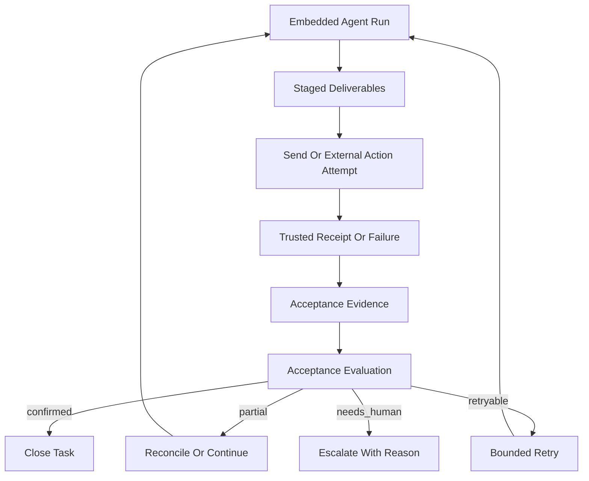

# Stage 10: Verified Delivery And Outcome Receipts

## Goal

Сделать так, чтобы backend опирался не только на `prepared reply payloads`, tool text и checkpoint closure, а на реальные machine-checkable receipts после отправки и после внешних side effects.

Итог этого этапа: система должна различать:

- `staged` — payload/side effect подготовлен
- `attempted` — отправка или действие реально было запущено
- `confirmed` — есть trusted receipt успешного завершения
- `partial` — что-то сделано, но closure не доказан полностью
- `failed` — действие не произошло или подтверждённо не доставлено

## Why This Is The Strongest Next Step

После `Stage 9` у нас уже есть:

- canonical execution input для messaging ingress
- acceptance-driven orchestration для main reply/followup/cron
- richer deliverable evidence
- durable pending automation

Но главный remaining backend gap теперь в другом: acceptance всё ещё во многом принимает решение по `prepared output`, а не по факту того, что внешний мир реально получил сообщение или side effect действительно материализовался.

Сейчас strongest next step — убрать разницу между:

- `мы подготовили/сгенерировали deliverable`
- `мы реально доказуемо доставили/выполнили его`

Именно это приблизит продукт к состоянию, где бот не только умно оркестрирует execution, но и умеет честно подтверждать, что задача действительно доведена до результата.

## Product Outcome

- Main messaging ingress получает post-send truth, а не только pre-send payload evidence.
- Acceptance умеет различать `staged delivery`, `attempted delivery`, `confirmed delivery`, `partial delivery`, `delivery failure`.
- Followup/persisted automation умеет reconcile partial success и send-failure без тупых loops.
- Tool/artifact/bootstrap side effects получают stronger attestation contract там, где trusted receipts уже доступны.
- Runtime остаётся лёгким: никаких тяжёлых workflow engine или глобального scheduler.

## Current Anchors

- Messaging acceptance/evidence уже считается в `src/auto-reply/reply/agent-runner-helpers.ts`.
- Main reply path уже строит semantic decisions в `src/auto-reply/reply/agent-runner.ts`.
- Followup orchestration уже использует acceptance-driven behavior в `src/auto-reply/reply/followup-runner.ts`.
- Outbound routing уже возвращает concrete send result в `src/auto-reply/reply/route-reply.ts`.
- Outbound delivery queue и recovery уже существуют в `src/infra/outbound/deliver.ts` и связанных runtime/store файлах.
- Runtime acceptance contract уже живёт в `src/platform/runtime/contracts.ts` и `src/platform/runtime/service.ts`.
- Cron уже ближе к delivery-aware closure в `src/cron/isolated-agent/run.ts` и `src/cron/isolated-agent/delivery-dispatch.ts`.

## Architecture Sketch

## Workstreams

### 1. Delivery Receipt Contract

Ввести явный contract для post-send delivery receipts и delivery-aware acceptance evidence, чтобы backend больше не путал prepared payloads с подтверждённой доставкой.

Основные файлы:

- `src/platform/runtime/contracts.ts`
- `src/platform/runtime/service.ts`
- `src/auto-reply/reply/agent-runner-helpers.ts`
- `src/auto-reply/reply/route-reply.ts`
- `src/infra/outbound/deliver.ts`

Ключевой результат:

- acceptance получает разные evidence signals для `payload prepared`, `delivery attempted`, `delivery confirmed`, `delivery failed`, `delivery partial`.

### 2. Post-Send Closure On Main Messaging Ingress

Замкнуть основной main reply path на post-dispatch outcome, чтобы semantic closure учитывал реальный результат delivery, а не только reply payload shape.

Основные файлы:

- `src/auto-reply/reply/agent-runner.ts`
- `src/auto-reply/reply/dispatch-from-config.ts`
- `src/auto-reply/reply/reply-dispatcher.ts`
- `src/auto-reply/reply/agent-runner-helpers.ts`
- `src/platform/runtime/service.ts`

Ключевой результат:

- main ingress может честно различить "ответ сформирован" и "ответ реально ушёл/не ушёл".

### 3. Followup Reconciliation For Partial Delivery

Добавить bounded reconciliation для followup automation и persisted retries, когда delivery partially succeeded или failed after semantic success.

Что нужно:

- no duplicate spam on already-confirmed parts
- bounded retry only for retryable receipt classes
- escalation on deterministic send-denial / human-required cases
- restart-safe rehydrate для незакрытых reconciliation items

Основные файлы:

- `src/auto-reply/reply/followup-runner.ts`
- `src/auto-reply/reply/queue/state.ts`
- `src/auto-reply/reply/queue/enqueue.ts`
- `src/auto-reply/reply/queue/drain.ts`
- `src/infra/outbound/delivery-queue-recovery.ts`

Ключевой результат:

- persisted automation умеет доводить partial delivery до closure без бесконечных loops и без тяжёлого scheduler.

### 4. Stronger Side-Effect Attestations Beyond Messaging

Усилить machine-checkable receipts для side effects вне messaging delivery: artifacts, bootstrap/materialization, tool-backed external effects, где trusted receipts уже существуют или могут быть cheaply surfaced.

Основные файлы:

- `src/platform/artifacts/service.ts`
- `src/platform/bootstrap/service.ts`
- `src/agents/pi-embedded-runner/run.ts`
- `src/agents/pi-embedded-subscribe.handlers.tools.ts`
- `src/platform/runtime/contracts.ts`
- `src/platform/runtime/service.ts`

Ключевой результат:

- acceptance меньше зависит от text-level claims и лучше различает "сказал, что сделал" от "есть receipt, что сделал".

### 5. Deterministic Verified-Outcome Scenarios

Закрепить stage короткими deterministic backend scenarios, где решающим является post-send/post-side-effect receipt, а не только payload text.

Сценарии:

- main messaging path: staged payload есть, но send failed → no false satisfied
- main messaging path: send succeeded → task closes with confirmed delivery evidence
- partial delivery → reconcile path без unbounded retry
- human-required delivery failure → explicit escalation без loop
- restart-safe persisted reconciliation item → rehydrates and continues predictably

Основные файлы:

- `src/auto-reply/reply/agent-runner.misc.runreplyagent.test.ts`
- `src/auto-reply/reply/followup-runner.test.ts`
- `src/auto-reply/reply/route-reply.test.ts`
- `src/platform/runtime/service.test.ts`
- `src/cron/isolated-agent/run.interim-retry.test.ts`
- `docs/help/testing.md`

Ключевой результат:

- минимум один deterministic scenario доказывает closure по real receipt, а не по staged output.

## Sequencing

1. Сначала ввести delivery receipt contract и delivery-aware acceptance evidence.
2. Затем замкнуть main ingress на post-send closure.
3. После этого добавить followup/persisted reconciliation для partial delivery.
4. Потом усилить non-messaging side-effect attestations.
5. В конце закрепить stage deterministic scenarios и testing guidance.

## Performance Guardrails

- Не переносить acceptance/reconciliation в streaming hot path; только на result/send boundaries.
- Не требовать глобального ACK там, где provider его не даёт; использовать только already trusted receipts.
- Не строить новый workflow engine; reuse существующие queue/recovery patterns.
- Retry/reconcile state держать bounded, cheap и append-friendly.
- Scenario suite держать короткой и CI-stable.

## Guardrails

- Не смешивать `prepared payload count` с подтверждённой доставкой.
- Не пытаться добиться "идеального универсального receipt" для всех каналов; использовать capability-specific truth.
- Не делать reconciliation безграничным; partial success не должен вызывать spam loops.
- Не размазывать stage в общий “event sourcing rewrite”.
- Не откладывать main ingress truth ради будущего UI; backend contract должен быть честным уже сейчас.

## Validation Target

- `pnpm tsgo`
- `pnpm build`
- targeted auto-reply/outbound/runtime/cron tests
- минимум один deterministic main-ingress scenario, где staged output не считается delivered truth
- минимум один scenario, где confirmed send переводит run в honest closure
- минимум один scenario с partial delivery reconciliation без infinite retry
