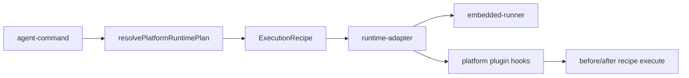

# Stage 31: Execution Runtime Activation

## Why This Next

После `Stage 30` session/gateway contract стал заметно чище, но это всё ещё в первую очередь **transport and orchestration hygiene**. Для движения к рабочему `v1` следующий шаг должен дать уже не только правильный wire contract, а **реальный execution behavior**: система должна выбирать и применять execution recipe на живом agent path, а не только иметь platform-модули в репозитории.

Сейчас в коде уже есть сильный фундамент:

- `[C:\Users\Tanya\source\repos\god-mode-core\src\agents\agent-command.ts](C:\Users\Tanya\source\repos\god-mode-core\src\agents\agent-command.ts)` уже считает `platformRuntimePlan` через `resolvePlatformRuntimePlan(...)`.
- `[C:\Users\Tanya\source\repos\god-mode-core\src\platform\recipe\defaults.ts](C:\Users\Tanya\source\repos\god-mode-core\src\platform\recipe\defaults.ts)` уже содержит стартовый набор recipes (`general_reasoning`, `doc_ingest`, `ocr_extract`, `table_extract`, `code_build_publish`, ...).
- `[C:\Users\Tanya\source\repos\god-mode-core\src\platform\SEAMS.md](C:\Users\Tanya\source\repos\god-mode-core\src\platform\SEAMS.md)` уже фиксирует правильный архитектурный путь: не форкать core, а использовать существующие hooks/plugin seams.

Но для `v1` надо закрыть главный разрыв: **recipe/planner должны реально менять путь исполнения и проходить через те же runtime/plugin hooks, что и обычный agent run**.

## Goal

Сделать первый по-настоящему рабочий platform execution path для `v1`, где:

- planner/recipe selection влияет на реальный `agent` / embedded runner flow;
- существующие recipes становятся не просто metadata, а execution intent для runtime и hooks;
- platform plugin/hook path становится проверяемой и стабильной точкой расширения;
- добавление нового recipe дальше идёт шаблонно, без расползания логики по core.

## Scope

### 1. Audit the current platform wiring gap

Проверить и явно зафиксировать, где `platformRuntimePlan` уже доходит до runtime, а где влияние пока только частичное.

Основные файлы:

- `[C:\Users\Tanya\source\repos\god-mode-core\src\agents\agent-command.ts](C:\Users\Tanya\source\repos\god-mode-core\src\agents\agent-command.ts)`
- `[C:\Users\Tanya\source\repos\god-mode-core\src\agents\pi-embedded-runner\run.ts](C:\Users\Tanya\source\repos\god-mode-core\src\agents\pi-embedded-runner\run.ts)`
- `[C:\Users\Tanya\source\repos\god-mode-core\src\platform\recipe\runtime-adapter.ts](C:\Users\Tanya\source\repos\god-mode-core\src\platform\recipe\runtime-adapter.ts)`
- `[C:\Users\Tanya\source\repos\god-mode-core\src\platform\plugin.ts](C:\Users\Tanya\source\repos\god-mode-core\src\platform\plugin.ts)`

Нужно сохранить принцип из `SEAMS.md`: **минимальный upstream-safe orchestration seam**, без большого рефакторинга `agent-command` или runner.

### 2. Activate recipe selection on the real execution path

Для `v1` достаточно ограниченного, но рабочего набора execution routes:

- `general_reasoning`
- `doc_ingest`
- `code_build_publish`

В этой стадии recipe должен реально влиять как минимум на:

- execution intent / runtime context;
- timeout / capability expectations;
- profile-aware system prompt/runtime behavior там, где это уже поддержано существующим runtime adapter.

Важно: не пытаться разом активировать весь каталог recipes. Для `v1` лучше 2-3 надёжно работающих route, чем широкий, но декоративный registry.

### 3. Stabilize the plugin/hook path

Закрепить platform extension path через существующие seams, а не через размазывание recipe-логики в core:

- `before_agent_start`
- `before_model_resolve`
- `before_prompt_build`
- `before_recipe_execute`
- `after_recipe_execute`

Ключевая цель: recipe/profile/runtime context должен проходить один и тот же lifecycle, независимо от того, идёт ли запуск из CLI или через gateway ingress.

Основные зоны:

- `[C:\Users\Tanya\source\repos\god-mode-core\src\plugins\types.ts](C:\Users\Tanya\source\repos\god-mode-core\src\plugins\types.ts)`
- `[C:\Users\Tanya\source\repos\god-mode-core\src\platform\plugin.ts](C:\Users\Tanya\source\repos\god-mode-core\src\platform\plugin.ts)`
- `[C:\Users\Tanya\source\repos\god-mode-core\src\agents\agent-command.ts](C:\Users\Tanya\source\repos\god-mode-core\src\agents\agent-command.ts)`
- `[C:\Users\Tanya\source\repos\god-mode-core\src\gateway\server-methods\agent.ts](C:\Users\Tanya\source\repos\god-mode-core\src\gateway\server-methods\agent.ts)`

### 4. Lock a v1 regression matrix

Добавить regression coverage не на абстрактные helper’ы, а на живой путь:

- planner input -> selected recipe;
- recipe -> runtime context / timeout / execution intent;
- CLI `agent` path;
- gateway ingress path;
- fallback path не ломается, если recipe не требует special handling.

Опорные тестовые зоны:

- `[C:\Users\Tanya\source\repos\god-mode-core\src\agents\agent-command.ts](C:\Users\Tanya\source\repos\god-mode-core\src\agents\agent-command.ts)`
- `[C:\Users\Tanya\source\repos\god-mode-core\src\gateway\server-methods\agent.test.ts](C:\Users\Tanya\source\repos\god-mode-core\src\gateway\server-methods\agent.test.ts)`
- platform runtime / recipe tests рядом с `src/platform/recipe/`* и `src/platform/plugin.ts`

### 5. Document extension rules for future recipes

Коротко зафиксировать:

- где добавляется новый recipe;
- как он попадает в planner/runtime path;
- какие hook points считаются canonical;
- что нельзя делать: не обходить plugin seams и не размазывать recipe policy по core.

## Likely Files

- `[C:\Users\Tanya\source\repos\god-mode-core\src\agents\agent-command.ts](C:\Users\Tanya\source\repos\god-mode-core\src\agents\agent-command.ts)`
- `[C:\Users\Tanya\source\repos\god-mode-core\src\agents\pi-embedded-runner\run.ts](C:\Users\Tanya\source\repos\god-mode-core\src\agents\pi-embedded-runner\run.ts)`
- `[C:\Users\Tanya\source\repos\god-mode-core\src\platform\recipe\runtime-adapter.ts](C:\Users\Tanya\source\repos\god-mode-core\src\platform\recipe\runtime-adapter.ts)`
- `[C:\Users\Tanya\source\repos\god-mode-core\src\platform\recipe\defaults.ts](C:\Users\Tanya\source\repos\god-mode-core\src\platform\recipe\defaults.ts)`
- `[C:\Users\Tanya\source\repos\god-mode-core\src\platform\plugin.ts](C:\Users\Tanya\source\repos\god-mode-core\src\platform\plugin.ts)`
- `[C:\Users\Tanya\source\repos\god-mode-core\src\plugins\types.ts](C:\Users\Tanya\source\repos\god-mode-core\src\plugins\types.ts)`
- `[C:\Users\Tanya\source\repos\god-mode-core\src\gateway\server-methods\agent.ts](C:\Users\Tanya\source\repos\god-mode-core\src\gateway\server-methods\agent.ts)`
- `[C:\Users\Tanya\source\repos\god-mode-core\docs\help\testing.md](C:\Users\Tanya\source\repos\god-mode-core\docs\help\testing.md)`

## Execution Outline

## Validation

- Targeted tests prove planner/recipe selection reaches the real execution path.
- Gateway ingress and direct agent path stay consistent.
- Existing fallback/model selection regressions remain green.
- `pnpm build` passes.
- Targeted runtime/gateway/platform tests pass.

## Exit Criteria

- `platformRuntimePlan` больше не декоративный: он реально влияет на execution path для ограниченного `v1` recipe set.
- Новый recipe можно добавить через registry + adapter + hooks без переписывания orchestration core.
- CLI и gateway используют один и тот же canonical recipe/runtime path.
- Plugin seams остаются главным механизмом расширения, без большого форка core.

## Non-Goals

- Не расширять сейчас снова gateway session contract после закрытого Stage 30.
- Не пытаться активировать весь каталог recipes за один этап.
- Не делать тотальный рефакторинг `agent-command` / embedded runner.
- Не уходить сейчас в большой UI stage вместо execution foundation.
