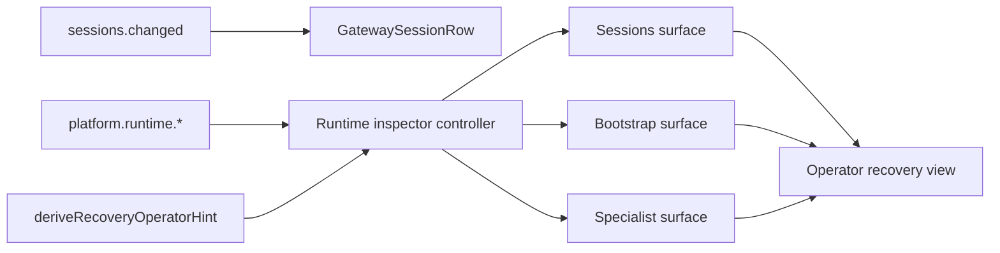

# Stage 34: Runtime Operator Surfaces

## Why This Next

После `Stage 33` у платформы уже есть discoverable catalog (`recipes` / `capabilities`), но следующая практическая дыра для `v1` находится не в metadata, а в **operator runtime flow**: backend уже умеет хранить и отдавать `checkpoints`, `actions`, `closures`, а UI почти не использует этот ledger.

Сейчас foundation уже есть:

- [c:\Users\Tanya\source\repos\god-mode-core\src\platform\runtime\gateway.ts](c:\Users\Tanya\source\repos\god-mode-core\src\platform\runtime\gateway.ts) уже отдаёт `platform.runtime.actions.`*, `platform.runtime.checkpoints.`*, `platform.runtime.closures.*`, включая `operatorHint` для checkpoint surfaces.
- [c:\Users\Tanya\source\repos\god-mode-core\src\platform\runtime\recovery-operator-hint.ts](c:\Users\Tanya\source\repos\god-mode-core\src\platform\runtime\recovery-operator-hint.ts) уже формирует человекочитаемое состояние recovery без второго источника правды.
- [c:\Users\Tanya\source\repos\god-mode-core\ui\src\ui\controllers\sessions.ts](c:\Users\Tanya\source\repos\god-mode-core\ui\src\ui\controllers\sessions.ts) уже протаскивает `recoveryOperatorHint` в `GatewaySessionRow`.
- Но [c:\Users\Tanya\source\repos\god-mode-core\ui\src\ui\views\sessions.ts](c:\Users\Tanya\source\repos\god-mode-core\ui\src\ui\views\sessions.ts) и текущие operator surfaces не превращают эти данные в рабочий v1 recovery/inspection UX.

То есть execution/runtime contract уже есть, но operator пока не видит его как единый usable flow.

## Goal

Сделать первый рабочий operator runtime surface для `v1`, где:

- оператор видит checkpoint/recovery состояние без raw RPC;
- sessions/specialist/bootstrap начинают ссылаться на один и тот же runtime ledger;
- recovery/action/closure inspection становится explainable и discoverable;
- будущие write-heavy operator steps смогут опираться на уже готовую read-side поверхность.

## Scope

### 1. Audit the runtime operator gap

Явно зафиксировать, какие runtime contracts уже есть в gateway, но ещё не используются как operator-facing surface.

Основные файлы:

- [c:\Users\Tanya\source\repos\god-mode-core\src\platform\runtime\gateway.ts](c:\Users\Tanya\source\repos\god-mode-core\src\platform\runtime\gateway.ts)
- [c:\Users\Tanya\source\repos\god-mode-core\src\platform\runtime\service.ts](c:\Users\Tanya\source\repos\god-mode-core\src\platform\runtime\service.ts)
- [c:\Users\Tanya\source\repos\god-mode-core\src\platform\runtime\recovery-operator-hint.ts](c:\Users\Tanya\source\repos\god-mode-core\src\platform\runtime\recovery-operator-hint.ts)
- [c:\Users\Tanya\source\repos\god-mode-core\ui\src\ui\controllers\sessions.ts](c:\Users\Tanya\source\repos\god-mode-core\ui\src\ui\controllers\sessions.ts)
- [c:\Users\Tanya\source\repos\god-mode-core\ui\src\ui\views\sessions.ts](c:\Users\Tanya\source\repos\god-mode-core\ui\src\ui\views\sessions.ts)

Ключевая цель аудита: не изобретать новый orchestration/service слой, а собрать уже существующий runtime ledger в operator-usable contract.

### 2. Add a minimal runtime inspector controller

Добавить read-only UI/controller слой для runtime inspection поверх уже существующих gateway methods:

- `platform.runtime.checkpoints.list|get`
- `platform.runtime.actions.list|get`
- `platform.runtime.closures.list|get`

Минимум для `v1`:

- загрузка checkpoint list по `sessionKey` и/или `runId`;
- базовый detail для выбранного checkpoint/closure/action;
- reuse `operatorHint`, `blockedReason`, `nextActions`, `continuation.state` как canonical operator language.

Опорные зоны:

- [c:\Users\Tanya\source\repos\god-mode-core\ui\src\ui\controllers\bootstrap.ts](c:\Users\Tanya\source\repos\god-mode-core\ui\src\ui\controllers\bootstrap.ts)
- [c:\Users\Tanya\source\repos\god-mode-core\ui\src\ui\controllers\catalog.ts](c:\Users\Tanya\source\repos\god-mode-core\ui\src\ui\controllers\catalog.ts)
- [c:\Users\Tanya\source\repos\god-mode-core\ui\src\ui\types.ts](c:\Users\Tanya\source\repos\god-mode-core\ui\src\ui\types.ts)
- [c:\Users\Tanya\source\repos\god-mode-core\ui\src\ui\app.ts](c:\Users\Tanya\source\repos\god-mode-core\ui\src\ui\app.ts)
- [c:\Users\Tanya\source\repos\god-mode-core\ui\src\ui\app-settings.ts](c:\Users\Tanya\source\repos\god-mode-core\ui\src\ui\app-settings.ts)

### 3. Wire runtime operator context into existing surfaces

Не делать отдельную большую админку; минимально встроить runtime insight туда, где оператор уже смотрит сессии и specialist/bootstrap состояние.

Минимум для `v1`:

- показать `recoveryOperatorHint` и recovery status в sessions surface;
- дать переход/панель с checkpoint detail для выбранной session/run;
- связать specialist/bootstrap контекст с runtime operator queue, чтобы оператор видел не только "что требуется", но и "что сейчас заблокировано / в очереди / завершено".

Опорные зоны:

- [c:\Users\Tanya\source\repos\god-mode-core\ui\src\ui\views\sessions.ts](c:\Users\Tanya\source\repos\god-mode-core\ui\src\ui\views\sessions.ts)
- [c:\Users\Tanya\source\repos\god-mode-core\ui\src\ui\views\specialist-context.ts](c:\Users\Tanya\source\repos\god-mode-core\ui\src\ui\views\specialist-context.ts)
- [c:\Users\Tanya\source\repos\god-mode-core\ui\src\ui\views\bootstrap.ts](c:\Users\Tanya\source\repos\god-mode-core\ui\src\ui\views\bootstrap.ts)
- [c:\Users\Tanya\source\repos\god-mode-core\ui\src\ui\views\overview.ts](c:\Users\Tanya\source\repos\god-mode-core\ui\src\ui\views\overview.ts)

### 4. Lock operator/runtime regressions and docs

Закрепить focused regressions на живом operator contract:

- plugin/runtime gateway surfaces действительно доступны и стабильны;
- `recoveryOperatorHint` и checkpoint summaries доходят до UI без второго источника правды;
- sessions/runtime inspector корректно показывают blocked/in-progress/completed operator state;
- docs/testing guidance отражают новый canonical operator runtime path.

Основные тестовые зоны:

- [c:\Users\Tanya\source\repos\god-mode-core\src\platform\runtime\gateway.test.ts](c:\Users\Tanya\source\repos\god-mode-core\src\platform\runtime\gateway.test.ts)
- [c:\Users\Tanya\source\repos\god-mode-core\src\platform\runtime\recovery-operator-hint.test.ts](c:\Users\Tanya\source\repos\god-mode-core\src\platform\runtime\recovery-operator-hint.test.ts)
- [c:\Users\Tanya\source\repos\god-mode-core\src\platform\plugin.test.ts](c:\Users\Tanya\source\repos\god-mode-core\src\platform\plugin.test.ts)
- [c:\Users\Tanya\source\repos\god-mode-core\ui\src\ui\controllers\sessions.ts](c:\Users\Tanya\source\repos\god-mode-core\ui\src\ui\controllers\sessions.ts)
- [c:\Users\Tanya\source\repos\god-mode-core\ui\src\ui\views\sessions.ts](c:\Users\Tanya\source\repos\god-mode-core\ui\src\ui\views\sessions.ts)
- [c:\Users\Tanya\source\repos\god-mode-core\docs\help\testing.md](c:\Users\Tanya\source\repos\god-mode-core\docs\help\testing.md)

## Likely Files

- [c:\Users\Tanya\source\repos\god-mode-core\src\platform\runtime\gateway.ts](c:\Users\Tanya\source\repos\god-mode-core\src\platform\runtime\gateway.ts)
- [c:\Users\Tanya\source\repos\god-mode-core\src\platform\runtime\recovery-operator-hint.ts](c:\Users\Tanya\source\repos\god-mode-core\src\platform\runtime\recovery-operator-hint.ts)
- [c:\Users\Tanya\source\repos\god-mode-core\src\platform\plugin.test.ts](c:\Users\Tanya\source\repos\god-mode-core\src\platform\plugin.test.ts)
- [c:\Users\Tanya\source\repos\god-mode-core\ui\src\ui\controllers\sessions.ts](c:\Users\Tanya\source\repos\god-mode-core\ui\src\ui\controllers\sessions.ts)
- [c:\Users\Tanya\source\repos\god-mode-core\ui\src\ui\views\sessions.ts](c:\Users\Tanya\source\repos\god-mode-core\ui\src\ui\views\sessions.ts)
- [c:\Users\Tanya\source\repos\god-mode-core\ui\src\ui\views\specialist-context.ts](c:\Users\Tanya\source\repos\god-mode-core\ui\src\ui\views\specialist-context.ts)
- [c:\Users\Tanya\source\repos\god-mode-core\ui\src\ui\views\bootstrap.ts](c:\Users\Tanya\source\repos\god-mode-core\ui\src\ui\views\bootstrap.ts)
- [c:\Users\Tanya\source\repos\god-mode-core\ui\src\ui\types.ts](c:\Users\Tanya\source\repos\god-mode-core\ui\src\ui\types.ts)
- [c:\Users\Tanya\source\repos\god-mode-core\docs\help\testing.md](c:\Users\Tanya\source\repos\god-mode-core\docs\help\testing.md)

## Execution Outline

## Validation

- Targeted tests prove runtime checkpoint/action/closure surfaces are operator-usable through UI wiring, not only via raw RPC.
- `recoveryOperatorHint` remains derived from canonical checkpoint data instead of duplicated view logic.
- Sessions and related operator surfaces expose blocked/in-progress/completed runtime state coherently.
- `pnpm build` passes.
- Focused runtime/UI tests pass.

## Exit Criteria

- Runtime ledger stops being mostly internal/platform-only data and becomes a usable operator-facing recovery surface for `v1`.
- Sessions, specialist, bootstrap, and runtime surfaces start sharing one explainable operator vocabulary.
- Future action-heavy stages can build on a stable runtime inspection surface instead of starting from raw gateway methods.

## Non-Goals

- Не делать сейчас большой отдельный incident dashboard.
- Не переводить этот stage в write-heavy operator orchestration console.
- Не рефакторить заново runtime service или execution core.
- Не уходить сейчас в новый end-user product UX вместо operator usefulness.
