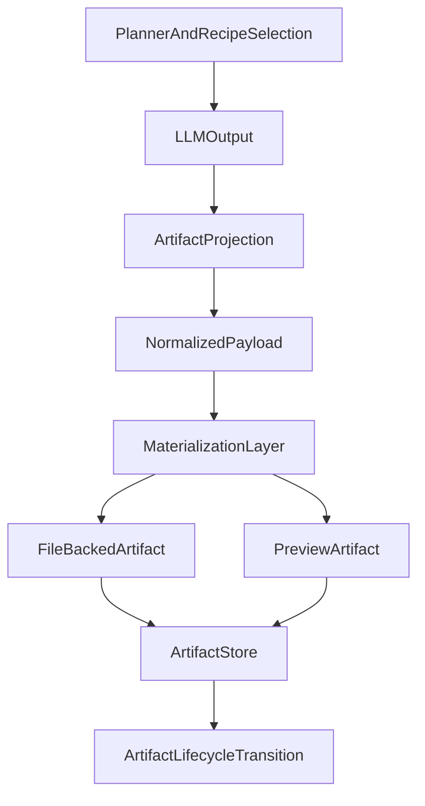

# Stage 5A Render and Materialization

## Goal

Собрать единый слой materialization, который превращает нормализованные document/developer outputs в реальные конечные артефакты: HTML preview, PDF export, file-backed assets и стабильные artifact descriptors с `path`/`url`/lifecycle.

## Why Now

- Stages 2–4 уже дали orchestration, route selection, artifact projection и policy gates.
- Сейчас `llm_output` умеет только извлекать и проецировать артефакты в metadata, но не материализует их в реальные файлы или preview endpoints.
- В репозитории уже есть полезные примитивы, которые можно переиспользовать вместо изобретения нового рендера с нуля:
  - `src/platform/document/artifact-projection.ts`
  - `src/platform/developer/artifact-projection.ts`
  - `src/platform/schemas/artifact.ts`
  - `src/platform/registry/artifact-store.ts`
  - `src/auto-reply/reply/export-html/`
  - `src/browser/pw-tools-core.snapshot.ts`
  - `extensions/diffs/src/browser.ts`

## Scope

- Ввести общий `src/platform/materialization/` слой для render contracts и materializers.
- Определить render inputs для:
  - normalized document report/export/extraction summary
  - developer preview/release summary
  - generic HTML/Markdown/data-backed preview payloads
- Добавить file-backed materialization path:
  - `markdown -> html`
  - `html -> pdf`
  - `html -> preview artifact`
- Связать materialization со Stage 3B/4 artifact projection так, чтобы descriptor получал реальные `path`, `url`, `mimeType`, `sizeBytes`, `lifecycle`.
- Не делать сейчас capability bootstrap/install automation; только спроектировать seam так, чтобы будущий bootstrap мог доустанавливать approved render capabilities.

## Out Of Scope

- Автоматическая установка renderer/PDF движков из интернета.
- Полноценные cloud publish adapters.
- Новый параллельный artifact model.
- Полный UI для artifact browsing.

## Implementation Shape

### 1. Materialization Contracts

Добавить контракты в `src/platform/materialization/contracts.ts`:

- render kind: `html`, `markdown`, `pdf`, `image_bundle`, `site_preview`
- materialization request/result
- source domain: `document` | `developer`
- output target: `file` | `preview`

Опорой остаются существующие общие artifact contracts в `src/platform/schemas/artifact.ts`.

### 2. Shared Renderer Entry

Добавить `src/platform/materialization/render.ts` как единый entrypoint:

- принимает normalized payload + materialization request
- выбирает materializer
- возвращает materialized artifact metadata

Минимальный первый набор materializers:

- `markdown-report-materializer.ts`
- `html-preview-materializer.ts`
- `pdf-materializer.ts`

### 3. Reuse Existing HTML Foundations

Переиспользовать существующие export/render patterns вместо нового ad-hoc HTML:

- session export templates из `src/auto-reply/reply/export-html/`
- Playwright PDF/screenshot patterns из `src/browser/pw-tools-core.snapshot.ts`
- HTML-in-browser rendering pattern из `extensions/diffs/src/browser.ts`

### 4. Bridge Document Flow

Расширить document flow:

- `src/platform/document/artifact-projection.ts`
- возможно новый `src/platform/document/materialize.ts`

Смысл:

- report/export artifacts после projection могут materialize-иться в html/pdf/file outputs
- extraction artifact может materialize-иться как summary report, а не только raw normalized metadata

### 5. Bridge Developer Flow

Расширить developer flow:

- `src/platform/developer/artifact-projection.ts`
- возможно новый `src/platform/developer/materialize.ts`

Смысл:

- preview artifacts получают реальный preview backing
- release/report payloads получают file-backed summary/output
- descriptor больше не зависит только от того, что LLM сама написала в JSON

### 6. Shared Artifact Service Preparation

Необязательно сразу вводить persistence в БД, но нужно подготовить единый seam поверх `src/platform/registry/artifact-store.ts`:

- унифицировать document/developer materialized artifacts
- использовать lifecycle transitions (`draft -> preview -> published`) не только как enum, но и как post-materialization step

## Suggested File Areas

- `src/platform/materialization/contracts.ts`
- `src/platform/materialization/render.ts`
- `src/platform/materialization/markdown-report-materializer.ts`
- `src/platform/materialization/html-preview-materializer.ts`
- `src/platform/materialization/pdf-materializer.ts`
- `src/platform/materialization/index.ts`
- `src/platform/document/artifact-projection.ts`
- `src/platform/developer/artifact-projection.ts`
- `src/platform/plugin.ts`
- `src/platform/registry/artifact-store.ts`
- `src/platform/schemas/artifact.ts`

## Data Flow

## Tests To Require Up Front

- Unit tests for materialization contracts and routing.
- Unit tests for `markdown -> html` and `html -> pdf` request/result validation.
- Integration tests proving document report/export artifacts become file-backed outputs.
- Integration tests proving developer preview/release artifacts become materialized descriptors.
- Regression tests proving existing Stage 3B normalization still works unchanged when materialization is skipped.
- Safety tests proving render/materialization does not imply publish approval and does not bypass existing policy gates.
- Failure tests for renderer unavailable / degraded mode.

## Risks To Control

- Не дублировать существующие HTML/render paths разными независимыми модулями.
- Не смешать materialization с capability bootstrap; bootstrap идёт следующим infra stage.
- Не превратить Stage 5A в giant exporter framework; начать с минимального supported set: markdown/html/pdf/preview.
- Не оставлять file-backed outputs вне artifact lifecycle.
- Не завязывать materialization на свободный LLM output без normalized intermediate shape.

## Done When

- Document и developer flows могут материализовать хотя бы один реальный file-backed output каждый.
- `ArtifactDescriptor` получает не только metadata, но и реальные `path`/`mimeType`/`sizeBytes` и при необходимости `url`.
- Есть единый materialization entrypoint, а не отдельные ad-hoc рендеры по доменам.
- Stage 5A остаётся совместимым с будущим Stage 5 Bootstrap, который сможет безопасно доустанавливать approved renderer capabilities.
