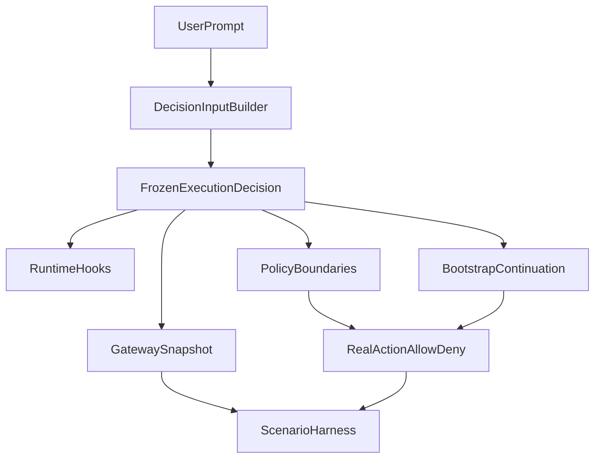

# Stage 7G: Decision Enforcement Loop

## Goal

Превратить Stage 7F из слоя объяснимости в слой реального управления поведением: один resolved execution decision должен не только объяснять profile/recipe/policy/capabilities, но и детерминированно ограничивать или разрешать критичные действия на runtime boundaries и проверяться на реалистичных сценариях.

## Why This Is The Strongest Next Step

Сейчас у нас уже есть хороший decision object в [src/platform/recipe/runtime-adapter.ts](src/platform/recipe/runtime-adapter.ts), но продуктовая ценность ещё не максимальна: часть поведения реально исполняется через hooks и сервисы, а часть остаётся лишь `policyPreview`/snapshot. Следующий самый сильный шаг — сделать так, чтобы decision engine управлял системой не только в explainability, но и в enforcement.

Это даёт сразу три выигрыша:

- Повышает доверие: система ведёт себя так же, как объясняет.
- Снижает регрессии: меньше drift между `agent-command`, hooks, bootstrap, gateway snapshot и runtime boundaries.
- Делает продукт конкурентнее: появляется настоящий decision-to-action loop, а не просто красивая маршрутизация.

## Product Outcome

После этапа:

- Один frozen execution context проходит через `agent-command`, hooks, bootstrap, machine/artifact boundaries и gateway snapshot.
- Policy posture влияет не только на тексты, но и на реальные действия: publish / artifact transition / bootstrap / privileged execution.
- Появляется scenario-based regression harness, который проверяет одинаковое поведение decision engine на реальных run paths.
- Мы получаем первый слой high-confidence “decision reliability”, а не только unit correctness.

## Workstreams

### 1. Freeze And Carry Execution Context

Убрать оставшийся drift между основным run path и hook/service re-resolution. Где возможно, использовать уже resolved decision context вместо prompt-only fallback.

Основные файлы:

- [src/agents/agent-command.ts](src/agents/agent-command.ts)
- [src/platform/recipe/runtime-adapter.ts](src/platform/recipe/runtime-adapter.ts)
- [src/platform/plugin.ts](src/platform/plugin.ts)
- [src/platform/decision/input.ts](src/platform/decision/input.ts)
- [src/platform/machine/service.ts](src/platform/machine/service.ts)

Ключевой результат:

- любой dangerous/runtime-significant path получает либо тот же execution decision, либо явно помеченный fallback path с contract test.

### 2. Enforce Policy At Real Boundaries

Поднять `policyPreview` до фактического enforcement на ключевых границах:

- privileged tool execution
- machine control
- artifact persistence / transition / publish-like transitions
- capability bootstrap execution

Основные файлы:

- [src/platform/policy/engine.ts](src/platform/policy/engine.ts)
- [src/platform/policy/rules.ts](src/platform/policy/rules.ts)
- [src/platform/plugin.ts](src/platform/plugin.ts)
- [src/platform/bootstrap/service.ts](src/platform/bootstrap/service.ts)
- [src/platform/bootstrap/runtime.ts](src/platform/bootstrap/runtime.ts)
- [src/platform/artifacts/service.ts](src/platform/artifacts/service.ts)
- [src/platform/artifacts/gateway.ts](src/platform/artifacts/gateway.ts)

Ключевой результат:

- policy posture становится причиной allow/deny в реальных действиях, а не только explainability output.

### 3. Turn Bootstrap Into A True Decision Continuation

Сделать bootstrap не отдельной синтетической веткой, а продолжением исходного decision:

- capability requirement приходит из того же execution decision
- bootstrap request хранит/восстанавливает decision-facing context
- approve/run path остаётся согласован с исходным profile/recipe/policy posture

Основные файлы:

- [src/platform/bootstrap/service.ts](src/platform/bootstrap/service.ts)
- [src/platform/bootstrap/orchestrator.ts](src/platform/bootstrap/orchestrator.ts)
- [src/platform/bootstrap/contracts.ts](src/platform/bootstrap/contracts.ts)
- [src/platform/bootstrap/resolver.ts](src/platform/bootstrap/resolver.ts)
- [src/platform/recipe/runtime-adapter.ts](src/platform/recipe/runtime-adapter.ts)

Ключевой результат:

- bootstrap больше не «догадывается» заново по synthetic prompt, а продолжает исходное execution decision.

### 4. Add Scenario-Based Decision Validation

Добавить deterministic regression harness для real run paths, а не только для isolated planner tests. Опорные паттерны уже есть в gateway/mock/e2e harness и trigger case harness.

Основные файлы:

- [src/gateway/gateway.test.ts](src/gateway/gateway.test.ts)
- [test/helpers/gateway-e2e-harness.ts](test/helpers/gateway-e2e-harness.ts)
- [test/gateway.multi.e2e.test.ts](test/gateway.multi.e2e.test.ts)
- [src/auto-reply/reply.triggers.trigger-handling.test-harness.ts](src/auto-reply/reply.triggers.trigger-handling.test-harness.ts)
- [docs/help/testing.md](docs/help/testing.md)

Целевые сценарии:

- document task requiring capability but not risky publish
- code/publish task requiring guarded posture
- integration rollout with publish targets
- operator/machine-control task with kill switch / approval edges
- media task staying lightweight without accidental privileged posture

Ключевой результат:

- один сценарий проверяет и decision snapshot, и фактическое allow/deny behavior.

### 5. Expose Reliability Signals Cleanly

Расширить explainability так, чтобы UI/gateway diagnostics показывали именно enforcement-relevant причины:

- почему действие разрешено/запрещено
- какой boundary сработал
- где нужен approval
- где bootstrap — continuation of decision

Основные файлы:

- [src/platform/profile/gateway.ts](src/platform/profile/gateway.ts)
- [src/platform/profile/contracts.ts](src/platform/profile/contracts.ts)
- [ui/src/ui/views/specialist-context.ts](ui/src/ui/views/specialist-context.ts)
- [ui/src/ui/types.ts](ui/src/ui/types.ts)

Ключевой результат:

- explainability становится operational, а не только descriptive.

## Execution Flow

## Sequencing

1. Сначала убрать оставшиеся re-resolution gaps и закрепить frozen execution context.
2. Затем подключить decision-aware enforcement на artifact/bootstrap/machine boundaries.
3. После этого встроить bootstrap как continuation of decision, а не synthetic branch.
4. В конце собрать scenario-based validation и расширить reliability-facing explainability.

## Guardrails

- Не распыляться в UI polish: UI нужен только как окно в enforcement reasons.
- Не вводить второй policy engine: platform decision должен стать canonical source для boundary checks.
- Не подменять real-scenario coverage только unit tests: минимум один gateway/agent path должен проверять end-to-end согласованность решения.
- Не превращать этап в release/live-key зависимость: основная regression matrix должна оставаться CI-stable через mock/harness paths.

## Validation Target

Минимальный landing bar:

- `pnpm tsgo`
- `pnpm build`
- целевые platform/policy/bootstrap/artifact/gateway scenario tests
- минимум один real gateway scenario harness pass
- финальный `pnpm test`
