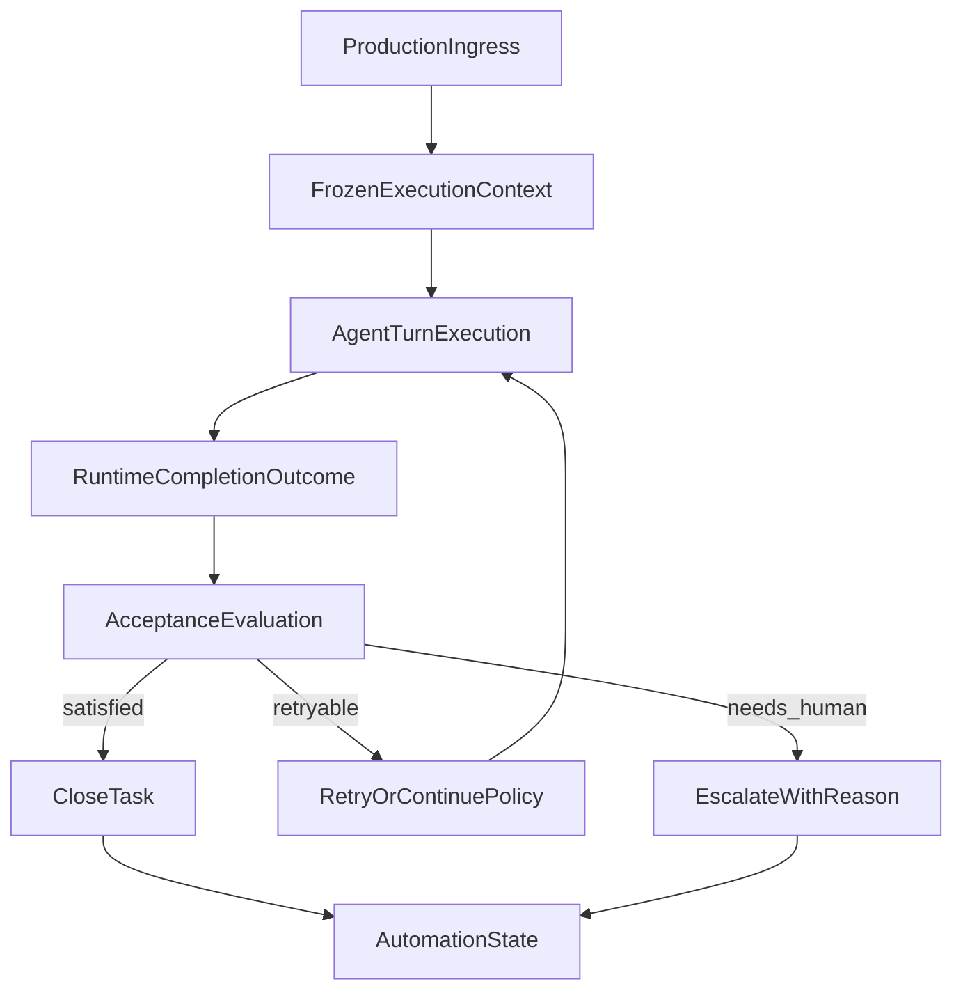

# Stage 8: Semantic Outcome Orchestration

## Goal

Превратить `completionOutcome` из диагностического артефакта в реальный backend contract: production ingress paths должны не терять frozen execution context, а unattended/cron/followup execution должны уметь завершать задачу, ретраить её, эскалировать и подтверждать результат не по тексту модели, а по структурированному outcome.

## Why This Is The Strongest Next Step

После `Stage 7I` runtime умеет `blocked -> approved -> resumed -> completed` и выдаёт machine-checkable outcome, но бот всё ещё недостаточно автономен: эти данные почти не используются для принятия следующих шагов. Следующий strongest step — дать backend-слою способность понимать, выполнена ли задача достаточно хорошо, и что делать дальше без UI и без нового prompt-driven guesswork.

## Product Outcome

- Все основные production ingress paths используют один frozen execution context, а не частично fallback-логики по prompt.
- `completionOutcome` начинает управлять backend-автоматизацией: retry, escalate, notify, close.
- Появляется минимальный acceptance contract поверх checkpoint closure: не только `runtime completed`, но и `task satisfied / partial / failed`.
- Cron и unattended flows становятся реально полезными: они могут доводить задачу до результата или явно эскалировать её с причиной.
- Hot path остаётся быстрым: orchestration включается только на turn/result boundaries и при unattended workflows.

## Current Anchors

- Runtime outcome агрегируется в [src/platform/runtime/service.ts](src/platform/runtime/service.ts) и типизирован в [src/platform/runtime/contracts.ts](src/platform/runtime/contracts.ts).
- Embedded runner уже прикладывает `completionOutcome` в [src/agents/pi-embedded-runner/run.ts](src/agents/pi-embedded-runner/run.ts) и [src/agents/pi-embedded-runner/types.ts](src/agents/pi-embedded-runner/types.ts).
- Continuation и trusted bootstrap lanes уже есть в [src/platform/bootstrap/service.ts](src/platform/bootstrap/service.ts) и [src/platform/artifacts/service.ts](src/platform/artifacts/service.ts).
- Recipe/runtime prep уже умеет readiness/policy hints в [src/platform/recipe/runtime-adapter.ts](src/platform/recipe/runtime-adapter.ts).
- Deterministic runtime closure scenarios уже закреплены в [src/gateway/server.node-invoke-approval-bypass.test.ts](src/gateway/server.node-invoke-approval-bypass.test.ts), [src/platform/bootstrap/service.test.ts](src/platform/bootstrap/service.test.ts), [src/agents/pi-embedded-runner/usage-reporting.test.ts](src/agents/pi-embedded-runner/usage-reporting.test.ts).
- Production ingress paths всё ещё неоднородны: reference path есть в [src/agents/agent-command.ts](src/agents/agent-command.ts), но followup/auto-reply/cron surfaces нужно выровнять через shared execution context.

## Architecture Sketch

## Workstreams

### 1. Universal Frozen Execution Context On Production Ingress

Сделать так, чтобы не только CLI/`agent-command`, но и followup/auto-reply/cron/memory-triggered paths запускали `runEmbeddedPiAgent` с одним resolved execution context.

Основные файлы:

- [src/agents/agent-command.ts](src/agents/agent-command.ts)
- [src/platform/decision/input.ts](src/platform/decision/input.ts)
- [src/platform/recipe/runtime-adapter.ts](src/platform/recipe/runtime-adapter.ts)
- [src/auto-reply/reply/agent-runner-execution.ts](src/auto-reply/reply/agent-runner-execution.ts)
- [src/auto-reply/reply/followup-runner.ts](src/auto-reply/reply/followup-runner.ts)
- [src/auto-reply/reply/agent-runner-memory.ts](src/auto-reply/reply/agent-runner-memory.ts)
- [src/cron/isolated-agent/run.ts](src/cron/isolated-agent/run.ts)
- [src/platform/plugin.ts](src/platform/plugin.ts)

Ключевой результат:

- production ingresses перестают частично опираться на fallback re-resolution по prompt и используют единый frozen chain.

### 2. Promote Completion Outcome Into Automation Contract

Сделать `completionOutcome` пригодным для принятия backend-решений, а не только для диагностики.

Основные файлы:

- [src/platform/runtime/contracts.ts](src/platform/runtime/contracts.ts)
- [src/platform/runtime/service.ts](src/platform/runtime/service.ts)
- [src/agents/pi-embedded-runner/types.ts](src/agents/pi-embedded-runner/types.ts)
- [src/agents/pi-embedded-runner/run.ts](src/agents/pi-embedded-runner/run.ts)
- [src/auto-reply/reply/agent-runner-execution.ts](src/auto-reply/reply/agent-runner-execution.ts)
- [src/cron/isolated-agent/run.ts](src/cron/isolated-agent/run.ts)

Ключевой результат:

- unattended flows видят не только assistant text, а структурированный signal: blocked, partial, completed, failed, pending approvals, artifacts, bootstrap dependencies.

### 3. Add Minimal Acceptance Contract Above Runtime Closure

Ввести lightweight semantic acceptance layer: `runtime completed` ещё не означает `task satisfied`.

Что добавить:

- acceptance summary/result code
- reasoned `satisfied | partial | retryable | needs_human | failed`
- structured evidence hooks: artifacts produced, approvals left, tool errors, missing deliverables

Основные файлы:

- [src/platform/runtime/contracts.ts](src/platform/runtime/contracts.ts)
- [src/platform/runtime/service.ts](src/platform/runtime/service.ts)
- [src/platform/artifacts/service.ts](src/platform/artifacts/service.ts)
- [src/platform/bootstrap/service.ts](src/platform/bootstrap/service.ts)
- [src/agents/pi-embedded-subscribe.handlers.tools.ts](src/agents/pi-embedded-subscribe.handlers.tools.ts)
- [src/agents/pi-embedded-runner/run.ts](src/agents/pi-embedded-runner/run.ts)

Ключевой результат:

- backend может отличать “checkpoint loop дошёл до конца” от “задача реально закрыта”.

### 4. Add Retry And Escalation Policy For Unattended Runs

Поверх acceptance/outcome ввести дешёвый orchestration слой для unattended execution:

- retry only for bounded retryable classes
- no loops on deterministic denials
- escalate on pending approvals / human-required outcomes
- preserve speed by running only at result boundaries

Основные файлы:

- [src/infra/backoff.js](src/infra/backoff.js)
- [src/auto-reply/reply/agent-runner-execution.ts](src/auto-reply/reply/agent-runner-execution.ts)
- [src/cron/isolated-agent/run.ts](src/cron/isolated-agent/run.ts)
- [src/platform/runtime/service.ts](src/platform/runtime/service.ts)
- [src/platform/plugin.ts](src/platform/plugin.ts)

Ключевой результат:

- cron/unattended paths умеют не просто завершаться, а принимать следующий шаг: continue, retry, escalate, stop.

### 5. Lock The Stage With Deterministic Backend Scenarios

Закрепить stage короткими сценариями, где outcome влияет на automation behavior.

Сценарии:

- trusted unattended document/bootstrap path завершает task без ручного approval
- retryable path делает bounded retry и затем завершает task
- human-required path не retry-loop’ится, а уходит в explicit escalation
- followup/cron path использует тот же frozen execution context, что и main run

Основные файлы:

- [src/gateway/server.node-invoke-approval-bypass.test.ts](src/gateway/server.node-invoke-approval-bypass.test.ts)
- [src/platform/runtime/service.test.ts](src/platform/runtime/service.test.ts)
- [src/platform/bootstrap/service.test.ts](src/platform/bootstrap/service.test.ts)
- [src/agents/pi-embedded-runner/usage-reporting.test.ts](src/agents/pi-embedded-runner/usage-reporting.test.ts)
- [src/gateway/gateway.test.ts](src/gateway/gateway.test.ts)
- [docs/help/testing.md](docs/help/testing.md)

Ключевой результат:

- минимум один backend scenario подтверждает не только runtime closure, но и корректное automation decision по acceptance/outcome.

## Sequencing

1. Сначала выровнять frozen execution context across production ingresses.
2. Затем поднять `completionOutcome` до статуса automation contract.
3. После этого добавить acceptance layer поверх runtime closure.
4. Потом ввести bounded retry/escalation policy для unattended flows.
5. В конце закрепить stage deterministic scenarios и testing guidance.

## Performance Guardrails

- Не добавлять orchestration в streaming/tool hot path; evaluation только на result/checkpoint boundaries.
- Execution context resolution кешировать/переиспользовать там, где это уже безопасно и canonical.
- Retry policy должна быть bounded и дешёвой по lookup/state.
- Не сканировать transcript целиком для каждого решения; опираться на уже собранные runtime signals.
- Scenario suite держать короткой и CI-stable.

## Guardrails

- Не превращать acceptance layer в тяжёлый planner-v2.
- Не возвращаться к prompt-based re-planning там, где уже есть frozen context.
- Не смешивать semantic outcome с UI state или presentation.
- Не строить распределённый workflow engine; нужен прагматичный backend orchestration layer.
- Не делать безграничные retry loops; любая retryability должна быть policy-bounded и machine-checkable.

## Validation Target

- `pnpm tsgo`
- `pnpm build`
- targeted runtime/agent/gateway/cron tests
- минимум один deterministic unattended scenario с semantic outcome decision
- минимум один scenario, где retry bounded и не уходит в loop
- outcome/acceptance assertions, а не только text-level expectations
