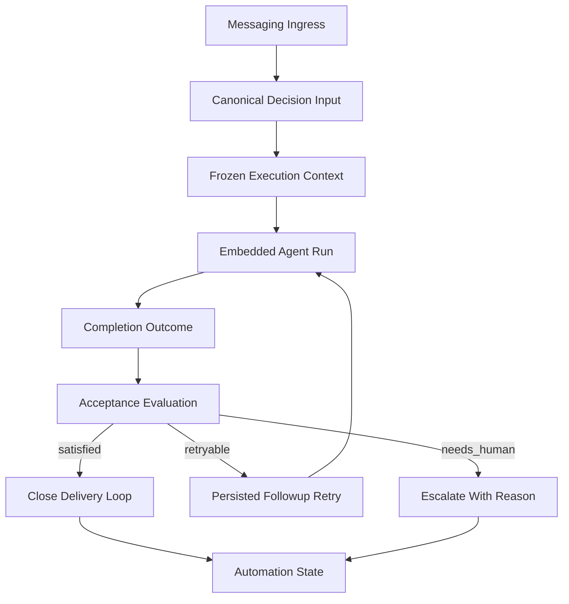

# Stage 9: Ingress Parity And Verifiable Delivery

## Goal

Сделать так, чтобы не только `cron`, но и основной production messaging ingress реально жил по semantic backend contract: один и тот же resolved execution input, один и тот же acceptance/outcome loop, более сильные deliverable-evidence signals и сохранение pending automation при process restart.

## Why This Is The Strongest Next Step

После `Stage 8` у нас уже есть `completionOutcome`, `acceptanceOutcome`, bounded retry/escalation и shared frozen execution context, но главный пользовательский path ещё не дотянут до того же уровня зрелости, что `cron`.

Сейчас strongest next step — убрать разницу между:

- тем, как backend принимает решения для `cron`
- тем, как он работает для обычных messaging/followup flows

Именно это приблизит продукт к состоянию, где бот не только умеет "правильно завершить run", но и стабильно доводит реальные пользовательские задачи до результата на основном ingress.

## Product Outcome

- Main reply/followup ingress использует тот же canonical execution-decision input, что и gateway/profile resolve path.
- Semantic acceptance/outcome влияет на backend behavior в основном production path, а не только в `cron`.
- Deliverable evidence становится сильнее: backend лучше отличает "реально сделал" от "что-то ответил".
- Pending semantic followups и bounded retries не теряются при рестарте процесса.
- Hot path остаётся быстрым: orchestration только на turn/result boundaries и на queue persistence boundaries.

## Current Anchors

- Gateway уже умеет richer planner input через transcript-derived prompt и `fileNames` в `src/platform/profile/gateway.ts`.
- Shared execution-context resolution уже есть в `src/platform/decision/input.ts` и частично заведена в `src/auto-reply/reply/agent-runner-utils.ts`.
- Runtime outcome и acceptance уже считаются в `src/platform/runtime/service.ts` и типизированы в `src/platform/runtime/contracts.ts`.
- Embedded runner уже прикладывает `completionOutcome` и `acceptanceOutcome` в `src/agents/pi-embedded-runner/run.ts` и `src/agents/pi-embedded-runner/types.ts`.
- Cron уже использует acceptance-driven retry/escalation в `src/cron/isolated-agent/run.ts`.
- Followup queues сейчас живут в памяти через `src/auto-reply/reply/queue/state.ts`.

## Architecture Sketch

## Workstreams

### 1. Gateway-Parity Execution Input For Messaging Ingress

Сделать так, чтобы основной messaging/followup ingress строил execution input так же канонично, как gateway profile resolution: использовать transcript-derived prompt, relevant `fileNames`, specialist override context и channel hints из одного shared path.

Основные файлы:

- `src/platform/decision/input.ts`
- `src/platform/profile/gateway.ts`
- `src/auto-reply/reply/agent-runner-utils.ts`
- `src/auto-reply/reply/agent-runner-execution.ts`
- `src/auto-reply/reply/followup-runner.ts`
- `src/auto-reply/reply/agent-runner-memory.ts`

Ключевой результат:

- messaging/followup execution context больше не слабее gateway path и не дрейфует по prompt-only эвристикам.

### 2. Acceptance-Orchestrated Main Reply And Followup Paths

Поднять `acceptanceOutcome` и `completionOutcome` до статуса реального orchestration signal на main ingress:

- bounded semantic retry
- no retry on deterministic human-required outcomes
- explicit escalation path
- clear stop/close behavior

Основные файлы:

- `src/auto-reply/reply/agent-runner.ts`
- `src/auto-reply/reply/agent-runner-execution.ts`
- `src/auto-reply/reply/followup-runner.ts`
- `src/agents/pi-embedded-runner/run.ts`
- `src/platform/runtime/service.ts`

Ключевой результат:

- основной user-facing ingress начинает принимать backend decisions по structured acceptance, а не только по assistant text.

### 3. Stronger Deliverable Evidence

Сделать acceptance менее хрупким за счёт richer machine-checkable evidence:

- produced artifacts
- successful file/materialization signals
- verified side-effect receipts where already available
- explicit delivery confirmations where already captured
- child/subtask completion hooks without heavy workflow-engine growth

Основные файлы:

- `src/platform/runtime/contracts.ts`
- `src/platform/runtime/service.ts`
- `src/platform/artifacts/service.ts`
- `src/agents/pi-embedded-runner/run.ts`
- `src/agents/pi-embedded-subscribe.handlers.tools.ts`
- `src/cron/isolated-agent/run.ts`

Ключевой результат:

- меньше ложных `completed_without_evidence`, меньше ненужных retry, лучше distinction между "ответил" и "сделал".

### 4. Durable Pending Automation

Добавить дешёвый persist/rehydrate layer для pending semantic followups и bounded retry attempts, чтобы процессный рестарт не обнулял полезную backend automation.

Основные файлы:

- `src/auto-reply/reply/queue/state.ts`
- `src/auto-reply/reply/queue/enqueue.ts`
- `src/auto-reply/reply/followup-runner.ts`
- `src/platform/runtime/service.ts`
- `src/platform/plugin.ts`

Ключевой результат:

- semantic followup work и retry budget переживают restart без перехода к тяжёлому workflow engine.

### 5. Deterministic Messaging Semantic Scenarios

Закрепить stage короткими deterministic backend scenarios для основного ingress:

- messaging path делает bounded retry по `retryable` acceptance
- human-required outcome уходит в escalation без loop
- richer evidence переводит run в `satisfied`, а не в ложный retry
- followup/persisted retry rehydrates after restart and continues predictably

Основные файлы:

- `src/auto-reply/reply/agent-runner-execution.test.ts`
- `src/auto-reply/reply/followup-runner.test.ts`
- `src/platform/runtime/service.test.ts`
- `src/agents/pi-embedded-runner/usage-reporting.test.ts`
- `src/cron/isolated-agent/run.interim-retry.test.ts`
- `docs/help/testing.md`

Ключевой результат:

- минимум один deterministic scenario доказывает semantic orchestration на main messaging ingress, а не только на `cron`.

## Sequencing

1. Сначала выровнять canonical execution input для messaging ingress с gateway path.
2. Затем поднять acceptance/outcome до orchestration contract в main reply/followup paths.
3. После этого усилить deliverable evidence, чтобы orchestration опирался на более надёжные сигналы.
4. Потом добавить durable pending automation и restart-safe bounded retry state.
5. В конце закрепить stage deterministic scenarios и testing guidance.

## Performance Guardrails

- Не сканировать transcript полностью на каждом шаге; использовать уже существующие bounded helpers и tail-oriented context.
- Не переносить orchestration в streaming/tool hot path; evaluation только на result boundaries.
- Retry storage и pending-state persistence держать cheap and append-friendly.
- Не строить тяжёлый workflow engine; нужен pragmatic restart-safe automation layer.
- Scenario suite держать короткой и CI-stable.

## Guardrails

- Не вводить новый planner-v2 вместо усиления текущего canonical decision chain.
- Не делать бесконечные retry loops; все retry должны оставаться bounded и machine-checkable.
- Не смешивать semantic backend state с UI/presentation state.
- Не требовать глобальных delivery ACK там, где их нет; использовать только уже доступные and trusted signals.
- Не раздувать followup persistence в универсальный job scheduler.

## Validation Target

- `pnpm tsgo`
- `pnpm build`
- targeted auto-reply/runtime/agent/cron tests
- минимум один deterministic messaging scenario с acceptance-driven retry
- минимум один deterministic messaging scenario с escalation без loop
- acceptance assertions и deliverable-evidence assertions, а не только text-level expectations
