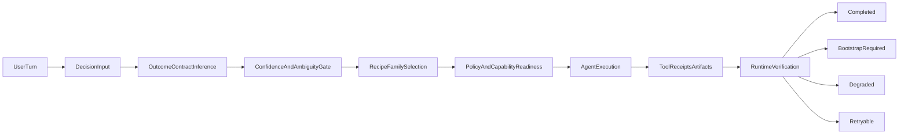

# V1 Orchestrator Reset Plan

## Objective

Собрать понятную V1-версию orchestration, которая:

- надежно определяет не «слово из словаря», а ожидаемый контракт результата: текстовый ответ, структурный файл, изменение workspace, локальный интерактивный результат, внешняя операция,
- не пытается заранее «перерешать» весь execution path через хрупкие keyword/rule-слои,
- требует реальное доказательство результата для file-like deliverables,
- использует существующие `bootstrap`, `materialization`, `runtime acceptance` как инфраструктуру,
- остается расширяемой для будущего LLM-orchestrator обучения, но уже сейчас работает стабильно.

## Product Truth For V1

Для V1 истина простая:

- Если пользователь просит файл, сайт, PDF, изображение, архив, preview или другой структурный артефакт, система не имеет права закрыть run без доказуемого tool-backed результата.
- Если нужного capability нет, система должна честно перейти в `bootstrap_required`/`degraded`, а не симулировать успех текстом.
- Если пользователь ожидает локально запускаемый или интерактивный результат, система должна реально войти в code path (`write` / `exec` / `process`) и не отвечать «планом вместо выполнения».
- Если задача не требует структурного артефакта, текстовый completion допустим.

## V1 Philosophy

V1 должен быть гибридом:

- Тонкий deterministic routing в core: сначала определить outcome contract и execution contract, затем policy/readiness, затем execution.
- Строгая post-run verification: решение о completion принимается по receipts/artifacts, а не по уверенности модели.
- Минимум domain-specific эвристик в core. Словари и regex допустимы только как weak hints с низким приоритетом, а не как основа маршрутизации.
- При неопределенности система должна выбирать не хрупкий guessed route, а safe fallback: либо broad execution family, либо clarification boundary, либо runtime-verified attempt без ложного completion.

Это означает:

- сохранить инфраструктуру из [src/platform/bootstrap/service.ts](src/platform/bootstrap/service.ts), [src/platform/bootstrap/orchestrator.ts](src/platform/bootstrap/orchestrator.ts), [src/platform/materialization/render.ts](src/platform/materialization/render.ts), [src/platform/runtime/service.ts](src/platform/runtime/service.ts),
- упростить decision/planner слой в [src/platform/decision/input.ts](src/platform/decision/input.ts), [src/platform/decision/intent-signals.ts](src/platform/decision/intent-signals.ts), [src/platform/recipe/planner.ts](src/platform/recipe/planner.ts), [src/platform/recipe/runtime-adapter.ts](src/platform/recipe/runtime-adapter.ts).

## Scope

### In scope

- Стабилизировать routing для `document/image/code` и локально запускаемых интерактивных результатов.
- Упростить planner so that it selects broad execution families instead of pseudo-smart micro-routing.
- Усилить runtime acceptance для structured outputs.
- Нормализовать artifact contracts and tool evidence.
- Привести live validation к небольшому, но надежному release gate.

### Out of scope

- Не обучать LLM orchestrator сейчас.
- Не строить полноценный learning-to-route слой.
- Не покрывать все типы документов и все языки мира.
- Не делать идеальный universal planner. Нужен работающий, понятный baseline.

## Current Problem Map

Текущая проблема не в одном PDF-tool. Она распределена по четырем слоям:

1. Qualification overreach.

[src/platform/decision/input.ts](src/platform/decision/input.ts) и [src/platform/decision/intent-signals.ts](src/platform/decision/intent-signals.ts) пытаются слишком много угадать по словам, вместо того чтобы строить outcome contract, confidence и safe fallback.

1. Planner over-directiveness.

[src/platform/recipe/planner.ts](src/platform/recipe/planner.ts) и [src/platform/recipe/defaults.ts](src/platform/recipe/defaults.ts) превращают orchestration в набор накопленных scoring rules.

1. Runtime truth is still too inference-dependent.

[src/platform/runtime/service.ts](src/platform/runtime/service.ts) уже умеет проверять receipts, но V1 должен еще сильнее опираться на фактический artifact/tool output, а не на inferred intent alone.

1. Validation is uneven.

Есть хорошие unit/integration тесты, но live matrix в [scripts/dev/stage86-live-matrix.ts](scripts/dev/stage86-live-matrix.ts) не везде утверждает реальное наличие deliverable.

## Target V1 Flow




Ключевое отличие от текущего состояния:

- Decision layer определяет только coarse class и artifact contract.
- Decision layer сначала строит ожидаемый контракт результата и уровень уверенности, а не ищет совпадение по словам.
- Planner выбирает family, а не симулирует сверхточный route.
- Runtime closes runs only from evidence.

## How V1 Understands Requests Without Dictionaries

V1 не должен отвечать на вопрос «что пользователь имел в виду?» через словари `site/web/pdf/...`.

Вместо этого qualification идет в четыре ступени:

1. Outcome contract first.

Сначала определяется, какой результат ожидается по форме задачи:

- текстовый ответ,
- структурный файл/артефакт,
- изменение workspace,
- локально запускаемый интерактивный результат,
- внешняя операция или интеграция.

1. Evidence sources are ranked.

Источники сигнала ранжируются так:

- высокий приоритет: вложения, явные filenames/extensions, предыдущий state run, tool-eligible context, requested deliverable shape;
- средний приоритет: phrasing patterns and prompt semantics;
- низкий приоритет: словари, regex, language-specific hints.

1. Qualification must emit confidence.

Decision layer обязан возвращать не только guessed class, но и confidence/ambiguity.

1. Unknown is a valid state.

Если уверенность низкая, система не должна выдумывать точный route. Она должна:

- выбрать broad execution family,
- или задать clarification,
- или выполнить safe attempt с жесткой runtime verification, чтобы не было ложного success.

Это и есть основной разворот V1: не «угадываем формулировку пользователя», а «строим контракт результата и не врем без evidence».

## Core V1 Principle

Маршрутизация должна строиться не от слов, а от ограничений задачи.

Система должна отвечать на 5 вопросов:

1. Какой тип результата пользователь реально ожидает получить?
2. Требует ли этот результат реальных tool actions или достаточно текста?
3. Нужно ли менять workspace или запускать локальный процесс?
4. Нужен ли внешний capability / bootstrap?
5. Хватает ли уверенности для auto-execution, или нужен bounded clarification?

Если на эти 5 вопросов можно ответить, маршрут выбирается без словарей.

## Qualification Architecture

### Inputs

Qualification layer должен использовать не только prompt text, а полный turn context:

- user prompt,
- attachments and filenames,
- explicit output references,
- active workspace context,
- prior turn state,
- policy restrictions,
- capability readiness,
- already-known execution state from paused or resumed runs.

### Qualification Output Schema

Decision layer должен возвращать typed object, а не набор loosely related flags.

```ts
type QualificationResult = {
  outcomeContract:
    | "text_response"
    | "structured_artifact"
    | "workspace_change"
    | "interactive_local_result"
    | "external_operation";
  executionContract: {
    requiresTools: boolean;
    requiresWorkspaceMutation: boolean;
    requiresLocalProcess: boolean;
    requiresArtifactEvidence: boolean;
    requiresDeliveryEvidence: boolean;
    mayNeedBootstrap: boolean;
  };
  requestedEvidence: Array<
    | "assistant_text"
    | "tool_receipt"
    | "artifact_descriptor"
    | "process_receipt"
    | "delivery_receipt"
    | "capability_receipt"
  >;
  confidence: "high" | "medium" | "low";
  ambiguityReasons: string[];
  candidateFamilies: Array<
    | "general_assistant"
    | "document_render"
    | "media_generation"
    | "code_build"
    | "analysis_transform"
    | "ops_execution"
  >;
};
```

Это не обязательно буквально финальный TypeScript shape, но смысл должен быть именно таким:

- routing produces a contract,
- runtime verifies the same contract,
- planner consumes the same contract,
- нет отдельной «магии по словам» в каждом слое.

## Qualification Pipeline

### Stage 0. Normalize Turn Context

Перед любой квалификацией собрать normalized turn:

- cleaned prompt,
- attachments metadata,
- referenced filenames/extensions,
- current workspace capability signals,
- resume/checkpoint context,
- policy constraints.

На этом этапе нельзя принимать routing decisions. Только normalization.

### Stage 1. Infer Outcome Contract

Первый реальный вопрос:

`Что пользователь хочет получить как результат?`

Не «он сказал сайт?», а:

- хочет ли он просто ответ,
- хочет ли он файл,
- хочет ли он, чтобы были созданы/изменены project files,
- хочет ли он локально запускаемый интерактивный результат,
- хочет ли он внешнюю операцию.

Примеры:

- «Сделай PDF-отчет» -> `structured_artifact`
- «Исправь баг в проекте» -> `workspace_change`
- «Сделай простое приложение и запусти локально» -> `interactive_local_result`
- «Объясни почему тест падает» -> `text_response`
- «Опубликуй / зарелизь / отправь во внешний сервис» -> `external_operation`

### Stage 2. Infer Execution Contract

Второй вопрос:

`Что должно реально произойти, чтобы такой результат существовал?`

Здесь определяются жесткие свойства исполнения:

- нужны ли tools вообще,
- нужно ли менять файлы,
- нужен ли процесс,
- нужен ли артефакт,
- нужен ли delivery receipt,
- может ли потребоваться bootstrap.

Это уже почти полностью убирает необходимость гадать по словам.

### Stage 3. Infer Evidence Contract

Третий вопрос:

`Какие доказательства результата обязательны?`

Примеры:

- `text_response` -> достаточно `assistant_text`
- `structured_artifact` -> нужны `tool_receipt + artifact_descriptor`, часто еще `delivery_receipt`
- `interactive_local_result` -> нужны `tool_receipt + process_receipt`, опционально `artifact_descriptor`
- `workspace_change` -> нужны `tool_receipt`, а иногда file-diff-backed confirmation
- `external_operation` -> нужен operation-specific receipt or confirmed denial

Ключевой разворот:

- сначала определяется `requiredEvidence`,
- потом runtime замыкает run против этого контракта.

### Stage 4. Compute Confidence

Уверенность считается не по красоте prompt, а по полноте constraints.

Высокая уверенность:

- outcome contract однозначен,
- execution contract однозначен,
- evidence contract однозначен.

Средняя уверенность:

- family очевидна, но часть execution details придется уточнить по ходу.

Низкая уверенность:

- outcome contract или evidence contract неоднозначны,
- несколько mutually exclusive families равновероятны.

### Stage 5. Resolve Ambiguity Policy

При низкой уверенности система не делает «вечный fallback». Она должна выбрать один из трех строго ограниченных путей:

1. `clarify`

Используется, если без ответа пользователя нельзя определить outcome contract.

1. `safe_broad_family_execution`

Используется, если outcome contract ясен, но implementation family широкая.
Пример: ясно, что нужен структурный артефакт, но неясен лучший внутренний способ его собрать.

1. `bounded_attempt_with_strict_verification`

Используется, если можно безопасно попробовать один путь без риска соврать о результате.

Важно:

- fallback не должен быть «обычным состоянием системы»,
- fallback должен быть редким и bounded,
- основной happy path обязан покрывать большинство нормальных сценариев.

## Routing Decision Matrix

После qualification planner должен работать по явной таблице решений.

### If `outcomeContract = text_response`

- default family: `general_assistant` or `analysis_transform`
- tools optional
- completion allowed from text evidence

### If `outcomeContract = structured_artifact`

- candidate families: `document_render`, `media_generation`, `analysis_transform`
- artifact evidence mandatory
- text-only completion forbidden
- bootstrap path allowed only with honest pause/degraded outcome

### If `outcomeContract = workspace_change`

- candidate family: `code_build` or `ops_execution`
- tool receipts mandatory
- final response without actual tool-backed workspace mutation is invalid

### If `outcomeContract = interactive_local_result`

- candidate family: `code_build`
- process/tool receipts mandatory
- `localhost` mention itself is irrelevant
- only actual local execution evidence matters

### If `outcomeContract = external_operation`

- candidate family: `ops_execution`
- policy and approval gate are first-class
- completion requires operation-specific evidence

## Clarification Policy

Clarification should not be used because the system is weak.
It should be used only when the requested result itself is ambiguous.

### Clarification is allowed when

- невозможно отличить `text_response` от `workspace_change`,
- невозможно понять, нужен ли пользователю файл или просто содержимое,
- mutually exclusive external actions require user intent confirmation,
- policy/approval boundary requires explicit user choice.

### Clarification is not allowed when

- outcome contract already clear,
- system just lacks confidence in implementation details,
- the only missing part is bootstrap/capability readiness,
- runtime can safely attempt and verify without lying.

## Bootstrap And Capability Decision Rules

Bootstrap должен приниматься не по словам запроса, а по execution contract and selected family.

Правило:

- planner selects family,
- readiness resolves required capabilities for that family,
- bootstrap is requested only if required capability missing,
- bootstrap state is part of execution truth, not prompt interpretation.

То есть:

- prompt не должен говорить системе «тут pdf-renderer»,
- family and renderer/tool selection делают это сами,
- user only sees capability need as product-facing fact.

## Why This Is More Reliable

Этот подход лучше словарей по трем причинам:

1. Он работает через форму результата, а не через формулировку просьбы.

Если пользователь пишет необычно, но outcome contract ясен, маршрут не ломается.

1. Он замыкает routing и verification на один и тот же contract.

Нельзя выбрать один маршрут, а завершение проверить по другой логике.

1. Он делает ambiguity explicit.

Вместо скрытого forced guess появляется контролируемая ветка `clarify` or `bounded_attempt`.

## Anti-Costyl Rules

Следующие правила должны быть прямо включены в реализацию и code review:

1. Нельзя добавлять новый routing branch только потому, что встретилась новая формулировка запроса.
2. Нельзя решать execution family через language-specific словарь, если это не weak last-mile hint.
3. Нельзя завершать run по inferred success without evidence.
4. Нельзя в одном месте определять outcome contract, а в другом переопределять его ad hoc.
5. Нельзя переносить product truth в prompt guardrails, если это должно проверяться runtime.
6. Нельзя лечить системный routing bug локальным PDF/site/image exception.

## Workstream 2 Acceptance Criteria

Работа по qualification считается завершенной только если:

- `input.ts` возвращает typed qualification contract, а не набор loose heuristics,
- lexical hints имеют низкий приоритет и не являются route truth,
- существует explicit low-confidence branch,
- planner получает candidate families from contract, not from word-matching,
- runtime verification использует тот же evidence contract,
- минимум 5 human-like prompts с разной формулировкой, но одинаковым outcome contract, проходят одинаковый family selection.

## Concrete Module Plan

Ниже уже не философия, а почти техническое ТЗ: какие модули должны появиться, какие текущие точки надо сузить, и в каком порядке это мигрировать.

### Existing entry points to refactor around

- [src/platform/decision/input.ts](src/platform/decision/input.ts)
  - `inferPromptIntent(...)`
  - `inferArtifactKinds(...)`
  - `buildExecutionDecisionInput(...)`
  - `resolveExecutionRuntimePlan(...)`
- [src/platform/recipe/planner.ts](src/platform/recipe/planner.ts)
  - `buildRecipeScore(...)`
  - `planExecutionRecipe(...)`
- [src/platform/recipe/defaults.ts](src/platform/recipe/defaults.ts)
  - `INITIAL_RECIPES`
- [src/platform/recipe/runtime-adapter.ts](src/platform/recipe/runtime-adapter.ts)
  - `buildArtifactOutputGuardrails(...)`
  - `buildRequestedToolGuardrails(...)`
  - `buildCapabilitySummary(...)`
  - `adaptExecutionPlanToRuntime(...)`
  - `resolvePlatformExecutionDecision(...)`
- [src/platform/runtime/service.ts](src/platform/runtime/service.ts)
  - `hasStructuredArtifactToolOutputReceipt(...)`
  - `buildRunClosure...`
  - acceptance / verification helpers around structured output truth

### New modules to introduce

#### 1. `src/platform/decision/qualification-contract.ts`

Purpose:

- central type definitions for qualification result,
- single vocabulary for outcome/execution/evidence contracts,
- no routing logic.

Expected content:

- `QualificationResult`
- `OutcomeContract`
- `ExecutionContract`
- `RequestedEvidenceKind`
- `QualificationConfidence`
- `CandidateExecutionFamily`

Why:

- today the meaning is smeared across `intent`, `artifactKinds`, `requestedTools`, `renderKind`, runtime evidence helpers.
- V1 needs one shared contract.

#### 2. `src/platform/decision/turn-normalizer.ts`

Purpose:

- build normalized turn context before qualification.

Expected content:

- `normalizeExecutionTurn(...)`
- attachment/file metadata extraction
- explicit output reference extraction
- resume/checkpoint context merge

Why:

- current `buildExecutionDecisionInput(...)` does too much at once.

#### 3. `src/platform/decision/outcome-contract.ts`

Purpose:

- infer only outcome contract from normalized turn.

Expected content:

- `inferOutcomeContract(...)`
- `inferOutcomeSignals(...)`

Strict rule:

- cannot choose recipe family,
- cannot decide tools directly,
- cannot encode bootstrap logic.

#### 4. `src/platform/decision/execution-contract.ts`

Purpose:

- infer what execution constraints follow from outcome contract.

Expected content:

- `inferExecutionContract(...)`
- `inferRequestedEvidence(...)`

Why:

- runtime and planner need explicit execution/evidence expectations.

#### 5. `src/platform/decision/qualification-confidence.ts`

Purpose:

- compute confidence and ambiguity reasons explicitly.

Expected content:

- `computeQualificationConfidence(...)`
- `resolveAmbiguityStrategy(...)`

Output:

- `high | medium | low`
- `clarify | safe_broad_family_execution | bounded_attempt_with_strict_verification`

#### 6. `src/platform/decision/family-candidates.ts`

Purpose:

- map qualification contract to candidate execution families.

Expected content:

- `inferCandidateExecutionFamilies(...)`

Why:

- family selection should be derived from contract, not from prompt wording.

#### 7. `src/platform/recipe/family-selector.ts`

Purpose:

- replace giant implicit score jungle with explicit family resolution.

Expected content:

- `selectExecutionFamily(...)`
- `pickSimplestValidFamily(...)`

This module should consume:

- candidate families,
- policy restrictions,
- capability readiness,
- optional profile compatibility.

#### 8. `src/platform/runtime/evidence-sufficiency.ts`

Purpose:

- centralize runtime truth about completion evidence.

Expected content:

- `isCompletionEvidenceSufficient(...)`
- `requiresStructuredEvidence(...)`
- `mapQualificationToEvidenceRequirements(...)`

Why:

- today similar logic is spread around runtime/service helpers.

### Existing files that should become thin adapters

#### `src/platform/decision/input.ts`

Target state:

- remains public orchestration entry point,
- but becomes mostly composition:
  - normalize turn
  - infer outcome contract
  - infer execution contract
  - infer requested evidence
  - compute confidence
  - infer candidate families
  - build compatibility fields for old callers

What must disappear from this file over time:

- deep lexical routing logic as route truth,
- entangled direct mapping from wording to requested tools,
- route-specific branching hidden inside inference helpers.

#### `src/platform/recipe/planner.ts`

Target state:

- no giant implicit score jungle,
- mostly family validation and selection,
- lightweight tie-breakers only after family candidates are already known.

What must disappear:

- recipe choice driven by too many local prompt heuristics,
- duplicated semantics already expressed in qualification result.

#### `src/platform/recipe/runtime-adapter.ts`

Target state:

- consumes chosen family + readiness + qualification result,
- builds runtime context and guardrails from explicit contract,
- does not re-infer routing semantics.

What must disappear:

- domain-specific instruction pileup as substitute for architecture,
- repeated prompt-derived truths already available from qualification.

#### `src/platform/runtime/service.ts`

Target state:

- verifies evidence contract against receipts and artifacts,
- owns completion truth,
- does not need to guess what the user wanted from prompt semantics.

What must disappear:

- acceptance decisions that depend too much on inferred artifact semantics when explicit evidence requirements are available.

## Exact Migration Sequence By File

### Step A. Introduce the shared qualification vocabulary

Create first:

- [src/platform/decision/qualification-contract.ts](src/platform/decision/qualification-contract.ts)

Then adapt:

- [src/platform/decision/input.ts](src/platform/decision/input.ts)
- [src/platform/runtime/service.ts](src/platform/runtime/service.ts)

Goal:

- both decision and runtime import the same contract vocabulary before any large behavior rewrite.

### Step B. Split `input.ts` by responsibility

Extract from [src/platform/decision/input.ts](src/platform/decision/input.ts):

- normalization,
- outcome contract inference,
- execution contract inference,
- confidence/ambiguity,
- candidate family derivation.

Keep `buildExecutionDecisionInput(...)` as adapter:

- it should assemble the new pieces,
- and still temporarily emit legacy fields needed by existing planner/runtime code.

Goal:

- additive migration without breaking all call sites at once.

### Step C. Replace planner scoring with explicit family selection

Introduce:

- [src/platform/recipe/family-selector.ts](src/platform/recipe/family-selector.ts)

Refactor:

- [src/platform/recipe/planner.ts](src/platform/recipe/planner.ts)
- [src/platform/recipe/defaults.ts](src/platform/recipe/defaults.ts)

Goal:

- planner consumes `candidateFamilies` + readiness,
- lightweight tie-breakers remain allowed,
- broad recipe families remain in defaults as registry data,
- but prompt wording no longer dominates selection.

### Step D. Move runtime completion truth to evidence sufficiency helper

Introduce:

- [src/platform/runtime/evidence-sufficiency.ts](src/platform/runtime/evidence-sufficiency.ts)

Refactor:

- [src/platform/runtime/service.ts](src/platform/runtime/service.ts)

Goal:

- closure/acceptance ask:
  - what evidence is required?
  - what evidence was observed?
  - is it sufficient?
- not:
  - what did the prompt maybe mean?

### Step E. Rebuild runtime adapter around explicit contract

Refactor:

- [src/platform/recipe/runtime-adapter.ts](src/platform/recipe/runtime-adapter.ts)

Goal:

- build system/prepend context from qualification result and selected family,
- keep guardrails short and contract-based,
- remove re-inference of routing truth in adapter layer.

### Step F. Rewire route preflight to depend on qualification output

Refactor:

- [src/platform/decision/route-preflight.ts](src/platform/decision/route-preflight.ts)

Goal:

- preflight should consume normalized qualification output,
- not re-implement a second hidden routing layer.

## Compatibility Strategy

This migration must be additive-first.

### Rule 1

Do not remove current `intent`, `artifactKinds`, `requestedTools` immediately.

### Rule 2

Generate them from the new qualification contract temporarily as compatibility fields.

### Rule 3

Only remove old routing helpers after:

- planner consumes `candidateFamilies`,
- runtime consumes evidence contract,
- route preflight consumes qualification output.

### Rule 4

Never rewrite decision + planner + runtime in one commit.

## Per-Iteration Deliverables

### Iteration 1 deliverables

- new qualification vocabulary introduced,
- runtime evidence sufficiency helper introduced,
- first runtime tests moved to contract-based truth.

### Iteration 2 deliverables

- `input.ts` internally split by responsibility,
- explicit `QualificationResult` produced,
- legacy compatibility fields still emitted.

### Iteration 3 deliverables

- family selector introduced,
- planner reduced to broad family selection,
- old score jungle materially reduced.

### Iteration 4 deliverables

- runtime adapter rebuilt around explicit contract,
- route preflight aligned to qualification result,
- redundant guardrail text trimmed.

### Iteration 5 deliverables

- live matrix asserts evidence for structured artifact scenarios,
- duplicate completion checks strengthened,
- bounded low-confidence paths validated.

## Required Architecture Reviews During Implementation

At the end of each iteration, run a parallel review using subagents:

### Review A

`Where is route truth still duplicated?`

Expected answer should identify remaining duplication across:

- decision,
- planner,
- runtime adapter,
- runtime verification,
- route preflight.

### Review B

`Where are lexical hints still acting as routing truth?`

Expected answer should identify any place where:

- wording still directly selects family,
- wording still directly selects completion path,
- wording still overrides stronger evidence from attachments/context.

Implementation is not done until both review questions produce a short, shrinking answer.

## Old-To-New Migration Map

Ниже прямая карта замены текущих слоев, чтобы в новом чате было видно, что именно заменяется, а что временно сохраняется.

### Decision layer

Old:

- `inferPromptIntent(...)`
- `inferArtifactKinds(...)`
- ad hoc `requestedTools` inference
- lexical routing hints as hidden route truth

New:

- `normalizeExecutionTurn(...)`
- `inferOutcomeContract(...)`
- `inferExecutionContract(...)`
- `inferRequestedEvidence(...)`
- `computeQualificationConfidence(...)`
- `inferCandidateExecutionFamilies(...)`

Temporary compatibility:

- `intent`
- `artifactKinds`
- `requestedTools`

Removal condition:

- planner no longer depends on old fields for family selection,
- runtime no longer depends on old fields for evidence truth,
- route preflight consumes qualification output.

### Planner layer

Old:

- giant score-based `buildRecipeScore(...)`
- recipe choice partially driven by wording heuristics

New:

- `selectExecutionFamily(...)`
- `pickSimplestValidFamily(...)`
- minimal tie-breaks after explicit candidate filtering

Temporary compatibility:

- existing recipe registry in [src/platform/recipe/defaults.ts](src/platform/recipe/defaults.ts)
- existing profile compatibility logic

Removal condition:

- score-based prompt heuristics no longer materially affect family selection.

### Runtime adapter layer

Old:

- guardrails and runtime context partially compensate for routing ambiguity
- repeated prompt-derived truths

New:

- adapter consumes explicit qualification result and selected family
- guardrails only reinforce contract already decided upstream

Temporary compatibility:

- current system/prepend context builders
- current capability summary flow

Removal condition:

- adapter no longer performs hidden routing inference.

### Runtime verification layer

Old:

- evidence truth spread across multiple helpers
- some acceptance depends on inferred artifact semantics

New:

- `isCompletionEvidenceSufficient(...)`
- explicit evidence contract match
- closure decided from observed receipts/artifacts/delivery

Temporary compatibility:

- existing receipt builders and schemas

Removal condition:

- structured output completion no longer relies on legacy inference helpers.

### Route preflight / model preflight

Old:

- partially duplicates routing semantics

New:

- consumes qualification result as input

Temporary compatibility:

- current ordering heuristics may remain

Removal condition:

- no second routing brain remains outside qualification + planner.

## What Must Be Deleted Eventually

These are not immediate deletions, but explicit cleanup targets.

1. Deep lexical route truth in [src/platform/decision/input.ts](src/platform/decision/input.ts).
2. Prompt-wording-driven family selection in [src/platform/recipe/planner.ts](src/platform/recipe/planner.ts).
3. Hidden routing compensation inside [src/platform/recipe/runtime-adapter.ts](src/platform/recipe/runtime-adapter.ts).
4. Acceptance branches in [src/platform/runtime/service.ts](src/platform/runtime/service.ts) that rely on inferred success instead of evidence sufficiency.
5. Duplicate route semantics in [src/platform/decision/route-preflight.ts](src/platform/decision/route-preflight.ts).

## Red Flags During Implementation

If any of the following appears, the implementation is drifting back into the wrong architecture.

1. A new prompt wording requires adding a new routing branch.
2. A new language requires adding another lexical dictionary to preserve core routing behavior.
3. Planner and runtime disagree about what counts as success.
4. Runtime adapter starts re-inferring user intent from text.
5. A “temporary exception” is introduced for `pdf`, `site`, `image`, `report`, or another artifact class.
6. Low-confidence path is hit often in ordinary happy-path scenarios.
7. A live case passes because assistant text looked plausible, even though artifact/process evidence was weak.
8. A new helper appears that mixes `intent`, `artifactKinds`, `requestedTools`, and delivery semantics all over again.

## Stop Conditions

Stop the implementation and reassess architecture if:

1. Iteration 2 still requires large lexical dictionaries to classify ordinary prompts.
2. Iteration 3 cannot select families without reintroducing score-jungle heuristics.
3. Iteration 4 still needs prompt guardrails to carry core product truth.
4. Live validation shows the system regularly taking ambiguity fallback on normal user requests.
5. The same outcome expressed with paraphrases maps to different family selections.

## New Chat Operator Checklist

Use this checklist at the start and end of every implementation session in a fresh chat.

### Before coding

1. Read:
  - [src/platform/decision/input.ts](src/platform/decision/input.ts)
  - [src/platform/recipe/planner.ts](src/platform/recipe/planner.ts)
  - [src/platform/recipe/runtime-adapter.ts](src/platform/recipe/runtime-adapter.ts)
  - [src/platform/runtime/service.ts](src/platform/runtime/service.ts)
2. Read this plan section-by-section, not just the overview.
3. Launch two parallel explore subagents:
  - architecture map
  - test gap map
4. State which single iteration is being executed now.
5. State which files are in scope for this iteration and which are explicitly out of scope.

### During coding

1. Do not modify more than one architectural layer unless the migration step explicitly requires it.
2. Keep compatibility fields additive-first.
3. After each meaningful code edit, ask:
  - did route truth become more centralized?
  - did wording matter less than before?
  - did runtime truth become stricter?

### Before ending the session

1. Run targeted tests for the touched layer.
2. Run at least one integration or live scenario if the touched layer affects completion truth.
3. Summarize:
  - what became structurally simpler,
  - what compatibility debt remains,
  - what red flags are still present,
  - what exact next iteration should do.

## Final V1 Success Definition

V1 is successful not when it “sounds smarter,” but when the architecture becomes predictably honest.

That means:

1. Most ordinary requests are classified from outcome/execution/evidence contract without relying on lexical route truth.
2. Planner chooses a valid family from explicit candidates, not from hidden prompt-scoring magic.
3. Runtime closes runs only from sufficient evidence.
4. Bootstrap/degraded/clarify are explicit, bounded states rather than accidental fallback behavior.
5. New prompt phrasing does not require new routing branches to preserve core correctness.

## Iteration Rule

Каждая итерация должна идти одинаково:

1. Explore two angles in parallel via subagents.
2. Сделать маленький срез изменения в одном слое.
3. Прогнать targeted unit tests.
4. Прогнать 1-2 integration/live сценария.
5. Проверить глазами user-visible output.
6. Только потом идти дальше.

Нельзя делать большой рефакторинг decision + planner + runtime + delivery в одном заходе.

## Subagent Playbook For Every Major Iteration

В новом чате запускать минимум два параллельных explore-subagent перед началом каждого крупного шага.

### Subagent A: architecture map

Задача:

- найти текущий execution/data flow для затрагиваемого слоя,
- перечислить точные file paths and functions,
- указать hidden coupling.

Формулировка:

- «Map current flow for . Return current path, brittle spots, exact functions/files to change first.»

### Subagent B: test/review map

Задача:

- найти все тесты и missing assertions по этому же слою,
- назвать минимальный regression set.

Формулировка:

- «Map tests for . Return current coverage, likely gaps, and the smallest regression suite to run after edits.»

### Optional third subagent

Использовать только если слой реально сложный:

- `bootstrap/capability` changes,
- `runtime acceptance` changes,
- `delivery or live matrix` changes.

Его задача:

- review-mode pass: где останутся special cases после proposed edit.

## Workstream 1: Freeze V1 Contracts First

### Goal

Перед упрощением routing зафиксировать минимальные продуктовые инварианты, иначе изменения будут бесконечно расползаться.

### Files

- [src/platform/runtime/contracts.ts](src/platform/runtime/contracts.ts)
- [src/platform/runtime/service.ts](src/platform/runtime/service.ts)
- [src/platform/schemas/artifact.ts](src/platform/schemas/artifact.ts)
- [src/platform/recipe/runtime-adapter.ts](src/platform/recipe/runtime-adapter.ts)

### Deliverables

- Явное разделение `text completion allowed` vs `structured output required`.
- Явный список artifact kinds, которые требуют tool-backed evidence.
- Один центральный helper для проверки «этот run нельзя закрывать без реального артефакта».

### Important implementation note

Не плодить новые флаги по всему коду. Лучше централизовать truth в runtime/service + execution-intent mapping.

## Workstream 2: Replace Keyword Routing With Contract-First Qualification

### Goal

Перестроить `input.ts` так, чтобы он определял outcome contract, execution contract и confidence, а не pseudo-expert route по словарям.

### Files

- [src/platform/decision/input.ts](src/platform/decision/input.ts)
- [src/platform/decision/intent-signals.ts](src/platform/decision/intent-signals.ts)
- [src/platform/decision/route-preflight.ts](src/platform/decision/route-preflight.ts)

### What to do

- Ввести staged qualification output:
  - `outcomeContract`
  - `executionContract`
  - `confidence`
  - `ambiguityReasons`
  - `requestedEvidence`
  - `candidateFamilies`
- Outcome contract должен быть action-oriented, а не keyword-oriented. Базовые варианты для V1:
  - `text_response`
  - `structured_artifact`
  - `workspace_change`
  - `interactive_local_result`
  - `external_operation`
- Execution contract должен отвечать на вопрос: нужны ли реальные tool actions, нужны ли attachments/artifacts, нужен ли local runtime/process.
- Evidence contract должен отвечать на вопрос: что runtime обязан увидеть, чтобы честно закрыть run.
- Убрать зависимость core routing от language-specific списков слов.
- Разрешить weak lexical hints только как последний дополнительный сигнал.
- Не пытаться в `input.ts` выбирать almost-final execution path.
- Добавить explicit low-confidence path вместо forced guess.

### Detailed implementation steps

1. Выделить normalization boundary в [src/platform/decision/input.ts](src/platform/decision/input.ts), чтобы очистка prompt, attachments context и session context были собраны до routing logic.
2. Вынести outcome contract inference в отдельный helper/module с минимальной зависимостью от lexical patterns.
3. Вынести execution contract inference в отдельный helper/module, который работает уже от outcome contract и turn context.
4. Вынести evidence contract inference отдельно, чтобы runtime и decision layer использовали один vocabulary.
5. Добавить confidence computation как отдельный шаг, а не как побочный эффект эвристик.
6. Ввести явный `low-confidence strategy`:
  - `clarify`
  - `safe_broad_family_execution`
  - `bounded_attempt_with_strict_verification`
7. Убедиться, что [src/platform/decision/route-preflight.ts](src/platform/decision/route-preflight.ts) больше не дублирует доменную routing logic, а использует qualification result.
8. Подготовить migration adapter, чтобы старые call sites могли временно читать legacy fields, пока planner and runtime переходят на новый contract.

### Required test additions

- prompts with different wording but same requested outcome must produce the same qualification result;
- prompts with the same keywords but different expected result must produce different qualification results;
- low-confidence path must be reachable and explicit;
- lexical hints alone must not force `interactive_local_result` or `structured_artifact`;
- attachment/file evidence must outrank wording.

### V1 rule

`input.ts` отвечает за outcome/execution contract и confidence, а не за глубокую strategy selection и не за поиск словарных совпадений.

## Workstream 3: Collapse Recipe Planning To Broad Families

### Goal

Сделать planner понятным: не «сложный score jungle», а ограниченный family selector.

### Files

- [src/platform/recipe/planner.ts](src/platform/recipe/planner.ts)
- [src/platform/recipe/defaults.ts](src/platform/recipe/defaults.ts)
- [src/platform/profile/resolver.ts](src/platform/profile/resolver.ts)
- [src/platform/recipe/runtime-adapter.ts](src/platform/recipe/runtime-adapter.ts)

### Recipe families for V1

Оставить несколько крупных семейств, например:

- `code_build`
- `document_render`
- `media_generation`
- `analysis_transform`
- `ops_execution`
- `general_assistant`

### Family selection rule

Planner не должен выбирать family по словам. Он должен:

1. взять `candidateFamilies` из qualification result,
2. применить policy and capability readiness,
3. исключить invalid families,
4. выбрать simplest valid family,
5. only then apply lightweight tie-breakers.

### Simplest valid family rule

Если несколько families допустимы, выбирать надо не «самую умную», а самую простую и проверяемую:

- prefer the family with the smallest execution surface,
- prefer the family with the clearest evidence contract,
- prefer the family that does not require unnecessary bootstrap,
- prefer the family that preserves user intent with the least transformation.

### What to remove or reduce

- Многоступенчатый recipe scoring для edge-case differentiation.
- Логику, где profile/recipe choice зависит от too many local heuristics.
- Domain-specific prompt text inside core runtime adapter.

### What to keep

- Policy gate.
- Capability readiness.
- Allowed profiles.
- Tool guardrails.

## Workstream 4: Make Runtime Acceptance The Source Of Truth

### Goal

Усилить уже правильную идею: run closes only from evidence.

### Files

- [src/platform/runtime/service.ts](src/platform/runtime/service.ts)
- [src/platform/runtime/contracts.ts](src/platform/runtime/contracts.ts)
- [src/platform/runtime/execution-intent-from-plan.ts](src/platform/runtime/execution-intent-from-plan.ts)
- [src/auto-reply/dispatch.delivery-closure.test.ts](src/auto-reply/dispatch.delivery-closure.test.ts)
- [src/gateway/gateway.recovery-confidence.test.ts](src/gateway/gateway.recovery-confidence.test.ts)

### Required V1 invariants

- File/site/image/document requests require verified structured evidence.
- If only text was sent but file was requested, status cannot be `completed_with_output`.
- If bootstrap is still required, status cannot masquerade as success.
- Duplicate completion paths must be treated as delivery failure/retry bug, not acceptable noise.

### Concrete direction

- Tighten the mapping from `declaredArtifactKinds` to evidence requirements.
- Prefer explicit tool receipt kinds over inferred prompt semantics wherever possible.
- Keep degraded/bootstrap/retryable outcomes human-readable and machine-distinct.
- Introduce a single helper that answers `isCompletionEvidenceSufficient(qualificationResult, receipts, artifacts, deliveries)`.
- Make low-confidence execution paths verifiable rather than permissive.

## Workstream 5: Keep Materialization And Bootstrap As Infrastructure, Not Routing Brain

### Goal

Не переписывать заново working infrastructure. Использовать существующую materialization/bootstrap основу, но перестать заставлять ее компенсировать routing chaos.

### Files

- [src/platform/materialization/render.ts](src/platform/materialization/render.ts)
- [src/platform/document/materialize.ts](src/platform/document/materialize.ts)
- [src/platform/developer/materialize.ts](src/platform/developer/materialize.ts)
- [src/platform/bootstrap/resolver.ts](src/platform/bootstrap/resolver.ts)
- [src/platform/bootstrap/orchestrator.ts](src/platform/bootstrap/orchestrator.ts)
- [src/platform/bootstrap/service.ts](src/platform/bootstrap/service.ts)

### V1 rule

Bootstrap and materialization remain generic plumbing.

- They should not carry extra domain-routing hacks.
- They should expose clean degraded/bootstrap results.
- Callers should pass clearer contracts.

### Important note

Не делать еще один большой document/pipeline rewrite сейчас. Для V1 важнее стабильность closure and delivery truth, чем еще один глубокий архитектурный разворот.

## Workstream 6: Add Interactive Local Result As First-Class Contract

### Goal

Локально запускаемый интерактивный результат сейчас особенно важен, потому что это самый болезненный пример «ответили текстом вместо реального выполнения».

### Files

- [src/platform/decision/input.ts](src/platform/decision/input.ts)
- [src/platform/recipe/planner.ts](src/platform/recipe/planner.ts)
- [src/platform/recipe/runtime-adapter.ts](src/platform/recipe/runtime-adapter.ts)
- [src/platform/runtime/service.ts](src/platform/runtime/service.ts)

### V1 rules for interactive local result

- `interactive_local_result` must imply structured execution contract.
- Interactive/local completion needs code/tool/process receipts, not just assistant text.
- `localhost URL without execution` is not acceptable completion.
- Lexical mentions like `site`, `web`, `internet`, `page`, `app` must not by themselves force this contract.

## Workstream 7: Rewrite Test Pyramid Around Real Failure Modes

### Goal

Перестать мерить успех только отсутствием obvious crash. Тесты должны ловить именно продуктовые провалы.

### Base unit suite

- [src/platform/runtime/service.test.ts](src/platform/runtime/service.test.ts)
- [src/platform/bootstrap/orchestrator.test.ts](src/platform/bootstrap/orchestrator.test.ts)
- [src/platform/bootstrap/service.test.ts](src/platform/bootstrap/service.test.ts)
- [src/platform/materialization/render.test.ts](src/platform/materialization/render.test.ts)
- [src/agents/tools/pdf-tool.test.ts](src/agents/tools/pdf-tool.test.ts)
- [src/agents/tools/image-generate-tool.test.ts](src/agents/tools/image-generate-tool.test.ts)

### Integration suite

- [src/agents/subagent-registry.nested.e2e.test.ts](src/agents/subagent-registry.nested.e2e.test.ts)
- [src/agents/subagent-announce.format.e2e.test.ts](src/agents/subagent-announce.format.e2e.test.ts)
- [src/auto-reply/dispatch.delivery-closure.test.ts](src/auto-reply/dispatch.delivery-closure.test.ts)
- [src/gateway/gateway.recovery-confidence.test.ts](src/gateway/gateway.recovery-confidence.test.ts)

### Live gate

- [scripts/dev/stage86-live-matrix.ts](scripts/dev/stage86-live-matrix.ts)
- [.cursor/stage86_test_cases.md](.cursor/stage86_test_cases.md)

### Required V1 test gaps to close

- `claimed file delivered but no real file`
- `duplicate completion message`
- `bootstrap accepted but original intent lost`
- `interactive local request routed to non-executing path`
- `structured artifact run closes from text-only evidence`

## Workstream 8: Reduce Prompt Guardrails To High-Value Rules

### Goal

Сделать injected instructions короче и сильнее.

### Files

- [src/platform/recipe/runtime-adapter.ts](src/platform/recipe/runtime-adapter.ts)

### Rules to preserve

- If structured artifact requested, produce it or report bootstrap/degraded honestly.
- If interactive local result is requested, tools must actually run.
- If capability missing, ask/install/resume via approved flow.

### Rules to trim

- Repeated domain-language guidance.
- Overlapping profile/planner narration.
- Redundant routing explanations repeated in both system and prepend contexts.

## Implementation Sequence

### Iteration 0: Baseline capture

- Re-read decision/planner/runtime/materialization/bootstrap files.
- Run two explore subagents in parallel: architecture + test gaps.
- Write a short checkpoint note listing current invariants and V1 non-goals.

### Iteration 1: Runtime truth first

- Tighten structured artifact completion criteria in runtime.
- Add failing tests for text-only success on structured requests.
- Verify no regressions in existing PDF/bootstrap paths.

### Iteration 2: Coarse decision input

- Implement outcome-contract inference and confidence reporting.
- Remove or reduce brittle lexical rule sprawl.
- Keep lexical hints only as weak signals, not as routing truth.
- Add contract-level regression prompts that prove routing is stable under paraphrase.

### Iteration 3: Planner family reduction

- Reduce recipe selection to broad families.
- Keep readiness/policy/capability integration.
- Re-test interactive local results, `document`, mixed media, and plain text turns.
- Verify `simplest valid family` selection on ambiguous but valid prompts.

### Iteration 4: Guardrail cleanup

- Shorten system/prepend context.
- Keep only high-signal artifact/interactive/tool rules.
- Ensure the runtime, not the prompt, carries most truth burden.

### Iteration 5: Live matrix tightening

- Upgrade stage86 scenarios so artifact cases assert real tool outputs and on-disk existence whenever applicable.
- Add duplicate-delivery assertions stronger than adjacent-text comparison.

### Iteration 6: Human verification pass

- Run representative human-like scenarios.
- Inspect actual user-visible messages and attached artifacts.
- Fix only systemic failures, not cosmetic micro-behavior.

## Human-Like Regression Set For V1

Use these as the minimum manual/live scenarios:

- “Сделай сайт на Vue/Vite и дай локальный preview.”
- “Сделай PDF-отчет по CSV.”
- “Вот готовый HTML, сохрани как PDF.”
- “Сделай картинку и PDF с этой картинкой.”
- “Не устанавливай ничего нового, просто скажи что нужно.”
- “Можно установить renderer, продолжай после установки сам.”

## Done Criteria

- `interactive_local_result`/`document`/`image` requests do not close from text-only success.
- Bootstrap/degraded outcomes are honest and resumable.
- Planner is understandable from file reads, not from archaeology.
- Live matrix checks real artifact outcomes for structured cases.
- Duplicate final-message behavior is either eliminated or explicitly caught as failure.
- Qualification no longer depends on wording dictionaries as route truth.
- The same requested outcome expressed with different wording maps to the same contract and family.
- V1 architecture is simple enough that future LLM orchestration can sit on top, instead of replacing a brittle maze.

## New-Chat Execution Instruction

If this plan is executed in a fresh chat, start with:

1. Read [src/platform/decision/input.ts](src/platform/decision/input.ts), [src/platform/recipe/planner.ts](src/platform/recipe/planner.ts), [src/platform/recipe/runtime-adapter.ts](src/platform/recipe/runtime-adapter.ts), [src/platform/runtime/service.ts](src/platform/runtime/service.ts), [scripts/dev/stage86-live-matrix.ts](scripts/dev/stage86-live-matrix.ts).
2. Launch two parallel explore subagents: architecture map + testing gaps.
3. Implement only Iteration 1 first.
4. After each iteration, stop and summarize: what changed, what became simpler, what is still brittle.
5. Do not start LLM-orchestrator training work until this V1 passes live structured-output scenarios reliably.
