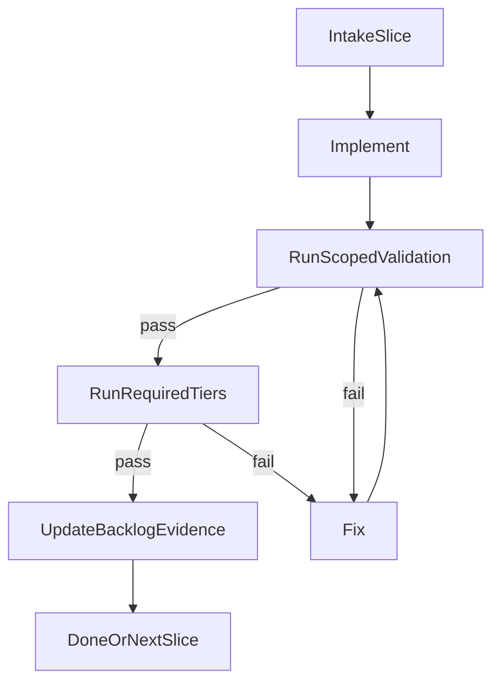

# V1 Execution Checklist

Короткий операционный контракт для любого нового чата, который продолжает `Horizon 1 / v1`.

## Что читать на старте

1. [master_v1_roadmap.md](master_v1_roadmap.md)
2. [autonomous_v1_active_backlog.md](autonomous_v1_active_backlog.md)
3. Текущий активный `stage_XX_*.plan.md`, если работа идёт внутри stage
4. [multi_agent_execution_protocol.md](multi_agent_execution_protocol.md), если нужны подагенты
5. [../v1_user_acceptance_cases.md](../v1_user_acceptance_cases.md) как главный live gate

## Цикл исполнения



## Допустимые состояния

- `status: open` + `executionState: queued` — slice ещё не взят в работу.
- `status: in_progress` + `executionState: implementing|verifying|fixing|waiting_manual` — работа идёт, validation обязан продолжаться до зелёного статуса или явного блокера.
- `status: blocked` + `executionState: blocked_external|blocked_scope` — продолжение невозможно без внешнего действия или согласования scope.
- `status: done` + `executionState: completed` — выполнены `doneWhen` и обязательные tier’ы.

## Обязательные поля backlog

У каждого активного slice должны быть заполнены:

- `lastValidation`
- `blockerOwner`
- `resumeFrom`
- `evidence`

## Жёсткие правила

- Нельзя останавливаться на состоянии «код написан, но тесты ещё не запускал».
- Нельзя писать пользователю `готово`, пока не выполнены требуемые tier’ы slice или не оформлен `blocked`.
- При любом провале цикл только один: `fix -> rerun same validation -> continue`.
- Если нужен ручной/live шаг, deterministic часть всё равно должна быть доведена до зелёного состояния до handoff.
- Если чат прервался, следующий агент продолжает с `resumeFrom`, а не начинает discovery заново.
- Для финального `v1 ready` главным сигналом считается прохождение **10/10** сценариев из [../v1_user_acceptance_cases.md](../v1_user_acceptance_cases.md), а не только зелёный automated ladder.

## Что писать в `lastValidation`

- Дата.
- Какие tier’ы запускались.
- Какими командами или группами тестов это подтверждено.
- Итог: `pass|fail|pending_manual`.

Пример:

```md
2026-04-08: T1 pass (`pnpm test -- src/agents/model-fallback.test.ts`), T2 pending, T5 pending_manual.
```

## Что писать в `resumeFrom`

- Один конкретный следующий шаг.
- Если шаг manual/live, указать точный сценарий или кейс.
- Если есть блокер, указать, что запускать сразу после разблокировки.

## Что писать в `evidence`

- Самые важные артефакты, которые доказывают готовность.
- Не пересказывать весь чат; только факты, полезные следующему агенту.

## Условие остановки

Останавливаться можно только в одном из двух состояний:

1. `done`: slice действительно закрыт.
2. `blocked`: есть владелец блокера, точная причина и понятный `resumeFrom`.

## Финальный релизный gate

Перед заявлением `v1 ready` нужно одновременно:

- довести deterministic проверки затронутых slice до требуемого уровня;
- пройти **10/10** живых пользовательских сценариев из [../v1_user_acceptance_cases.md](../v1_user_acceptance_cases.md);
- убедиться, что bot реально отвечает, устанавливает, продолжает, создаёт артефакты и не падает на живом прогоне.
