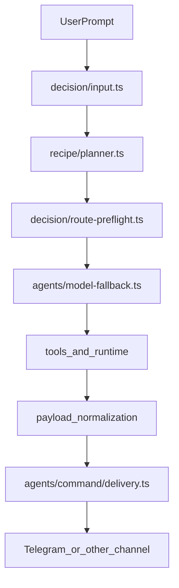

# V1 Routing-First Closeout

## Что уже подтверждено

- Базовый release-план уже есть в `[.cursor/plans/autonomous_v1_release_lockdown_20260407.plan.md](.cursor/plans/autonomous_v1_release_lockdown_20260407.plan.md)`; заменять его не нужно.
- Дубли и ложная текстовая «ссылка на PDF» связаны с тем, что delivery ownership был размазан между моделью и command pipeline. В коде уже есть защита через `[src/agents/agent-command.ts](src/agents/agent-command.ts)` (`disableMessageTool` при `deliver=true`) и финальная доставка через `[src/agents/command/delivery.ts](src/agents/command/delivery.ts)`.
- Прямой Telegram smoke уже подтверждал реальную отправку PDF как документа через `[src/infra/outbound/message.ts](src/infra/outbound/message.ts)`, значит проблема не в самом Telegram send, а в end-to-end orchestration.
- PDF-рендер уже переведён на HTML -> Playwright -> PDF в `[src/platform/materialization/pdf-materializer.ts](src/platform/materialization/pdf-materializer.ts)` и используется из `[src/agents/tools/pdf-tool.ts](src/agents/tools/pdf-tool.ts)`. Это правильнее старого минимального PDF-буфера.
- Основная архитектурная хрупкость сейчас не только в PDF: сильная доля поведения задаётся эвристиками в `[src/platform/decision/input.ts](src/platform/decision/input.ts)`, `[src/platform/decision/route-preflight.ts](src/platform/decision/route-preflight.ts)` и `[src/platform/recipe/planner.ts](src/platform/recipe/planner.ts)`.

## Протокол выполнения моей работы

- Работа идёт как непрерывный цикл `implement -> verify -> continue` без остановки на частичном фиксе.
- На каждую крупную зону запускаются отдельные сабагенты по ролям: `delivery/artifacts`, `routing/policy`, `autonomy/install`, `live verification`.
- Сабагенты используются не для размазывания ответственности, а для параллельной разведки, focused regression и проверки гипотез перед основным изменением.
- После каждой смысловой правки обязателен короткий цикл проверки: focused tests по затронутым файлам, затем сборка или более широкий gate, если слой влияет на runtime.
- После каждого user-facing фикса обязателен живой прогон: Telegram/UI сценарий с реальным сообщением, реальным tool execution и проверкой фактического результата, а не логической догадки.
- Если в live-прогоне найден новый реальный дефект, работа возвращается к следующей итерации и предыдущая фаза не считается завершённой.
- Финальное сообщение допустимо только после полного прохождения automated и live validation, когда все пункты плана реально закрыты.

## Фаза 1: Зафиксировать ownership user-facing delivery

- Дожать один источник истины для outbound delivery: модель только вызывает tool и возвращает нормальный assistant reply, а вся отправка файлов и сообщений живёт в `[src/agents/command/delivery.ts](src/agents/command/delivery.ts)` и связанном outbound слое.
- Проверить весь путь `tool result -> payload normalization -> deliverOutboundPayloads`, чтобы attachment payload не деградировал в plain text и не дублировался повторной отправкой.
- Отдельно прогнать Telegram regression на русском PDF и на обычном file/report сценарии, чтобы подтвердить: одно сообщение, реальный document attachment, корректный filename, корректный текст внутри PDF.

## Фаза 2: Убрать лишний "велосипед" из routing

- Свести к одному согласованному слою решения связку из `[src/platform/decision/input.ts](src/platform/decision/input.ts)`, `[src/platform/recipe/planner.ts](src/platform/recipe/planner.ts)` и `[src/platform/decision/route-preflight.ts](src/platform/decision/route-preflight.ts)`: сейчас compare/calculation/report и сложность запроса частично определяются в нескольких местах разными эвристиками.
- Оставить rule-based логику только как cheap prefilter/safety-net, а product behavior строить вокруг planner input, recipe runtime plan и model fallback chain, чтобы бот сначала использовал существующие инструменты/модели, а не сваливался в текстовые заглушки.
- Проверить, не дублируют ли `input.ts` и `planner.ts` сигналы compare/calculation/table/doc и не создают ли они ложные маршруты в investor сценариях.

## Фаза 3: Явная стратегия моделей и fallback-ов

- Зафиксировать политику выбора моделей в терминах ролей: быстрый локальный, сильный локальный, remote premium. Опорные места: конфиг в `C:\Users\Tanya\.openclaw\openclaw.json`, candidate assembly в `[src/agents/model-fallback.ts](src/agents/model-fallback.ts)`, overrides/policy в `[src/agents/agent-scope.ts](src/agents/agent-scope.ts)` и `[src/agents/runtime-plan-policy.ts](src/agents/runtime-plan-policy.ts)`.
- Проверить разрешение `ollama/gemma4:e4b` в runtime-реестре и фактическое попадание в candidate chain; если модель заявлена в конфиге, но не доходит до запуска, причина должна быть устранена или явно зафиксирована тестом.
- Отдельно верифицировать, какие сценарии реально должны вести к remote provider `hydra`, а какие обязаны оставаться local-first. Сейчас `hydra` — это provider entry, а не отдельный orchestrator.

## Фаза 4: Дожать autonomy/install-resume

- Пройти bootstrap/install/resume путь как единый user flow: если capability отсутствует, система должна не отвечать "не могу", а создавать bootstrap request, доводить установку и продолжать run.
- Проверить seams в `[src/platform/bootstrap/orchestrator.ts](src/platform/bootstrap/orchestrator.ts)`, `[src/platform/bootstrap/installers.ts](src/platform/bootstrap/installers.ts)` и `[src/platform/materialization/render.ts](src/platform/materialization/render.ts)`, чтобы capability install реально возвращал управление в исходный сценарий.
- Убрать случаи, где bootstrap или artifact materialization завершились технически, а пользователь получил только объяснение вместо действия.

## Фаза 5: Полный release gate

- После user-facing фиксов прогнать весь ladder из существующего lockdown-плана: focused tests, `pnpm check`, `pnpm build`, `pnpm test`, smoke/v1-gate, live Telegram/UI regression.
- Только после зелёных live и automated gates переходить к release-candidate и beta-first release validation.

## Обязательная матрица тестирования

- Focused unit/regression tests по delivery, routing, planner, bootstrap и model fallback после каждого изменения в соответствующем слое.
- `pnpm check` как общий guardrail на lint/type/format contract.
- `pnpm build` как обязательный gate для runtime, lazy-loading и delivery/materialization слоёв.
- `pnpm test` как полный проектный regression pass.
- `pnpm test:e2e:smoke` и `pnpm test:v1-gate` как продуктовый gate investor-facing поведения.
- Живые Telegram-прогоны минимум для четырёх сценариев: PDF attachment, compare двух файлов, calculation/report, capability install-resume.
- UI/runtime verification: проверка, что gateway/runtime surface и фактический outbound результат совпадают и не расходятся по payload/delivery.

## Режим исполнения за один проход

- Сначала закрываются реальные user-facing blocker-ы, потому что без этого остальная «умность» не имеет ценности для пользователя.
- Затем выравнивается orchestration: routing, model tiers, fallback-и, bootstrap-resume.
- Затем выполняется полный validation ladder без пропусков и без подмены live-проверки локальными рассуждениями.
- Только после этого делается release candidate и релизный проход.
- Если в процессе вскрывается место, где мы снова «изобретаем велосипед», оно либо заменяется на уже существующий reuse seam, либо жёстко изолируется как временный слой с тестами и понятной границей.

## Архитектурный фокус

## Критерий завершения

- Один run даёт один user-facing результат без дублей.
- PDF/report/file доходят как реальные attachments.
- Compare/calculation/report идут через согласованный routing без ложных деградаций.
- Capability install-resume работает end-to-end.
- Полный validation ladder и release validation зелёные.
